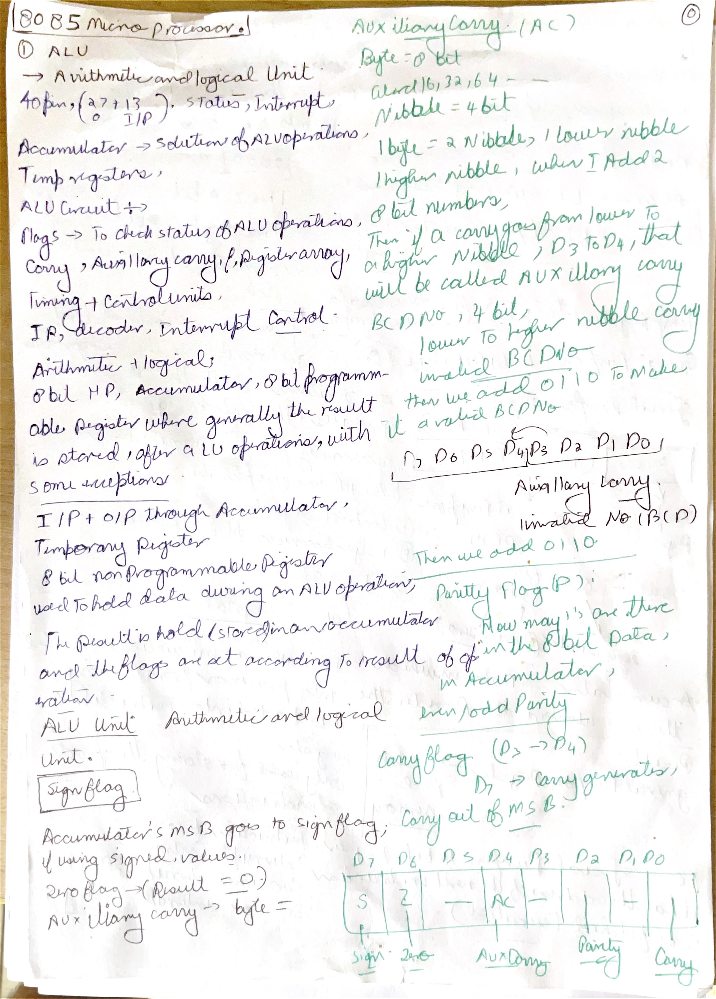
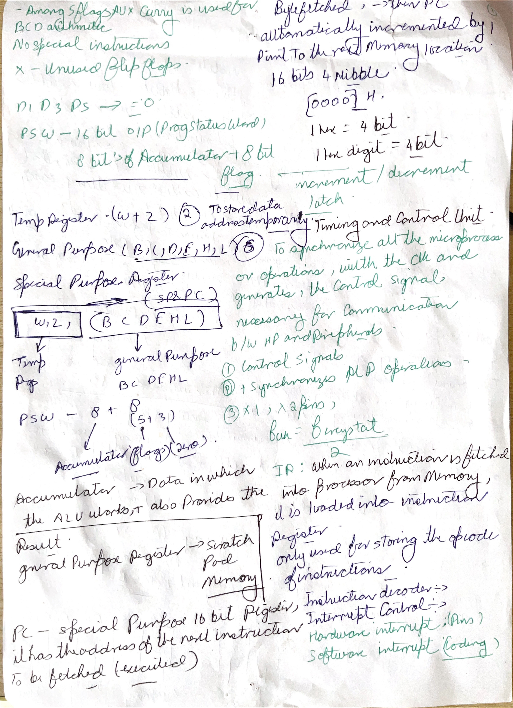
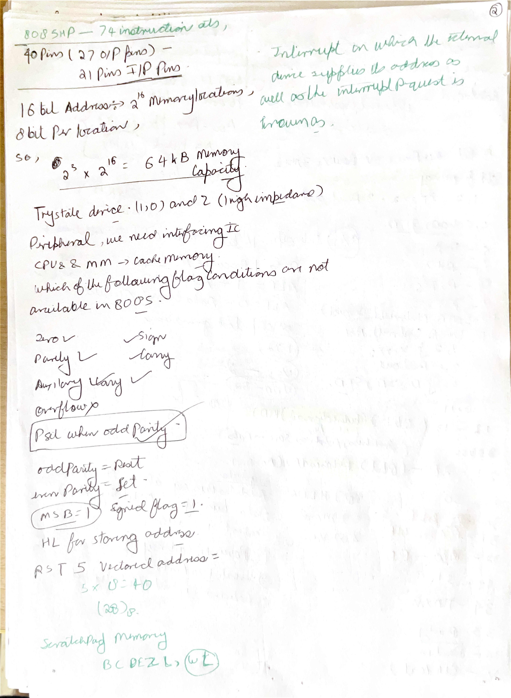
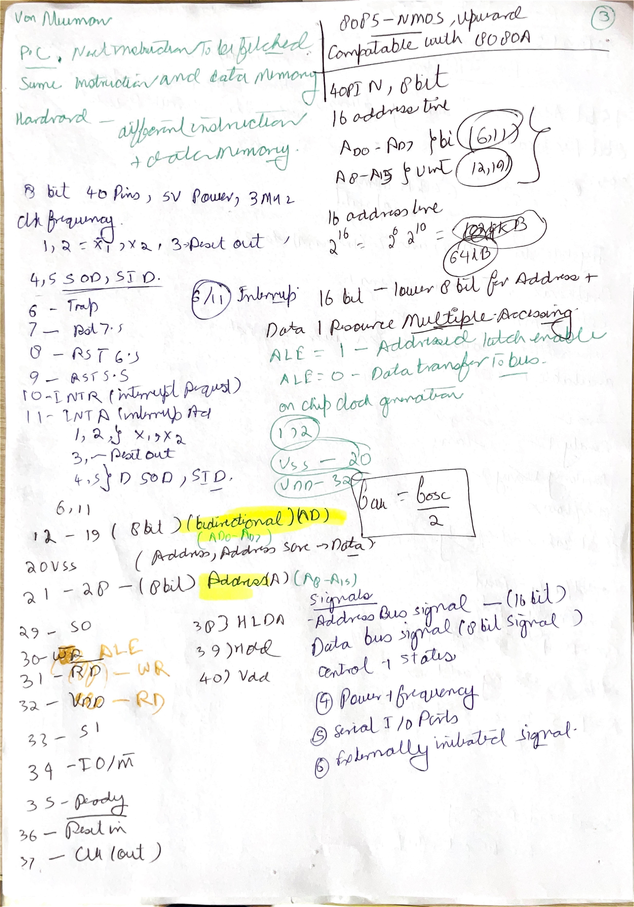
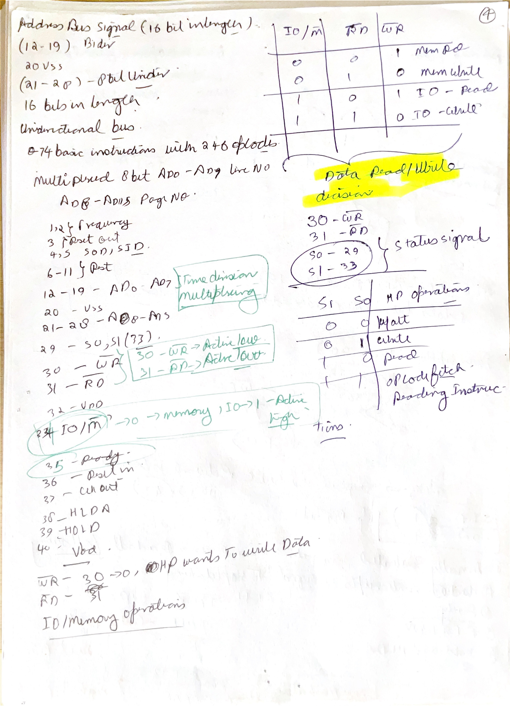
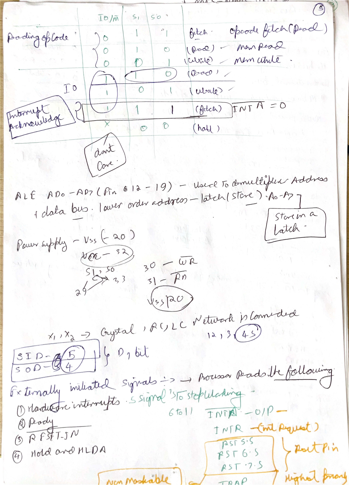
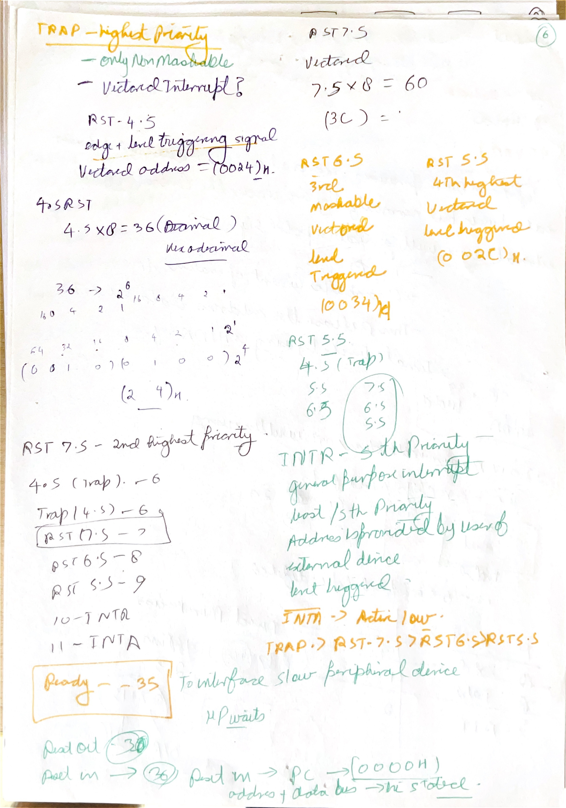

# Day 01: Introduction to the 8085 Microprocessor

This file explains every major term shown in the Day 01 screenshots: microprocessor, CPU, ALU, control unit, binary data, microcomputer, microcontroller, 4004/8008 history, PMOS/MOSFET, memory addressing, scale of integration, language levels, compiler/interpreter/assembler, Von Neumann/Harvard architecture, 8085 pins/signals, key 8085 specifications, `ALE`, clocking, interrupts, signal grouping, machine cycles, control/status signals, and serial I/O. The notes are written for 8085 study, so the definitions are connected back to the Intel 8085 wherever useful.

## Handwritten Notes Linked To Day 01

Each handwritten page is shown first as a large full-page image. The explanation below the image adds the technical layer: instruction behavior, bus cycles, flags, timing, address formation, or hardware reason behind the note.

### [till46 p001](images/HandWrittenNotes/till46/page-001.jpg)

<a href="images/HandWrittenNotes/till46/page-001.jpg"></a>

Technical explanation: the ALU is where arithmetic and logical results are physically produced, but the useful output is not only the 8-bit result. The accumulator usually supplies one operand and receives the result, while the flag flip-flops record properties of that result. Carry is generated from bit 7, auxiliary carry from bit 3 to bit 4, zero from an all-zero result, sign from bit 7, and parity from the number of 1 bits. That is why exam traces must update flags from the actual binary result, not from the instruction name alone.

Flags are a compressed record of the last flag-affecting result. `S` copies bit 7, `Z` reports zero, `P` reports even parity, `AC` reports carry from bit 3 to bit 4, and `CY` reports carry out of bit 7. In subtraction, `CY` is interpreted as borrow. A common trace error is testing a flag after an instruction that did not update it.

### [till46 p002](images/HandWrittenNotes/till46/page-002.jpg)

<a href="images/HandWrittenNotes/till46/page-002.jpg"></a>

Technical explanation: the ALU is where arithmetic and logical results are physically produced, but the useful output is not only the 8-bit result. The accumulator usually supplies one operand and receives the result, while the flag flip-flops record properties of that result. Carry is generated from bit 7, auxiliary carry from bit 3 to bit 4, zero from an all-zero result, sign from bit 7, and parity from the number of 1 bits. That is why exam traces must update flags from the actual binary result, not from the instruction name alone.

Flags are a compressed record of the last flag-affecting result. `S` copies bit 7, `Z` reports zero, `P` reports even parity, `AC` reports carry from bit 3 to bit 4, and `CY` reports carry out of bit 7. In subtraction, `CY` is interpreted as borrow. A common trace error is testing a flag after an instruction that did not update it.

The 8085 register set mixes 8-bit storage and 16-bit addressing. `B`, `C`, `D`, `E`, `H`, and `L` are 8-bit registers, but `BC`, `DE`, and `HL` can be used as 16-bit pairs. `HL` has the special memory role: `M` means the memory byte addressed by `HL`. `PC` and `SP` are 16-bit because program bytes and stack bytes live in the 64 KB memory space.

Separate opcode bytes from operand bytes. The opcode selects the operation; following bytes may be immediate data, a port number, a low address byte, or a high address byte. One-byte instructions encode everything in the opcode. Two-byte instructions usually add one data or port byte. Three-byte instructions usually add a 16-bit address or 16-bit immediate value, stored low byte first in memory.

A T-state is one processor clock state. Instruction timing is the number of T-states multiplied by the clock period. The counts are not arbitrary: every external memory or I/O access needs a bus cycle. Opcode fetch has address output, `ALE`, memory read control, data capture, and decode work, so it is longer than a plain memory read. Extra operand bytes, memory operands, stack transfers, I/O transfers, and slow memory wait states all add timing cost.

A machine cycle is one external bus operation: opcode fetch, memory read, memory write, I/O read, I/O write, interrupt acknowledge, and so on. An instruction cycle is the whole instruction and can contain several machine cycles. This is why instruction length, addressing mode, and T-state count are connected: every extra byte or external operand has to be fetched, read, or written on the bus.

### [till46 p003](images/HandWrittenNotes/till46/page-003.jpg)

<a href="images/HandWrittenNotes/till46/page-003.jpg"></a>

Technical explanation: the 8085 is an 8-bit processor because its main data path and accumulator are 8 bits wide, but it can address 16-bit memory locations, giving `2^16 = 65536` byte addresses. The tri-state bus matters because the processor, memory, I/O devices, and DMA hardware may need to share external lines. Only the selected device should drive the bus; otherwise two devices could electrically fight each other.

8085 interrupts combine priority, masking, and vectoring. `TRAP` is highest priority and non-maskable. `RST 7.5`, `RST 6.5`, and `RST 5.5` are maskable vectored interrupts with fixed restart addresses: `RST n` maps to `n x 8`, so `RST 7.5` starts at `003CH`, `RST 6.5` at `0034H`, and `RST 5.5` at `002CH`. `INTR` is maskable and non-vectored, so external hardware must supply the instruction during acknowledge.

8085 serial I/O is bit-oriented. `SID` is the serial input data pin and `SOD` is the serial output data pin. They are controlled through `RIM` and `SIM`, not through normal parallel `IN` and `OUT` port transfers. Serial transfer moves one bit under software control; normal I/O ports move an 8-bit byte through the data bus.

### [till46 p004](images/HandWrittenNotes/till46/page-004.jpg)

<a href="images/HandWrittenNotes/till46/page-004.jpg"></a>

Technical explanation: the 8085 pin diagram becomes technical when pins are grouped by bus role. `A8-A15` carry the high address. `AD0-AD7` are multiplexed: low address first, data later. `/RD` and `/WR` are active-low control outputs, while `IO/M`, `S1`, and `S0` identify the current bus cycle. `READY` can insert wait states, and `HOLD/HLDA` hands bus ownership to DMA hardware.

DMA transfers data without the CPU executing every byte transfer. A DMA controller requests the bus with `HOLD`; the 8085 responds with `HLDA` after it can release the bus. During DMA, the controller supplies addresses and read/write control for memory or I/O. The CPU is temporarily not the bus master, which is why DMA improves block-transfer efficiency.

### [till46 p005](images/HandWrittenNotes/till46/page-005.jpg)

<a href="images/HandWrittenNotes/till46/page-005.jpg"></a>

Technical explanation: `IO/M`, `S1`, and `S0` tell external hardware what type of machine cycle is occurring. That status decoding is how the system distinguishes opcode fetch, memory read, memory write, I/O read, I/O write, interrupt acknowledge, halt, and bus idle behavior. `/RD` and `/WR` then provide the actual read/write strobes, so status lines describe the cycle and control lines perform the transfer.

A machine cycle is one external bus operation: opcode fetch, memory read, memory write, I/O read, I/O write, interrupt acknowledge, and so on. An instruction cycle is the whole instruction and can contain several machine cycles. This is why instruction length, addressing mode, and T-state count are connected: every extra byte or external operand has to be fetched, read, or written on the bus.

`ALE` exists because the lower address and data share `AD0-AD7`. During the first T-state of a bus cycle the low address is valid on those pins, so an external latch captures it when `ALE` pulses. After that, the same pins can become the bidirectional data bus. Without the latch, memory decoding would lose `A0-A7` before the read or write finished.

A T-state is one processor clock state. Instruction timing is the number of T-states multiplied by the clock period. The counts are not arbitrary: every external memory or I/O access needs a bus cycle. Opcode fetch has address output, `ALE`, memory read control, data capture, and decode work, so it is longer than a plain memory read. Extra operand bytes, memory operands, stack transfers, I/O transfers, and slow memory wait states all add timing cost.

### [till46 p006](images/HandWrittenNotes/till46/page-006.jpg)

<a href="images/HandWrittenNotes/till46/page-006.jpg"></a>

Technical explanation: `ALE` exists because the lower address and data share `AD0-AD7`. During the first T-state of a bus cycle the low address is valid on those pins, so an external latch captures it when `ALE` pulses. After that, the same pins can become the bidirectional data bus. Without the latch, memory decoding would lose `A0-A7` before the read or write finished.

A T-state is one processor clock state. Instruction timing is the number of T-states multiplied by the clock period. The counts are not arbitrary: every external memory or I/O access needs a bus cycle. Opcode fetch has address output, `ALE`, memory read control, data capture, and decode work, so it is longer than a plain memory read. Extra operand bytes, memory operands, stack transfers, I/O transfers, and slow memory wait states all add timing cost.

8085 serial I/O is bit-oriented. `SID` is the serial input data pin and `SOD` is the serial output data pin. They are controlled through `RIM` and `SIM`, not through normal parallel `IN` and `OUT` port transfers. Serial transfer moves one bit under software control; normal I/O ports move an 8-bit byte through the data bus.

### [till46 p007](images/HandWrittenNotes/till46/page-007.jpg)

<a href="images/HandWrittenNotes/till46/page-007.jpg"></a>

Technical explanation: 8085 interrupts combine priority, masking, and vectoring. `TRAP` is highest priority and non-maskable. `RST 7.5`, `RST 6.5`, and `RST 5.5` are maskable vectored interrupts with fixed restart addresses: `RST n` maps to `n x 8`, so `RST 7.5` starts at `003CH`, `RST 6.5` at `0034H`, and `RST 5.5` at `002CH`. `INTR` is maskable and non-vectored, so external hardware must supply the instruction during acknowledge.

For vector questions, derive the address instead of memorizing the table blindly. A restart interrupt uses `RST n -> n x 8`, so `RST 5.5`, `RST 6.5`, and `RST 7.5` map to `002CH`, `0034H`, and `003CH`. Priority and masking then decide whether that vector is actually accepted.

## 1. Meaning of "Microprocessor"


A **microprocessor** is a computer processor implemented on an integrated circuit. In simple exam language, it is the **CPU on a chip**. It contains the circuitry needed to perform arithmetic, logic, control, and instruction execution. IBM describes a microprocessor as a CPU's required arithmetic, logic, and control units combined into one clock-driven, register-based device; Intel's MCS-80/85 manual describes the 8085A as an 8-bit general-purpose microprocessor that can access up to 64 KB of memory. [S1] [S2]

The word has two parts:

| Word part | Meaning |
| --- | --- |
| `micro` | Very small. In electronics, this points to miniaturized circuitry built on a semiconductor chip. |
| `processor` | A device that processes data by performing operations according to instructions. |

The important point is this: a microprocessor does not understand meaning like a human. It works with binary patterns. A pattern may represent a number, an instruction, a memory address, a character, or a control value depending on how the program and hardware use it.

For the **8085**, the word "microprocessor" specifically means:

- It is an **8-bit CPU**, so its main data operations work on 8-bit values.
- It has an **8-bit bidirectional data bus**.
- It uses a **16-bit memory address capability**, so it can directly address `2^16 = 65,536` memory locations, normally written as **64 KB**.
- It contains registers, ALU, flags, instruction decoding, clock/control support, interrupt handling, and bus-control functions.
- It still needs external memory and I/O chips to become a complete computer system. [S1]

## 2. Meaning of "Processor" and "Processing"


A **processor** is a device that performs operations on data. In a microprocessor, these operations are controlled by a stored program. Intel explains the instruction cycle as a repeated sequence: the processor fetches an instruction, decodes it, performs the required operation, and then fetches the next instruction. [S3]

**Processing** means changing, moving, testing, comparing, or controlling data. Examples:

| Operation | Meaning in 8085 |
| --- | --- |
| Add | `ADD B` adds register `B` to accumulator `A`. |
| Subtract | `SUB C` subtracts register `C` from accumulator `A`. |
| Move | `MOV A,B` copies data from register `B` into `A`. |
| Compare | `CMP B` compares `A` with `B` by subtracting internally but not storing the result. |
| Jump | `JMP 2050H` changes the next instruction address to `2050H`. |
| Input | `IN port` reads data from an input port into the accumulator. |
| Output | `OUT port` sends accumulator data to an output port. |

So when the slide says "processor means a device that processes numbers," read it carefully: the 8085 processes **binary data**, and the meaning of that data depends on the instruction being executed.

## 3. Binary, Bit, Byte, and Number Meaning

A **bit** is a binary digit, either `0` or `1`. NIST defines a bit as a binary digit with value zero or one. [S4]

A group of **8 bits** is treated as one byte in the 8085. Intel's MCS-80/85 manual states that data in the 8085A is stored as 8-bit binary integers. [S5]

Example:

```text
Binary: 00000101
Hex:    05H
Decimal if unsigned: 5
```

In an 8-bit value:

- Smallest unsigned value: `00000000` = `00H` = decimal `0`
- Largest unsigned value: `11111111` = `FFH` = decimal `255`
- Total combinations: `2^8 = 256`

The suffix `H` means **hexadecimal**. Hexadecimal is base-16 and is convenient because 4 binary bits map exactly to one hex digit:

```text
1111 1111 = F F = FFH
```

This is why 8085 notes often use values like `05H`, `3AH`, `FFH`, and addresses like `2050H`.

## 4. Program and Stored-Program Meaning

A **program** is a sequence of instructions stored in memory. The microprocessor fetches these instruction bytes one by one and executes them.

Intel's manual explains that, during instruction fetch, the CPU sends the contents of the program counter to memory, reads the next instruction word, places the first byte in the instruction register, increments the program counter, decodes the instruction, and executes the operation in the remaining states of the instruction cycle. [S3]

Basic 8085 execution flow:

1. The **program counter** holds the address of the next instruction.
2. The CPU places that address on the address bus.
3. Memory returns the instruction byte on the data bus.
4. The instruction is decoded.
5. The control unit activates the required internal and external signals.
6. The ALU, registers, memory, or I/O port performs the required action.
7. The program counter moves to the next instruction or changes because of jump/call/return/interrupt.

Example:

```asm
MVI A, 05H   ; Load 05H into accumulator A
MVI B, 03H   ; Load 03H into register B
ADD B        ; A = A + B, so A becomes 08H
```

This small program shows the stored-program idea: the hardware is fixed, but the behavior changes depending on the instructions stored in memory.

## 5. CPU Meaning


The **CPU**, or central processing unit, is the main instruction-executing part of a computer. IBM describes the CPU as the primary functional component of a computer and explains that CPU work follows an instruction cycle of fetch, decode, and execute. [S2]

For basic study, write:

```text
CPU = ALU + Control Unit + Registers + internal buses + timing/control circuitry
```

The slide says CPU can be understood as `ALU + CU`. That is a useful simplified form, but a real CPU also needs registers and internal paths for moving data. In the 8085, the CPU includes the accumulator, registers, flags, program counter, stack pointer, instruction decoder, ALU, timing/control section, and bus interface. [S1]

## 6. ALU Meaning and Use

The **ALU**, or arithmetic logic unit, performs arithmetic and logical operations. IBM defines the ALU as the CPU component that handles arithmetic and logical work. [S2]

Arithmetic operations include:

- Addition
- Subtraction
- Increment
- Decrement
- Decimal adjustment after BCD addition

Logical operations include:

- AND
- OR
- XOR
- Complement
- Compare
- Rotate

8085 examples:

```asm
ADD B   ; Arithmetic: A = A + B
ANA C   ; Logic: A = A AND C
XRA A   ; Logic: A = A XOR A, often clears A to 00H
CMP D   ; Compare A with D
```

The ALU does not decide **when** to operate. The control unit decides that. The ALU is the calculating and logic-performing part; the control unit is the coordinating part.

## 7. Control Unit Meaning and Use

The **control unit**, or **CU**, is the part of the CPU that interprets instructions and coordinates their execution. IBM states that the CU interprets instructions and initiates execution, directing the processor's basic operations. Intel's manual says that after an instruction is fetched and decoded, the control circuitry issues signals to internal and external CPU units for execution. [S2] [S3]

The control unit is important because a processor instruction is not one single action. Each instruction is broken into timed steps.

### What the Control Unit Does

| Control unit job | Meaning |
| --- | --- |
| Fetch control | Makes the CPU read the next instruction from memory. |
| Decode control | Interprets the opcode to know what operation is required. |
| Register control | Selects which register sends data and which register receives data. |
| ALU control | Tells the ALU whether to add, subtract, AND, OR, compare, rotate, etc. |
| Memory control | Generates read/write timing so memory can provide or accept data. |
| I/O control | Coordinates data movement between the CPU and input/output ports. |
| Bus control | Controls which data or address appears on the bus at a given time. |
| Timing control | Ensures each small operation happens in the correct clock period/state. |
| Interrupt control | Helps pause the current program and branch to an interrupt service routine. |
| Wait-state control | Can idle the CPU when memory or I/O is slower than the processor. |

Intel's MCS-80/85 manual explains that the 8085A generates control signals to perform read and write operations and to select memory or I/O ports. It also explains that the CPU may wait when memory or I/O is not ready. [S1] [S3]

### Example: What Happens During `ADD B`

```asm
ADD B
```

Internally, the control unit coordinates steps like these:

1. Fetch the opcode for `ADD B` from memory.
2. Decode the opcode.
3. Select accumulator `A` and register `B` as ALU inputs.
4. Tell the ALU to perform addition.
5. Store the result back into accumulator `A`.
6. Update the flags: zero, sign, parity, carry, auxiliary carry.
7. Move on to the next instruction.

Without the control unit, the ALU would not know which operation to do, registers would not know when to send or receive data, memory would not know when to read or write, and the program would not progress in order.

### Control Unit in One Sentence

The control unit is the **traffic controller of the CPU**: it does not usually store the main data result, but it tells every other part when to act, what operation to perform, and where data should move.

## 8. Registers, Accumulator, PC, SP, and Flags

Intel's 8085A description lists internal 8-bit and 16-bit registers. It identifies the accumulator as the focus of accumulator instructions, the program counter as the register that points to the next instruction, and the stack pointer as the pointer to the stack top. [S1]

| Term | Meaning | 8085 use |
| --- | --- | --- |
| Register | Small, fast storage inside the CPU | Holds temporary data |
| Accumulator `A` | Main 8-bit working register | Used by many arithmetic, logic, load/store, and I/O instructions |
| `B`, `C`, `D`, `E`, `H`, `L` | General-purpose 8-bit registers | Store temporary values; can form register pairs |
| Register pair | Two 8-bit registers treated as one 16-bit register | `BC`, `DE`, `HL` |
| `HL` pair | Important memory pointer | `MOV A,M` uses address stored in `HL` |
| Program Counter `PC` | 16-bit register holding next instruction address | Controls instruction sequence |
| Stack Pointer `SP` | 16-bit register pointing to stack top | Used in calls, returns, interrupts, PUSH, POP |
| Flags | One-bit result indicators | Used for conditional jumps and result checking |

The 8085 has five main condition flags:

| Flag | Meaning |
| --- | --- |
| Zero `Z` | Set if the result is zero. |
| Sign `S` | Set if the most significant bit of the result is `1`. |
| Parity `P` | Set if the result has even parity. |
| Carry `CY` | Set if addition produces a carry or subtraction/comparison needs a borrow. |
| Auxiliary Carry `AC` | Set if there is carry from bit 3 to bit 4; mainly useful for BCD correction. |

Intel's manual explicitly lists these five 8085A condition flags and explains when they are set or reset. [S6]

## 9. Microprocessor vs Microcomputer vs Microcontroller


These three words are related but not the same.

| Term | Pure meaning | What it includes |
| --- | --- | --- |
| Microprocessor | CPU on a chip | ALU, CU, registers, instruction execution, control logic |
| Microcomputer | Complete small computer built around a microprocessor | Microprocessor + memory + I/O + support circuits |
| Microcontroller | Small computer on one chip for control tasks | CPU core + memory + I/O peripherals, usually on one IC |

IBM explains the core difference clearly: microcontrollers combine the necessary elements of a microcomputer system onto one piece of hardware, while microprocessors are typically designed to be supported by external hardware. [S7]

### 8085 Example

The **8085 chip alone** is a microprocessor.

An **8085 trainer kit** is a microcomputer system because it includes:

- 8085 CPU
- ROM or monitor program
- RAM
- Input keys
- Display output
- Address/data/control buses
- I/O devices
- Clock and reset circuit
- Power supply

A **microcontroller** is different because memory and I/O are commonly built into the same chip as the CPU core.

## 10. Why 8085 Is Not a Complete Computer by Itself

The 8085 can execute instructions, but instructions must be stored somewhere. Data must also come from somewhere and go somewhere. That is why external memory and I/O are needed.

Intel describes a minimum 8085AH system as using the CPU plus RAM/I/O and ROM or EPROM/I/O chips. The same Intel manual also says the 8085A contains clock generation, bus control, and interrupt priority selection, but it still interfaces with external memory and I/O. [S1] [S8]

So:

```text
8085 chip = microprocessor
8085 + memory + I/O + support circuits = microcomputer system
```

## 11. Address Bus, Data Bus, and Control Bus

A **bus** is a group of signal lines used to transfer information between parts of a computer. IBM notes that buses provide data transfer between computing components and that bus width describes how many bits transfer in parallel. [S2]

| Bus | Direction | 8085 meaning |
| --- | --- | --- |
| Address bus | Mostly CPU to memory/I/O | Selects memory location or I/O port |
| Data bus | Bidirectional | Carries data or instruction bytes |
| Control bus | Mixed direction | Carries read, write, status, interrupt, reset, clock, and related control signals |

In the 8085:

- The data bus is 8-bit.
- The memory address capability is 16-bit.
- The low-order address and data share multiplexed lines `AD0-AD7`.
- `ALE` is used to latch the lower address byte so a full 16-bit address can be available externally.

Intel explains that the 8085 uses a multiplexed data bus: the low-order address appears on the address/data bus during the first T-state, and then those lines are used for data during the rest of the machine cycle. It also explains that `ALE` indicates when the multiplexed bus contains the lower 8 address bits. [S8] [S9]

## 12. History: Intel 4004 and Intel 8008


The slide mentions early microprocessor history.

### Intel 4004

Intel's official history page says the Intel 4004 was Intel's first microprocessor, released in 1971. Intel's 4004 anniversary facts also state that the 4004 was created in 1971 and had 2,300 transistors. [S10] [S11]

Important points:

| Feature | Meaning |
| --- | --- |
| 4-bit processor | Its main data word size was 4 bits. |
| PMOS | It used p-channel MOS technology. |
| 1971 | The year Intel released the 4004. |
| 16 pins | Early packaging constraint; many signals were multiplexed or shared. |
| Calculator origin | It was originally connected with Busicom calculator work. |

### PMOS and MOSFET Meaning

**MOS** means metal-oxide-semiconductor. **FET** means field-effect transistor. NASA's semiconductor fabrication reference explains that unipolar devices are commonly referred to as field-effect transistors or metal-oxide semiconductors, and that MOS and bipolar components can be integrated on silicon chips. [S12]

**PMOS** means p-channel MOS technology. In simple words, it is a MOS transistor technology using p-channel devices. Many early microprocessors used PMOS before later NMOS/HMOS/CMOS technologies became common.

### Memory Addressing Note

The slide says the 4004 had 640 bytes of memory addressing capability and 10 address lines. Be careful with this statement. A direct `n`-line address bus can select `2^n` locations, so 10 address lines can select up to `1024` possible addresses. But the Intel 4004 system used a more specialized MCS-4 memory organization and did not look like the later 8085-style 16-line address bus. For exam basics, remember the slide's idea: early processors had much smaller memory reach than the 8085.

### Intel 8008

Intel's official 8008 history page says the Intel 8008 was introduced in April 1972 and helped establish microprocessors as a new business area for Intel. [S13]

Important points:

| Feature | Meaning |
| --- | --- |
| 8-bit processor | It processed 8-bit data quantities, larger than the 4004's 4-bit word size. |
| 1972 | Year of introduction. |
| Historical role | It was an early step toward more capable 8-bit microprocessor systems. |

The 8085 came later and is much more convenient for learning complete microprocessor system concepts because it has a cleaner 8-bit data model, 16-bit memory addressing, useful interrupts, serial input/output pins, and simpler power requirements than earlier generations.

## 13. Scale of Integration: SSI, MSI, LSI, VLSI, ULSI


**Scale of integration** means how many logic components or gates are integrated on one chip. NASA's reference publication defines complexity by the number of gates on the chip and gives approximate categories: SSI, MSI, LSI, and VLSI. [S14]

| Term | Full form | Meaning |
| --- | --- | --- |
| SSI | Small-Scale Integration | Small number of gates on one IC |
| MSI | Medium-Scale Integration | More gates, enough for functions like counters, multiplexers, decoders |
| LSI | Large-Scale Integration | Hundreds to thousands of gates; enabled early complex chips |
| VLSI | Very-Large-Scale Integration | Very large number of gates; used for much more complex chips |
| ULSI | Ultra-Large-Scale Integration | Even higher integration, usually used for very dense modern ICs |

The exact gate-count boundaries vary across books and eras. Your screenshot uses the common teaching idea:

- SSI: discrete/basic logic gates on one chip
- MSI: tens of gates
- LSI: hundreds of gates
- VLSI: very large integration
- ULSI: ultra large integration

The main concept is not the exact number. The main concept is that increasing integration allowed more of a computer to fit on fewer chips. That is what made microprocessors, microcontrollers, memory chips, and modern systems-on-chip possible.

## 14. Why Integration Matters for Microprocessors

Before microprocessors, CPU logic required many separate components or circuit boards. As integration improved, more transistors and gates could be placed on one silicon chip. This allowed the arithmetic, logic, control, and register circuitry of a CPU to be built as one chip.

This is the historical jump:

```text
Many boards of logic -> many ICs -> LSI CPU chip -> microprocessor -> microcontroller / SoC
```

The 8085 is a good example of higher integration than the 8080 generation because Intel integrated functions such as clock generation, system bus control, and interrupt priority selection into the 8085A. Intel specifically says these functions are contained in the 8085A in addition to instruction execution. [S1]

## 15. Assembly, Low-Level, and High-Level Language


This screenshot introduces programming-language levels. A **programming language** is a way for humans to write instructions that can eventually control a computer. Since the CPU finally executes machine instructions, human-written programs must either already be close to machine code or must be translated into a lower-level form.

| Term | Meaning | 8085 connection |
| --- | --- | --- |
| Machine language | Binary instruction codes directly executed by the CPU | The 8085 finally executes opcodes such as `3EH`, `80H`, `C3H`, etc. |
| Assembly language | A symbolic language using mnemonics for machine instructions | `MVI A,05H`, `ADD B`, and `JMP 2050H` are assembly-style instructions |
| Mnemonic | A short readable name for an instruction | `MOV`, `MVI`, `ADD`, `SUB`, `JMP`, `IN`, `OUT` |
| Low-level language | A language closely tied to a specific processor architecture | 8085 assembly is low-level and processor-specific |
| High-level language | A more human-readable language that hides many hardware details | C, C++, BASIC, and similar languages use English-like structure |

Intel's 8080/8085 assembly manual uses instruction mnemonics and object code tables, which shows the main idea: assembly language is a readable symbolic form, while object code/machine code is the binary or hexadecimal form the processor can execute. [S15]

### Low-Level Language

A **low-level language** is machine-dependent. That means it is designed for a particular CPU or CPU family. 8085 assembly is not automatically valid for ARM, x86, 8051, or RISC-V because each processor has its own registers, instruction formats, addressing modes, and machine codes.

Example:

```asm
MVI A, 05H
ADD B
```

This is meaningful for 8085 because the 8085 has an accumulator `A`, a register `B`, and instructions named `MVI` and `ADD`.

### High-Level Language

A **high-level language** is more independent of one exact machine. A C statement such as:

```c
sum = a + b;
```

does not mention the 8085 accumulator, flags, opcode bytes, or buses. A translator must convert the statement into lower-level instructions for the target machine.

High-level does not mean "better for everything." It means more abstract. Low-level language gives more hardware control; high-level language gives more readability and portability.

## 16. Compiler, Interpreter, and Assembler


These three are **language translators**. Their job is to bridge the gap between human-readable code and machine-executable code.

| Translator | Input | Output / behavior |
| --- | --- | --- |
| Compiler | High-level source program | Translates source language into target language/object code, often before execution |
| Interpreter | Source program or intermediate form | Executes by examining program instructions step by step |
| Assembler | Assembly-language source | Converts mnemonics and operands into machine code/object code |

IBM defines a compiler as a program that converts code from one programming language into another target language. Britannica describes an interpreter as software that examines a program one instruction at a time and invokes the required machine operations. Intel's 8080/8085 assembly manual shows assemblers producing object code from symbolic assembly instructions. [S16] [S17] [S15]

### Compiler

A **compiler** usually reads a source program and translates it into another form, often object code or machine code. In traditional C/C++ development, the compiler checks the whole program or translation unit, reports errors, and produces lower-level output that can later be linked and executed.

For microprocessor study:

```text
High-level C program -> compiler -> object code/machine code -> CPU executes it
```

### Interpreter

An **interpreter** executes a program through another program instead of producing a separate final machine-code program in the same simple way as a traditional ahead-of-time compiler. Basic course material often says it works "one statement at a time." That is a useful beginner model, though modern interpreters may first parse code into internal forms such as bytecode or trees.

For exams, the safe contrast is:

```text
Compiler: translates before execution in a larger compile step.
Interpreter: translates/executes through an interpreter during program run.
```

### Assembler

An **assembler** is the translator used for assembly language. It converts mnemonics into machine code.

Example:

```asm
MVI A, 05H
```

The assembler converts this readable instruction into opcode/data bytes that the 8085 can fetch and execute. The written assembly program is source code; the produced machine bytes are object code or machine code.

## 17. Microprocessor Architecture: Von Neumann and Harvard


**Architecture** means the logical design of a computer system: how the CPU, memory, buses, instructions, and data movement are organized. The screenshot focuses on memory organization for program and data.

| Architecture | Main idea |
| --- | --- |
| Von Neumann architecture | Program instructions and data share the same memory space/pathway. |
| Harvard architecture | Program instructions and data use separate memories or separate pathways. |

The University of Maryland computer architecture material notes that the terms "von Neumann architecture" and "stored-program computer" are generally used together, and Arm's architecture note contrasts Harvard-style separation with shared program/data organization. [S18] [S19]

### Von Neumann Architecture

In **Von Neumann architecture**, instructions and data are stored in the same memory system. The CPU fetches instruction bytes and reads/writes data through a shared memory organization. This is flexible because the same memory can hold program code and data, but it can create a bottleneck because instruction fetches and data transfers may compete for the same path.

The 8085 is normally studied as a Von Neumann-style microprocessor system because program memory and data memory are part of the same 64 KB memory address space. Whether a byte is an instruction or data depends on how the program counter and instructions use it.

### Harvard Architecture

In **Harvard architecture**, program memory and data memory are separate. This can allow the processor to fetch an instruction and access data at the same time. Many microcontrollers and DSP-style systems use Harvard or modified-Harvard ideas because embedded systems often benefit from separate program memory and data memory.

The key exam difference:

```text
Von Neumann: one memory organization for program + data.
Harvard: separate program memory and data memory.
```

## 18. 8085 Microprocessor Pins and Signals


The 8085A is an 8-bit microprocessor in a 40-pin package. Intel's MCS-80/85 manual describes the 8085A as a complete 8-bit parallel central processor and identifies its single +5 V supply, clock-generation support, bus-control signals, interrupt system, serial I/O pins, and multiplexed address/data bus. [S1] [S8]

### Why Pins Matter

Pins are the physical electrical connection points between the microprocessor and the outside system. The 8085 can calculate internally, but it must use pins to receive clock signals, reset signals, instruction bytes, data bytes, memory addresses, interrupt requests, input/output data, and power.

### Main Pin/Signal Groups

| Group | Signals | Meaning |
| --- | --- | --- |
| Power | `VCC`, `VSS` | `VCC` is +5 V supply; `VSS` is ground. |
| Clock | `X1`, `X2`, `CLK OUT` | Crystal/clock input pins and clock output for system timing. |
| High-order address bus | `A8-A15` | Carries the upper 8 bits of a 16-bit memory address. |
| Multiplexed address/data bus | `AD0-AD7` | Carries low-order address bits first, then data bits. |
| Address latch enable | `ALE` | Tells external latch hardware when `AD0-AD7` contain the lower address byte. |
| Control/status | `RD`, `WR`, `IO/M`, `S0`, `S1` | Identifies read/write activity and whether the operation is memory or I/O related. |
| Interrupts | `TRAP`, `RST 7.5`, `RST 6.5`, `RST 5.5`, `INTR`, `INTA` | Let external devices request CPU attention. |
| Serial I/O | `SID`, `SOD` | Serial input data and serial output data pins, controlled through `RIM` and `SIM`. |
| DMA/bus request | `HOLD`, `HLDA` | Let another device request and receive control of the buses. |
| Reset/ready | `RESET IN`, `RESET OUT`, `READY` | Reset the processor/system and insert wait states for slow memory or I/O. |

### Meaning of Multiplexed Address/Data Bus

The 8085 needs both address lines and data lines, but a 40-pin chip has limited physical pins. To save pins, `AD0-AD7` are **multiplexed**:

1. During the early part of a machine cycle, `AD0-AD7` carry address bits `A0-A7`.
2. `ALE` goes active so an external latch can store those lower address bits.
3. During the later part of the cycle, the same pins carry data bits `D0-D7`.

This is why 8085 systems commonly use an external latch such as 74LS373 or 74LS573 to separate the lower address byte from the data bus. Intel describes this as demultiplexing the bus using `ALE`. [S9]

### 8080A Compatibility

The slide says the 8085 instruction set is compatible with the 8080A and includes additional instructions. The practical meaning is that the 8085 can run the 8080 instruction set, while adding 8085-specific features such as `RIM` and `SIM` for interrupt mask and serial I/O control. Intel's 8080/8085 assembly reference lists these mnemonics and their machine-code forms. [S15]

## 19. Key Points of 8085 Microprocessor


This screenshot compresses several important 8085 facts into one slide. Some of these repeat earlier ideas, but they are worth collecting because they are common exam points.

| Point | Meaning |
| --- | --- |
| NMOS technology | The standard 8085/8085A is commonly described in course material as an NMOS microprocessor. Later 8085AH parts are described by Intel as HMOS versions. [S20] [S8] |
| Upward compatible with 8080A | 8085 supports the 8080A instruction set and adds extra 8085-specific instructions/features. |
| 40-pin DIP | DIP means Dual In-line Package: pins are arranged in two parallel rows. The 8085 has 40 pins. |
| 8-bit processor | The main internal data size and external data bus width are 8 bits. |
| 16 address lines | A 16-bit address can select `2^16 = 65,536` memory locations. |
| 64 KB addressing | Since each memory location stores one byte, `65,536` locations = 64 KB. |
| 8 data bus lines | The data bus carries 8 bits in parallel, so one byte transfers at a time. |
| Serial data transfer | The 8085 provides serial input/output pins: `SID` and `SOD`. |
| `AD0-AD7` multiplexed | These lines first carry lower address bits, then carry data bits. |
| `A8-A15` not multiplexed | These higher address lines carry only address bits. |
| `ALE` | Address Latch Enable tells external hardware when `AD0-AD7` contain address bits. |

### Why 16 Address Lines Give 64 KB

Each address line can carry two states: `0` or `1`. With 16 lines, the number of unique combinations is:

```text
2^16 = 65,536 addresses
```

In the 8085 memory model, each address identifies one byte:

```text
65,536 bytes = 64 x 1024 bytes = 64 KB
```

So the slide's calculation `2^16 = 2^10 x 2^6 = 1K x 64` is showing why the answer is 64 KB. `2^10` is 1024, which is treated as 1 KB in this memory-size context.

### Data Bus Width vs Address Bus Width

The **data bus width** tells how much data can be transferred at one time. In the 8085, the data bus is 8-bit, so the processor transfers one byte at a time.

The **address bus width** tells how many memory locations can be selected. In the 8085, the address width is 16-bit, so it can select 64 KB of memory.

These two widths are related but not the same:

```text
8-bit data bus: one byte moves per transfer.
16-bit address bus: up to 64 KB memory locations can be selected.
```

### Multiplexing and ALE

The lower address bus `AD0-AD7` is multiplexed with the data bus to reduce the number of physical pins. During the start of a machine cycle, those pins carry address bits `A0-A7`. After the low address is latched externally using `ALE`, the same pins are reused for data transfer as `D0-D7`. Intel's bus-demultiplexing explanation uses `ALE` for this exact purpose. [S9]

This is why `ALE` is essential in practical 8085 systems: without latching the low address, external memory would lose the lower address bits when `AD0-AD7` change over to data mode.

## 20. ALE, Clock, Interrupts, Opcodes, and Signal Groups


These two slides continue the 8085 pin-and-signal discussion. They are important because they move from "what pins exist" to "how the pins behave during real processor operation."

### ALE: Address Latch Enable

`ALE` means **Address Latch Enable**. It is an output signal from the 8085 used to separate the lower address byte from the multiplexed address/data bus.

The slide says:

```text
ALE = 1: address transfer to bus
ALE = 0: data transfer to bus
```

The deeper and more precise meaning is:

| `ALE` state | Practical meaning |
| --- | --- |
| `ALE = 1` | The low-order address bits `A0-A7` are valid on `AD0-AD7`, so an external latch should capture them. |
| `ALE = 0` | The low address is no longer guaranteed on `AD0-AD7`; those same pins are now free for data transfer or bus idle states depending on the machine cycle. |

This matters because the 8085 has a 16-bit address but does not provide 16 separate address-only pins. The high address `A8-A15` stays on dedicated pins, while the low address `A0-A7` shares pins with data `D0-D7`. Intel's bus-demultiplexing discussion explains that `ALE` is used to latch the lower address byte externally. [S9]

### Why Multiplexing Reduces Speed

Multiplexing is a pin-saving technique. It lets one physical group of pins do two jobs at different times:

```text
AD0-AD7 during T1: lower address A0-A7
AD0-AD7 after T1: data D0-D7
```

The advantage is fewer pins and simpler packaging. Without multiplexing, the chip would need separate pins for all lower address bits and all data bits.

The disadvantage is timing overhead. The system must spend part of the machine cycle putting the address on the bus and latching it before data transfer can safely happen. Extra external hardware, usually a latch, is also required. This is why multiplexing can reduce effective bus speed compared with a design where address and data have fully separate pins all the time.

### On-Chip Clock Generation

The 8085 has clock-generation support on chip. In a basic system, a crystal or external clock network is connected to `X1` and `X2`. The processor then provides timing internally and also has `CLK OUT` for external system timing. Intel's 8085 documentation identifies clock generation as one of the integrated system functions of the 8085A. [S8]

The slide says the crystal frequency is 6 MHz and the clock frequency is about 3 MHz. The idea is that the internal operating clock is approximately half of the crystal frequency:

```text
Crystal: about 6 MHz
Processor clock: about 3 MHz
```

This distinction is important. The crystal frequency and the actual processor clock are not always the same value. In 8085 timing problems, be clear whether the question gives the crystal frequency or the clock frequency.

### Power Supply and Ground

The 8085 uses a single +5 V supply. In pin terminology:

| Pin name | Meaning |
| --- | --- |
| `VCC` | +5 V supply input |
| `VSS` | Ground |

This was a major simplification compared with older processors such as the Intel 8080, which required multiple supply voltages. The 8085's single +5 V operation made board design easier.

### Five Hardware Interrupts

An **interrupt** is a signal that requests the CPU to temporarily pause the current program and service another event. The 8085 has five hardware interrupt inputs:

| Interrupt | Type | Priority idea |
| --- | --- | --- |
| `TRAP` | Non-maskable, vectored | Highest priority |
| `RST 7.5` | Maskable, vectored | Next after `TRAP` |
| `RST 6.5` | Maskable, vectored | Lower than `RST 7.5` |
| `RST 5.5` | Maskable, vectored | Lower than `RST 6.5` |
| `INTR` | Maskable, non-vectored | Lowest hardware interrupt priority |

`INTA` is not an interrupt request. It is an interrupt acknowledge output used by the processor to acknowledge `INTR`. Intel's 8085 documentation describes the interrupt structure and the serial/interrupt control instructions `RIM` and `SIM`. [S8] [S15]

**Maskable** means the processor can disable or ignore the interrupt under program control. **Non-maskable** means the interrupt cannot be disabled in the same normal way. **Vectored** means the processor already knows the service routine address associated with that interrupt.

### Word Length or Bit Capacity

The slide says the word length or bit capacity is 8. In this context, **word length** means the natural size of data handled by the processor's main data path. For the 8085:

- Accumulator is 8-bit.
- Most general-purpose registers are 8-bit.
- Data bus is 8-bit.
- ALU operations are mainly 8-bit.

This is why the 8085 is called an 8-bit microprocessor even though it has a 16-bit address bus.

### 74 Basic Instructions and 246 Opcodes

An **instruction** is a human-visible operation type such as `MOV`, `ADD`, `JMP`, or `CALL`. An **opcode** is the actual machine-code byte that identifies the exact operation form.

The number can look confusing because one instruction mnemonic may produce many opcodes. For example:

```asm
MOV A,B
MOV A,C
MOV B,A
MOV C,A
```

These are all forms of `MOV`, but they require different opcode bytes because the source and destination registers differ.

Many 8085 teaching references state the common exam convention: **74 basic instruction types and 246 defined opcodes**. Since an 8-bit opcode field has 256 possible byte values, this means not every possible opcode byte is a normal documented 8085 instruction. [S21] [S15]

### Six Groups of 8085 Signals

The second slide classifies 8085 signals into six groups. This grouping is useful because it tells you what each pin is trying to accomplish in the whole system.

| Group | Important signals | Deep meaning |
| --- | --- | --- |
| Address bus signals | `A8-A15`, `AD0-AD7` during address phase | Selects memory or I/O location. |
| Data bus signals | `AD0-AD7` during data phase | Transfers instruction bytes, data bytes, or I/O data. |
| Control and status signals | `RD`, `WR`, `IO/M`, `S0`, `S1`, `ALE` | Tells external devices what kind of bus operation is happening. |
| Power supply and frequency signals | `VCC`, `VSS`, `X1`, `X2`, `CLK OUT` | Provide power and timing reference. |
| Serial I/O ports | `SID`, `SOD` | Allow serial input and output bit transfer under program control. |
| Externally initiated signals | `READY`, `RESET IN`, `RESET OUT`, `HOLD`, `HLDA`, interrupts | Let external hardware pause, reset, interrupt, or request bus control. |

Some books split these into seven groups by separating interrupts from other externally initiated signals. Your slide uses the common six-group classification, where interrupts and DMA/ready/reset-style signals are grouped together as externally initiated signals. [S22]

### Why Signal Grouping Matters

Signal grouping is not only for memorization. It helps during system design:

- To connect memory, focus on address bus, data bus, `RD`, `WR`, `IO/M`, and chip-select decoding.
- To connect an I/O device, focus on data bus, `IO/M`, `RD`, `WR`, and port addressing.
- To connect slow memory, use `READY` so the CPU can insert wait states.
- To support DMA, use `HOLD` and `HLDA`.
- To support external events, use interrupts.
- To demultiplex the bus, use `ALE` and an external latch.

So the 8085 is not just an 8-bit ALU. It is a bus-oriented system component: most of its pins exist so it can communicate with memory, I/O devices, and external control hardware in a timed and organized way.

## 21. Detailed 8085 Bus and Signal Operation


These screenshots zoom in on how the 8085 communicates with the outside world. This is the practical part of microprocessor study: the CPU does not execute programs in isolation. It continuously places addresses on the bus, reads instruction bytes, reads or writes memory, communicates with I/O devices, responds to interrupts, and follows clock timing.

### Multiplexed Address/Data Bus: AD0-AD7

The pins `AD0-AD7` are pins 12 to 19. If a slide says "control pins: pin 12 to 19," read that carefully: in the 8085 pinout, pins 12 to 19 are the **multiplexed address/data bus pins**, not the control-signal pins.

`AD0-AD7` have two jobs:

| Time in machine cycle | What `AD0-AD7` carry | Meaning |
| --- | --- | --- |
| Early part, normally T1 | `A0-A7` | Lower 8 bits of the address |
| Later part | `D0-D7` | 8-bit data transfer |

This is called **time-division multiplexing** because the same physical pins are shared by different signals at different times. The address and data are not present on these pins at the same time; they appear in different time portions of the machine cycle.

The bus is also **bidirectional** during the data phase:

- During memory read, I/O read, or opcode fetch, data flows into the 8085.
- During memory write or I/O write, data flows out of the 8085.

This is why the bus needs control signals such as `RD`, `WR`, and `IO/M`. External memory and I/O devices must know whether they should drive data onto the bus or receive data from the bus.

### ALE and Demultiplexing

`ALE` stands for **Address Latch Enable**. It is a positive pulse produced near the beginning of a machine cycle. Its job is to tell an external latch: "capture the lower address now."

The correct practical sequence is:

1. The 8085 puts full address information on the bus.
2. `A8-A15` appear on dedicated high-order address pins.
3. `A0-A7` appear on `AD0-AD7`.
4. `ALE` pulses high.
5. An external latch stores `A0-A7`.
6. `AD0-AD7` stop behaving as address pins and become the data bus.

This external latch creates a stable lower address bus for the rest of the bus cycle. Intel's demultiplexing discussion identifies `ALE` as the signal used for latching the lower address byte from the multiplexed bus. [S9]

Some slides write that `ALE = 1` means address transfer and `ALE = 0` means data transfer. That is acceptable for a first explanation, but the precise idea is: `ALE = 1` marks the time when the low address is valid and should be latched; after the pulse, `AD0-AD7` are no longer the stable low address and can be used for data.

The slide says the latch generates address lines `A1` to `A0`; that is almost certainly a writing/printing mistake. The intended lower address lines are `A0-A7`.

### Control Signals: RD and WR

The 8085 has two main read/write control outputs:

| Signal | Pin | Active level | Meaning |
| --- | --- | --- | --- |
| `RD` | 32 | Active low | External memory or I/O should place data on the data bus. |
| `WR` | 31 | Active low | External memory or I/O should accept data from the data bus. |

**Active low** means the signal is considered asserted when it is `0`, not when it is `1`. In many diagrams this is shown by a bar over the signal name, such as overlined `RD` and overlined `WR`. In plain text notes, write `/RD` and `/WR` if you want to show active-low behavior clearly.

When `/RD = 0`, the processor is performing a read operation. When `/WR = 0`, the processor is performing a write operation. Both should not normally be active for the same bus operation.

### Status Signals: IO/M, S1, and S0

The status signals tell the external system what type of machine cycle is happening.

| Signal | Pin | Role |
| --- | --- | --- |
| `IO/M` | 34 | Distinguishes I/O cycle from memory cycle. |
| `S1` | 33 | Status bit used with `S0`. |
| `S0` | 29 | Status bit used with `S1`. |

Together, `IO/M`, `S1`, and `S0` identify the bus cycle type. The common table is:

| Machine cycle | `IO/M` | `S1` | `S0` | Active control signal |
| --- | --- | --- | --- | --- |
| Opcode fetch | 0 | 1 | 1 | `/RD = 0` |
| Memory read | 0 | 1 | 0 | `/RD = 0` |
| Memory write | 0 | 0 | 1 | `/WR = 0` |
| I/O read | 1 | 1 | 0 | `/RD = 0` |
| I/O write | 1 | 0 | 1 | `/WR = 0` |
| Interrupt acknowledge | 1 | 1 | 1 | `/INTA = 0` |
| Halt | X | 0 | 0 | No normal read/write transfer |

`X` means "do not care." In the halt row, the exact `IO/M` value is not important for identifying the halted status because `S1 = 0` and `S0 = 0` indicate halt. Intel's 8085 documentation and classroom pin-configuration references use these status/control signals to describe machine-cycle identification. [S8] [S22]

### Opcode Fetch vs Memory Read

Opcode fetch and memory read both read from memory, but they are not the same logical machine cycle.

| Cycle | What is read | Why it matters |
| --- | --- | --- |
| Opcode fetch | Instruction opcode byte | The byte goes to the instruction decoder. |
| Memory read | Data byte from memory | The byte is used as operand/data. |

This distinction helps external hardware and timing analysis. The processor knows whether it is fetching an instruction or reading ordinary data, and it exposes that through status lines.

### Power Supply and Frequency Pins

The power and frequency pins provide the electrical base for operation.

| Signal | Pin | Meaning |
| --- | --- | --- |
| `VCC` | 40 | +5 V supply |
| `VSS` | 20 | Ground reference |
| `X1` | 1 | Crystal/clock input connection |
| `X2` | 2 | Crystal/clock input connection |
| `CLK OUT` | 37 | Clock output for other system parts |

The slide says a crystal, RC network, or LC network can be connected at `X1` and `X2`. In normal learning examples, a crystal is usually used because it gives a stable clock. The 8085 internally divides the crystal frequency by two, so a 6 MHz crystal gives an operating clock of about 3 MHz. Intel's 8085 materials also describe the integrated clock generation support. [S8] [S20]

This matters in timing problems:

```text
Crystal frequency = 6 MHz
8085 clock frequency = 3 MHz
Clock period = 1 / 3 MHz = about 333 ns
```

If an instruction takes 4 T-states, then at 3 MHz it takes about:

```text
4 x 333 ns = 1332 ns = about 1.33 microseconds
```

So clock frequency directly affects instruction execution time.

### Serial I/O Pins: SID and SOD

The 8085 provides two serial I/O pins:

| Signal | Pin | Meaning |
| --- | --- | --- |
| `SOD` | 4 | Serial Output Data |
| `SID` | 5 | Serial Input Data |

`SID` receives one serial bit into the processor. The 8085 reads this serial input through the `RIM` instruction, which places the serial input status into the accumulator. In standard 8085 teaching, the `SID` value is read into the `D7` bit of the accumulator.

`SOD` sends one serial bit out of the processor. The 8085 controls this through the `SIM` instruction. The serial output data is taken from the accumulator's `D7` bit, and a serial-output enable bit must be set correctly for output to occur. Intel's 8080/8085 assembly manual documents `RIM` and `SIM` for serial I/O and interrupt-mask control. [S15]

Be careful with modern examples such as "pen drive." The 8085 `SID` and `SOD` pins are simple one-bit serial lines. A USB pen drive cannot be connected directly to these pins. Modern USB requires complex protocol handling and dedicated USB interface hardware. For 8085 study, think of `SID` and `SOD` as low-level serial bit input/output lines, not a full modern serial port by themselves.

### How These Signals Work Together

For a memory read, the system flow is roughly:

1. 8085 places address on `A8-A15` and `AD0-AD7`.
2. `ALE` pulses so external latch captures `A0-A7`.
3. `IO/M = 0`, `S1 = 1`, `S0 = 0`, identifying memory read.
4. `/RD` becomes `0`.
5. Selected memory chip places data on `D0-D7`.
6. 8085 reads the data.
7. `/RD` returns inactive and the bus cycle ends.

For a memory write, the flow changes:

1. Address is placed and latched.
2. Status lines indicate memory write.
3. 8085 places data on `AD0-AD7`.
4. `/WR` becomes `0`.
5. Selected memory chip stores the data.
6. `/WR` returns inactive and the cycle ends.

This is the core idea behind almost every 8085 hardware interface: address selects the device/location, status identifies the operation type, control signal triggers read/write, and the data bus carries the byte.

## 22. One-Page Revision Summary

| Term | Meaning |
| --- | --- |
| Bit | A binary digit: `0` or `1`. |
| Byte | 8 bits in the 8085 context. |
| Processor | Device that performs operations on data. |
| Microprocessor | CPU implemented on an IC. |
| CPU | Main instruction-executing unit of a computer. |
| ALU | Performs arithmetic and logical operations. |
| Control Unit | Decodes instructions and coordinates all CPU actions. |
| Register | Fast internal CPU storage. |
| Accumulator | Main 8-bit working register in 8085. |
| Program Counter | Holds address of next instruction. |
| Stack Pointer | Holds address of top of stack. |
| Flag | One-bit condition result indicator. |
| Address Bus | Selects memory/I/O location. |
| Data Bus | Carries instruction or data bytes. |
| Control Bus | Carries timing and control signals. |
| Microcomputer | Complete computer built around a microprocessor. |
| Microcontroller | CPU + memory + I/O on one chip for control tasks. |
| PMOS | P-channel MOS transistor technology. |
| SSI/MSI/LSI/VLSI | Increasing levels of IC integration. |
| Assembly language | Mnemonic-based language close to machine code. |
| Low-level language | Machine-dependent language. |
| High-level language | More abstract, more machine-independent language. |
| Compiler | Translates high-level source into another target form, often object code. |
| Interpreter | Executes a source program through an interpreter during run time. |
| Assembler | Translates assembly mnemonics into machine code. |
| Von Neumann architecture | Program and data share memory organization. |
| Harvard architecture | Program and data use separate memory organization. |
| Pin | Physical signal connection on an IC package. |
| `ALE` | Address Latch Enable; helps separate low address from multiplexed address/data bus. |
| `AD0-AD7` | Multiplexed lower address/data pins. |
| `A8-A15` | Higher-order address bus pins. |
| `RD` / `WR` | Read and write control signals. |
| `IO/M` | Distinguishes I/O operation from memory operation. |
| `READY` | Lets slow memory/I/O insert wait states. |
| `HOLD` / `HLDA` | Bus request and hold acknowledge signals. |
| `SID` / `SOD` | Serial input and serial output data pins. |
| `TRAP`, `RST`, `INTR` | Interrupt request pins. |
| NMOS | N-channel MOS technology; commonly used to describe original 8085/8085A course notes. |
| DIP | Dual In-line Package, with two rows of pins. |
| 64 KB | `2^16` byte-addressable memory locations. |
| Opcode | Machine-code byte that selects an exact instruction operation. |
| Instruction | A command such as `MOV`, `ADD`, `JMP`, or `CALL`. |
| Hardware interrupt | External signal that requests CPU service. |
| Maskable interrupt | Interrupt that can be disabled under program control. |
| Non-maskable interrupt | Interrupt that cannot be disabled in the ordinary interrupt-mask way. |
| Vectored interrupt | Interrupt with a predefined service routine address. |
| `X1` / `X2` | Clock/crystal input pins. |
| `CLK OUT` | Clock output for external system timing. |
| `VCC` / `VSS` | +5 V supply and ground. |
| `/RD` | Active-low read control signal. |
| `/WR` | Active-low write control signal. |
| `IO/M`, `S1`, `S0` | Status signals used to identify machine cycle type. |
| Machine cycle | Basic bus operation such as opcode fetch, memory read, memory write, I/O read, or I/O write. |
| Time-division multiplexing | Sharing the same pins for different signal roles at different times. |
| `SID` | Serial input data pin, read through `RIM`. |
| `SOD` | Serial output data pin, controlled through `SIM`. |

## 23. Control Unit Final Answer

The **control unit** is used to make the CPU work in the correct sequence. It fetches the instruction, decodes what the instruction means, tells registers when to send or receive data, tells the ALU which operation to perform, generates read/write signals for memory and I/O, controls timing, handles waits, and helps with interrupts.

In short:

```text
ALU does the operation.
Registers hold the data.
Memory stores program and data.
Control Unit makes all of them work together in the right order.
```

Without the control unit, the 8085 would have hardware parts, but no organized execution of instructions.

## 24. Research Deep Dive: Turning Pin Facts Into System Behavior

The Intel manuals describe the 8085 as a CPU meant to sit at the center of a small microcomputer system. The important point is that the 8085 is not only a list of registers and instructions. It is also a bus controller: during every external memory or I/O operation it places an address on the bus, announces the cycle type with status/control signals, and samples or drives data at the correct time.

### How A Memory Read Really Happens

Suppose the 8085 must read one byte from memory address `2050H`.

| Step | Hardware meaning |
| --- | --- |
| 1 | `A8-A15` carry the high address byte `20H`. |
| 2 | `AD0-AD7` first carry the low address byte `50H`. |
| 3 | `ALE` pulses high so an external latch can hold `50H` as `A0-A7`. |
| 4 | After the low address is latched, `AD0-AD7` stop being address lines and become data lines. |
| 5 | `/RD` goes active low, telling memory to place the selected byte on the data bus. |
| 6 | The 8085 samples the data bus and stores the byte internally. |

This is why `ALE` is not optional in a real system that uses external memory. Without latching the low address byte, the external address would disappear when `AD0-AD7` change into data pins.

### Why `READY` Exists

The CPU clock is not the same as memory speed. If memory or an I/O device is too slow, the `READY` input lets external hardware insert wait states. A wait state is not a new instruction; it is extra time added inside a machine cycle so the external device can finish.

Exam shortcut:

```text
Instruction timing = normal T-states + inserted wait states
```

If a question says "one wait state is inserted during every memory read," then every memory-read machine cycle becomes longer, but internal register operations do not automatically become longer.

### Why `HOLD` and `HLDA` Matter

`HOLD` and `HLDA` are the beginning of the DMA story. A DMA controller cannot safely drive the system address/data/control bus while the CPU is also driving it. So the controller asserts `HOLD`, the 8085 finishes the current bus activity, floats its bus lines, and responds with `HLDA`.

In system language:

```text
HOLD = external device asks for bus ownership
HLDA = CPU says the bus has been released
```

This connects Day 01 pins directly to Day 08 DMA. The signal names are not isolated facts; they define who owns the system bus at a given time.

### Pin-Level Facts To Keep Together

| Course fact | Deeper system meaning |
| --- | --- |
| 16 address lines | The CPU can select `2^16 = 65536` byte locations. |
| 8 data lines | One external data transfer moves one byte at a time. |
| `AD0-AD7` multiplexing | The same pins carry low address first and data later. |
| `IO/M` | External hardware can distinguish memory cycles from I/O cycles. |
| `/RD` and `/WR` | Direction of transfer: device-to-CPU or CPU-to-device. |
| Interrupt pins | External hardware can request a controlled change in program flow. |
| `SID` and `SOD` | The 8085 includes a minimal serial bit path controlled by `RIM` and `SIM`. |

When revising images from Day 1, always connect each pin back to one of four jobs:

```text
address selection
data transfer
cycle control
external event handling
```

## Handwritten And Screenshot Deepening

The handwritten Day 01 pages should be read as the hardware foundation behind every later screenshot. Do not treat the ALU, accumulator, flags, buses, and control unit as separate definitions. In the 8085, an instruction becomes useful only when these blocks cooperate: the program counter chooses the next memory address, the instruction register holds the opcode, the control unit creates the timing signals, the register file supplies operands, the ALU performs the operation, and the flags preserve the result condition for later decisions.

When revising the accumulator and flag pages, always ask two questions after an operation: what 8-bit value is left in `A`, and what truth did the flags record about that value? `CY` is about carry out in addition and borrow in subtraction. `AC` is about the nibble boundary from bit 3 to bit 4, so it matters for BCD-style correction even when the final 8-bit result looks simple. `Z`, `S`, and `P` are not optional decoration; they are the bridge from arithmetic into conditional branching later.

The pin screenshots and handwritten pin diagrams are best studied in groups. Address pins select a location, data pins move the byte, control/status pins explain what kind of bus cycle is happening, interrupt pins let outside hardware request attention, serial pins move one-bit data, and DMA pins let another controller borrow the bus. If you can name a pin but cannot say which of those jobs it supports, the revision is still incomplete.

The multiplexed `AD0-AD7` bus is the most important Day 01 hardware idea. During the early part of a machine cycle, those lines carry the low address byte. After `ALE` lets an external latch store that address, the same pins become the data bus. This explains why `ALE` is not just a signal to memorize; it is the reason the 8085 can use fewer package pins while still providing a 16-bit address and 8-bit data path.

Connect the screenshot sequence to the handwritten notes through timing. A microprocessor is not simply "executing an instruction"; it is repeatedly placing addresses on the bus, enabling memory or I/O, waiting for valid data, and then updating internal registers. That is why later timing diagrams, machine cycles, and T-state counts depend directly on Day 01 signals such as `ALE`, `/RD`, `/WR`, `IO/M`, `S1`, and `S0`.

## Sources

[S1] Intel Corporation, [MCS-80/85 Family User's Manual, January 1983](https://www.bitsavers.org/components/intel/MCS80/MCS80_85_Users_Manual_Jan83.pdf), Chapter 2, "What the 8085A Is" and "What's in the 8085A." Used for 8085 as 8-bit microprocessor, 64 KB memory access, 8-bit data bus, 16-bit addressing, registers, control signals, and system functions.

[S2] IBM, [What is a Central Processing Unit (CPU)?](https://www.ibm.com/think/topics/central-processing-unit). Used for CPU, control unit, ALU, buses, and fetch/decode/execute explanation.

[S3] Intel Corporation, [MCS-80/85 Family User's Manual, January 1983](https://www.bitsavers.org/components/intel/MCS80/MCS80_85_Users_Manual_Jan83.pdf), introductory computer operations section. Used for instruction cycle, timing, instruction fetch, memory read/write, and wait-state explanation.

[S4] NIST CSRC Glossary, [bit](https://csrc.nist.gov/glossary/term/bit). Used for the definition of bit as binary digit `0` or `1`.

[S5] Intel Corporation, [MCS-80/85 Family User's Manual, January 1983](https://www.bitsavers.org/components/intel/MCS80/MCS80_85_Users_Manual_Jan83.pdf), instruction set section. Used for 8085 data as 8-bit binary integers.

[S6] Intel Corporation, [MCS-80/85 Family User's Manual, January 1983](https://www.bitsavers.org/components/intel/MCS80/MCS80_85_Users_Manual_Jan83.pdf), Section 5.5, "Condition Flags." Used for Zero, Sign, Parity, Carry, and Auxiliary Carry meanings.

[S7] IBM, [Microcontrollers vs. Microprocessors: What's the Difference?](https://www.ibm.com/think/topics/microcontroller-vs-microprocessor). Used for microcontroller vs microprocessor distinction and component structure.

[S8] Intel Corporation, [MCS-80/85 Family User's Manual, January 1983](https://www.bitsavers.org/components/intel/MCS80/MCS80_85_Users_Manual_Jan83.pdf), 8085AH functional description. Used for minimum system, register set, multiplexed bus, `ALE`, bus-control signals, serial I/O, and interrupts.

[S9] Intel Corporation, [MCS-80/85 Family User's Manual, January 1983](https://www.bitsavers.org/components/intel/MCS80/MCS80_85_Users_Manual_Jan83.pdf), "Demultiplexing the Bus." Used for `ALE` and lower-address latching explanation.

[S10] Intel, [Announcing a New Era of Integrated Electronics: The Intel 4004](https://www.intel.com/content/www/us/en/history/virtual-vault/articles/the-intel-4004.html). Used for Intel 4004 history and 1971 release.

[S11] Intel Newsroom, [Intel 4004 Processor Celebrates 40th Anniversary facts](https://download.intel.com/newsroom/kits/40thanniversary/pdfs/40_years_of_processors_facts.pdf). Used for 4004 creation year and transistor-count context.

[S12] NASA, [Reference Publication 1122, integrated circuit processing reference](https://ntrs.nasa.gov/api/citations/19850004848/downloads/19850004848.pdf). Used for MOS/FET and integrated-circuit fabrication terminology.

[S13] Intel, [The Intel 8008](https://www.intel.com/content/www/us/en/history/virtual-vault/articles/the-8008.html). Used for 8008 introduction and historical role.

[S14] NASA, [Reference Publication 1122](https://ntrs.nasa.gov/api/citations/19850004848/downloads/19850004848.pdf), integrated circuit complexity section. Used for SSI, MSI, LSI, and VLSI scale-of-integration definitions.

[S15] Intel Corporation, [8080/8085 Assembly Language Programming Manual](https://www.bitsavers.org/pdf/intel/ISIS_II/9800301-04_8080_8085_Assembly_Language_Programming_Manual_May81.pdf). Used for instruction mnemonics, assembly-language source form, object-code relationship, and `RIM`/`SIM` serial I/O control.

[S16] IBM, [What is a Compiler?](https://www.ibm.com/think/topics/compiler). Used for compiler definition and source-language to target-language translation.

[S17] Britannica, [Interpreter](https://www.britannica.com/technology/interpreter). Used for interpreter definition and instruction-by-instruction execution idea.

[S18] University of Maryland, [Computer Architecture Introduction](https://www.cs.umd.edu/~meesh/411/CA-online/chapter/computer-architectureintroduction/index.html). Used for the stored-program/Von Neumann architecture concept.

[S19] Arm Developer, [Harvard vs Von Neumann Architectures](https://developer.arm.com/documentation/ka002816/latest). Used for the program/data memory organization distinction.

[S20] Intel 8085 8-bit Microprocessor PDF, [hosted by Datasheet4U](https://datasheet4u.com/pdf-down/8/0/8/8085-Intel.pdf). Used for the course-note style summary of 8085 as 8-bit NMOS microprocessor, 40-pin package, +5 V supply, 3 MHz clock note, 8-bit data bus, 16-bit address capacity, and multiplexed address/data bus.

[S21] Electricalvoice, [Opcodes of 8085 Microprocessor](https://electricalvoice.com/opcodes-8085-microprocessor/). Used for the common teaching count of 74 basic instruction functions and 246 defined opcode forms.

[S22] Electricalvoice, [Microprocessor - 8085 Pin Configuration](https://electricalvoice.com/microprocessor-8085-pin-configuration/). Used for the classroom-style grouping of 8085 pin signals and descriptions of address, data, control/status, serial, clock/power, and externally initiated signals.
