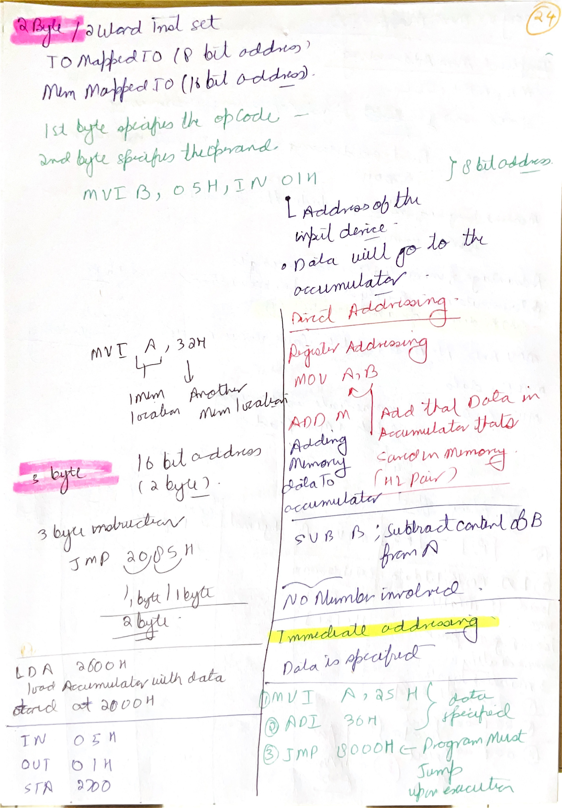
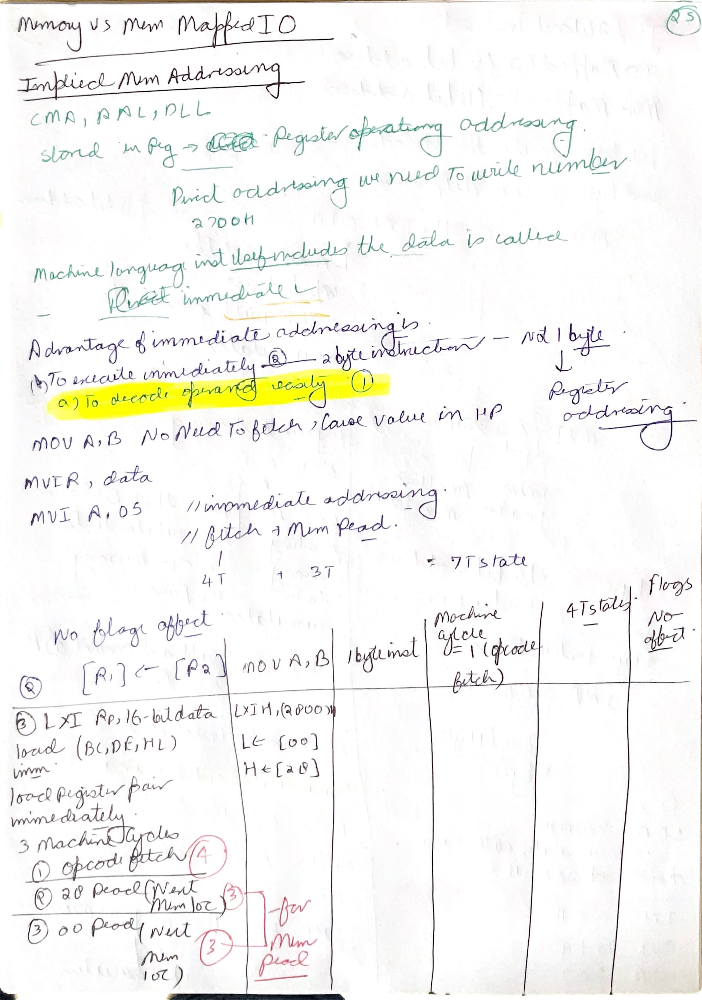
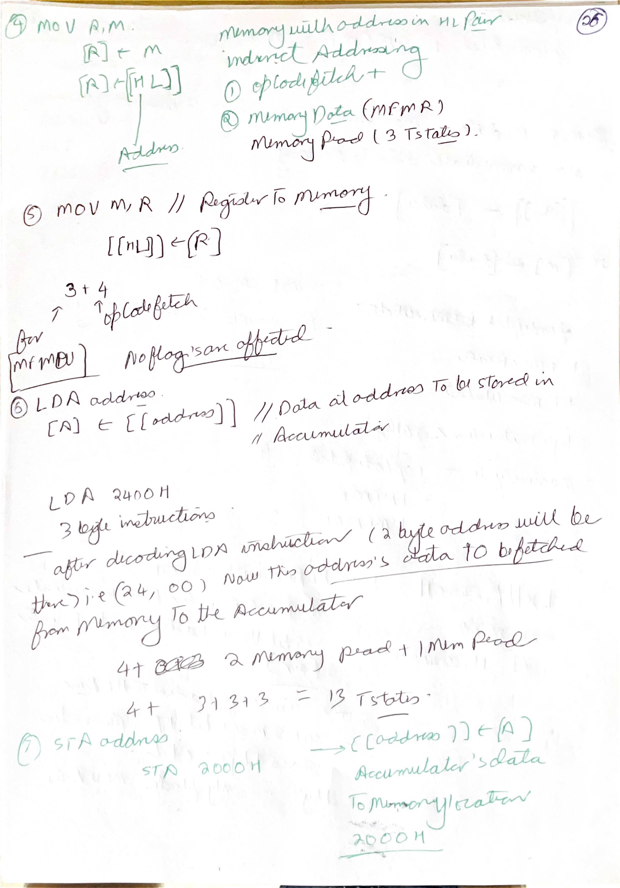
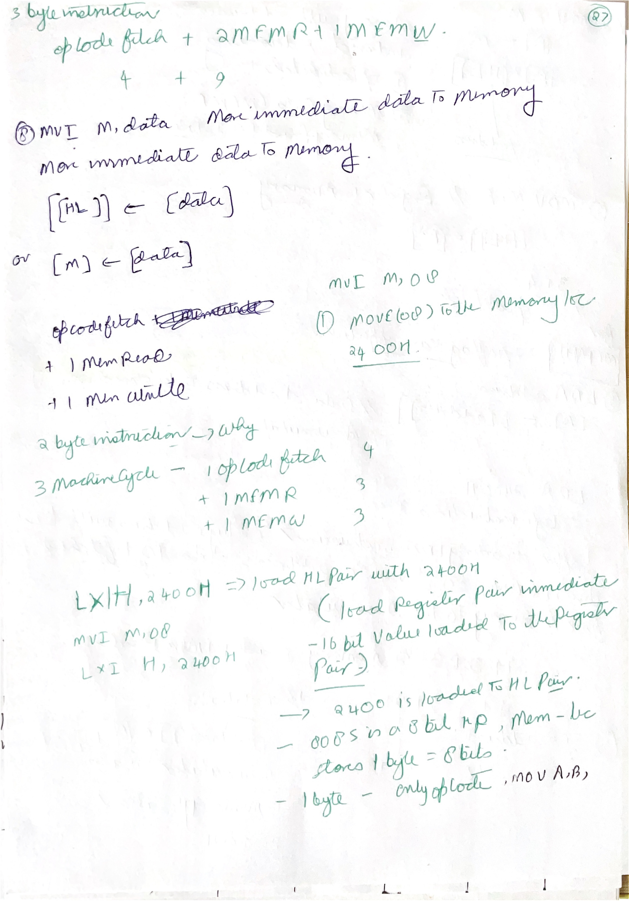
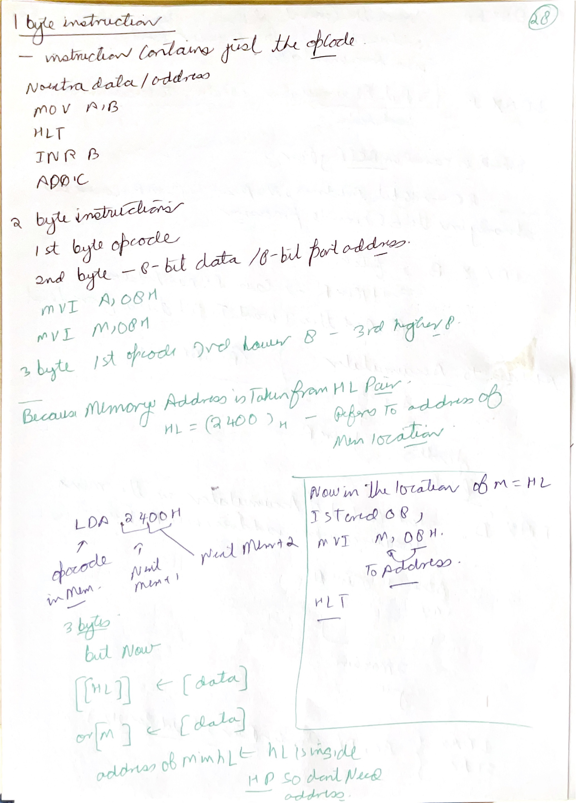
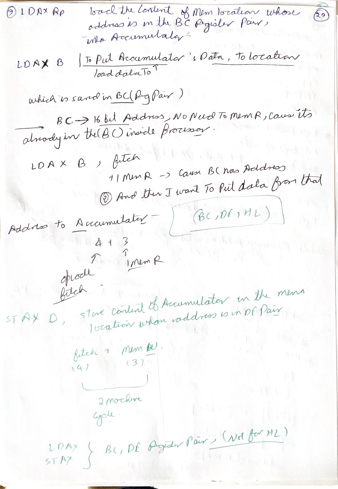
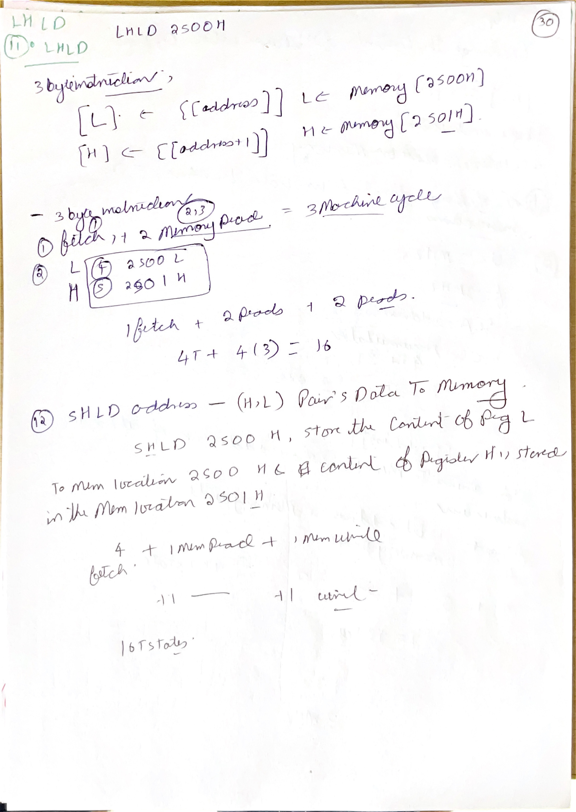
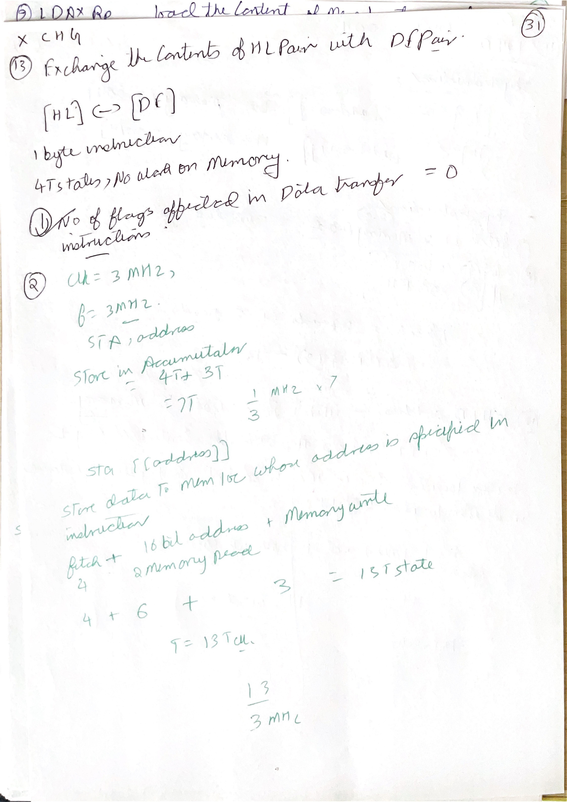
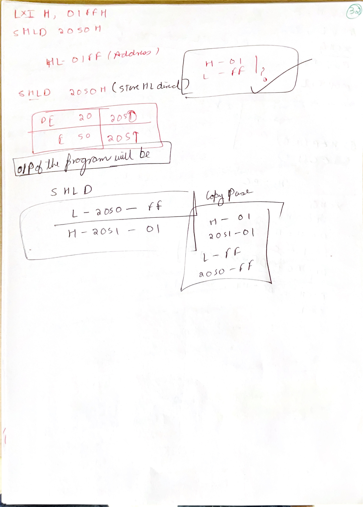
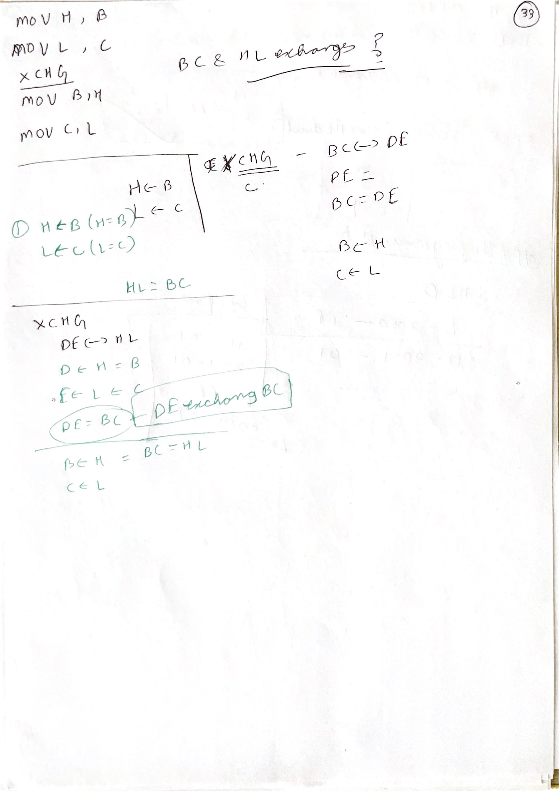

# Day 03: Data Transfer, Register Pairs, and Logical Instructions

Day 03 focuses on how the 8085 moves data between registers and memory, how `HL` acts as a memory pointer, and how logical instructions such as `ORI`, `XRA`, and accumulator operations affect data and flags. This day is important because many later programming problems become simple once you can trace register contents carefully.

## Image Index

| No. | Image | Main idea |
| --- | --- | --- |
| 1 | [MVI M,data and indirect addressing](images/Day%2003/day-3-mvi-m-data-indirect-addressing.png) | `M` means memory location addressed by `HL`; immediate data is stored there. |
| 2 | [LHLD direct addressing example](images/Day%2003/day-3-lhld-direct-addressing-example.png) | Load `L` and `H` directly from two consecutive memory locations. |
| 3 | [XCHG register-pair question](images/Day%2003/day-3-xchg-register-pair-question.png) | `XCHG` exchanges `HL` and `DE` register pairs. |
| 4 | [Register-pair program tracing](images/Day%2003/day-3-register-pair-program-tracing.png) | Step-by-step tracing of `XRA`, `MOV`, `INX`, `DAD`, and register-pair effects. |
| 5 | [ORI data immediate with accumulator](images/Day%2003/day-3-ori-data-immediate-accumulator.png) | Immediate OR operation: `A <- A OR data`. |
| 6 | [XRA A clears accumulator](images/Day%2003/day-3-xra-a-clear-accumulator-note.png) | XORing a value with itself gives zero; `XRA A` clears `A`. |

## Handwritten Notes Linked To Day 03

Each handwritten page is shown first as a large full-page image. The explanation below the image adds the technical layer: instruction behavior, bus cycles, flags, timing, address formation, or hardware reason behind the note.

### [till47 p001](images/HandWrittenNotes/till47/page-001.jpg)

<a href="images/HandWrittenNotes/till47/page-001.jpg"></a>

Technical explanation: separate opcode bytes from operand bytes. The opcode selects the operation; following bytes may be immediate data, a port number, a low address byte, or a high address byte. One-byte instructions encode everything in the opcode. Two-byte instructions usually add one data or port byte. Three-byte instructions usually add a 16-bit address or 16-bit immediate value, stored low byte first in memory.

Addressing mode means where the operand comes from. Immediate addressing puts the operand in the instruction stream. Register addressing uses an internal register. Direct addressing stores the 16-bit memory address inside the instruction. Register-indirect addressing uses a register pair as a pointer. Implied addressing builds the operand into the instruction definition, such as accumulator, carry, or stack behavior.

Data-transfer instructions do not all cost the same in hardware. Register-to-register movement happens inside the CPU after opcode fetch. Direct memory instructions such as `LDA` and `STA` must fetch two address bytes and then perform a memory read or write. `LHLD` and `SHLD` transfer two memory bytes because `HL` is 16 bits while memory is byte-wide.

Direct addressing and register-indirect addressing differ in where the effective address comes from. `LDA 2050H` contains the address bytes in the instruction. `MOV A,M`, `MOV M,R`, or `MVI M,data` does not contain the final memory address; the address is already in `HL`. Changing `HL` changes the accessed memory byte without changing the opcode.

### [till47 p002](images/HandWrittenNotes/till47/page-002.jpg)

<a href="images/HandWrittenNotes/till47/page-002.jpg"></a>

Technical explanation: addressing mode means where the operand comes from. Immediate addressing puts the operand in the instruction stream. Register addressing uses an internal register. Direct addressing stores the 16-bit memory address inside the instruction. Register-indirect addressing uses a register pair as a pointer. Implied addressing builds the operand into the instruction definition, such as accumulator, carry, or stack behavior.

Keep flag layout separate from addressing mode. Addressing mode tells where the operand comes from; flags tell what happened after an ALU-style result. A data-transfer instruction may use an addressing mode without changing flags, so a later conditional branch may still be testing older flag values.

### [till47 p003](images/HandWrittenNotes/till47/page-003.jpg)

<a href="images/HandWrittenNotes/till47/page-003.jpg"></a>

Technical explanation: data-transfer instructions do not all cost the same in hardware. Register-to-register movement happens inside the CPU after opcode fetch. Direct memory instructions such as `LDA` and `STA` must fetch two address bytes and then perform a memory read or write. `LHLD` and `SHLD` transfer two memory bytes because `HL` is 16 bits while memory is byte-wide.

Direct addressing and register-indirect addressing differ in where the effective address comes from. `LDA 2050H` contains the address bytes in the instruction. `MOV A,M`, `MOV M,R`, or `MVI M,data` does not contain the final memory address; the address is already in `HL`. Changing `HL` changes the accessed memory byte without changing the opcode.

### [till47 p004](images/HandWrittenNotes/till47/page-004.jpg)

<a href="images/HandWrittenNotes/till47/page-004.jpg"></a>

Technical explanation: for `MVI M,data`, `M` is not a separate register. It means `[HL]`, the memory byte at the address currently stored in the `HL` pair. Therefore `LXI H,addr16` must come first when the target memory address is not already in `HL`; `LXI` loads the pointer, and `MVI M,data` writes the immediate byte through that pointer. The instruction bytes and data/address bytes must be separated when tracing: `LXI H,2050H` fetches opcode, low byte `50H`, high byte `20H`; then `MVI M,32H` fetches its opcode and data byte `32H`, and writes `32H` into memory location `2050H`.

The timing follows the bus cycles. `LXI H,addr16` is opcode fetch 4T + low-byte memory read 3T + high-byte memory read 3T = 10T. `MVI M,data` is opcode fetch 4T + immediate-byte memory read 3T + memory write to `[HL]` 3T = 10T. `MVI B,data` lacks that final external memory write, so it is shorter even though the mnemonic family is the same.

Direct addressing and register-indirect addressing differ in where the effective address comes from. `LDA 2050H` contains the address bytes in the instruction. `MOV A,M`, `MOV M,R`, or `MVI M,data` does not contain the final memory address; the address is already in `HL`. Changing `HL` changes the accessed memory byte without changing the opcode.

`LXI rp,data16` loads a 16-bit register pair using the two bytes after the opcode. The low byte is fetched first and loaded into the lower register of the pair; the high byte is fetched next and loaded into the higher register. For `LXI H,2050H`, the final state is `H=20H`, `L=50H`, so `M` now refers to memory address `2050H`.

### [till47 p005](images/HandWrittenNotes/till47/page-005.jpg)

<a href="images/HandWrittenNotes/till47/page-005.jpg"></a>

Technical explanation: separate opcode bytes from operand bytes. The opcode selects the operation; following bytes may be immediate data, a port number, a low address byte, or a high address byte. One-byte instructions encode everything in the opcode. Two-byte instructions usually add one data or port byte. Three-byte instructions usually add a 16-bit address or 16-bit immediate value, stored low byte first in memory.

Data-transfer instructions do not all cost the same in hardware. Register-to-register movement happens inside the CPU after opcode fetch. Direct memory instructions such as `LDA` and `STA` must fetch two address bytes and then perform a memory read or write. `LHLD` and `SHLD` transfer two memory bytes because `HL` is 16 bits while memory is byte-wide.

Direct addressing and register-indirect addressing differ in where the effective address comes from. `LDA 2050H` contains the address bytes in the instruction. `MOV A,M`, `MOV M,R`, or `MVI M,data` does not contain the final memory address; the address is already in `HL`. Changing `HL` changes the accessed memory byte without changing the opcode.

### [till47 p006](images/HandWrittenNotes/till47/page-006.jpg)

<a href="images/HandWrittenNotes/till47/page-006.jpg"></a>

Technical explanation: `LDAX` and `STAX` use register-pair indirect addressing through `BC` or `DE`; `MOV A,M` and `MOV M,A` use `HL` through the symbol `M`. The effective address is not stored in the instruction bytes. The opcode selects which pair supplies the address, and the bus performs a memory read or write at that 16-bit address.

`LDAX` and `STAX` are restricted in the 8085: they use `BC` or `DE` as the pointer, not `HL`. If the handwritten example changes `B/C` or `D/E` before the instruction, the effective memory address changes even though the instruction mnemonic is unchanged.

### [till47 p007](images/HandWrittenNotes/till47/page-007.jpg)

<a href="images/HandWrittenNotes/till47/page-007.jpg"></a>

Technical explanation: `LHLD addr` and `SHLD addr` are direct 16-bit memory transfers involving `HL`. The address bytes are part of the instruction, low byte first. `LHLD 2050H` loads `L` from `2050H` and `H` from `2051H`; `SHLD 2050H` stores `L` at `2050H` and `H` at `2051H`. The low-address/low-register pairing is the key detail.

The timing comes from the extra bus transfers. `LHLD` and `SHLD` fetch the opcode and two address bytes, then perform two data memory reads or writes. That gives five machine cycles and commonly 16 T-states: `4T + 3T + 3T + 3T + 3T`.

### [till47 p008](images/HandWrittenNotes/till47/page-008.jpg)

<a href="images/HandWrittenNotes/till47/page-008.jpg"></a>

Technical explanation: `LDAX` and `STAX` use register-pair indirect addressing through `BC` or `DE`; `MOV A,M` and `MOV M,A` use `HL` through the symbol `M`. The effective address is not stored in the instruction bytes. The opcode selects which pair supplies the address, and the bus performs a memory read or write at that 16-bit address.

`XCHG` swaps `HL` with `DE`; it does not touch memory. `DAD rp` adds a 16-bit register pair to `HL` and stores the 16-bit result in `HL`, with carry out recorded in `CY`. When tracing these, combine each pair as a 16-bit number first, then split the result back into high and low registers.

### [till47 p009](images/HandWrittenNotes/till47/page-009.jpg)

<a href="images/HandWrittenNotes/till47/page-009.jpg"></a>

Technical explanation: `LXI rp,data16` loads a 16-bit register pair using the two bytes after the opcode. The low byte is fetched first and loaded into the lower register of the pair; the high byte is fetched next and loaded into the higher register. For `LXI H,2050H`, the final state is `H=20H`, `L=50H`, so `M` now refers to memory address `2050H`.

`LHLD addr` and `SHLD addr` are direct 16-bit memory transfers involving `HL`. The address bytes are part of the instruction, low byte first. `LHLD 2050H` loads `L` from `2050H` and `H` from `2051H`; `SHLD 2050H` stores `L` at `2050H` and `H` at `2051H`. The low-address/low-register pairing is the key detail.

### [till47 p010](images/HandWrittenNotes/till47/page-010.jpg)

<a href="images/HandWrittenNotes/till47/page-010.jpg"></a>

Technical explanation: `XCHG` swaps `HL` with `DE`; it does not touch memory. `DAD rp` adds a 16-bit register pair to `HL` and stores the 16-bit result in `HL`, with carry out recorded in `CY`. When tracing these, combine each pair as a 16-bit number first, then split the result back into high and low registers.

For program traces, keep a state table. Each row should list only what the current instruction changes: registers, flags, memory, `PC`, `SP`, or stack bytes. This prevents the common mistake of updating a value but forgetting the pointer that determines where the next memory access will happen.

## 1. `MVI M,data`: Immediate Data to Memory Through `HL`


`MVI M,data` is one of the most important instructions for understanding 8085 notation.

```asm
LXI H,2400H
MVI M,08H
HLT
```

Meaning:

```text
HL <- 2400H
memory[HL] <- 08H
therefore memory[2400H] <- 08H
```

The symbol `M` does not mean a separate register. It means **the memory location whose address is currently stored in the `HL` pair**. So when `HL = 2400H`, `M` means `memory[2400H]`.

`MVI M,08H` combines two ideas:

| Part | Meaning |
| --- | --- |
| `MVI` | Move immediate data. |
| `M` | Destination is memory addressed by `HL`. |
| `08H` | 8-bit immediate data byte. |

Because the instruction stores data into memory, the CPU needs more than just opcode fetch. It must fetch the opcode, fetch the immediate byte, and then perform a memory write to the address held in `HL`.

Common trap: students sometimes write "M = 2400H." That is wrong. `HL = 2400H`; `M` is the memory byte stored at address `2400H`.

## 2. `LHLD addr`: Load H and L Direct


`LHLD addr` loads the `HL` pair from two consecutive memory locations.

```asm
LHLD 2500H
```

The 8085 performs:

```text
L <- memory[2500H]
H <- memory[2501H]
```

The lower-order register `L` is loaded from the lower address, and the higher-order register `H` is loaded from the next address. This matches the little-endian style used by the 8085 for 16-bit values: low byte first, high byte second.

If:

```text
memory[2500H] = 34H
memory[2501H] = 12H
```

then after:

```asm
LHLD 2500H
```

we get:

```text
L = 34H
H = 12H
HL = 1234H
```

Common trap: do not load `H` from the first address. The mnemonic says `LHLD`, but the memory order is low byte first.

## 3. `XCHG`: Exchange `HL` and `DE`


`XCHG` exchanges the contents of the `HL` and `DE` register pairs:

```text
H <-> D
L <-> E
```

So if:

```text
HL = 2500H
DE = 1234H
```

then after:

```asm
XCHG
```

we get:

```text
HL = 1234H
DE = 2500H
```

This instruction is useful when one instruction requires an address or value in `HL`, but the program currently has the useful value in `DE`. Instead of moving each register separately, `XCHG` swaps both pairs in one instruction.

Common trap: `XCHG` does not exchange `BC` with anything. It only exchanges `DE` and `HL`.

## 4. Register-Pair Program Tracing


The program-tracing screenshot is testing whether you can track register contents line by line. The reliable method is to make a table and update only the registers touched by each instruction.

Example style:

```asm
XRA A
MOV L,A
MOV H,L
INX H
DAD H
```

Interpretation:

| Instruction | Effect |
| --- | --- |
| `XRA A` | `A <- A XOR A`, so `A = 00H`. |
| `MOV L,A` | `L <- A`, so `L = 00H`. |
| `MOV H,L` | `H <- L`, so `H = 00H`. |
| `INX H` | `HL <- HL + 1`, so `HL = 0001H`. |
| `DAD H` | `HL <- HL + HL`, so `HL = 0002H`. |

Key idea: `INX H` increments the 16-bit register pair `HL`; it is not the same as incrementing only `H`. `DAD H` adds the selected register pair to `HL`, so `DAD H` doubles `HL`.

Common trap: `DAD` affects the carry flag, but it does not update all arithmetic flags the way an 8-bit `ADD` instruction does.

## 5. `ORI data`: Immediate OR With Accumulator


`ORI data` performs a bitwise OR between the accumulator and an 8-bit immediate value:

```text
A <- A OR data
```

Example:

```asm
MVI A,82H
ORI 0FH
```

Binary view:

```text
82H = 1000 0010
0FH = 0000 1111
OR  = 1000 1111 = 8FH
```

OR is useful for **setting bits**. Wherever the immediate data has `1`, the result will have `1`. Wherever the immediate data has `0`, the original accumulator bit is preserved.

Flags: logical instructions update condition flags based on the result. In normal 8085 study, `ORI` resets carry and auxiliary carry and updates sign, zero, and parity according to the result.

Common trap: OR is not addition. `82H OR 0FH` is `8FH`, not `91H`.

## 6. `XRA A`: Clearing the Accumulator


`XRA r` performs exclusive-OR between the accumulator and the selected operand:

```text
A <- A XOR r
```

When the operand is `A` itself:

```asm
XRA A
```

the result is always zero, because every bit XORed with itself gives `0`:

```text
0 XOR 0 = 0
1 XOR 1 = 0
```

Therefore:

```text
A <- A XOR A = 00H
```

This is a compact way to clear the accumulator. It also sets the zero flag because the result is zero. In 8085, XOR-type logical instructions reset the carry flag.

Common trap: `XRA A` is not the same as `MVI A,00H` in timing and flag behavior. `MVI A,00H` loads zero but does not affect flags; `XRA A` clears `A` and affects flags.

## Research Deep Dive: Addressing and Data-Movement Patterns

The Intel assembly manual treats instruction mnemonics as precise contracts. For Day 3, the contract is usually about where the data comes from, where it goes, and whether flags are changed.

### `HL` As A Pointer

In 8085 notation, `M` is not a physical register. It means:

```text
M = memory byte whose address is in HL
```

So:

```asm
MVI M,42H
```

does not store `42H` in `H` or `L`. It stores `42H` into memory at address `HL`.

Worked example:

```asm
LXI H,2050H
MVI M,42H
```

Result:

```text
H = 20H
L = 50H
memory[2050H] = 42H
```

### `LHLD` And Little-Endian Loading

For:

```asm
LHLD 3000H
```

the CPU reads two consecutive memory locations:

| Memory location | Loaded into |
| --- | --- |
| `3000H` | `L` |
| `3001H` | `H` |

This low-byte-first rule is the same idea that later appears in 8086 word storage. It is easy to reverse `H` and `L`, so always write the two memory addresses separately.

### Why `XCHG` Is Useful

`XCHG` exchanges `HL` and `DE`. It is useful when one register pair is acting as a source pointer and the other as a destination pointer.

Example:

```asm
LXI H,2000H
LXI D,3000H
XCHG
```

After `XCHG`:

```text
HL = 3000H
DE = 2000H
```

No memory byte is read or written by `XCHG`; only internal register-pair contents are exchanged.

### Logical Instructions As Bit Tools

Use this mental table:

| Goal | Instruction pattern | Example |
| --- | --- | --- |
| Set selected bits | `ORI mask` | `ORI 80H` sets bit 7. |
| Clear selected bits | `ANI mask` | `ANI 0FH` clears high nibble. |
| Toggle selected bits | `XRI mask` | `XRI 01H` toggles bit 0. |
| Clear accumulator | `XRA A` | Result is always `00H`. |

This is deeper than saying "logical instruction." In programs, these instructions are used to modify control/status bytes without disturbing unrelated bits.

## Handwritten And Screenshot Deepening

Day 03 handwritten notes should be studied as a tracing discipline. The screenshots show specific instructions such as `MVI M,data`, `LHLD`, `XCHG`, `ORI`, and `XRA A`, but the deeper skill is knowing exactly which storage location changes after each instruction. Before writing a result, identify whether the destination is a register, the accumulator, a register pair, or the memory byte addressed by `HL`.

The symbol `M` deserves special attention. It is not a real register; it means memory at the 16-bit address currently held in `HL`. So `MVI M,05H` stores `05H` into memory, while `MVI H,05H` changes the high byte of the pointer itself. Many wrong traces happen because `M` is treated like another register instead of as a memory reference through `HL`.

For direct loading instructions such as `LDA` and `LHLD`, connect the handwritten byte-order notes to the screenshots. `LHLD addr` reads two consecutive memory locations: the byte at `addr` goes into `L`, and the byte at `addr + 1` goes into `H`. This low-byte-first rule is the same little-endian habit that later appears in 8086 words, stack return addresses, and interrupt vectors.

`XCHG` is simple only if you remember it swaps complete register pairs. After `XCHG`, `H` exchanges with `D` and `L` exchanges with `E`. It does not touch memory, flags, or the accumulator. In program traces, write the pair values before and after the swap, because many examples rely on moving an address from `DE` into `HL` so the next `M` instruction points somewhere new.

The logical-instruction screenshots should be revised through bit patterns, not decimal intuition. `ORI data` sets any bit that is 1 in the immediate operand. `XRA A` clears the accumulator because every bit XOR itself is 0. Logical instructions update flags from the resulting accumulator value, but they are not arithmetic addition or subtraction, so the meaning of carry and auxiliary carry is different from arithmetic pages.

The useful handwritten-note method for Day 03 is a four-column trace: instruction, registers before, memory touched, registers after. If an instruction does not affect flags, mark that explicitly. If it does, compute flags from the binary result. This turns the screenshots into repeatable program-tracing technique.

## Points To Remember

- `M` means `memory[HL]`.
- `LHLD addr` loads `L` from `addr` and `H` from `addr + 1`.
- `XCHG` swaps `DE` and `HL`, not `BC`.
- `INX H` increments the full 16-bit `HL` pair.
- `DAD rp` adds a 16-bit register pair to `HL`.
- OR is used to set bits; AND is used to mask bits; XOR is often used to toggle or clear by self-XOR.
- `XRA A` clears accumulator and affects flags.
- Immediate data is a value stored after the opcode, not an address unless the instruction definition says so.

## Sources

[S1] Intel Corporation, [MCS-80/85 Family User's Manual, January 1983](https://www.bitsavers.org/components/intel/MCS80/MCS80_85_Users_Manual_Jan83.pdf). Used for instruction behavior, register-pair operation, flags, direct/indirect/immediate addressing, and accumulator logical instructions.

[S2] Intel Corporation, [8080/8085 Assembly Language Programming Manual, May 1981](https://www.bitsavers.org/pdf/intel/ISIS_II/9800301-04_8080_8085_Assembly_Language_Programming_Manual_May81.pdf). Used for assembly notation and examples of data transfer and logical instructions.
