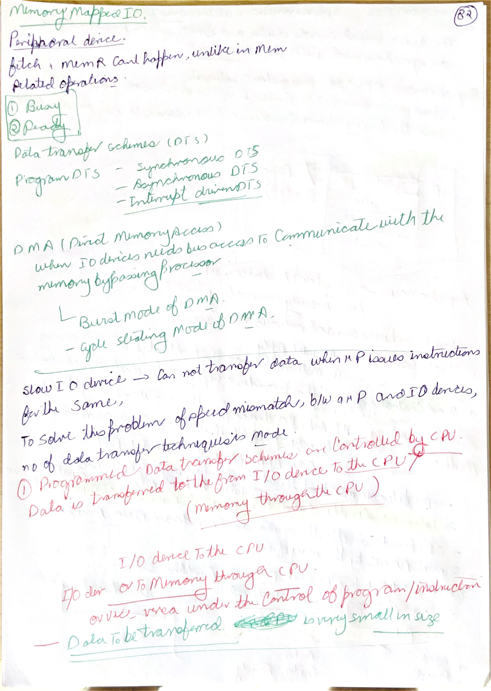
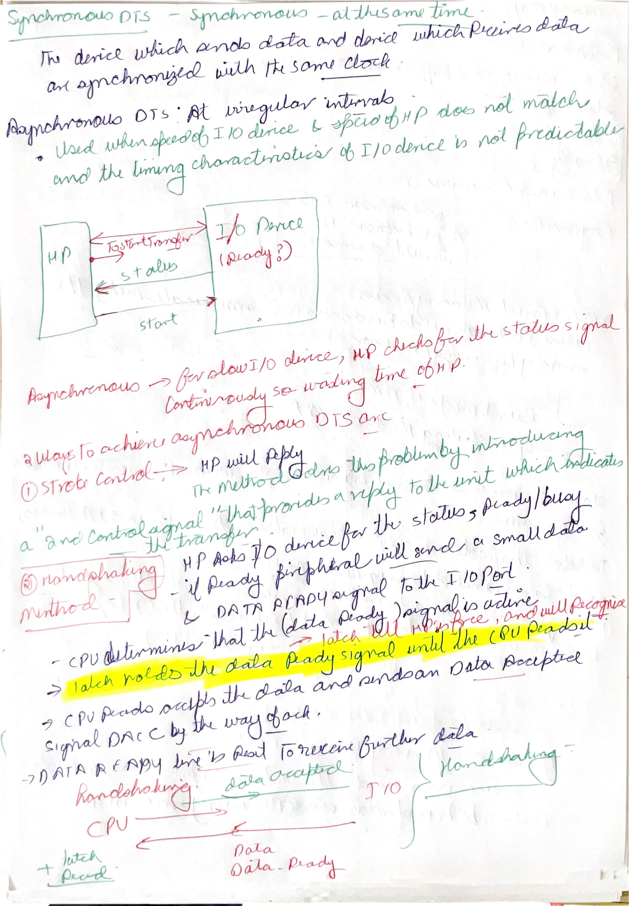
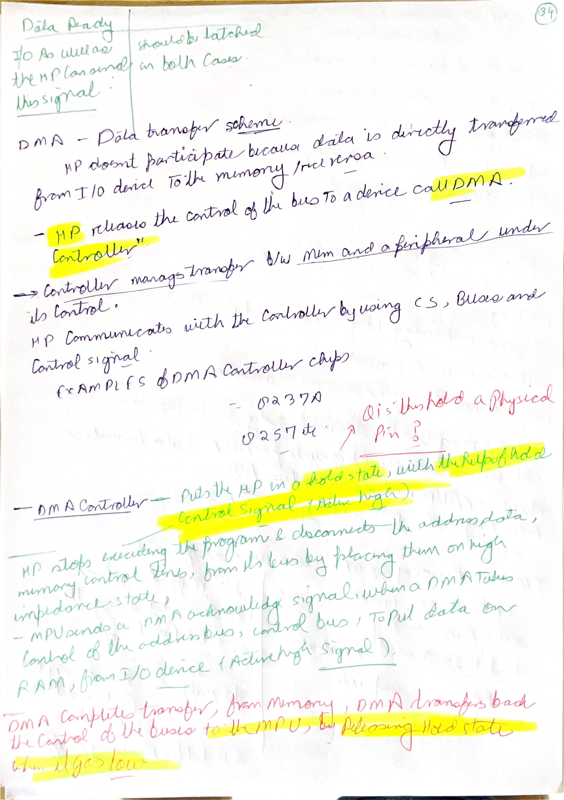
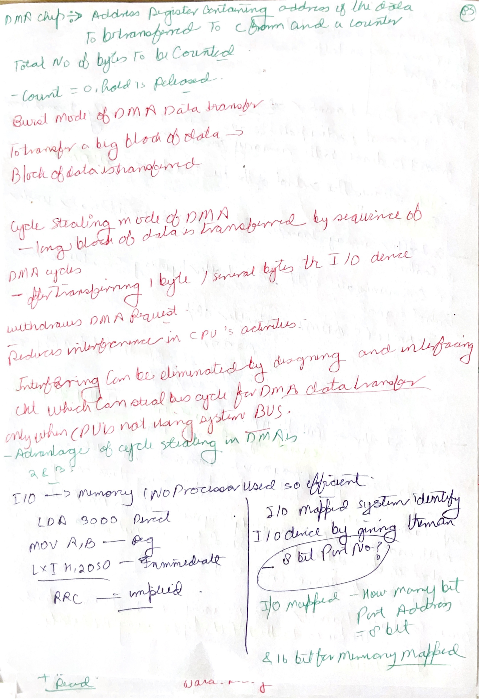
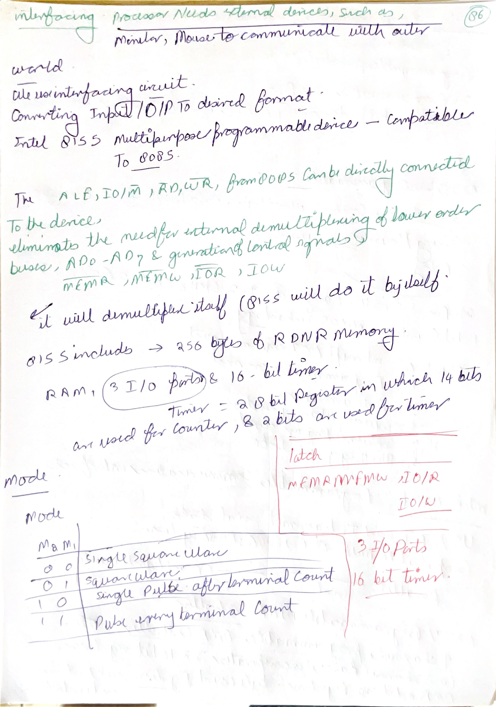
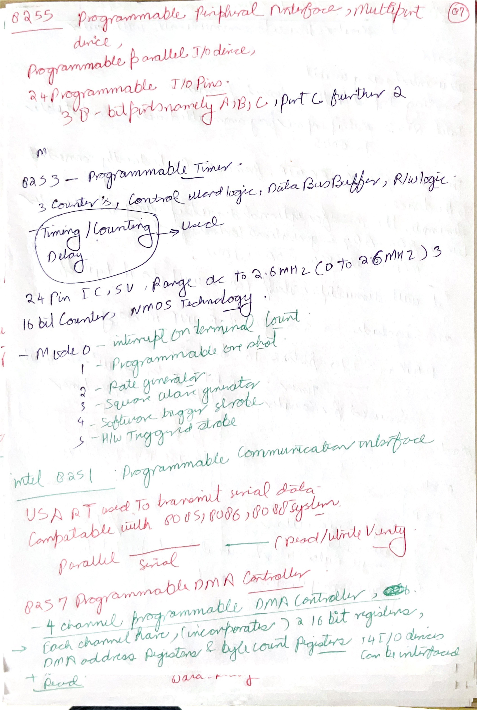
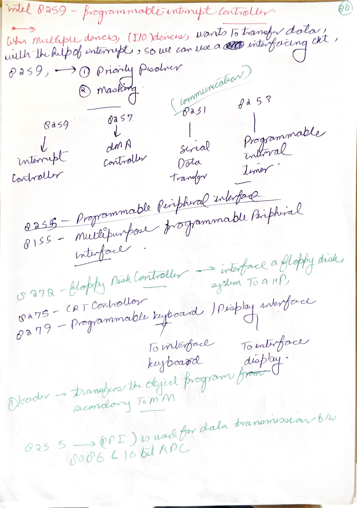
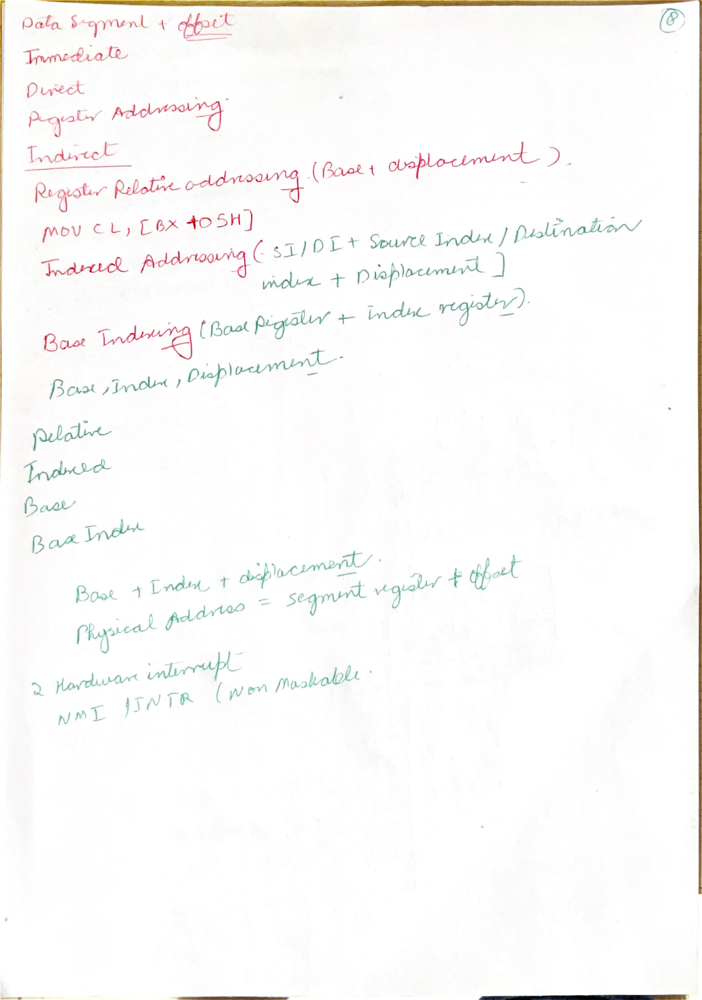

# Day 08: I/O Handshaking, DMA, and 8085 Support Chips

Day 08 covers the May 31 afternoon screenshots. The session moves from CPU-controlled I/O into DMA and the Intel support chips commonly used around 8085-style systems. The main idea is that a microprocessor system is not only the CPU: practical systems need peripheral controllers for parallel I/O, timers, DMA, interrupts, storage, displays, and keyboards.

## Image Index

| No. | Image | Main idea |
| --- | --- | --- |
| 1 | [I/O data transfer handshaking sequence](images/Day%2008/day-8-io-data-transfer-handshaking-sequence.png) | CPU and I/O module exchange ready/accepted status signals. |
| 2 | [DMA data transfer scheme](images/Day%2008/day-8-dma-data-transfer-scheme.png) | DMA transfers data directly between I/O and memory. |
| 3 | [DMA HOLD/HLDA transfer steps](images/Day%2008/day-8-dma-hold-hlda-transfer-steps.png) | DMA controller takes bus control through `HOLD` and `HLDA`. |
| 4 | [Burst mode DMA data transfer](images/Day%2008/day-8-burst-mode-dma-data-transfer.png) | Device transfers a block after taking control of the bus. |
| 5 | [Cycle stealing DMA data transfer](images/Day%2008/day-8-cycle-stealing-dma-data-transfer.png) | DMA transfers small units while reducing CPU interference. |
| 6 | [Cycle stealing DMA efficiency note](images/Day%2008/day-8-cycle-stealing-dma-efficiency-note.png) | Cycle stealing can use bus cycles when CPU is not using the bus. |
| 7 | [I/O mapped port number question](images/Day%2008/day-8-io-mapped-port-number-question.png) | I/O mapped devices are identified by 8-bit port numbers. |
| 8 | [Intel 8155 programmable peripheral interface](images/Day%2008/day-8-intel-8155-programmable-peripheral-interface.png) | 8155 provides RAM, I/O ports, and a timer. |
| 9 | [Intel 8255 programmable peripheral interface](images/Day%2008/day-8-intel-8255-programmable-peripheral-interface.png) | 8255 gives programmable parallel I/O ports. |
| 10 | [Intel 8253 programmable interval timer](images/Day%2008/day-8-intel-8253-programmable-interval-timer.png) | 8253 has counters, control word register, and read/write logic. |
| 11 | [Intel 8253 operating modes](images/Day%2008/day-8-intel-8253-operating-modes.png) | Timer modes 0 through 5. |
| 12 | [Intel 8257 DMA controller](images/Day%2008/day-8-intel-8257-dma-controller.png) | 8257 is a four-channel programmable DMA controller. |
| 13 | [Intel 8259 programmable interrupt controller](images/Day%2008/day-8-intel-8259-programmable-interrupt-controller.png) | 8259 manages multiple interrupt request inputs. |
| 14 | [Intel 8259 PIC features](images/Day%2008/day-8-intel-8259-pic-features.png) | 8259 is compatible with 8085/8086/8088 systems. |
| 15 | [Intel 8272 floppy disk controller](images/Day%2008/day-8-intel-8272-floppy-disk-controller.png) | 8272 interfaces floppy disk systems to the microprocessor. |
| 16 | [Intel 8275 and 8279 display interfaces](images/Day%2008/day-8-intel-8275-8279-display-interfaces.png) | 8275 handles CRT display; 8279 handles keyboard/display interface. |

## Handwritten Notes Linked To Day 08

Each handwritten page is shown first as a large full-page image. The explanation below the image adds the technical layer: instruction behavior, bus cycles, flags, timing, address formation, or hardware reason behind the note.

### [85completed p011](images/HandWrittenNotes/85completed/page-011.jpg)

<a href="images/HandWrittenNotes/85completed/page-011.jpg"></a>

Technical explanation: programmed I/O means the CPU explicitly executes instructions to move each byte between an I/O port and a register, usually the accumulator. The port address selects the external device, and the control signals decide whether the transfer is input or output. This is simple hardware but consumes CPU time because the processor must poll or execute transfer instructions for every data movement.

Memory-mapped I/O and I/O-mapped I/O differ in address space and control signaling. Memory-mapped I/O uses ordinary 16-bit memory addresses and memory-style read/write cycles. I/O-mapped I/O uses `IN` and `OUT` with an 8-bit port address and I/O control cycles. The data bus still carries the byte; the difference is how external decoding selects memory versus a device.

### [85completed p012](images/HandWrittenNotes/85completed/page-012.jpg)

<a href="images/HandWrittenNotes/85completed/page-012.jpg"></a>

Technical explanation: a T-state is one processor clock state. Instruction timing is the number of T-states multiplied by the clock period. The counts are not arbitrary: every external memory or I/O access needs a bus cycle. Opcode fetch has address output, `ALE`, memory read control, data capture, and decode work, so it is longer than a plain memory read. Extra operand bytes, memory operands, stack transfers, I/O transfers, and slow memory wait states all add timing cost.

A machine cycle is one external bus operation: opcode fetch, memory read, memory write, I/O read, I/O write, interrupt acknowledge, and so on. An instruction cycle is the whole instruction and can contain several machine cycles. This is why instruction length, addressing mode, and T-state count are connected: every extra byte or external operand has to be fetched, read, or written on the bus.

Synchronous transfer assumes timing agreement; asynchronous transfer needs extra signals because the device and CPU are not guaranteed to be ready at the same moment. Strobe transfer uses a signal to mark valid data. Handshaking adds request/acknowledge style feedback, so the sender knows the receiver actually accepted the byte. The extra signals reduce timing assumptions but increase interface complexity.

### [85completed p013](images/HandWrittenNotes/85completed/page-013.jpg)

<a href="images/HandWrittenNotes/85completed/page-013.jpg"></a>

Technical explanation: DMA transfers data without the CPU executing every byte transfer. A DMA controller requests the bus with `HOLD`; the 8085 responds with `HLDA` after it can release the bus. During DMA, the controller supplies addresses and read/write control for memory or I/O. The CPU is temporarily not the bus master, which is why DMA improves block-transfer efficiency.

The HOLD/HLDA sequence is a bus-arbitration protocol. The DMA controller requests bus control, the CPU finishes a safe point in its current bus use, asserts `HLDA`, and tri-states the bus lines. Only then can the DMA controller drive addresses and read/write controls.

### [85completed p014](images/HandWrittenNotes/85completed/page-014.jpg)

<a href="images/HandWrittenNotes/85completed/page-014.jpg"></a>

Technical explanation: DMA modes are tradeoffs between CPU pause time and transfer speed. Burst mode holds the bus for a block and is fastest for the device but stalls the CPU longer. Cycle stealing takes one bus cycle at a time, reducing CPU disruption but lowering peak transfer rate. Demand or transparent styles vary bus ownership based on device need or CPU idle periods.

DMA transfers data without the CPU executing every byte transfer. A DMA controller requests the bus with `HOLD`; the 8085 responds with `HLDA` after it can release the bus. During DMA, the controller supplies addresses and read/write control for memory or I/O. The CPU is temporarily not the bus master, which is why DMA improves block-transfer efficiency.

### [85completed p015](images/HandWrittenNotes/85completed/page-015.jpg)

<a href="images/HandWrittenNotes/85completed/page-015.jpg"></a>

Technical explanation: support chips offload repeated interface work from the CPU. `8255` provides programmable parallel I/O ports, `8253` provides programmable timing/counting, `8257` manages DMA channels, and `8259` prioritizes and vectors interrupt requests. Devices such as `8272`, `8275`, and `8279` specialize further for floppy, display, keyboard, or display-control tasks.

For 8255 questions, separate the physical ports from the programmed mode. Ports A and B are 8-bit ports, Port C can be split into control/handshake bits, and the control word selects mode and direction. The chip is programmable because software configures that behavior instead of rewiring the interface.

### [85completed p016](images/HandWrittenNotes/85completed/page-016.jpg)

<a href="images/HandWrittenNotes/85completed/page-016.jpg"></a>

Technical explanation: DMA transfers data without the CPU executing every byte transfer. A DMA controller requests the bus with `HOLD`; the 8085 responds with `HLDA` after it can release the bus. During DMA, the controller supplies addresses and read/write control for memory or I/O. The CPU is temporarily not the bus master, which is why DMA improves block-transfer efficiency.

Support chips offload repeated interface work from the CPU. `8255` provides programmable parallel I/O ports, `8253` provides programmable timing/counting, `8257` manages DMA channels, and `8259` prioritizes and vectors interrupt requests. Devices such as `8272`, `8275`, and `8279` specialize further for floppy, display, keyboard, or display-control tasks.

### [85completed p017](images/HandWrittenNotes/85completed/page-017.jpg)

<a href="images/HandWrittenNotes/85completed/page-017.jpg"></a>

Technical explanation: support chips offload repeated interface work from the CPU. `8255` provides programmable parallel I/O ports, `8253` provides programmable timing/counting, `8257` manages DMA channels, and `8259` prioritizes and vectors interrupt requests. Devices such as `8272`, `8275`, and `8279` specialize further for floppy, display, keyboard, or display-control tasks.

Choose the support chip by the hardware problem: many interrupt sources suggest `8259`, block data transfer suggests `8257`, periodic timing suggests `8253`, and keyboard/display interfacing suggests `8279`. The CPU still runs the program, but these chips remove repetitive external-control work.

### [85completed p018](images/HandWrittenNotes/85completed/page-018.jpg)

<a href="images/HandWrittenNotes/85completed/page-018.jpg"></a>

Technical explanation: addressing mode means where the operand comes from. Immediate addressing puts the operand in the instruction stream. Register addressing uses an internal register. Direct addressing stores the 16-bit memory address inside the instruction. Register-indirect addressing uses a register pair as a pointer. Implied addressing builds the operand into the instruction definition, such as accumulator, carry, or stack behavior.

8085 interrupts combine priority, masking, and vectoring. `TRAP` is highest priority and non-maskable. `RST 7.5`, `RST 6.5`, and `RST 5.5` are maskable vectored interrupts with fixed restart addresses: `RST n` maps to `n x 8`, so `RST 7.5` starts at `003CH`, `RST 6.5` at `0034H`, and `RST 5.5` at `002CH`. `INTR` is maskable and non-vectored, so external hardware must supply the instruction during acknowledge.

Support chips offload repeated interface work from the CPU. `8255` provides programmable parallel I/O ports, `8253` provides programmable timing/counting, `8257` manages DMA channels, and `8259` prioritizes and vectors interrupt requests. Devices such as `8272`, `8275`, and `8279` specialize further for floppy, display, keyboard, or display-control tasks.

## 1. Programmed I/O and Handshaking


In simple programmed I/O, the CPU controls the transfer directly. The program checks whether a device is ready, then reads or writes data using instructions such as `IN` and `OUT`. This is easy to understand, but it wastes CPU time when a device is slow.

Handshaking solves the timing mismatch between CPU and peripheral. The CPU may be fast, but an input device, printer, display interface, disk controller, or communication device may not be ready at the exact moment the CPU wants to transfer data.

The basic handshaking idea:

```text
source says data is ready
destination accepts or acknowledges
data transfer occurs
status is cleared or updated
next transfer begins
```

Compared with a fixed synchronous transfer, handshaking is safer because the transfer happens only when both sides are ready. Compared with a simple strobe, handshaking gives feedback: the sender knows the receiver accepted the data.

## 2. I/O Mapped Port Addressing


The 8085 has special I/O instructions:

```asm
IN port
OUT port
```

In standard 8085 teaching, the port address is 8 bits, so there can be up to 256 input port addresses and 256 output port addresses. The same numeric port value can be used for input and output if hardware decoding treats read and write separately.

This is different from memory mapped I/O:

| Feature | I/O mapped I/O | Memory mapped I/O |
| --- | --- | --- |
| Address size in basic 8085 teaching | 8-bit port address | 16-bit memory address |
| Main instructions | `IN`, `OUT` | Memory-reference instructions |
| Address space used | I/O port space | Part of 64 KB memory space |
| Control signal type | I/O read/write | Memory read/write |

The screenshot's port-number question depends on this rule: I/O mapped devices are identified by port numbers, not full 16-bit memory addresses.

## 3. DMA: Direct Memory Access


DMA means **Direct Memory Access**. It lets a controller move data between an I/O device and memory without the CPU executing one instruction per byte.

The CPU still sets up the transfer. It may program the DMA controller with:

- starting memory address;
- transfer count;
- transfer direction;
- device/channel selection;
- mode of operation.

After setup, the DMA controller requests the system bus:

```text
DMA controller asserts HOLD
8085 completes current bus operation
8085 responds with HLDA
DMA controller controls address, data, and control buses
data moves between I/O and memory
DMA controller releases HOLD
8085 resumes bus control
```

The key hardware idea is bus ownership. During DMA, the CPU is not the bus master. The DMA controller temporarily becomes the bus master so it can generate addresses and read/write signals.

## 4. Burst Mode and Cycle Stealing


DMA mode decides how aggressively the controller uses the bus.

| DMA mode | What happens | CPU effect |
| --- | --- | --- |
| Burst mode | DMA transfers a whole block while holding the bus. | CPU is blocked from bus access during the burst. |
| Cycle stealing | DMA transfers one byte or a small unit at a time. | CPU is slowed but not blocked for a long continuous burst. |

Burst mode is efficient for moving large blocks quickly, but the CPU loses the bus until the burst finishes. Cycle stealing is friendlier to CPU execution because DMA uses individual bus cycles. The total transfer may take longer, but the CPU can continue between stolen cycles.

The note about efficiency means: if the CPU is not using the bus during some internal operation, a DMA transfer can sometimes use that available bus time. In real hardware, exact behavior depends on timing and controller design, but the study-level idea is that cycle stealing reduces long CPU suspension.

## 5. 8155 and 8255 Programmable Peripheral Interfaces


The 8155 and 8255 are peripheral interface chips. They let the processor connect to external devices through programmable ports instead of building all control logic from discrete gates.

The 8255 is especially important in 8085 courses. It provides three 8-bit ports:

```text
Port A
Port B
Port C
```

Port C can also be split into upper and lower parts for control/handshaking. The processor writes a control word to configure port direction and mode. This is why the chip is called programmable: the same hardware can act as input, output, or handshake-capable interface depending on the control word.

The 8155 combines RAM, I/O, and timer functions. It is useful in small systems because it reduces the number of separate chips needed.

## 6. 8253 Programmable Interval Timer


The 8253 is a programmable timer/counter. It has multiple counters that can be loaded with count values and programmed into different modes.

Typical timer uses:

- generating delays;
- producing square waves;
- counting external events;
- creating periodic interrupts;
- timing I/O operations.

The CPU writes a control word to tell the 8253 which counter to use, how to load the count, and what mode to operate in. The common modes listed in the screenshot are mode 0 through mode 5. You do not need to memorize every waveform at first; the main point is that a timer chip offloads timing work from software loops.

## 7. 8257 DMA Controller


The 8257 is a programmable DMA controller. In typical 8085 study, it has four DMA channels. Each channel can hold address/count information for a device transfer.

Its job is to:

1. accept DMA requests from devices;
2. request the system bus from the CPU;
3. generate memory addresses;
4. generate control signals for read/write transfer;
5. update address/count information;
6. release the bus when the transfer is complete.

So the 8257 is the hardware that makes the Day 08 DMA diagrams practical.

## 8. 8259 Programmable Interrupt Controller


The 8085 has only a limited number of interrupt input pins. The 8259 expands interrupt handling by accepting multiple interrupt request inputs and presenting a controlled interrupt request to the CPU.

The 8259 can:

- prioritize multiple interrupt requests;
- mask selected interrupt inputs;
- provide vector information;
- be cascaded for more interrupt sources;
- work with 8085, 8086, and 8088 style systems depending on configuration.

In system terms, the 8259 is an interrupt traffic controller. Devices request service from the 8259; the 8259 decides priority and communicates with the CPU.

## 9. 8272, 8275, and 8279


The later support chips are specialized controllers:

| Chip | Main role |
| --- | --- |
| 8272 | Floppy disk controller. It handles low-level disk interface tasks. |
| 8275 | CRT controller. It helps generate display timing and character display control. |
| 8279 | Keyboard/display interface. It scans keyboard inputs and drives display outputs. |

The reason these chips exist is the same reason DMA and interrupt controllers exist: a general-purpose CPU should not have to perform every low-level timing and control task directly. Support chips turn complex peripheral timing into programmable registers and status/control signals.

## Research Deep Dive: Why Support Chips Exist

The support chips in Day 08 are not random part numbers. Each one converts a messy real-world timing problem into programmable registers and status bits.

### 8255: Parallel I/O Becomes Programmable

The 8255 gives the CPU three 8-bit ports:

| Port | Typical role |
| --- | --- |
| Port A | 8-bit input/output group, often with handshaking. |
| Port B | 8-bit input/output group, often simpler than Port A. |
| Port C | Can be used as one 8-bit port or split into upper/lower control bits. |

The CPU writes a control word to select the mode:

| Mode | Main idea |
| --- | --- |
| Mode 0 | Simple input/output, no handshaking. |
| Mode 1 | Strobed input/output with handshaking signals. |
| Mode 2 | Bidirectional bus mode for Port A. |
| BSR | Bit set/reset mode for individual Port C bits. |

This connects directly to the handshaking screenshots: the CPU does not need to manually toggle every handshake line if the interface chip can manage a defined protocol.

### 8253: Timing Without Burning CPU Loops

A software delay loop wastes CPU time and depends on instruction timing. The 8253 provides hardware counters that can count clock pulses or external events.

Typical uses:

| Use | Why hardware timer helps |
| --- | --- |
| Periodic interrupt | CPU gets a regular time base. |
| Square-wave generation | Output waveform can continue without software toggling. |
| Event counting | External pulses can be counted accurately. |
| One-shot delay | Hardware can signal after a programmed interval. |

The CPU programs the counter, mode, and count value. After that, the timer hardware does the repetitive timing work.

### 8257: DMA Controller As Temporary Bus Master

The 8257 makes DMA practical by storing transfer state for multiple channels. A channel needs at least:

| Information | Purpose |
| --- | --- |
| Starting address | Where memory transfer begins. |
| Count | How many bytes are transferred. |
| Direction/control | Whether memory is read or written. |
| Request/acknowledge lines | Handshake with the I/O device. |

DMA is not magic. The CPU first programs the controller. Then the controller requests the bus, becomes bus master during transfer, updates address/count, and releases the bus when done.

### 8259: Interrupt Controller As Priority Hardware

The 8259 is useful because a CPU has limited interrupt pins but a real system may have many devices. The controller keeps separate internal ideas:

| Register idea | Meaning |
| --- | --- |
| IRR | Interrupt Request Register: which inputs are requesting service. |
| IMR | Interrupt Mask Register: which requests are masked. |
| ISR | In-Service Register: which interrupt is currently being serviced. |

That separation explains why "interrupt requested" is not the same as "interrupt serviced." A request can exist but be masked or lower priority than another active request.

### Choosing A Transfer Method

| Situation | Best fit |
| --- | --- |
| Rare simple byte transfer | Programmed I/O. |
| Device and CPU need readiness coordination | Handshaking or interrupt-driven I/O. |
| Large block transfer where CPU should not move every byte | DMA. |
| Many devices competing for service | Programmable interrupt controller. |
| Accurate periodic timing | Programmable interval timer. |

## Handwritten And Screenshot Deepening

Day 08 is about moving data between the processor system and the outside world. The handwritten notes and screenshots should be read through one question: who controls the transfer at this moment? In programmed I/O, the CPU executes instructions for each transfer. In interrupt-driven I/O, the device asks for attention when ready. In DMA, a controller temporarily takes bus ownership so data can move without CPU instruction execution for every byte.

For programmed I/O, the processor is fully involved. It selects the port or memory-mapped device, executes `IN` or `OUT` or memory instructions, and waits through the instruction sequence. This is simple and predictable, but inefficient for large blocks or fast devices because the CPU spends time repeatedly moving data instead of doing other work.

Handshaking pages should be understood as timing protection. A processor and peripheral rarely operate at exactly the same speed. Strobe and handshaking signals let one side say "data is valid" and the other side say "data received" or "ready for next data." That prevents the CPU from reading unstable input or overwriting output before the device can accept it.

DMA pages are deeper if you trace bus ownership. The DMA controller requests the bus using `HOLD`; the processor responds with `HLDA` after releasing address, data, and control buses. Then the DMA controller supplies addresses and read/write controls for memory and I/O. The CPU is not performing the repeated byte transfers; it has only initialized the DMA controller and temporarily surrendered the bus.

Burst mode, cycle stealing, and demand mode should be compared by the tradeoff between speed and CPU availability. Burst mode is fastest for a block but blocks the CPU from the bus during the burst. Cycle stealing transfers one byte or word at a time and returns the bus between transfers. Demand mode continues while the device keeps requesting service. The screenshots become easier when each mode is drawn as a bus-ownership timeline.

For support chips, revise each one by its system problem. The 8255 expands parallel I/O, 8253/8254 provides timing/counting, 8257 handles DMA, 8259 organizes interrupts, 8272 handles floppy control, 8275 handles display timing, and 8279 handles keyboard/display interfacing. These are not random chip numbers; each chip removes a repeated hardware-control burden from the main processor.

## Points To Remember

- Programmed I/O keeps the CPU involved in the transfer.
- Handshaking prevents data transfer until both sides are ready.
- DMA transfers data directly between I/O and memory after setup.
- `HOLD` and `HLDA` are the 8085 bus request/acknowledge signals used for DMA.
- Burst DMA blocks the CPU for a continuous block transfer.
- Cycle stealing transfers smaller units and reduces long CPU blocking.
- 8255 is for programmable parallel I/O.
- 8253 is for timers/counters.
- 8257 is for DMA control.
- 8259 is for interrupt control.
- 8272, 8275, and 8279 are specialized storage/display/keyboard support chips.

## Sources

[S1] Intel Corporation, [MCS-80/85 Family User's Manual, January 1983](https://www.bitsavers.org/components/intel/MCS80/MCS80_85_Users_Manual_Jan83.pdf). Used for 8085 bus control, `HOLD/HLDA`, memory/I/O cycles, and peripheral-interface context.

[S2] Intel Corporation, [8080/8085 Assembly Language Programming Manual, May 1981](https://www.bitsavers.org/pdf/intel/ISIS_II/9800301-04_8080_8085_Assembly_Language_Programming_Manual_May81.pdf). Used for `IN`, `OUT`, I/O mapped instruction behavior, and programming notation.

[S3] Intel Corporation, [Intel Microprocessors and Peripherals Handbook, 1983](https://bitsavers.org/components/intel/_dataBooks/1983_Intel_Microprocessors_and_Peripherals_Handbook.pdf), 8255A material. Used for port grouping, mode 0/mode 1/mode 2, and bit set/reset behavior.

[S4] Intel Corporation, [Intel Microprocessors and Peripherals Handbook, 1983](https://bitsavers.org/components/intel/_dataBooks/1983_Intel_Microprocessors_and_Peripherals_Handbook.pdf), 8253 material. Used for counter/timer purpose, programmable modes, and count-based timing behavior.

[S5] Intel Corporation, [Intel Microprocessors and Peripherals Handbook, 1983](https://bitsavers.org/components/intel/_dataBooks/1983_Intel_Microprocessors_and_Peripherals_Handbook.pdf), 8257 material. Used for DMA channel, address/count, bus-request, and transfer-control behavior.

[S6] Intel Corporation, [Intel Microprocessors and Peripherals Handbook, 1983](https://bitsavers.org/components/intel/_dataBooks/1983_Intel_Microprocessors_and_Peripherals_Handbook.pdf), 8259A material. Used for interrupt request, mask, in-service, priority, and cascade-controller behavior.
