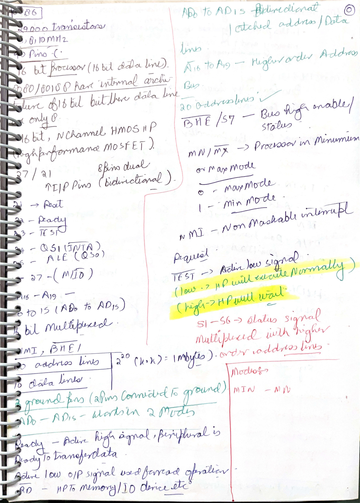
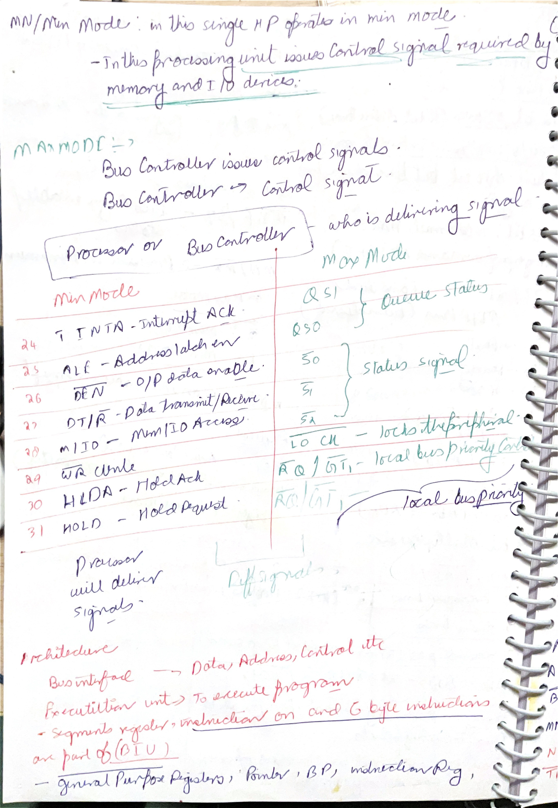
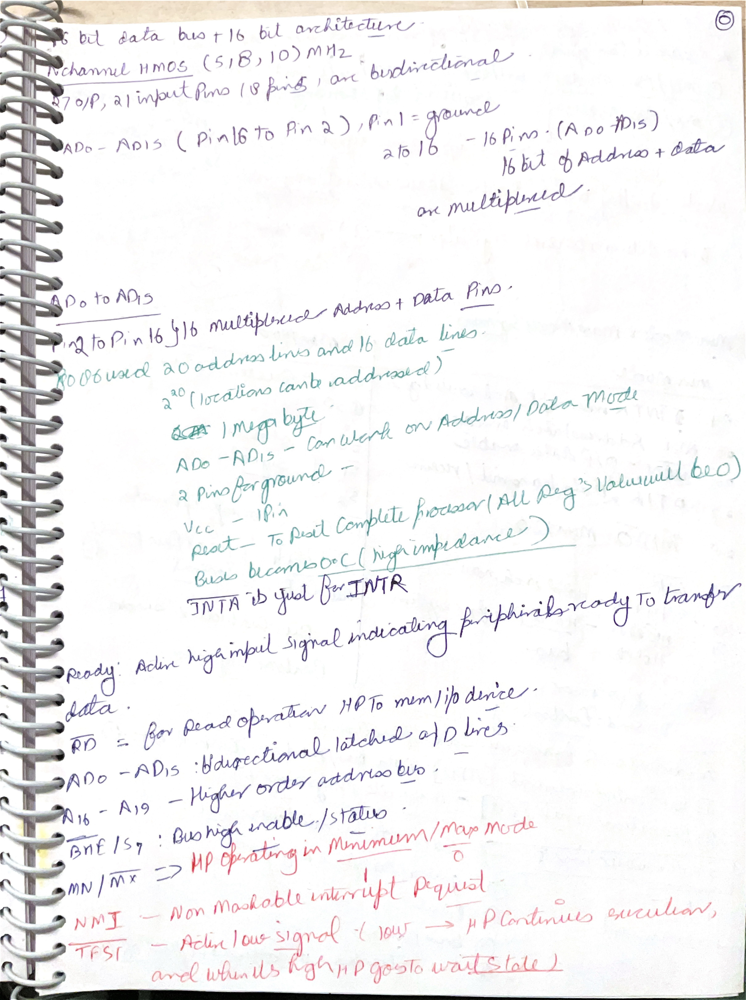
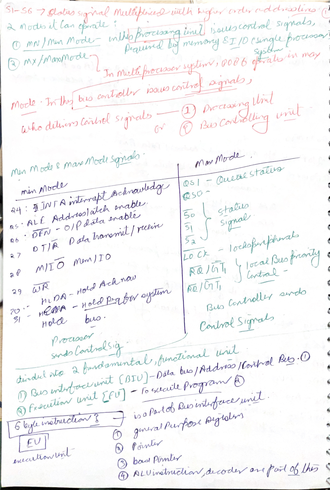
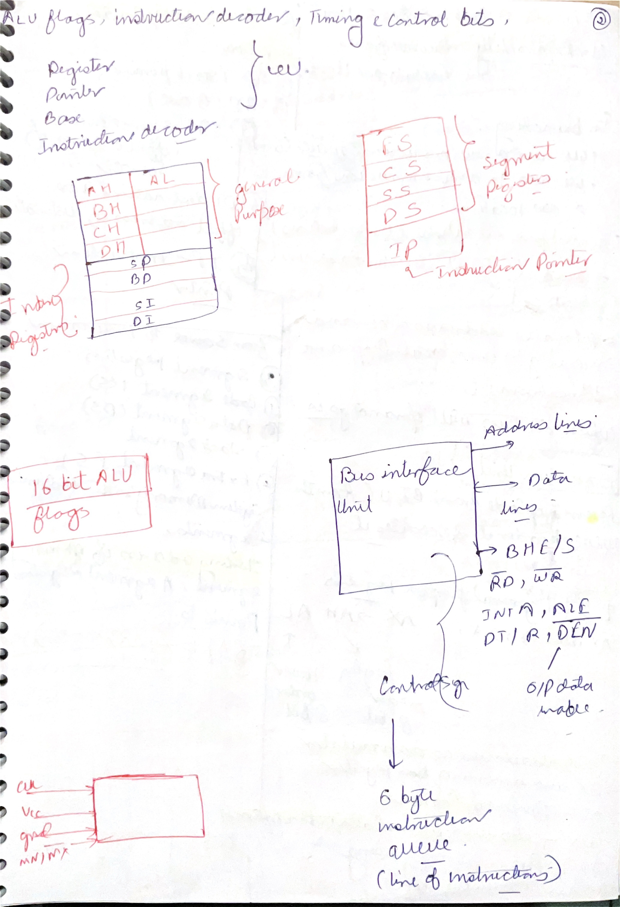
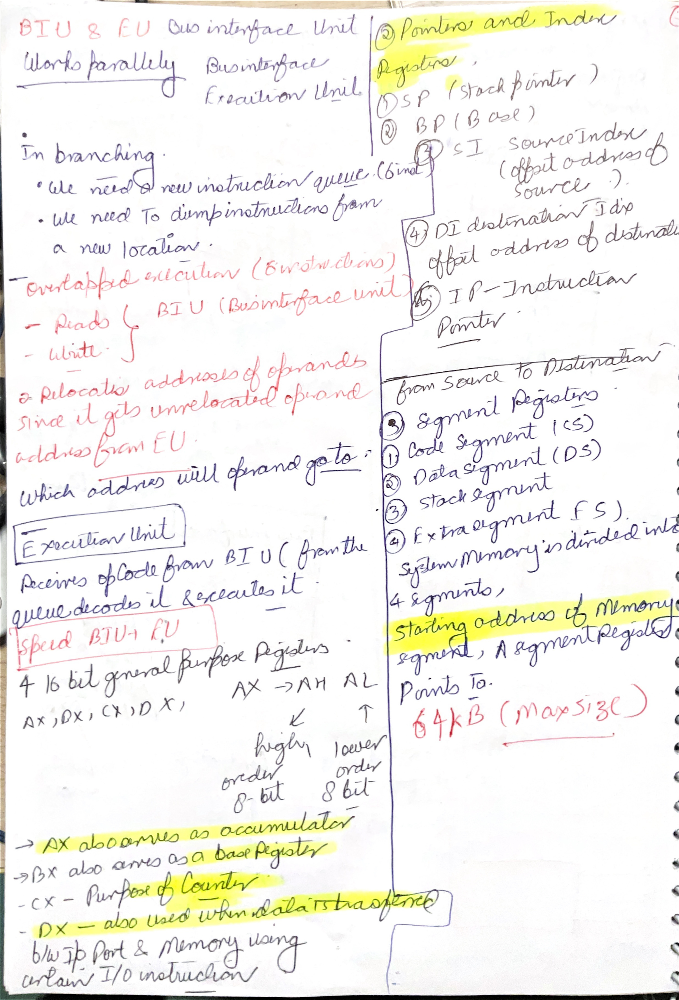
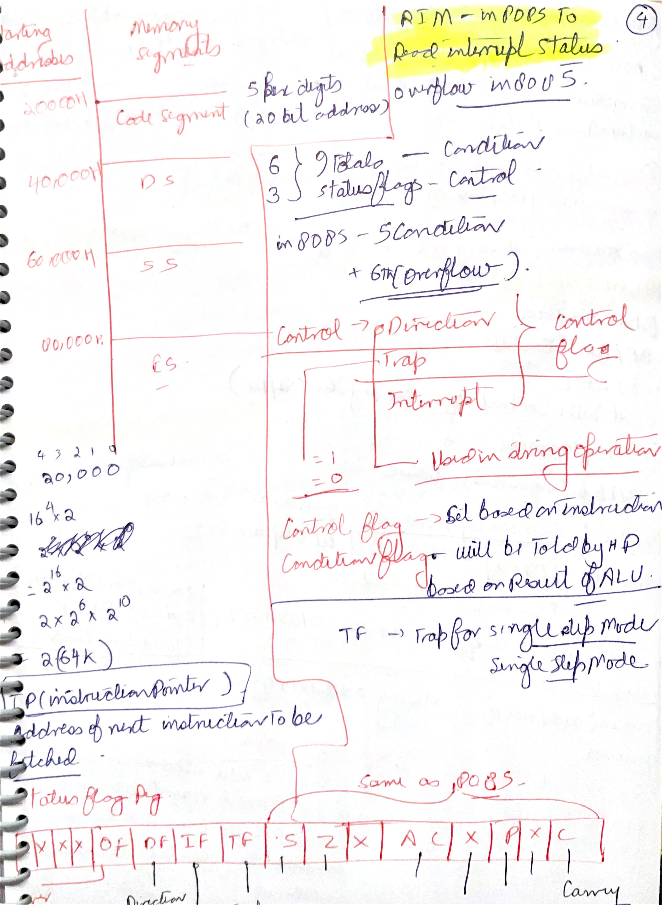

# Day 09: 8086 Pin Signals, BIU/EU, Queue, and Register Organization

Day 09 is the transition from 8085 to 8086. The biggest change is not only that the 8086 is a 16-bit processor. The deeper change is that 8086 separates bus work and execution work into two cooperating units: the **Bus Interface Unit** and the **Execution Unit**. This creates instruction prefetching and introduces segment-based memory addressing.

## Image Index

| No. | Image | Main idea |
| --- | --- | --- |
| 1 | [8086 pin configuration](images/Day%2009/day-9-8086-pin-configuration.png) | 8086 pinout with multiplexed address/data/status/control signals. |
| 2 | [8086 min/max mode signals](images/Day%2009/day-9-8086-min-max-mode-signals.png) | Compare minimum-mode and maximum-mode signal meanings. |
| 3 | [8086 internal architecture](images/Day%2009/day-9-8086-internal-architecture.png) | 8086 is divided into BIU and EU. |
| 4 | [8086 block diagram](images/Day%2009/day-9-8086-block-diagram.png) | Block diagram showing registers, bus interface, ALU, and control logic. |
| 5 | [8086 bus interface unit](images/Day%2009/day-9-8086-bus-interface-unit.png) | BIU handles address/data transfer, queue fetch, memory, and I/O access. |
| 6 | [8086 execution unit](images/Day%2009/day-9-8086-execution-unit.png) | EU receives opcodes from the queue, decodes, and executes instructions. |
| 7 | [8086 general-purpose register uses](images/Day%2009/day-9-8086-general-purpose-register-uses.png) | AX, BX, CX, and DX have general and special-purpose roles. |

## Handwritten Notes Linked To Day 09

Each handwritten page is shown first as a large full-page image. The explanation below the image adds the technical layer: instruction behavior, bus cycles, flags, timing, address formation, or hardware reason behind the note.

### [85completed p021](images/HandWrittenNotes/85completed/page-021.jpg)

<a href="images/HandWrittenNotes/85completed/page-021.jpg"></a>

Technical explanation: the 8086 architecture separates bus work from execution work. The Bus Interface Unit forms addresses, fetches instruction bytes, manages the prefetch queue, and performs memory/I/O transfers. The Execution Unit decodes and executes instructions using registers, ALU, and flags. This overlap improves bus use when the prefetch queue is not empty.

The prefetch queue is the key difference from a simple 8085-style fetch/execute picture. The BIU can fetch instruction bytes while the EU executes previous bytes, but branches or jumps can flush that queue because the next bytes are no longer from the old sequential path.

### [85completed p022](images/HandWrittenNotes/85completed/page-022.jpg)

<a href="images/HandWrittenNotes/85completed/page-022.jpg"></a>

Technical explanation: the 8086 architecture separates bus work from execution work. The Bus Interface Unit forms addresses, fetches instruction bytes, manages the prefetch queue, and performs memory/I/O transfers. The Execution Unit decodes and executes instructions using registers, ALU, and flags. This overlap improves bus use when the prefetch queue is not empty.

In 8086 architecture sketches, always trace an address through segment register plus offset before thinking about the external bus. The internal EU may compute an effective offset, but the BIU forms the physical 20-bit address and performs the actual memory or I/O cycle.

### [86tilllnow p001](images/HandWrittenNotes/86tilllnow/page-001.jpg)

<a href="images/HandWrittenNotes/86tilllnow/page-001.jpg"></a>

Technical explanation: the 8086 multiplexes `AD0-AD15` as address/data lines and `A16-A19/S3-S6` as high-address/status lines to fit a 20-bit address bus and 16-bit data bus into a 40-pin package. As with the 8085, external latching is required because the same pins carry different information during different parts of a bus cycle.

Minimum mode is meant for simpler single-processor systems where the 8086 itself supplies bus-control signals. Maximum mode is for systems with external bus-control logic, coprocessors, or multiprocessor-style coordination. The selected mode changes the meaning of several pins, so pin diagrams must be read together with the mode.

### [86tilllnow p002](images/HandWrittenNotes/86tilllnow/page-002.jpg)

<a href="images/HandWrittenNotes/86tilllnow/page-002.jpg"></a>

Technical explanation: minimum mode is meant for simpler single-processor systems where the 8086 itself supplies bus-control signals. Maximum mode is for systems with external bus-control logic, coprocessors, or multiprocessor-style coordination. The selected mode changes the meaning of several pins, so pin diagrams must be read together with the mode.

The 8086 multiplexes `AD0-AD15` as address/data lines and `A16-A19/S3-S6` as high-address/status lines to fit a 20-bit address bus and 16-bit data bus into a 40-pin package. As with the 8085, external latching is required because the same pins carry different information during different parts of a bus cycle.

### [86tilllnow p003](images/HandWrittenNotes/86tilllnow/page-003.jpg)

<a href="images/HandWrittenNotes/86tilllnow/page-003.jpg"></a>

Technical explanation: the 8086 multiplexes `AD0-AD15` as address/data lines and `A16-A19/S3-S6` as high-address/status lines to fit a 20-bit address bus and 16-bit data bus into a 40-pin package. As with the 8085, external latching is required because the same pins carry different information during different parts of a bus cycle.

Minimum mode is meant for simpler single-processor systems where the 8086 itself supplies bus-control signals. Maximum mode is for systems with external bus-control logic, coprocessors, or multiprocessor-style coordination. The selected mode changes the meaning of several pins, so pin diagrams must be read together with the mode.

### [86tilllnow p004](images/HandWrittenNotes/86tilllnow/page-004.jpg)

<a href="images/HandWrittenNotes/86tilllnow/page-004.jpg"></a>

Technical explanation: minimum mode is meant for simpler single-processor systems where the 8086 itself supplies bus-control signals. Maximum mode is for systems with external bus-control logic, coprocessors, or multiprocessor-style coordination. The selected mode changes the meaning of several pins, so pin diagrams must be read together with the mode.

The 8086 multiplexes `AD0-AD15` as address/data lines and `A16-A19/S3-S6` as high-address/status lines to fit a 20-bit address bus and 16-bit data bus into a 40-pin package. As with the 8085, external latching is required because the same pins carry different information during different parts of a bus cycle.

The 8086 architecture separates bus work from execution work. The Bus Interface Unit forms addresses, fetches instruction bytes, manages the prefetch queue, and performs memory/I/O transfers. The Execution Unit decodes and executes instructions using registers, ALU, and flags. This overlap improves bus use when the prefetch queue is not empty.

### [86tilllnow p005](images/HandWrittenNotes/86tilllnow/page-005.jpg)

<a href="images/HandWrittenNotes/86tilllnow/page-005.jpg"></a>

Technical explanation: the 8086 architecture separates bus work from execution work. The Bus Interface Unit forms addresses, fetches instruction bytes, manages the prefetch queue, and performs memory/I/O transfers. The Execution Unit decodes and executes instructions using registers, ALU, and flags. This overlap improves bus use when the prefetch queue is not empty.

8086 flags include status flags and control flags. `CF`, `PF`, `AF`, `ZF`, `SF`, and `OF` describe arithmetic/logical results. `TF` enables single-step trap behavior, `IF` controls maskable interrupt recognition, and `DF` controls string-instruction direction. Do not map the 8086 flag register directly onto the 8085 flag register; overflow, trap, interrupt, and direction behavior are important additions.

### [86tilllnow p006](images/HandWrittenNotes/86tilllnow/page-006.jpg)

<a href="images/HandWrittenNotes/86tilllnow/page-006.jpg"></a>

Technical explanation: the 8086 architecture separates bus work from execution work. The Bus Interface Unit forms addresses, fetches instruction bytes, manages the prefetch queue, and performs memory/I/O transfers. The Execution Unit decodes and executes instructions using registers, ALU, and flags. This overlap improves bus use when the prefetch queue is not empty.

8086 physical addresses are formed from `segment:offset`. The segment value is shifted left four bits and the 16-bit offset is added: `physical = segment x 10H + offset`. This produces a 20-bit address and allows access to 1 MB even though most visible registers are 16 bits. Different segment:offset pairs can refer to the same physical address.

### [scanned-2026-06-16-231727 p001](images/HandWrittenNotes/scanned-2026-06-16-231727/page-001.jpg)

<a href="images/HandWrittenNotes/scanned-2026-06-16-231727/page-001.jpg"></a>

Technical explanation: this page is a dense 8086 pin-and-feature recap. The 8086 is treated as a 16-bit processor because its main data bus and ALU data path are 16 bits wide, but its external address space is 20 bits wide. That is why the note reaches `2^20 = 1 MB`: the processor can output physical addresses from `00000H` through `FFFFFH`. The important distinction is that the data bus width controls how much data can move at once, while address width controls how many byte locations can be selected.

The `AD0-AD15` lines are multiplexed. During the address part of a bus cycle they carry low address bits, and during the data part they carry data. This saves pins but forces external latching, because memory and I/O hardware must preserve the low address after the pins switch over to data. `A16-A19` carry the high address bits and later become status lines, so those are also time-shared. `BHE/S7` is especially important on a 16-bit byte-addressed bus: with `A0`, it selects whether the low byte bank, high byte bank, or both byte banks participate in a transfer.

`READY` and `TEST` are handshake-style control inputs. `READY` tells the 8086 whether the addressed memory or I/O device can complete the bus cycle; if it is not ready, wait states are inserted. `TEST` is checked by the `WAIT` instruction: if `TEST` is low, execution continues; if high, the processor waits. `MN/MX` selects minimum mode or maximum mode. Minimum mode lets the processor provide most bus-control signals directly; maximum mode shifts detailed bus command generation to external bus-control logic.

### [scanned-2026-06-16-231727 p002](images/HandWrittenNotes/scanned-2026-06-16-231727/page-002.jpg)

<a href="images/HandWrittenNotes/scanned-2026-06-16-231727/page-002.jpg"></a>

Technical explanation: this page compares minimum mode and maximum mode by asking who generates control signals. In minimum mode, the 8086 is assumed to be the main bus master in a single-processor system, so it directly provides signals such as `ALE`, `DEN`, `DT/R`, `M/IO`, `/WR`, `HOLD`, `HLDA`, and interrupt acknowledge. External memory and I/O interface circuits can therefore decode those processor outputs without needing a separate bus controller.

In maximum mode, the processor does not directly output the same simple read/write-style controls. Instead, it outputs status information such as `S2`, `S1`, and `S0`, plus queue-status and arbitration-related signals. A bus controller, commonly the 8288, interprets those status lines and produces the detailed memory, I/O, and interrupt-control commands. This is needed in multiprocessor or coprocessor systems because control of the bus must be coordinated rather than assumed to belong only to the CPU.

The page also connects this mode split to the architecture split. The 8086 is divided into the Bus Interface Unit and Execution Unit. BIU handles address/data/control bus activity and the instruction queue. EU executes decoded instructions. This is why bus-control signals are naturally discussed with BIU behavior, while registers, ALU, flags, and instruction decoding are EU-centered.

### [scanned-2026-06-16-231727 p003](images/HandWrittenNotes/scanned-2026-06-16-231727/page-003.jpg)

<a href="images/HandWrittenNotes/scanned-2026-06-16-231727/page-003.jpg"></a>

Technical explanation: this page repeats the pin recap in a cleaner order. The 8086 has 16 multiplexed low address/data pins, `AD0-AD15`, and four high address/status pins, `A16/S3` through `A19/S6`. Together these produce a 20-bit physical address. Because memory is byte-addressed, a 20-bit address does not mean 20-bit data; it means 1 MB of byte locations can be selected.

The note calls out `RESET`, `READY`, `/RD`, `INTA`, `ALE`, `BHE/S7`, `MN/MX`, `NMI`, and `TEST`. These are not just names to memorize. `RESET` restarts the processor state. `/RD` tells external hardware that the processor is reading. `INTA` is produced when the processor acknowledges an interrupt request. `ALE` lets external latches capture address bits before the bus changes role. `NMI` is a non-maskable interrupt input, so software cannot disable it through the interrupt flag. `TEST` works with `WAIT`, which is useful when synchronizing with external hardware.

The key exam-level connection is that multiplexing creates timing requirements. Address must be valid early enough for latching; data must be valid during the data phase; status/control lines must tell the external circuit whether the operation is memory, I/O, interrupt acknowledge, read, or write. A correct explanation of the 8086 pin diagram must therefore mention both pin meaning and bus timing.

### [scanned-2026-06-16-231727 p004](images/HandWrittenNotes/scanned-2026-06-16-231727/page-004.jpg)

<a href="images/HandWrittenNotes/scanned-2026-06-16-231727/page-004.jpg"></a>

Technical explanation: this page continues the min/max mode comparison and then moves into BIU/EU. In minimum mode, signals such as `ALE`, `DEN`, `DT/R`, `M/IO`, `/WR`, `HOLD`, and `HLDA` are directly meaningful to memory and I/O hardware. In maximum mode, lines such as `S2-S0`, `QS1-QS0`, `LOCK`, and request/grant lines are more about reporting bus status, queue status, and arbitration so an external controller can make the final bus commands.

`QS1` and `QS0` are queue-status outputs. They tell external logic about the instruction queue condition, such as whether a byte has been taken from the queue. That matters because the 8086 is not simply fetching one instruction, executing it, then fetching the next. The BIU may already have prefetched future bytes. Branches, calls, returns, and interrupts disturb this because they change the next instruction address and make queued bytes from the old path useless.

The bottom of the page correctly divides the processor into two fundamental units: BIU and EU. BIU owns physical address formation, bus cycles, and queue filling. EU owns instruction decoding, register/ALU work, and flags. The queue is the bridge: BIU fills it, EU consumes it. When the queue is full and the EU is busy, the bus can rest; when the EU needs memory operands or a branch changes flow, the BIU must resume external bus work.

### [scanned-2026-06-16-231727 p005](images/HandWrittenNotes/scanned-2026-06-16-231727/page-005.jpg)

<a href="images/HandWrittenNotes/scanned-2026-06-16-231727/page-005.jpg"></a>

Technical explanation: this page sketches the internal register organization. The general-purpose registers `AX`, `BX`, `CX`, and `DX` are word registers, but each can be split into high and low bytes: `AH/AL`, `BH/BL`, `CH/CL`, and `DH/DL`. That is why `MOV AL,...` and `MOV AX,...` are different sizes even though they refer to the same register family. `AX` is often used as the accumulator, `BX` often participates in base addressing, `CX` is commonly used as a count register, and `DX` participates in multiplication/division and port addressing.

The segment-register sketch shows `CS`, `DS`, `SS`, and `ES`, plus `IP`. `CS:IP` locates the next instruction. `DS` is the default data segment for many memory operands. `SS` is the stack segment used with `SP` and `BP`. `ES` is an extra segment heavily used by string instructions and far-pointer instructions such as `LES`. These registers do not directly hold full physical addresses; they hold segment bases that must be shifted left four bits and combined with offsets.

The BIU drawing on the page is also important. It outputs address lines, data lines, and control signals, and it contains the instruction queue. The queue is six bytes on 8086. The note's point is that the BIU does more than "fetch": it handles bus timing, external transfer, queue storage, and physical-address calculation. The EU requests bytes or operands; the BIU performs the external work.

### [scanned-2026-06-16-231727 p006](images/HandWrittenNotes/scanned-2026-06-16-231727/page-006.jpg)

<a href="images/HandWrittenNotes/scanned-2026-06-16-231727/page-006.jpg"></a>

Technical explanation: this page explains why branching matters in a queued processor. In a straight-line program, the BIU can prefetch upcoming instruction bytes while the EU executes older ones. In a branch, call, return, or interrupt, the next instruction is no longer the next sequential byte, so prefetched bytes may need to be discarded. This is why branch-heavy code reduces the benefit of the queue.

The page also describes relocation through segmentation. An instruction may contain an offset, but the final physical location depends on the segment register chosen for that access. If a segment base changes, the same offset can point to a different physical area without rewriting every offset inside the program. This is one reason segmented addressing is more flexible than a plain single 16-bit address space.

The right side lists pointer/index registers and segments. `SP` points to the top of stack, `BP` is a base pointer commonly used with stack-frame addressing, `SI` is a source index, `DI` is a destination index, and `IP` is the instruction pointer. The source-to-destination phrase is especially important for string instructions later: `SI` normally refers to `DS:SI`, while `DI` normally refers to `ES:DI`.

### [scanned-2026-06-16-231727 p007](images/HandWrittenNotes/scanned-2026-06-16-231727/page-007.jpg)

<a href="images/HandWrittenNotes/scanned-2026-06-16-231727/page-007.jpg"></a>

Technical explanation: this page ties segmentation to the flag register. Each segment can cover a maximum of 64 KB because offsets are 16 bits wide. The note marks segment blocks such as code, data, stack, and extra segment in memory. The numbers are not fixed permanent boundaries; they illustrate that `CS`, `DS`, `SS`, and `ES` can point to different 64 KB windows inside the 1 MB address space.

The lower part compares the 8086 flag register with the 8085 idea. The 8086 has status flags such as `CF`, `PF`, `AF`, `ZF`, `SF`, and `OF`, plus control flags such as `TF`, `IF`, and `DF`. The status flags describe arithmetic/logical results. The control flags change processor behavior: `TF` enables single-step trap, `IF` allows maskable interrupts through `INTR`, and `DF` controls whether string indexes increment or decrement.

The overflow flag deserves special attention because it is not the same as carry. `CF` is the unsigned carry/borrow indicator. `OF` indicates signed overflow, meaning the signed result cannot be represented in the operand size. This is why the same binary result can be valid as an unsigned result but overflow as a signed result, or vice versa.

## 1. Why 8086 Feels Different From 8085


The 8085 is an 8-bit processor with a 16-bit address bus, so it directly addresses `2^16 = 64 KB`. The 8086 has a 16-bit data bus and a 20-bit address bus, so it can address:

```text
2^20 = 1,048,576 bytes = 1 MB
```

The 8086 also changes the internal organization. Instead of treating instruction fetch and execution as one simple sequential flow, it splits work:

| Unit | Main job |
| --- | --- |
| BIU | Generates physical addresses, fetches instruction bytes, reads/writes memory or I/O, and maintains the instruction queue. |
| EU | Decodes and executes instructions using the ALU, flags, and general-purpose registers. |

The important consequence is overlap. While the EU executes the current instruction, the BIU can fetch upcoming instruction bytes into the queue. This does not make every instruction faster by itself, but it reduces wasted bus time when instruction bytes can be fetched ahead.

## 2. 8086 Pin Configuration


The 8086 is a 40-pin processor, but it exposes more address information than the 8085. It does this by multiplexing pins.

Important pin groups:

| Pin group | Meaning |
| --- | --- |
| `AD0-AD15` | Multiplexed address/data lines. They carry address bits during the early part of a bus cycle and data during the data part. |
| `A16/S3-A19/S6` | Multiplexed high-address/status lines. They carry high address bits and later status information. |
| `BHE/S7` | Bus High Enable/status. Helps select the upper byte of the 16-bit data bus. |
| `NMI`, `INTR` | Non-maskable and maskable interrupt inputs. |
| `RD`, `WR`, `M/IO`, `DT/R`, `DEN`, `ALE` | Minimum-mode bus control signals. |
| `MN/MX` | Selects minimum mode or maximum mode. |

Just as `AD0-AD7` are multiplexed in 8085, the 8086 multiplexes `AD0-AD15`. The reason is pin economy. A full 20-bit address bus plus 16-bit data bus plus control pins would need many more pins. Multiplexing saves pins but requires external latching and timing logic.

The 8086 can transfer a word through its 16-bit data bus, but memory is still byte-addressable. `BHE` and address bit `A0` together help decide whether the bus transfer involves the lower byte, upper byte, or full word.

## 3. Minimum Mode and Maximum Mode


The `MN/MX` pin changes how the 8086 system is controlled.

| Mode | When used | Control idea |
| --- | --- | --- |
| Minimum mode | Single-processor systems | 8086 itself directly provides bus control signals such as `M/IO`, `RD`, `WR`, `ALE`, `DEN`, `DT/R`, `INTA`. |
| Maximum mode | Multiprocessor or coprocessor-style systems | 8086 outputs status signals such as `S2`, `S1`, `S0`; an external bus controller generates detailed bus commands. |

Minimum mode is easier to understand because it resembles 8085-style system design: the CPU outputs the control signals needed by memory and I/O. Maximum mode is used when the system needs more complex bus coordination. In maximum mode, the processor provides status information, and external hardware interprets that status to generate command signals.

This is why some pins have two names. The same physical pin can have one meaning in minimum mode and a different meaning in maximum mode. When reading any 8086 pin table, always check the selected mode first.

## 4. Bus Interface Unit


The BIU is responsible for the outside-world interface and address generation.

Main BIU parts:

| BIU part | Role |
| --- | --- |
| Segment registers `CS`, `DS`, `SS`, `ES` | Hold segment base values used for address calculation. |
| Instruction pointer `IP` | Holds offset of the next instruction inside the code segment. |
| Address-generation adder | Combines segment base and offset to form a 20-bit physical address. |
| Bus-control logic | Performs memory and I/O reads/writes. |
| Instruction queue | Stores prefetched instruction bytes for the EU. |

The physical address calculation is:

```text
physical address = segment x 10H + offset
```

or equivalently:

```text
physical address = segment shifted left 4 bits + offset
```

Example:

```text
CS = 3000H
IP = 1234H
physical address = 30000H + 1234H = 31234H
```

The segment register gives the starting region; the offset selects a byte inside that region. This is how 16-bit registers can still produce a 20-bit address.

## 5. Execution Unit


The EU executes instructions. It does not normally fetch instruction bytes directly from memory; it takes them from the BIU queue.

Main EU parts:

| EU part | Role |
| --- | --- |
| ALU | Performs arithmetic and logical operations. |
| General-purpose registers | Hold operands and results. |
| Flag register | Stores condition and control flags. |
| Instruction decoder/control | Decodes opcodes and coordinates execution. |

When an instruction needs memory data, the EU asks the BIU for a memory access. The BIU calculates the physical address and performs the bus operation. This division is the heart of the 8086 architecture:

```text
EU decides what operation is needed.
BIU handles where and how the memory/I/O access happens.
```

If a branch, call, return, or interrupt changes the flow, the prefetched queue may no longer contain the correct upcoming bytes. Then the queue must be flushed and refilled from the new address.

## 6. Block Diagram and Queue


The block diagram shows why the 8086 is often taught as a two-stage architecture:

```text
BIU: fetches and interfaces
EU: decodes and executes
```

The queue is a small buffer between those units. The 8086 queue holds prefetched instruction bytes. The BIU fills it when bus time is available; the EU consumes bytes from it when executing.

This creates a simple pipeline-like overlap:

```text
BIU fetches future instruction bytes
EU executes current instruction
```

Do not overstate this as modern pipelining. The 8086 does not have a deep modern pipeline. But the queue is still important because it separates instruction fetch from instruction execution.

## 7. General-Purpose Registers


The 8086 has four main 16-bit general-purpose registers:

| Register | High/low halves | Common special use |
| --- | --- | --- |
| `AX` | `AH`, `AL` | Accumulator; default in many arithmetic, I/O, multiply/divide operations. |
| `BX` | `BH`, `BL` | Base register; can participate in effective-address formation. |
| `CX` | `CH`, `CL` | Count register; used by loops, shifts/rotates, and string repetition. |
| `DX` | `DH`, `DL` | Data register; used with `AX` in multiply/divide and for some I/O port addressing. |

This is a major difference from 8085. In 8085, the accumulator `A` is the central 8-bit working register. In 8086, `AX`, `BX`, `CX`, and `DX` are all more capable, and many can be split into 8-bit halves.

Example:

```asm
MOV AX,1234H
```

then:

```text
AH = 12H
AL = 34H
AX = 1234H
```

This makes the 8086 flexible: it can work with 16-bit words or 8-bit bytes using parts of the same register.

## Research Deep Dive: Segmentation, Queue Behavior, and Bus Modes

The 8086 is not just an 8085 with wider registers. The core change is that the programmer sees 16-bit offsets, while the hardware forms 20-bit physical addresses.

### Segment:Offset Address Formation

The formula is:

```text
physical address = segment x 10H + offset
```

Example:

```text
CS = 1234H
IP = 0100H
physical address = 12340H + 0100H = 12440H
```

Different segment:offset pairs can point to the same physical address.

Example:

```text
1000H:0020H -> 10020H
1001H:0010H -> 10020H
1002H:0000H -> 10020H
```

This aliasing is a natural result of shifting the segment by four bits. It is powerful, but it means a physical address cannot always be uniquely converted back to one segment:offset pair.

### BIU And EU Cooperation

The BIU does not execute arithmetic instructions. The EU does not directly drive the external address bus. They cooperate:

| Unit | Main work |
| --- | --- |
| BIU | Forms physical addresses, fetches instruction bytes, performs memory/I/O bus cycles, fills the queue. |
| EU | Decodes instructions, executes ALU operations, updates flags, requests operands from BIU when needed. |

The instruction queue helps only when the EU is not constantly forcing the BIU to fetch operands or refill after branches. A jump, call, return, or interrupt changes the code path, so prefetched bytes from the old path are discarded.

### Minimum Mode Versus Maximum Mode

Minimum mode is designed for simpler single-processor systems. The 8086 itself provides bus-control signals such as read/write-type control.

Maximum mode is designed for systems with an external bus controller, coprocessor, or more complex bus sharing. The processor outputs status information, and external controller logic turns that status into bus commands.

Revision rule:

```text
Minimum mode: 8086 directly controls the bus.
Maximum mode: 8086 reports bus status; external controller generates detailed bus controls.
```

### Why `BHE` Matters

The 8086 has a 16-bit data bus but memory is byte-addressed. It must select the low byte bank, high byte bank, or both. `A0` and `BHE` help decide which byte lane is active.

| Access type | Meaning |
| --- | --- |
| Even-address word | Can use both byte lanes in one bus cycle. |
| Odd-address word | Crosses a word boundary and may need two bus cycles. |
| Byte at even address | Low byte lane. |
| Byte at odd address | High byte lane. |

This explains why alignment matters on a 16-bit bus.

## Points To Remember

- 8086 has a 16-bit data bus and 20-bit address bus.
- 20 address lines allow `1 MB` physical memory addressing.
- `AD0-AD15` are multiplexed address/data lines.
- `A16/S3-A19/S6` are multiplexed high-address/status lines.
- `MN/MX` selects minimum mode or maximum mode.
- BIU handles bus operations, physical address generation, and instruction prefetch.
- EU decodes and executes instructions using the ALU, flags, and registers.
- Physical address = `segment x 10H + offset`.
- The instruction queue lets fetch and execute overlap.
- `AX`, `BX`, `CX`, and `DX` are general-purpose but have common special roles.

## Sources

[S1] Intel Corporation, [The 8086 Family User's Manual, October 1979](https://www.ardent-tool.com/CPU/docs/Intel/808x/manuals/9800722-03.pdf). Used for 8086 architecture, BIU/EU organization, segmentation, address formation, pins, modes, registers, and instruction-set context.

[S2] Intel Corporation, [iAPX 86,88 User's Manual, August 1981](https://www.dosdays.co.uk/media/intel/1981_iAPX_86_88_Users_Manual.pdf). Used for 8086/8088 programming model, flags, registers, addressing, and bus-interface concepts.
