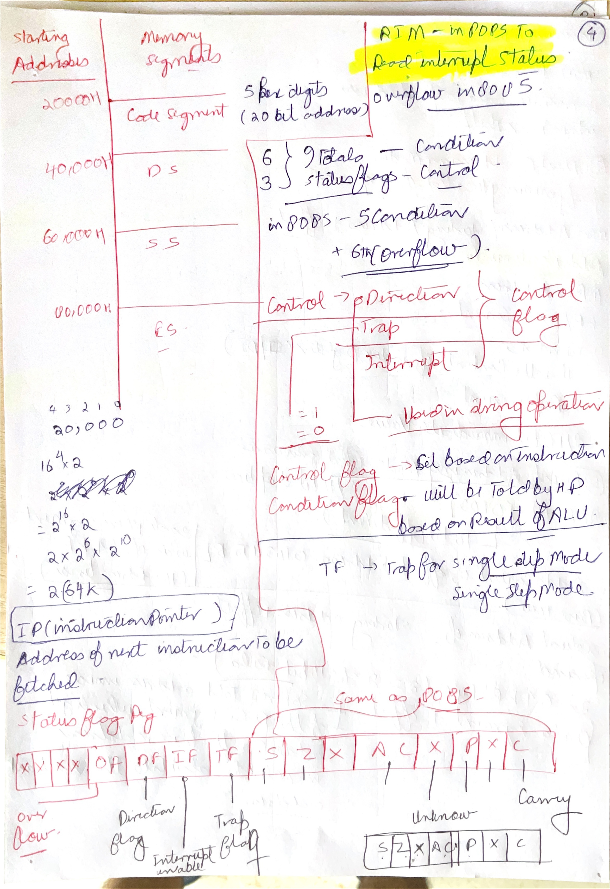
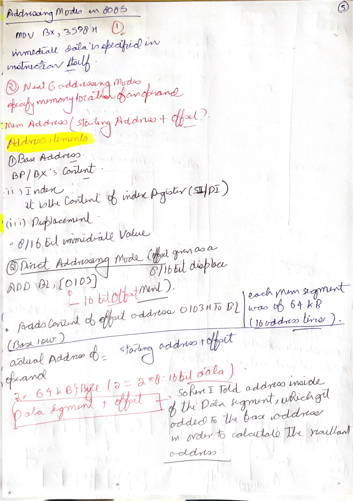
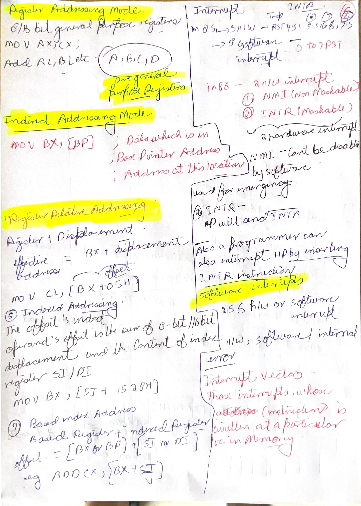
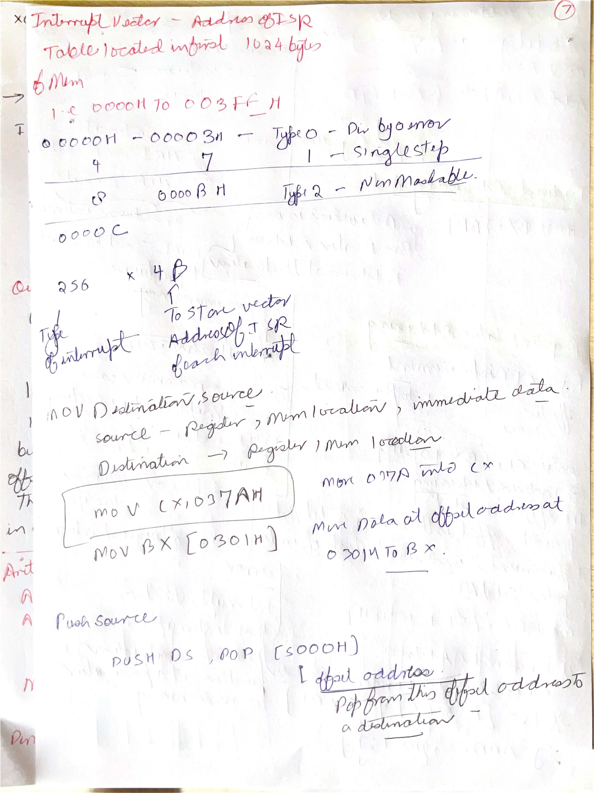
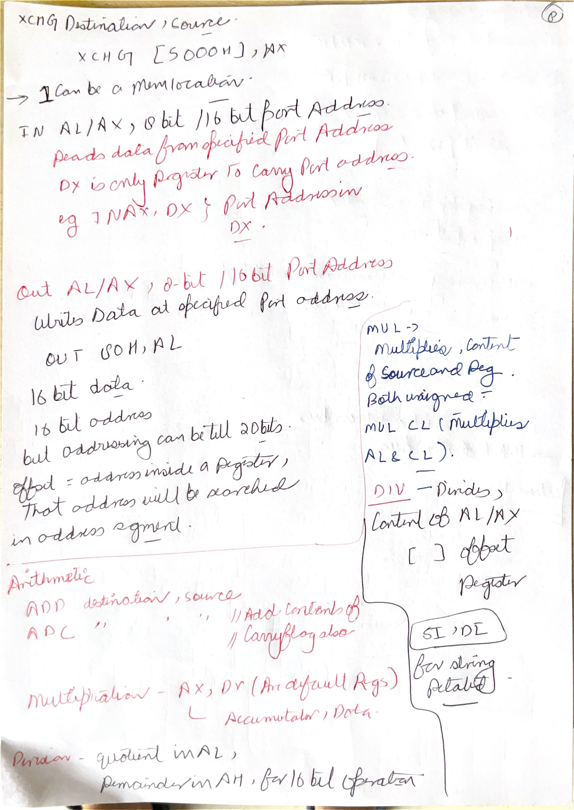
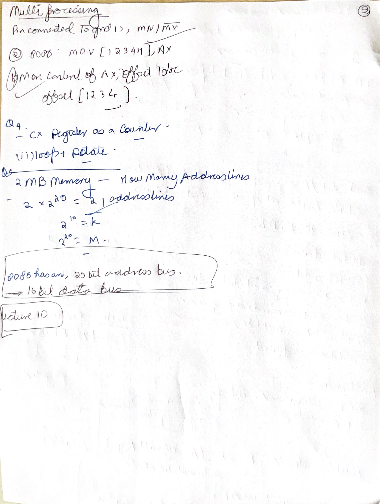

# Day 10: 8086 Flags, Addressing Modes, Interrupts, and Instruction Set

Day 10 continues the 8086 introduction from Day 9. The screenshots move from architecture into programming: flag bits, addressing modes, interrupt sources, interrupt vector table, and major instruction groups such as data transfer, arithmetic, logical, branch, loop, flag manipulation, string, and repeat instructions.

## Image Index

| No. | Image | Main idea |
| --- | --- | --- |
| 1 | [Question: flag bit used for single-step mode](images/Day%2010/Screenshot%202026-06-10%20113754.png) | The single-step control bit is the trap flag `TF`. |
| 2 | [Direction flag and interrupt flag](images/Day%2010/Screenshot%202026-06-10%20113801.png) | `DF` controls string direction; `IF` enables maskable interrupts. |
| 3 | [Direct and register addressing modes](images/Day%2010/Screenshot%202026-06-10%20115053.png) | Operand offset in instruction versus operand in register. |
| 4 | [Addressing mode examples close-up](images/Day%2010/Screenshot%202026-06-10%20115108.png) | `ADD BL,[0103]`, `MOV AX,CX`, and `ADD AL,BL`. |
| 5 | [Hardware interrupts: NMI and INTR](images/Day%2010/Screenshot%202026-06-10%20121951.png) | NMI is non-maskable; INTR is maskable through `IF`. |
| 6 | [Sources of 8086 interrupts](images/Day%2010/Screenshot%202026-06-10%20122150.png) | Hardware interrupt, software interrupt, and error/exception condition. |
| 7 | [Interrupt vectors overview](images/Day%2010/Screenshot%202026-06-10%20123137.png) | Vector table stores interrupt-service addresses. |
| 8 | [Interrupt vector types 0-31](images/Day%2010/Screenshot%202026-06-10%20123323.png) | Early interrupt types and reserved range. |
| 9 | [Interrupt vector table size](images/Day%2010/Screenshot%202026-06-10%20123503.png) | 256 vectors x 4 bytes = 1024 bytes. |
| 10 | [Instruction set of 8086 and MOV](images/Day%2010/Screenshot%202026-06-10%20124043.png) | 8086 is register-general, not accumulator-only like 8085. |
| 11 | [PUSH, POP, XCHG, and IN](images/Day%2010/Screenshot%202026-06-10%20125110.png) | Stack, exchange, and input instruction examples. |
| 12 | [OUT instruction](images/Day%2010/Screenshot%202026-06-10%20125135.png) | Output data to an 8-bit or 16-bit port address. |
| 13 | [Arithmetic instructions](images/Day%2010/Screenshot%202026-06-10%20125907.png) | `ADD`, `ADC`, multiply/divide register conventions. |
| 14 | [Interrupt and loop instructions](images/Day%2010/Screenshot%202026-06-10%20130445.png) | `INT`, `INTO`, `LOOP`, `LOOPZ`, and `LOOPNZ`. |
| 15 | [Logical and branching instructions](images/Day%2010/Screenshot%202026-06-10%20130450.png) | AND/OR/XOR/NOT/TEST and branch categories. |
| 16 | [Flag manipulation instructions](images/Day%2010/Screenshot%202026-06-10%20130514.png) | Clear, set, and complement selected flags. |
| 17 | [String instructions](images/Day%2010/Screenshot%202026-06-10%20130527.png) | `MOVS`, `CMPS`, `SCAS`, and `LODS`. |
| 18 | [Repeat instructions](images/Day%2010/Screenshot%202026-06-10%20130603.png) | Repeat prefixes before string instructions. |
| 19 | [Repeat instruction examples](images/Day%2010/Screenshot%202026-06-10%20130623.png) | `REP`, `REPE/REPZ`, and `REPNE/REPNZ`. |

## Handwritten Notes Linked To Day 10

| Page | Handwritten note | How to revise it with the screenshots |
| --- | --- | --- |
| [86tilllnow p007](images/HandWrittenNotes/86tilllnow/page-007.jpg) |  | Use with the flag screenshots. It records the flag register layout and control flags such as `TF`, `IF`, and `DF`. |
| [86tilllnow p008](images/HandWrittenNotes/86tilllnow/page-008.jpg) |  | Use with addressing modes. It connects segment:offset, physical address, direct addressing, and displacement. |
| [86tilllnow p009](images/HandWrittenNotes/86tilllnow/page-009.jpg) |  | Use with register/index/base addressing and interrupt notes. |
| [86tilllnow p010](images/HandWrittenNotes/86tilllnow/page-010.jpg) |  | Use with `MOV` examples and direct/register addressing examples. |
| [86tilllnow p011](images/HandWrittenNotes/86tilllnow/page-011.jpg) |  | Use with `XLAT`, `IN`, `OUT`, port addressing, and memory-versus-I/O distinction. |
| [86tilllnow p012](images/HandWrittenNotes/86tilllnow/page-012.jpg) |  | Use with branch instructions and the 8085 versus 8086 comparison. |

## 1. 8086 Flag Register and Single-Step Mode


The screenshot asks which 8086 flag bit is used to put the processor in single-step mode. The answer is:

```text
TF = Trap Flag
```

When `TF = 1`, the processor supports single-step execution by generating a debug-style trap after an instruction. This lets a debugger inspect the machine state one instruction at a time.

The 8086 flag register contains status flags and control flags.

| Flag | Type | Meaning |
| --- | --- | --- |
| `CF` | Status | Carry/borrow from arithmetic. |
| `PF` | Status | Even parity in the low byte of result. |
| `AF` | Status | Auxiliary carry between bit 3 and bit 4. |
| `ZF` | Status | Result is zero. |
| `SF` | Status | Sign bit of result is 1. |
| `OF` | Status | Signed overflow occurred. |
| `TF` | Control | Single-step trap control. |
| `IF` | Control | Enables maskable hardware interrupts through `INTR`. |
| `DF` | Control | Direction for string instructions. |

`IF` is important for interrupts. If `IF = 1`, maskable interrupts through `INTR` can be recognized. If `IF = 0`, maskable interrupts are disabled. `NMI` is not controlled by `IF`.

`DF` is important for string instructions. If `DF = 0`, string operations normally move forward by incrementing index registers. If `DF = 1`, they move backward by decrementing index registers. This matters for instructions such as `MOVSB`, `CMPSB`, `SCASB`, and `LODSB`.

## 2. Direct and Register Addressing Modes


An addressing mode tells the processor where the operand is.

### Direct Addressing

In direct addressing, the instruction contains the offset address of the memory operand.

Example from the screenshot:

```asm
ADD BL,[0103]
```

Meaning:

```text
BL <- BL + memory byte at offset 0103H
```

The square brackets mean "contents of memory at this address," not the literal number itself. The actual physical address also depends on the active segment base:

```text
physical address = segment x 10H + offset
```

If the data segment is assumed and `DS = 2000H`, then `[0103H]` refers to:

```text
20000H + 0103H = 20103H
```

### Register Addressing

In register addressing, the operand is inside a register.

Examples:

```asm
MOV AX,CX
ADD AL,BL
```

No memory operand is needed. The CPU uses internal registers, so this is simpler than memory addressing.

The difference:

| Example | Operand location |
| --- | --- |
| `ADD BL,[0103]` | One operand is in memory. |
| `MOV AX,CX` | Both operands are registers. |
| `ADD AL,BL` | Both operands are 8-bit register halves. |

## 3. Other 8086 Addressing Ideas


The handwritten notes expand beyond direct/register addressing into common 8086 effective-address forms:

| Mode idea | Example style | Meaning |
| --- | --- | --- |
| Register indirect | `[BX]`, `[BP]`, `[SI]`, `[DI]` | Memory address is held in a register. |
| Based | `[BX + displacement]` or `[BP + displacement]` | Base register plus constant displacement. |
| Indexed | `[SI + displacement]` or `[DI + displacement]` | Index register plus constant displacement. |
| Based indexed | `[BX + SI]`, `[BX + DI]`, `[BP + SI]`, `[BP + DI]` | Base and index are added. |
| Based indexed with displacement | `[BX + SI + disp]` | Base plus index plus constant displacement. |

This is more flexible than 8085. In 8085, memory-indirect access is strongly centered on `HL` through the symbol `M`. In 8086, several registers can participate in effective-address formation.

The main mental split:

```text
effective address = offset calculated by addressing mode
physical address = segment base + effective address
```

## 4. 8086 Hardware Interrupts


The 8086 has two hardware interrupt inputs:

| Interrupt input | Meaning |
| --- | --- |
| `NMI` | Non-maskable interrupt. Used for high-priority events and not disabled by `IF`. |
| `INTR` | Maskable interrupt request. Recognized when interrupt flag `IF = 1`. |

The screenshots divide interrupts into three sources:

| Source | Meaning | Example |
| --- | --- | --- |
| Hardware interrupt | External device requests service. | `NMI`, `INTR`. |
| Software interrupt | Program executes an interrupt instruction. | `INT n`. |
| Error/exception condition | Processor detects a fault-like condition. | Divide error. |

The important difference from an ordinary subroutine is that interrupts save processor state and transfer control through the interrupt vector table. Interrupt service routines normally return with interrupt-return behavior, not ordinary branch fall-through.

## 5. Interrupt Vector Table


The 8086 interrupt vector table is located at the beginning of memory:

```text
00000H to 003FFH
```

It has:

```text
256 interrupt types x 4 bytes per vector = 1024 bytes = 1 KB
```

Each vector stores a far address:

```text
2 bytes offset/IP
2 bytes segment/CS
```

The CPU uses the interrupt type number as an index:

```text
vector address = interrupt type x 4
```

Examples:

| Type | Vector table address range | Common meaning in basic 8086 notes |
| --- | --- | --- |
| Type 0 | `00000H-00003H` | Divide error. |
| Type 1 | `00004H-00007H` | Single step. |
| Type 2 | `00008H-0000BH` | Non-maskable interrupt. |
| Type 3 | `0000CH-0000FH` | Breakpoint. |
| Type 4 | `00010H-00013H` | Overflow. |
| Type 5-31 | `00014H-0007FH` | Reserved in the basic table. |
| Type 32-255 | Later entries | Available for user/software or system-defined interrupt use. |

The vector table does not store the ISR code itself. It stores the address of the ISR. That is why each vector needs four bytes: the 8086 must load both `IP` and `CS` to jump to the service routine.

## 6. Data Transfer Instructions


8086 is not accumulator-centered in the same way as 8085. Many instructions can use several general-purpose registers.

### `MOV destination, source`

```asm
MOV AX,CX
MOV BX,[0301H]
```

`MOV` copies data from source to destination. The source is not destroyed.

General restrictions to remember:

- source and destination sizes must match;
- ordinary `MOV` does not directly move memory to memory;
- not every register can be used for every segment-register transfer;
- immediate data can be moved into registers or memory, depending on instruction form.

### `PUSH` and `POP`

`PUSH source` stores a word on the stack. `POP destination` removes a word from the stack.

```asm
PUSH DS
POP [5000H]
```

The stack is managed through `SS:SP`. Stack operations are word-oriented in 8086 basic use.

### `XCHG`

```asm
XCHG [5000H],AX
```

`XCHG` exchanges source and destination. In many instruction sets, exchange is useful because it avoids needing a temporary register.

### `IN` and `OUT`

```asm
IN AL,DX
OUT 80H,AL
```

`IN` reads from an I/O port into `AL` or `AX`. `OUT` writes `AL` or `AX` to a port. Some forms use an 8-bit immediate port number; other forms use `DX` to hold the port address.

## 7. Arithmetic Instructions


8086 arithmetic instructions include:

| Instruction | Meaning |
| --- | --- |
| `ADD dest,src` | Add source to destination. |
| `ADC dest,src` | Add source plus carry flag to destination. |
| `SUB dest,src` | Subtract source from destination. |
| `SBB dest,src` | Subtract source plus carry/borrow from destination. |
| `INC dest` | Increment by 1. |
| `DEC dest` | Decrement by 1. |
| `CMP dest,src` | Compare by subtraction without storing result. |
| `MUL`, `IMUL` | Unsigned/signed multiplication. |
| `DIV`, `IDIV` | Unsigned/signed division. |

The screenshot notes a key register convention:

| Operation size | Register convention |
| --- | --- |
| 8-bit multiply/divide | Uses `AL`/`AX` depending on operation. |
| 16-bit multiply/divide | Uses `AX` and `DX` together for extended result or dividend. |

The important revision link from 8085 is carry/borrow and flags. The 8086 adds a stronger signed-arithmetic flag concept through overflow flag `OF`, while `CF` still handles unsigned carry/borrow.

## 8. Interrupt and Loop Instructions


Interrupt instructions include:

| Instruction | Meaning |
| --- | --- |
| `INT n` | Software interrupt of type `n`. |
| `INTO` | Interrupt on overflow; triggers if `OF = 1`. |

Loop instructions use `CX` as the count register:

| Instruction | Basic idea |
| --- | --- |
| `LOOP label` | Decrement `CX`; jump if `CX != 0`. |
| `LOOPZ` / `LOOPE` | Decrement `CX`; jump if `CX != 0` and `ZF = 1`. |
| `LOOPNZ` / `LOOPNE` | Decrement `CX`; jump if `CX != 0` and `ZF = 0`. |

This is one reason `CX` is called the count register. It has a normal general-purpose role, but certain instructions use it specially.

## 9. Logical and Branching Instructions


Logical instructions operate bit by bit:

| Instruction | Meaning |
| --- | --- |
| `AND` | Clears bits where mask has 0. |
| `OR` | Sets bits where mask has 1. |
| `XOR` | Toggles bits where mask has 1. |
| `NOT` | Complements all bits. |
| `TEST` | Performs AND for flags only; result is not stored. |

Branching instructions include unconditional jumps, conditional jumps, calls, and returns. The major idea is the same as 8085: branch instructions change the normal sequential flow of `IP`. The difference is that 8086 branches may be near or far depending on whether only `IP` changes or both `CS` and `IP` change.

## 10. Flag Manipulation Instructions


Flag manipulation instructions directly change selected control/status flags:

| Instruction | Meaning |
| --- | --- |
| `CLC` | Clear carry flag. |
| `STC` | Set carry flag. |
| `CMC` | Complement carry flag. |
| `CLD` | Clear direction flag. |
| `STD` | Set direction flag. |
| `CLI` | Clear interrupt flag. |
| `STI` | Set interrupt flag. |

These are control instructions. They are often used before arithmetic chains, interrupt-sensitive code, or string operations. For example, `CLD` before a string copy means the string index registers move forward.

## 11. String and Repeat Instructions


String instructions process sequences of bytes or words. They normally use `SI` as source index, `DI` as destination index, and `CX` as count when combined with repeat prefixes.

| Instruction | Meaning |
| --- | --- |
| `MOVSB` / `MOVSW` | Move byte/word from source string to destination string. |
| `CMPSB` / `CMPSW` | Compare source and destination string elements. |
| `SCASB` / `SCASW` | Scan string by comparing accumulator with destination string element. |
| `LODSB` / `LODSW` | Load byte/word from source string into accumulator. |

Repeat prefixes run a string instruction multiple times:

| Prefix | Meaning |
| --- | --- |
| `REP` | Repeat while `CX != 0`. |
| `REPE` / `REPZ` | Repeat while `CX != 0` and zero flag indicates equal/zero. |
| `REPNE` / `REPNZ` | Repeat while `CX != 0` and zero flag indicates not equal/not zero. |

`DF` controls direction:

```text
DF = 0 -> SI/DI increment after string element
DF = 1 -> SI/DI decrement after string element
```

So for predictable forward string processing, programs often execute:

```asm
CLD
```

before string instructions.

## 12. 8085 to 8086 Comparison


| Feature | 8085 | 8086 |
| --- | --- | --- |
| Main data size | 8-bit | 16-bit |
| Address range | 64 KB | 1 MB physical address space |
| Main accumulator idea | Accumulator-centered | General-purpose register model with `AX`, `BX`, `CX`, `DX` |
| Addressing | Strongly centered around `HL` for indirect memory access | Multiple base/index/displacement addressing forms |
| Memory address formation | 16-bit address | Segment:offset forms 20-bit physical address |
| Interrupt table | Fixed restart vectors and interrupt inputs | 256-entry interrupt vector table, 4 bytes per vector |
| String processing | No 8086-style string instruction group | Dedicated string instructions and repeat prefixes |

The main revision point: 8086 is not just "bigger 8085." It changes how memory is addressed, how registers are used, how interrupts are vectored, and how repeated string operations are handled.

## Points To Remember

- Single-step mode uses `TF`, the trap flag.
- `IF` controls maskable interrupts through `INTR`.
- `DF` controls forward/backward direction for string instructions.
- Direct addressing puts the offset in the instruction.
- Register addressing keeps operands inside registers.
- Physical address = segment shifted left 4 bits plus offset.
- 8086 IVT occupies `00000H-003FFH`.
- IVT size is `256 x 4 = 1024` bytes.
- Each vector stores offset and segment of the interrupt service routine.
- `MOV` copies; `XCHG` exchanges; `PUSH/POP` use stack.
- `CX` is the count register for `LOOP` and repeat prefixes.
- `REP`, `REPE/REPZ`, and `REPNE/REPNZ` repeat string instructions.

## Sources

[S1] Intel Corporation, [The 8086 Family User's Manual, October 1979](https://www.ardent-tool.com/CPU/docs/Intel/808x/manuals/9800722-03.pdf). Used for 8086 flags, addressing modes, interrupts, interrupt vector table, data-transfer instructions, arithmetic/logical instructions, string instructions, and repeat prefixes.

[S2] Intel Corporation, [iAPX 86,88 User's Manual, August 1981](https://www.dosdays.co.uk/media/intel/1981_iAPX_86_88_Users_Manual.pdf). Used for 8086 programming model, flag behavior, segment:offset addressing, interrupt handling, and instruction groups.
