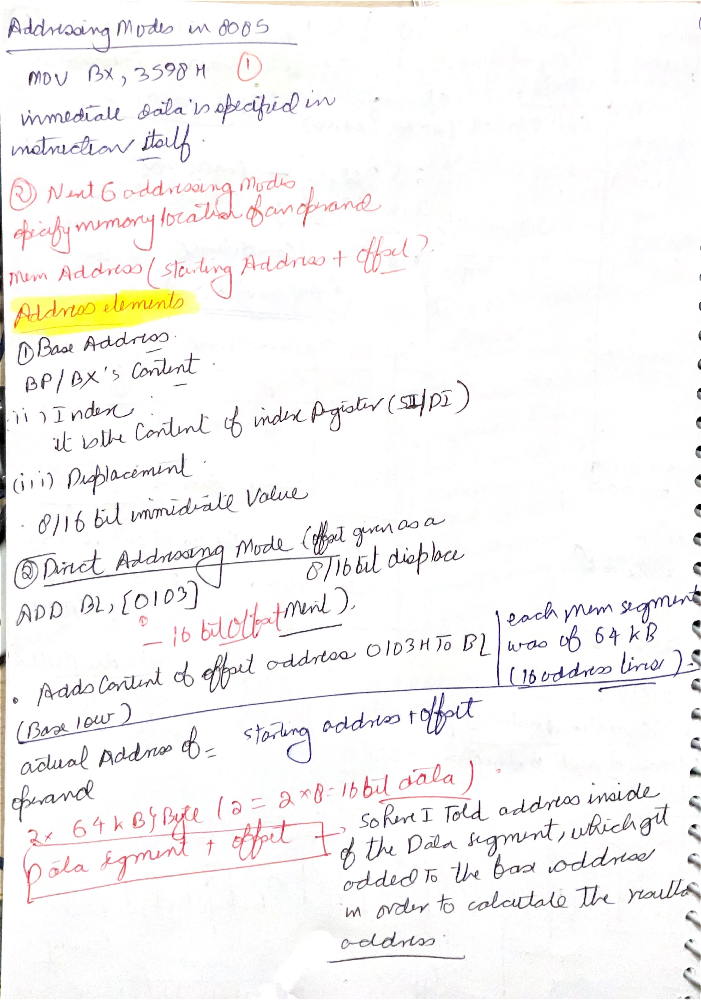
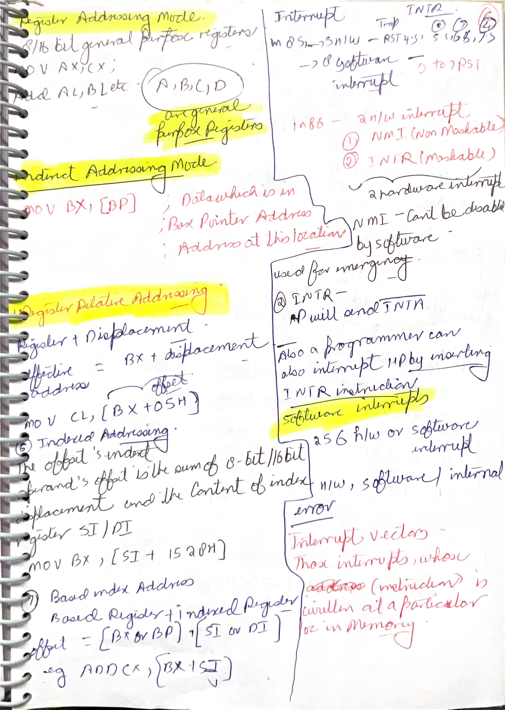
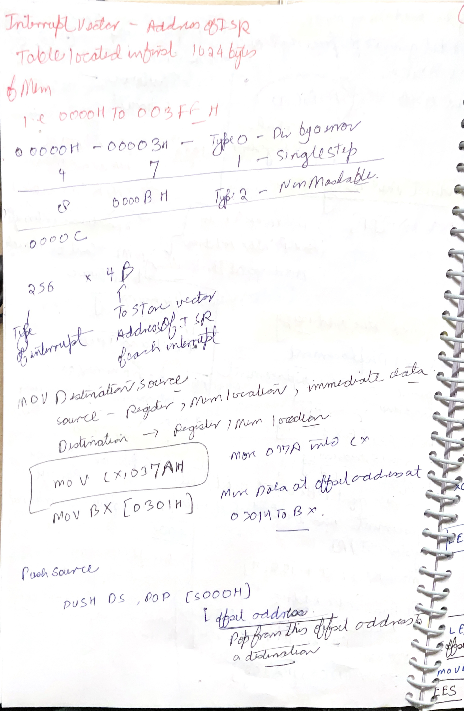

# Day 10: 8086 Flags, Addressing Modes, Interrupts, and Instruction Set

Day 10 continues the 8086 introduction from Day 9. The screenshots move from architecture into programming: flag bits, addressing modes, interrupt sources, interrupt vector table, and major instruction groups such as data transfer, arithmetic, logical, branch, loop, flag manipulation, string, and repeat instructions.

## Image Index

| No. | Image | Main idea |
| --- | --- | --- |
| 1 | [Question: flag bit used for single-step mode](images/Day%2010/Screenshot%202026-06-10%20113754.png) | The single-step control bit is the trap flag `TF`. |
| 2 | [Direction flag and interrupt flag](images/Day%2010/Screenshot%202026-06-10%20113801.png) | `DF` controls string direction; `IF` enables maskable interrupts. |
| 3 | [Direct and register addressing modes](images/Day%2010/Screenshot%202026-06-10%20115053.png) | Operand offset in instruction versus operand in register. |
| 4 | [Addressing mode examples close-up](images/Day%2010/Screenshot%202026-06-10%20115108.png) | `ADD BL,[0103]`, `MOV AX,CX`, and `ADD AL,BL`. |
| 5 | [Hardware interrupts: NMI and INTR](images/Day%2010/Screenshot%202026-06-10%20121951.png) | NMI is non-maskable; INTR is maskable through `IF`. |
| 6 | [Sources of 8086 interrupts](images/Day%2010/Screenshot%202026-06-10%20122150.png) | Hardware interrupt, software interrupt, and error/exception condition. |
| 7 | [Interrupt vectors overview](images/Day%2010/Screenshot%202026-06-10%20123137.png) | Vector table stores interrupt-service addresses. |
| 8 | [Interrupt vector types 0-31](images/Day%2010/Screenshot%202026-06-10%20123323.png) | Early interrupt types and reserved range. |
| 9 | [Interrupt vector table size](images/Day%2010/Screenshot%202026-06-10%20123503.png) | 256 vectors x 4 bytes = 1024 bytes. |
| 10 | [Instruction set of 8086 and MOV](images/Day%2010/Screenshot%202026-06-10%20124043.png) | 8086 is register-general, not accumulator-only like 8085. |
| 11 | [PUSH, POP, XCHG, and IN](images/Day%2010/Screenshot%202026-06-10%20125110.png) | Stack, exchange, and input instruction examples. |
| 12 | [OUT instruction](images/Day%2010/Screenshot%202026-06-10%20125135.png) | Output data to an 8-bit or 16-bit port address. |
| 13 | [Arithmetic instructions](images/Day%2010/Screenshot%202026-06-10%20125907.png) | `ADD`, `ADC`, multiply/divide register conventions. |
| 14 | [Interrupt and loop instructions](images/Day%2010/Screenshot%202026-06-10%20130445.png) | `INT`, `INTO`, `LOOP`, `LOOPZ`, and `LOOPNZ`. |
| 15 | [Logical and branching instructions](images/Day%2010/Screenshot%202026-06-10%20130450.png) | AND/OR/XOR/NOT/TEST and branch categories. |
| 16 | [Flag manipulation instructions](images/Day%2010/Screenshot%202026-06-10%20130514.png) | Clear, set, and complement selected flags. |
| 17 | [String instructions](images/Day%2010/Screenshot%202026-06-10%20130527.png) | `MOVS`, `CMPS`, `SCAS`, and `LODS`. |
| 18 | [Repeat instructions](images/Day%2010/Screenshot%202026-06-10%20130603.png) | Repeat prefixes before string instructions. |
| 19 | [Repeat instruction examples](images/Day%2010/Screenshot%202026-06-10%20130623.png) | `REP`, `REPE/REPZ`, and `REPNE/REPNZ`. |

## Handwritten Notes Linked To Day 10

Each handwritten page is shown first as a large full-page image. The explanation below the image adds the technical layer: instruction behavior, bus cycles, flags, timing, address formation, or hardware reason behind the note.

### [86tilllnow p007](images/HandWrittenNotes/86tilllnow/page-007.jpg)

<a href="images/HandWrittenNotes/86tilllnow/page-007.jpg"></a>

Technical explanation: 8086 flags include status flags and control flags. `CF`, `PF`, `AF`, `ZF`, `SF`, and `OF` describe arithmetic/logical results. `TF` enables single-step trap behavior, `IF` controls maskable interrupt recognition, and `DF` controls string-instruction direction. Do not map the 8086 flag register directly onto the 8085 flag register; overflow, trap, interrupt, and direction behavior are important additions.

8086 stack references normally use the `SS` segment with `SP` or `BP` as the offset source. A push reduces `SP` before storing a word, and a pop reads the word before increasing `SP`. This is still stack-in-memory behavior, but the 8086 explanation must include segmentation because the physical stack address is formed from `SS:SP` or `SS:BP`.

### [86tilllnow p008](images/HandWrittenNotes/86tilllnow/page-008.jpg)

<a href="images/HandWrittenNotes/86tilllnow/page-008.jpg"></a>

Technical explanation: 8086 physical addresses are formed from `segment:offset`. The segment value is shifted left four bits and the 16-bit offset is added: `physical = segment x 10H + offset`. This produces a 20-bit address and allows access to 1 MB even though most visible registers are 16 bits. Different segment:offset pairs can refer to the same physical address.

8086 addressing modes form an effective offset from registers, base registers, index registers, and displacement. That offset is then combined with a segment base. Code fetch normally uses `CS:IP`, stack access uses `SS`, many data accesses use `DS`, and some string or extra-segment operations use `ES`.

### [86tilllnow p009](images/HandWrittenNotes/86tilllnow/page-009.jpg)

<a href="images/HandWrittenNotes/86tilllnow/page-009.jpg"></a>

Technical explanation: 8086 addressing modes form an effective offset from registers, base registers, index registers, and displacement. That offset is then combined with a segment base. Code fetch normally uses `CS:IP`, stack access uses `SS`, many data accesses use `DS`, and some string or extra-segment operations use `ES`.

8086 interrupts use a vector table rather than the 8085 restart-address pattern. Each interrupt type has a four-byte entry containing offset and segment, so the vector address is `type x 4`. `NMI` is non-maskable, `INTR` is maskable through `IF`, and software `INT n` uses the same vectoring idea. That is why 8086 interrupt tracing must load both `CS` and `IP`, not just a single 16-bit program counter.

### [86tilllnow p010](images/HandWrittenNotes/86tilllnow/page-010.jpg)

<a href="images/HandWrittenNotes/86tilllnow/page-010.jpg"></a>

Technical explanation: for 8086 data-transfer instructions, identify source, destination, operand size, and address form. `MOV` copies between allowed register/memory forms but not arbitrary memory-to-memory forms. `IN` and `OUT` use I/O port addressing. `XLAT` performs a table lookup using `AL` as an index, so the effective table address must be derived before the moved byte is known.

8086 addressing modes form an effective offset from registers, base registers, index registers, and displacement. That offset is then combined with a segment base. Code fetch normally uses `CS:IP`, stack access uses `SS`, many data accesses use `DS`, and some string or extra-segment operations use `ES`.

### [86tilllnow p011](images/HandWrittenNotes/86tilllnow/page-011.jpg)

<a href="images/HandWrittenNotes/86tilllnow/page-011.jpg"></a>

Technical explanation: for 8086 data-transfer instructions, identify source, destination, operand size, and address form. `MOV` copies between allowed register/memory forms but not arbitrary memory-to-memory forms. `IN` and `OUT` use I/O port addressing. `XLAT` performs a table lookup using `AL` as an index, so the effective table address must be derived before the moved byte is known.

8086 addressing modes form an effective offset from registers, base registers, index registers, and displacement. That offset is then combined with a segment base. Code fetch normally uses `CS:IP`, stack access uses `SS`, many data accesses use `DS`, and some string or extra-segment operations use `ES`.

### [86tilllnow p012](images/HandWrittenNotes/86tilllnow/page-012.jpg)

<a href="images/HandWrittenNotes/86tilllnow/page-012.jpg"></a>

Technical explanation: 8086 branch instructions modify instruction flow by changing `IP` and sometimes `CS`. Short and near branches stay in the current code segment; far transfers also change `CS`. Conditional branches test flags such as `ZF`, `CF`, `SF`, and `OF`, so signed and unsigned comparisons use different branch conditions even if the previous comparison instruction was the same.

Compared with the 8085, the 8086 has a wider external data bus, a 20-bit address space, segmentation, a prefetch queue, richer addressing modes, and a more complex flag model. That is why an 8086 trace often begins by forming `segment:offset`, while an 8085 trace usually begins with a direct 16-bit address or a register-pair pointer.

### [scanned-2026-06-16-231727 p008](images/HandWrittenNotes/scanned-2026-06-16-231727/page-008.jpg)

<a href="images/HandWrittenNotes/scanned-2026-06-16-231727/page-008.jpg"></a>

Technical explanation: this page begins with immediate and direct addressing. In immediate addressing, the data is part of the instruction itself, such as `MOV BX,3598H`. No memory operand has to be read to get the source value; the operand bytes follow the opcode in the instruction stream. In direct addressing, the instruction contains an offset, such as `ADD BL,[0103H]`. The processor uses the offset with the default segment, usually `DS`, to locate the memory byte or word.

The page then lists the elements that can form an 8086 effective address: base register content, index register content, and displacement. The effective address is only an offset. The physical address is still formed later by the BIU using `segment x 10H + offset`. This split is essential: the EU can calculate `BX + SI + displacement`, but the BIU adds the segment base and performs the actual bus cycle.

The note "each memory segment was of 64 KB" is a direct consequence of 16-bit offsets. An offset can range from `0000H` to `FFFFH`, which is `65536` bytes. Direct addressing therefore gives an offset inside a segment, not a full 20-bit physical address by itself.

### [scanned-2026-06-16-231727 p009](images/HandWrittenNotes/scanned-2026-06-16-231727/page-009.jpg)

<a href="images/HandWrittenNotes/scanned-2026-06-16-231727/page-009.jpg"></a>

Technical explanation: the left side expands addressing modes. Register addressing keeps the operand inside a register, so no memory bus cycle is needed for that operand. Register-indirect addressing uses a register as a pointer, for example `[BP]`, `[BX]`, `[SI]`, or `[DI]`. Register-relative addressing adds a displacement to a register, such as `[BX+05H]`. Based-indexed addressing combines a base register and an index register, such as `[BX+SI]`, and can also include displacement.

The most important correction is default segment selection. Effective addresses involving `BP` usually default to `SS`; many others default to `DS`. This is why `MOV BX,[BP]` is not the same segment assumption as `MOV BX,[SI]`. Both produce offsets, but the segment base can differ.

The right side links interrupts to vectoring. In 8086, hardware interrupt inputs are `NMI` and `INTR`. `NMI` cannot be disabled by software; `INTR` depends on the interrupt flag `IF` and receives an acknowledge sequence. Software interrupts use `INT n`. The phrase "interrupt vector" means the memory entry that contains the address of the interrupt service routine, not the interrupt signal itself.

### [scanned-2026-06-16-231727 p010](images/HandWrittenNotes/scanned-2026-06-16-231727/page-010.jpg)

<a href="images/HandWrittenNotes/scanned-2026-06-16-231727/page-010.jpg"></a>

Technical explanation: this page focuses on the interrupt vector table and the beginning of `MOV`-style data transfer. The 8086 IVT starts at physical address `00000H` and occupies `1024` bytes because there are 256 interrupt types and each type uses four bytes. The formula is `vector address = interrupt type x 4`. Type 0 starts at `00000H`, type 1 starts at `00004H`, and type 2 starts at `00008H`.

Each vector entry stores two words: offset first and segment second. That means the processor loads both `IP` and `CS` when it vectors to an interrupt service routine. This is deeper than the 8085 restart idea, where many interrupts map to fixed 16-bit restart addresses. In 8086, the table entry gives a full far pointer.

The `MOV destination,source` notes are also important. Source can be register, memory, or immediate data depending on the exact form. Destination can be register or memory, but not immediate. Memory-to-memory `MOV` is generally not allowed as a single instruction. When the note shows `MOV BX,[0301H]`, the bracketed value is an offset; the processor reads the word or byte from memory, depending on the destination size.

## 1. 8086 Flag Register and Single-Step Mode


The screenshot asks which 8086 flag bit is used to put the processor in single-step mode. The answer is:

```text
TF = Trap Flag
```

When `TF = 1`, the processor supports single-step execution by generating a debug-style trap after an instruction. This lets a debugger inspect the machine state one instruction at a time.

The 8086 flag register contains status flags and control flags.

| Flag | Type | Meaning |
| --- | --- | --- |
| `CF` | Status | Carry/borrow from arithmetic. |
| `PF` | Status | Even parity in the low byte of result. |
| `AF` | Status | Auxiliary carry between bit 3 and bit 4. |
| `ZF` | Status | Result is zero. |
| `SF` | Status | Sign bit of result is 1. |
| `OF` | Status | Signed overflow occurred. |
| `TF` | Control | Single-step trap control. |
| `IF` | Control | Enables maskable hardware interrupts through `INTR`. |
| `DF` | Control | Direction for string instructions. |

`IF` is important for interrupts. If `IF = 1`, maskable interrupts through `INTR` can be recognized. If `IF = 0`, maskable interrupts are disabled. `NMI` is not controlled by `IF`.

`DF` is important for string instructions. If `DF = 0`, string operations normally move forward by incrementing index registers. If `DF = 1`, they move backward by decrementing index registers. This matters for instructions such as `MOVSB`, `CMPSB`, `SCASB`, and `LODSB`.

## 2. Direct and Register Addressing Modes


An addressing mode tells the processor where the operand is.

### Direct Addressing

In direct addressing, the instruction contains the offset address of the memory operand.

Example from the screenshot:

```asm
ADD BL,[0103]
```

Meaning:

```text
BL <- BL + memory byte at offset 0103H
```

The square brackets mean "contents of memory at this address," not the literal number itself. The actual physical address also depends on the active segment base:

```text
physical address = segment x 10H + offset
```

If the data segment is assumed and `DS = 2000H`, then `[0103H]` refers to:

```text
20000H + 0103H = 20103H
```

### Register Addressing

In register addressing, the operand is inside a register.

Examples:

```asm
MOV AX,CX
ADD AL,BL
```

No memory operand is needed. The CPU uses internal registers, so this is simpler than memory addressing.

The difference:

| Example | Operand location |
| --- | --- |
| `ADD BL,[0103]` | One operand is in memory. |
| `MOV AX,CX` | Both operands are registers. |
| `ADD AL,BL` | Both operands are 8-bit register halves. |

## 3. Other 8086 Addressing Ideas


The handwritten notes expand beyond direct/register addressing into common 8086 effective-address forms:

| Mode idea | Example style | Meaning |
| --- | --- | --- |
| Register indirect | `[BX]`, `[BP]`, `[SI]`, `[DI]` | Memory address is held in a register. |
| Based | `[BX + displacement]` or `[BP + displacement]` | Base register plus constant displacement. |
| Indexed | `[SI + displacement]` or `[DI + displacement]` | Index register plus constant displacement. |
| Based indexed | `[BX + SI]`, `[BX + DI]`, `[BP + SI]`, `[BP + DI]` | Base and index are added. |
| Based indexed with displacement | `[BX + SI + disp]` | Base plus index plus constant displacement. |

This is more flexible than 8085. In 8085, memory-indirect access is strongly centered on `HL` through the symbol `M`. In 8086, several registers can participate in effective-address formation.

The main mental split:

```text
effective address = offset calculated by addressing mode
physical address = segment base + effective address
```

## 4. 8086 Hardware Interrupts


The 8086 has two hardware interrupt inputs:

| Interrupt input | Meaning |
| --- | --- |
| `NMI` | Non-maskable interrupt. Used for high-priority events and not disabled by `IF`. |
| `INTR` | Maskable interrupt request. Recognized when interrupt flag `IF = 1`. |

The screenshots divide interrupts into three sources:

| Source | Meaning | Example |
| --- | --- | --- |
| Hardware interrupt | External device requests service. | `NMI`, `INTR`. |
| Software interrupt | Program executes an interrupt instruction. | `INT n`. |
| Error/exception condition | Processor detects a fault-like condition. | Divide error. |

The important difference from an ordinary subroutine is that interrupts save processor state and transfer control through the interrupt vector table. Interrupt service routines normally return with interrupt-return behavior, not ordinary branch fall-through.

## 5. Interrupt Vector Table


The 8086 interrupt vector table is located at the beginning of memory:

```text
00000H to 003FFH
```

It has:

```text
256 interrupt types x 4 bytes per vector = 1024 bytes = 1 KB
```

Each vector stores a far address:

```text
2 bytes offset/IP
2 bytes segment/CS
```

The CPU uses the interrupt type number as an index:

```text
vector address = interrupt type x 4
```

Examples:

| Type | Vector table address range | Common meaning in basic 8086 notes |
| --- | --- | --- |
| Type 0 | `00000H-00003H` | Divide error. |
| Type 1 | `00004H-00007H` | Single step. |
| Type 2 | `00008H-0000BH` | Non-maskable interrupt. |
| Type 3 | `0000CH-0000FH` | Breakpoint. |
| Type 4 | `00010H-00013H` | Overflow. |
| Type 5-31 | `00014H-0007FH` | Reserved in the basic table. |
| Type 32-255 | Later entries | Available for user/software or system-defined interrupt use. |

The vector table does not store the ISR code itself. It stores the address of the ISR. That is why each vector needs four bytes: the 8086 must load both `IP` and `CS` to jump to the service routine.

## 6. Data Transfer Instructions


8086 is not accumulator-centered in the same way as 8085. Many instructions can use several general-purpose registers.

### `MOV destination, source`

```asm
MOV AX,CX
MOV BX,[0301H]
```

`MOV` copies data from source to destination. The source is not destroyed.

General restrictions to remember:

- source and destination sizes must match;
- ordinary `MOV` does not directly move memory to memory;
- not every register can be used for every segment-register transfer;
- immediate data can be moved into registers or memory, depending on instruction form.

### `PUSH` and `POP`

`PUSH source` stores a word on the stack. `POP destination` removes a word from the stack.

```asm
PUSH DS
POP [5000H]
```

The stack is managed through `SS:SP`. Stack operations are word-oriented in 8086 basic use.

### `XCHG`

```asm
XCHG [5000H],AX
```

`XCHG` exchanges source and destination. In many instruction sets, exchange is useful because it avoids needing a temporary register.

### `IN` and `OUT`

```asm
IN AL,DX
OUT 80H,AL
```

`IN` reads from an I/O port into `AL` or `AX`. `OUT` writes `AL` or `AX` to a port. Some forms use an 8-bit immediate port number; other forms use `DX` to hold the port address.

## 7. Arithmetic Instructions


8086 arithmetic instructions include:

| Instruction | Meaning |
| --- | --- |
| `ADD dest,src` | Add source to destination. |
| `ADC dest,src` | Add source plus carry flag to destination. |
| `SUB dest,src` | Subtract source from destination. |
| `SBB dest,src` | Subtract source plus carry/borrow from destination. |
| `INC dest` | Increment by 1. |
| `DEC dest` | Decrement by 1. |
| `CMP dest,src` | Compare by subtraction without storing result. |
| `MUL`, `IMUL` | Unsigned/signed multiplication. |
| `DIV`, `IDIV` | Unsigned/signed division. |

The screenshot notes a key register convention:

| Operation size | Register convention |
| --- | --- |
| 8-bit multiply/divide | Uses `AL`/`AX` depending on operation. |
| 16-bit multiply/divide | Uses `AX` and `DX` together for extended result or dividend. |

The important revision link from 8085 is carry/borrow and flags. The 8086 adds a stronger signed-arithmetic flag concept through overflow flag `OF`, while `CF` still handles unsigned carry/borrow.

## 8. Interrupt and Loop Instructions


Interrupt instructions include:

| Instruction | Meaning |
| --- | --- |
| `INT n` | Software interrupt of type `n`. |
| `INTO` | Interrupt on overflow; triggers if `OF = 1`. |

Loop instructions use `CX` as the count register:

| Instruction | Basic idea |
| --- | --- |
| `LOOP label` | Decrement `CX`; jump if `CX != 0`. |
| `LOOPZ` / `LOOPE` | Decrement `CX`; jump if `CX != 0` and `ZF = 1`. |
| `LOOPNZ` / `LOOPNE` | Decrement `CX`; jump if `CX != 0` and `ZF = 0`. |

This is one reason `CX` is called the count register. It has a normal general-purpose role, but certain instructions use it specially.

## 9. Logical and Branching Instructions


Logical instructions operate bit by bit:

| Instruction | Meaning |
| --- | --- |
| `AND` | Clears bits where mask has 0. |
| `OR` | Sets bits where mask has 1. |
| `XOR` | Toggles bits where mask has 1. |
| `NOT` | Complements all bits. |
| `TEST` | Performs AND for flags only; result is not stored. |

Branching instructions include unconditional jumps, conditional jumps, calls, and returns. The major idea is the same as 8085: branch instructions change the normal sequential flow of `IP`. The difference is that 8086 branches may be near or far depending on whether only `IP` changes or both `CS` and `IP` change.

## 10. Flag Manipulation Instructions


Flag manipulation instructions directly change selected control/status flags:

| Instruction | Meaning |
| --- | --- |
| `CLC` | Clear carry flag. |
| `STC` | Set carry flag. |
| `CMC` | Complement carry flag. |
| `CLD` | Clear direction flag. |
| `STD` | Set direction flag. |
| `CLI` | Clear interrupt flag. |
| `STI` | Set interrupt flag. |

These are control instructions. They are often used before arithmetic chains, interrupt-sensitive code, or string operations. For example, `CLD` before a string copy means the string index registers move forward.

## 11. String and Repeat Instructions


String instructions process sequences of bytes or words. They normally use `SI` as source index, `DI` as destination index, and `CX` as count when combined with repeat prefixes.

| Instruction | Meaning |
| --- | --- |
| `MOVSB` / `MOVSW` | Move byte/word from source string to destination string. |
| `CMPSB` / `CMPSW` | Compare source and destination string elements. |
| `SCASB` / `SCASW` | Scan string by comparing accumulator with destination string element. |
| `LODSB` / `LODSW` | Load byte/word from source string into accumulator. |

Repeat prefixes run a string instruction multiple times:

| Prefix | Meaning |
| --- | --- |
| `REP` | Repeat while `CX != 0`. |
| `REPE` / `REPZ` | Repeat while `CX != 0` and zero flag indicates equal/zero. |
| `REPNE` / `REPNZ` | Repeat while `CX != 0` and zero flag indicates not equal/not zero. |

`DF` controls direction:

```text
DF = 0 -> SI/DI increment after string element
DF = 1 -> SI/DI decrement after string element
```

So for predictable forward string processing, programs often execute:

```asm
CLD
```

before string instructions.

## 12. 8085 to 8086 Comparison


| Feature | 8085 | 8086 |
| --- | --- | --- |
| Main data size | 8-bit | 16-bit |
| Address range | 64 KB | 1 MB physical address space |
| Main accumulator idea | Accumulator-centered | General-purpose register model with `AX`, `BX`, `CX`, `DX` |
| Addressing | Strongly centered around `HL` for indirect memory access | Multiple base/index/displacement addressing forms |
| Memory address formation | 16-bit address | Segment:offset forms 20-bit physical address |
| Interrupt table | Fixed restart vectors and interrupt inputs | 256-entry interrupt vector table, 4 bytes per vector |
| String processing | No 8086-style string instruction group | Dedicated string instructions and repeat prefixes |

The main revision point: 8086 is not just "bigger 8085." It changes how memory is addressed, how registers are used, how interrupts are vectored, and how repeated string operations are handled.

## Research Deep Dive: 8086 Programming Model Details

The Intel 8086 manuals repeatedly connect instruction behavior to registers, flags, and segment defaults. For Day 10, the deeper work is knowing which hidden state an instruction uses.

### Interrupt Entry Is A Far Control Transfer

When an 8086 interrupt is accepted, the CPU does not only jump. It saves enough state to return later.

The essential stack save sequence is:

```text
push FLAGS
push CS
push IP
load new IP and CS from interrupt vector table
```

Each interrupt vector occupies four bytes:

| Vector byte(s) | Meaning |
| --- | --- |
| first word | new `IP` offset |
| second word | new `CS` segment |

So interrupt type `n` uses:

```text
vector address = n x 4
```

Example:

```text
type 3 vector begins at 0000CH
```

The vector stores the address of the interrupt service routine, not the ISR code itself.

### Effective Address Versus Physical Address

An addressing mode computes an effective address, which is only an offset. The segment register then supplies the base.

Example:

```asm
MOV AL,[BX+SI+10H]
```

If:

```text
BX = 1000H
SI = 0020H
DS = 2000H
```

then:

```text
EA = 1000H + 0020H + 0010H = 1030H
physical = 20000H + 1030H = 21030H
```

The instruction reads memory from `DS:1030H`.

### String Instructions Use Implicit Registers

String instructions look short because many operands are implied.

| Instruction | Implied source | Implied destination/result |
| --- | --- | --- |
| `MOVSB` | `DS:SI` | `ES:DI` |
| `CMPSB` | `DS:SI` | compared with `ES:DI` |
| `SCASB` | `AL` | compared with `ES:DI` |
| `LODSB` | `DS:SI` | `AL` |

Direction flag controls index movement:

| `DF` | Byte string step | Word string step |
| --- | --- | --- |
| `0` | increment by 1 | increment by 2 |
| `1` | decrement by 1 | decrement by 2 |

That is why serious string code often begins with `CLD` unless it intentionally wants backward movement.

### Signed And Unsigned Branches After The Same `CMP`

`CMP AX,BX` only sets flags from `AX - BX`. It does not know whether the programmer means signed or unsigned numbers. The following jump gives the interpretation.

| Meaning | Unsigned jump | Signed jump |
| --- | --- | --- |
| below / less than | `JB` | `JL` |
| above / greater than | `JA` | `JG` |
| below or equal / less or equal | `JBE` | `JLE` |
| above or equal / greater or equal | `JAE` | `JGE` |

Use unsigned jumps for addresses, sizes, counts, and raw bytes. Use signed jumps for two's-complement numerical values.

## Points To Remember

- Single-step mode uses `TF`, the trap flag.
- `IF` controls maskable interrupts through `INTR`.
- `DF` controls forward/backward direction for string instructions.
- Direct addressing puts the offset in the instruction.
- Register addressing keeps operands inside registers.
- Physical address = segment shifted left 4 bits plus offset.
- 8086 IVT occupies `00000H-003FFH`.
- IVT size is `256 x 4 = 1024` bytes.
- Each vector stores offset and segment of the interrupt service routine.
- `MOV` copies; `XCHG` exchanges; `PUSH/POP` use stack.
- `CX` is the count register for `LOOP` and repeat prefixes.
- `REP`, `REPE/REPZ`, and `REPNE/REPNZ` repeat string instructions.

## Sources

[S1] Intel Corporation, [The 8086 Family User's Manual, October 1979](https://www.ardent-tool.com/CPU/docs/Intel/808x/manuals/9800722-03.pdf). Used for 8086 flags, addressing modes, interrupts, interrupt vector table, data-transfer instructions, arithmetic/logical instructions, string instructions, and repeat prefixes.

[S2] Intel Corporation, [iAPX 86,88 User's Manual, August 1981](https://www.dosdays.co.uk/media/intel/1981_iAPX_86_88_Users_Manual.pdf). Used for 8086 programming model, flag behavior, segment:offset addressing, interrupt handling, and instruction groups.
