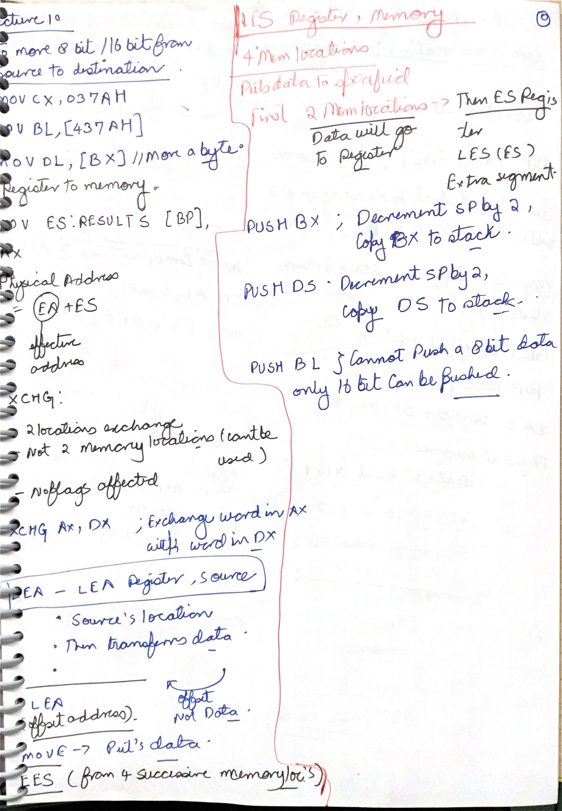
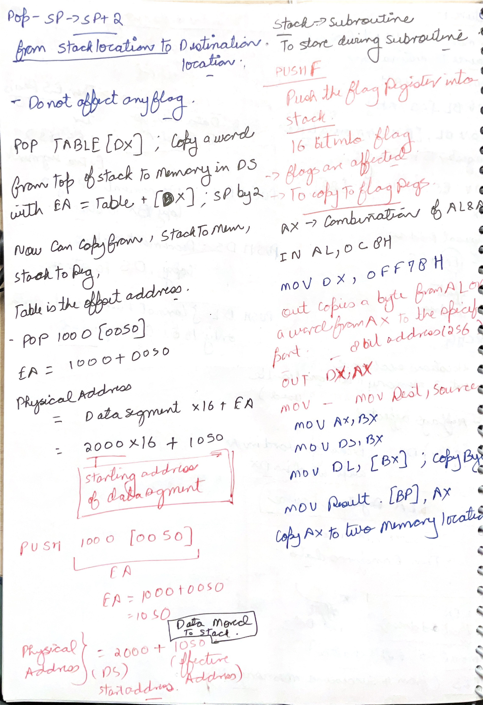

# Day 11: 8086 XCHG, LEA, LES, and PUSH Instructions

Day 11 continues the 8086 instruction-set discussion from Day 10. The screenshots focus on data-transfer and address-related instructions: exchanging register or memory operands, loading an effective address, loading a far pointer into `ES` and a register, and pushing word-sized data onto the stack.

## Handwritten Notes Linked To Day 11

Each handwritten page is shown first as a large full-page image. The explanation below the image adds the technical layer: address versus contents, far pointer layout, stack byte order, and why stack instructions operate on words.

### [scanned-2026-06-16-231727 p011](images/HandWrittenNotes/scanned-2026-06-16-231727/page-011.jpg)

<a href="images/HandWrittenNotes/scanned-2026-06-16-231727/page-011.jpg"></a>

Technical explanation: this page is directly tied to Day 11 because it compares `MOV`, `XCHG`, `LEA`, `LES`, and `PUSH`. The left side shows `MOV CX,037AH`, `MOV BL,[437AH]`, and `MOV DL,[BX]`. The rule is that the destination size controls how many bytes are copied. `CX` receives a word immediate, `BL` receives one byte from memory, and `DL` receives one byte from the memory offset held in `BX`.

`XCHG` exchanges two operands but cannot exchange two memory locations directly. At least one side must be a register. This restriction exists because the 8086 instruction format and execution path do not support a direct memory-to-memory swap as one instruction. If two memory values need to be exchanged, a register must be used as temporary storage.

`LEA` and `LES` are often confused, so this page is valuable. `LEA register,source` loads the calculated offset address; it does not read the data stored there. `LES register,memory` reads a four-byte far pointer from memory: the first word goes into the destination register and the second word goes into `ES`. After `LES`, the pair `ES:register` identifies a far memory location.

The `PUSH` examples on the right reinforce that 8086 stack operations are word-oriented. `PUSH BX` and `PUSH DS` are valid because they are 16-bit operands. `PUSH BL` is invalid because `BL` is only 8 bits. A push decrements `SP` by 2 first, then stores the word at `SS:SP`.

### [scanned-2026-06-16-231727 p012](images/HandWrittenNotes/scanned-2026-06-16-231727/page-012.jpg)

<a href="images/HandWrittenNotes/scanned-2026-06-16-231727/page-012.jpg"></a>

Technical explanation: this page adds `POP`, `PUSHF`, and stack-to-memory addressing. `POP` reverses `PUSH`: it copies a word from the top of the stack to the destination, then increments `SP` by 2. `POP TABLE[DX]` means the popped word is stored into memory at effective address `offset TABLE + DX` in the data segment, unless a segment override is used.

The worked address example `POP 1000[0050]` is really an effective-address calculation. The effective address is `1000H + 0050H = 1050H`. If `DS = 2000H`, the physical address is `2000H x 10H + 1050H = 21050H`. The important point is that the stack source is in `SS:SP`, but the destination memory operand can be in `DS`. One instruction can therefore read from the stack segment and write into the data segment.

`PUSHF` pushes the flag register onto the stack. That is different from pushing a normal data register because it captures processor-status information. It is useful before a subroutine or interrupt-like sequence when flags must be restored later. The page also reminds that `MOV`, `IN`, and `OUT` have special operand restrictions: `IN` and `OUT` use `AL/AX` as the accumulator-side operand, while `MOV` cannot simply copy from one memory location to another memory location in one instruction.

## 1. XCHG and LEA Instructions


### XCHG

`XCHG` exchanges the contents of two operands. The operands must be the same size.

Examples from the screenshot:

```asm
XCHG AX, DX
XCHG BL, CH
XCHG AL, PRICES[BX]
```

Meaning:

| Instruction | Operation |
| --- | --- |
| `XCHG AX, DX` | Exchange the word in `AX` with the word in `DX`. |
| `XCHG BL, CH` | Exchange the byte in `BL` with the byte in `CH`. |
| `XCHG AL, PRICES[BX]` | Exchange `AL` with the byte stored at offset `PRICES + BX` in the data segment. |

For the memory example, the square brackets mean that the operand is the memory byte at the computed effective address. `PRICES[BX]` uses `BX` as an index/base value added to the offset of `PRICES`.

Important rule:

```text
XCHG cannot exchange two memory operands directly.
```

At least one operand must be a register.

### LEA

`LEA` means **Load Effective Address**.

General form:

```asm
LEA register, source
```

`LEA` calculates the offset address of the source operand and loads that offset into the destination register. It does not load the data stored at that address.

Example idea:

```asm
LEA SI, PRICES[BX]
```

Meaning:

```text
SI <- offset address of PRICES[BX]
```

`LEA` is useful when a program needs an address for later memory access. It does not affect any flag.

## 2. LES and PUSH Instructions


### LES

`LES` means **Load Register and ES**.

General form:

```asm
LES register, memory
```

This instruction treats the memory operand as a far pointer made of two consecutive words:

| Memory word | Loaded into |
| --- | --- |
| First word | Specified register |
| Next word | `ES` segment register |

So `LES` loads both an offset and a segment value. It is used when the program needs a pointer of the form:

```text
ES:register
```

Important points:

```text
LES uses a memory operand.
LES does not affect any flag.
```

### PUSH

`PUSH` places a word onto the stack.

In 8086, the stack grows downward. So a push first reduces `SP`, then stores the word at the new stack location.

Example operations from the screenshot:

| Instruction | Operation |
| --- | --- |
| `PUSH BX` | `SP <- SP - 2`, then copy `BX` to the stack. |
| `PUSH DS` | `SP <- SP - 2`, then copy `DS` to the stack. |
| `PUSH BL` | Illegal, because `BL` is only an 8-bit register. |

The 8086 stack stores words, so `PUSH` works with 16-bit operands such as general-purpose word registers, segment registers, or memory words. Byte registers like `BL`, `AL`, and `CH` cannot be pushed directly.

## Research Deep Dive: Address Versus Contents, Far Pointers, and Stack Bytes

Day 11 has a small number of screenshots, but the concepts are central to 8086 programming.

### `LEA` Does Address Arithmetic Only

Compare these two instructions:

```asm
LEA SI,PRICES[BX]
MOV SI,PRICES[BX]
```

If:

```text
offset PRICES = 1000H
BX = 0004H
memory word at DS:1004H = 2222H
```

then:

| Instruction | Result |
| --- | --- |
| `LEA SI,PRICES[BX]` | `SI = 1004H` |
| `MOV SI,PRICES[BX]` | `SI = 2222H` |

This is the cleanest way to remember `LEA`: it loads the calculated offset, not the memory contents.

### `LES` Loads A Far Pointer

`LES register,memory` reads four bytes from memory:

| Memory bytes | Loaded into |
| --- | --- |
| first word | destination register |
| second word | `ES` |

Example memory layout:

| Offset | Byte |
| --- | --- |
| `2000H` | `56H` |
| `2001H` | `34H` |
| `2002H` | `9AH` |
| `2003H` | `78H` |

For:

```asm
LES DI,[2000H]
```

the result is:

```text
DI = 3456H
ES = 789AH
```

The bytes are low-byte first inside each word. After this, `ES:DI` points to the far memory location `789AH:3456H`.

### `PUSH` Byte Order Example

Suppose:

```text
SS = 3000H
SP = 0100H
AX = 1234H
```

After:

```asm
PUSH AX
```

the stack pointer becomes:

```text
SP = 00FEH
```

The word is stored low byte first at the new stack location:

| Logical stack address | Byte |
| --- | --- |
| `SS:00FEH` | `34H` |
| `SS:00FFH` | `12H` |

Physical location of the first byte:

```text
3000H x 10H + 00FEH = 300FEH
```

This example connects `PUSH` to segmentation, downward stack growth, and little-endian word storage.

## Handwritten And Screenshot Deepening

Day 11 looks smaller than other days, but the handwritten notes here are dense because they introduce 8086 address-manipulation instructions. `MOV`, `XCHG`, `LEA`, `LES`, `PUSH`, and `POP` are not just data movement names; they define what counts as data, what counts as an address, and how the stack stores words.

For `XCHG`, the key rule is equal size. A byte register exchanges with a byte register or byte memory operand; a word register exchanges with a word register or word memory operand. `XCHG` does not mean "copy both ways using a temporary variable in memory." It is an instruction-level exchange, and the operands must be compatible. It also does not update arithmetic flags, because no arithmetic result is being produced.

`LEA` is often misunderstood. It loads the effective address, not the data stored at that address. If `TABLE[BX+SI]` points to a memory byte, `MOV AL,TABLE[BX+SI]` reads the byte, while `LEA AX,TABLE[BX+SI]` computes the offset and stores that offset in `AX`. This is why `LEA` is useful for pointer arithmetic and address preparation.

`LES` adds another layer: it loads a far pointer from memory. A far pointer contains both an offset and a segment. `LES DI,[mem]` loads `DI` from the offset word and `ES` from the following segment word. The handwritten page is important because it connects little-endian word storage to segment-offset addressing. The first word is not a random value; it becomes the offset. The second word becomes the segment.

The stack material should be read with byte order and direction together. 8086 stack operations are word-sized for normal `PUSH` and `POP`. On `PUSH`, `SP` decreases by 2 and the word is stored at `SS:SP`. On `POP`, the word at `SS:SP` is loaded and `SP` increases by 2. Since 8086 is little-endian, the low byte of a word is stored at the lower memory address.

When screenshots show physical-address calculation, always separate effective offset from physical address. Effective offset is the 16-bit value produced by the addressing mode. Physical address is produced after adding the shifted segment base. That separation is the difference between understanding `LEA` and confusing it with a memory read.

## Points To Remember

| Instruction | Main use | Key point |
| --- | --- | --- |
| `XCHG` | Exchange two operands | Operands must be the same size; memory-to-memory exchange is not allowed. |
| `LEA` | Load an effective offset address | Loads the address, not the contents of memory. |
| `LES` | Load far pointer into `ES:register` | First memory word goes to the register; next word goes to `ES`. |
| `PUSH` | Save a word on stack | `SP` decreases by 2 before the word is stored. |

## Sources

[S1] Intel Corporation, [The 8086 Family User's Manual, October 1979](https://www.ardent-tool.com/CPU/docs/Intel/808x/manuals/9800722-03.pdf). Used for 8086 data-transfer instructions, effective-address calculation, stack operation, and segment-register behavior.

[S2] Intel Corporation, [iAPX 86,88 User's Manual, August 1981](https://www.dosdays.co.uk/media/intel/1981_iAPX_86_88_Users_Manual.pdf). Used for far pointer, `LES`, stack, and programming-model details.
