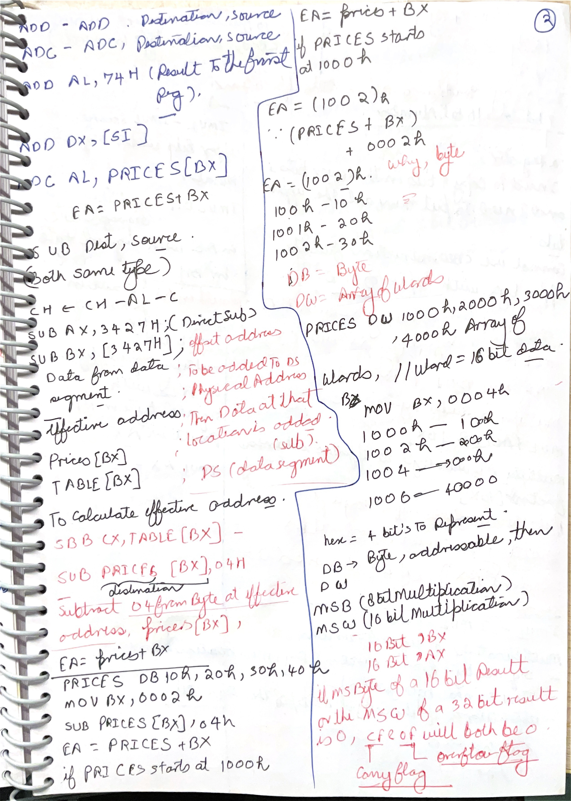
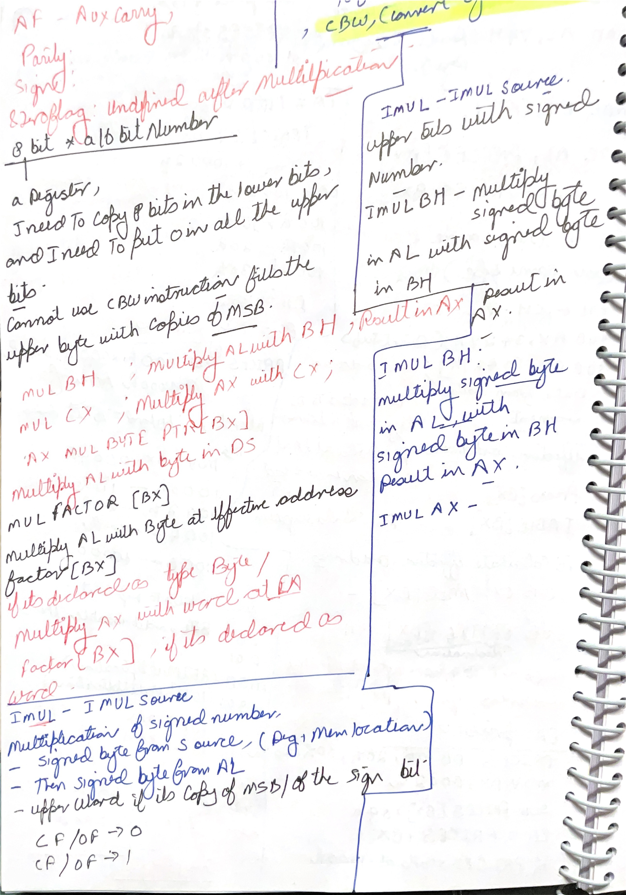
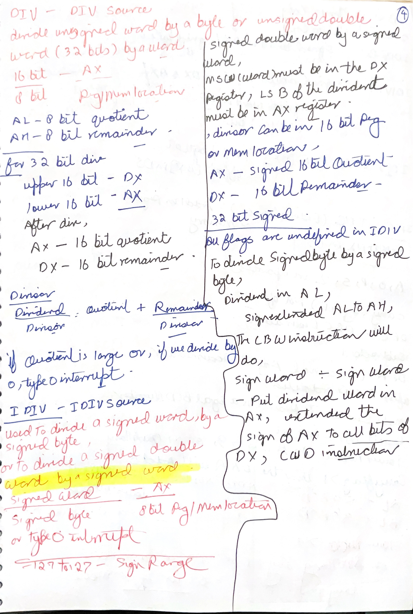
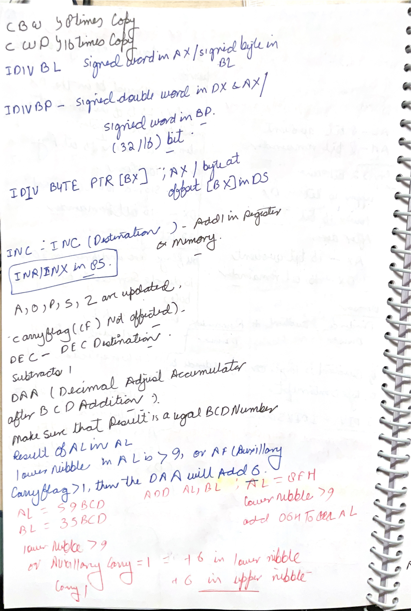
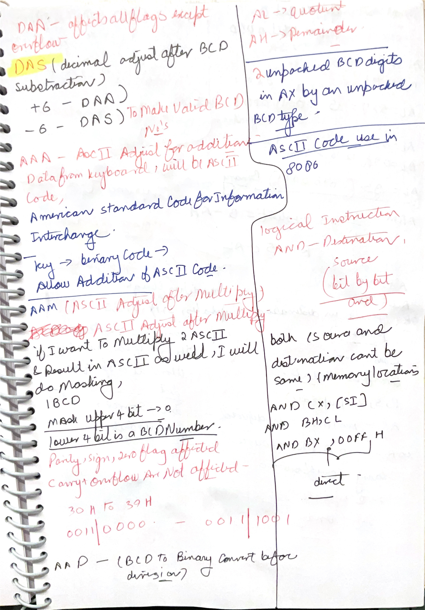
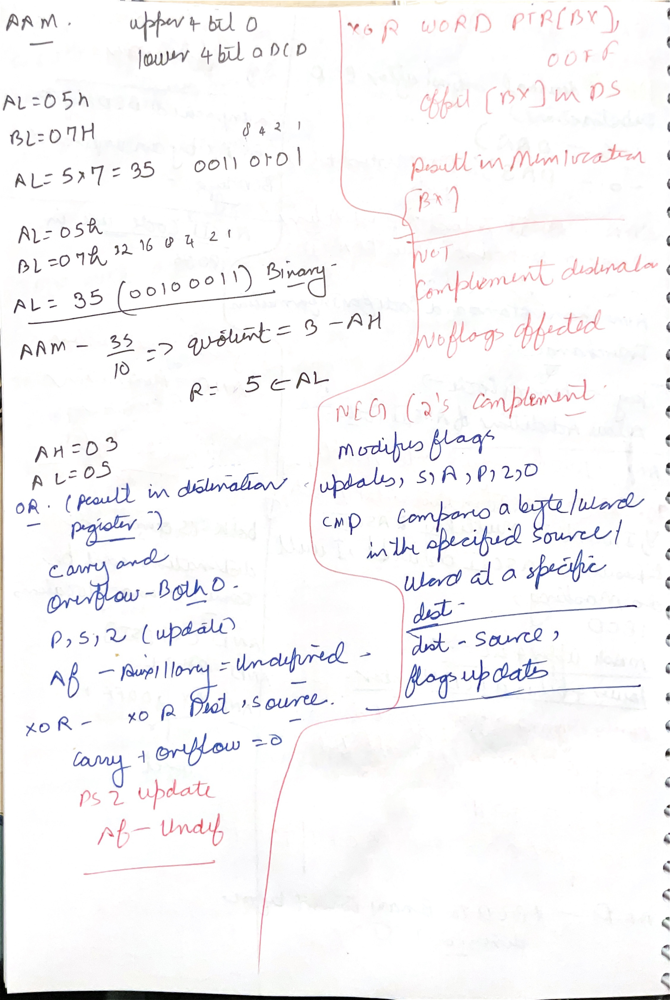

# Day 12: 8086 Instruction Set Deep Dive

Day 12 continues the 8086 instruction-set work from Day 10 and Day 11. The screenshots go deeper into data-transfer instructions, effective-address calculation, port I/O, arithmetic, multiplication, division, increment/decrement, decimal/ASCII adjust instructions, logical `OR`, and `CMP`.

The main study rule for this day:

```text
For every 8086 instruction, ask five questions:
1. What is the operation?
2. What is the operand size: byte or word?
3. Where are the operands: register, memory, immediate, port, or implicit register?
4. Which segment is used for memory?
5. Which flags are changed, cleared, undefined, or untouched?
```

## Handwritten Notes Linked To Day 12

Each handwritten page is shown first as a large full-page image. The explanation below the image adds the technical layer: effective-address arithmetic, implicit operands, flag reliability, BCD/ASCII adjustment, and exact result placement.

### [scanned-2026-06-16-231727 p013](images/HandWrittenNotes/scanned-2026-06-16-231727/page-013.jpg)

<a href="images/HandWrittenNotes/scanned-2026-06-16-231727/page-013.jpg"></a>

Technical explanation: this page connects arithmetic instructions to effective-address calculation. `ADD destination,source` stores the sum in the destination. `ADC` does the same but includes the carry flag, so it is used for multi-byte or multi-word addition. `SUB` subtracts source from destination. `SBB` subtracts source plus `CF`, which is the borrow chain for multi-precision subtraction.

The byte-array example `PRICES DB 10H,20H,30H,40H` and `BX = 0002H` means `PRICES[BX]` points to `PRICES + 2`, the third byte, because `DB` elements are one byte each. If `PRICES` starts at `1000H`, the effective address is `1002H`. The word-array example `PRICES DW 1000H,2000H,3000H,4000H` advances by two bytes per element, so index arithmetic must account for word spacing.

The page also begins multiply-result reasoning. For `MUL r/m8`, the hidden multiplicand is `AL` and the result is in `AX`. For `MUL r/m16`, the hidden multiplicand is `AX` and the result is in `DX:AX`. `CF` and `OF` are cleared only when the upper half of the result is zero; otherwise both are set. Other arithmetic flags are not reliable after multiply.

### [scanned-2026-06-16-231727 p014](images/HandWrittenNotes/scanned-2026-06-16-231727/page-014.jpg)

<a href="images/HandWrittenNotes/scanned-2026-06-16-231727/page-014.jpg"></a>

Technical explanation: this page separates unsigned `MUL` from signed `IMUL`. `MUL BH` multiplies unsigned `AL` by unsigned `BH`, placing the 16-bit result in `AX`. `MUL CX` multiplies unsigned `AX` by unsigned `CX`, placing the 32-bit result in `DX:AX`. If a memory operand is used, the assembler must know whether it is byte or word, for example `MUL BYTE PTR [BX]` versus `MUL WORD PTR [BX]`.

`IMUL` treats the operands as signed two's-complement values. For byte `IMUL`, signed `AL` is multiplied by a signed byte source and the signed result goes to `AX`. For word `IMUL`, signed `AX` is multiplied by a signed word source and the signed result goes to `DX:AX`.

The `CBW` note is about sign extension. `CBW` copies the sign bit of `AL` into all bits of `AH`, converting a signed byte in `AL` into a signed word in `AX`. It is not zero extension. If `AL = F6H`, `CBW` gives `AX = FFF6H`, representing `-10`, not `00F6H`.

### [scanned-2026-06-16-231727 p015](images/HandWrittenNotes/scanned-2026-06-16-231727/page-015.jpg)

<a href="images/HandWrittenNotes/scanned-2026-06-16-231727/page-015.jpg"></a>

Technical explanation: this page focuses on division, where operand size and dividend preparation are critical. For unsigned byte division, the dividend is `AX`, the divisor is an 8-bit register or memory operand, the quotient goes to `AL`, and the remainder goes to `AH`. For unsigned word division, the dividend is `DX:AX`, the divisor is 16-bit, the quotient goes to `AX`, and the remainder goes to `DX`.

`DIV` can raise type 0 interrupt in two cases: divisor is zero, or the quotient is too large to fit in the required quotient register. This means even if the mathematical division is possible, the instruction can fail if the quotient does not fit into `AL` for byte division or `AX` for word division.

For `IDIV`, the dividend must be sign-extended correctly. `CBW` sign-extends `AL` into `AX`; `CWD` sign-extends `AX` into `DX:AX`. Without these, a negative signed dividend may be interpreted as a completely different positive number, giving wrong quotient/remainder or quotient overflow.

### [scanned-2026-06-16-231727 p016](images/HandWrittenNotes/scanned-2026-06-16-231727/page-016.jpg)

<a href="images/HandWrittenNotes/scanned-2026-06-16-231727/page-016.jpg"></a>

Technical explanation: this page continues `IDIV` examples and then moves to `INC`, `DEC`, and `DAA`. `INC destination` adds one to a register or memory operand. `DEC destination` subtracts one. Both update `OF`, `SF`, `ZF`, `AF`, and `PF`, but preserve `CF`. That preservation is important in multi-precision code where carry or borrow must not be destroyed by loop-counter updates.

`DAA` means decimal adjust accumulator after packed BCD addition. It is used after adding two packed BCD numbers in `AL`. If the low nibble is greater than 9 or `AF = 1`, `DAA` adds `06H`. If the upper nibble is greater than 9 or `CF = 1`, it adds `60H`. The goal is not normal binary addition; the goal is to make each nibble a valid decimal digit.

The example idea with `59 BCD + 35 BCD` shows why adjustment is needed. Binary addition can create nibbles that are not valid BCD digits. `DAA` corrects the result so the hexadecimal-looking nibbles again represent decimal digits.

### [scanned-2026-06-16-231727 p017](images/HandWrittenNotes/scanned-2026-06-16-231727/page-017.jpg)

<a href="images/HandWrittenNotes/scanned-2026-06-16-231727/page-017.jpg"></a>

Technical explanation: this page collects the decimal and ASCII adjustment instructions. `DAS` adjusts after packed BCD subtraction. `AAA` adjusts after unpacked ASCII/decimal addition. `AAM` adjusts after multiplying two unpacked decimal digits, usually producing tens in `AH` and units in `AL`. `AAD` prepares unpacked decimal digits before division by converting `AH:AL` into a binary value in `AL`.

These instructions exist because ASCII digits, unpacked BCD digits, packed BCD digits, and binary values are not the same representation. For example, ASCII `'5'` is `35H`, unpacked BCD digit 5 may be `05H`, packed BCD `59` is `59H`, and binary decimal 59 is `3BH`. Adjustment instructions bridge those representations around arithmetic operations.

The right side begins logical instructions. `AND destination,source` performs bit-by-bit AND and stores the result in the destination. It is commonly used for masking: clearing selected bits while preserving others. Logical instructions generally clear `CF` and `OF`, update `SF`, `ZF`, and `PF`, and leave `AF` undefined.

### [scanned-2026-06-16-231727 p018](images/HandWrittenNotes/scanned-2026-06-16-231727/page-018.jpg)

<a href="images/HandWrittenNotes/scanned-2026-06-16-231727/page-018.jpg"></a>

Technical explanation: this page gives an `AAM` worked example. If `AL = 05H` and `BL = 07H`, multiplying unpacked decimal digits gives decimal 35. `AAM` divides that value by 10: quotient 3 goes into `AH`, remainder 5 goes into `AL`. So `AX` becomes `0305H`, representing the unpacked decimal result `35`.

The page also covers `XOR`, `NEG`, and `CMP`. `XOR destination,source` is useful for toggling bits or clearing a register with `XOR AX,AX`. `NEG destination` replaces the operand with its two's complement, effectively calculating `0 - destination`, and it updates flags. `CMP destination,source` performs `destination - source` only to update flags; it does not store the subtraction result.

The important flag lesson is reliability. After logical instructions, `CF` and `OF` are cleared and `SF/ZF/PF` reflect the result. After `CMP`, flags behave as if subtraction happened. After `AAM`, `SF`, `ZF`, and `PF` are updated but `AF`, `CF`, and `OF` are undefined. Do not test a flag unless the preceding instruction defines it.

## Page-By-Page Explanation

Every screenshot is explained separately here. Later sections still group related ideas for revision, but this section keeps the page order clear.

### Page 1: MOV Examples And `BP` Addressing

<a href="images/Day%2012/Screenshot%202026-06-15%20161545.png"></a>

This page introduces `MOV destination, source` as a copy operation. The source value remains unchanged, the destination receives a byte or word copy, and no flags are affected. The operand size comes from the destination: `MOV CX,037AH` is a word move because `CX` is 16-bit, while `MOV BL,[437AH]` is a byte move because `BL` is 8-bit.

The important addressing point is `MOV RESULT[BP],AX`. When an effective address uses `BP`, the default segment is `SS`, not `DS`. The effective offset is `offset RESULT + BP`, and the physical address is `SS x 10H + effective offset`. Since `AX` is a word, the low byte `AL` is stored first and `AH` is stored at the next address.

### Page 2: `XCHG` And `LEA`

<a href="images/Day%2012/Screenshot%202026-06-15%20162837.png"></a>

`XCHG` exchanges two operands of the same size. `XCHG AX,DX` swaps two words, `XCHG BL,CH` swaps two bytes, and `XCHG AL,PRICES[BX]` swaps `AL` with the memory byte at `DS:(offset PRICES + BX)`. At least one operand must be a register, so memory-to-memory exchange is not allowed.

`LEA` means load effective address. It calculates the offset of a memory expression and puts that offset into a 16-bit register. `LEA SI,PRICES[BX]` makes `SI = offset PRICES + BX`; it does not read the value stored at that address. This is why `LEA` is used for pointer setup and array indexing.

### Page 3: `IN` With Immediate Port And `DX` Port

<a href="images/Day%2012/Screenshot%202026-06-15%20170903.png"></a>

`IN` reads from an I/O port into the accumulator. Byte input always goes to `AL`; word input always goes to `AX`. `IN AL,0C8H` reads one byte from port `0C8H`, while `IN AX,34H` reads one word from port `34H`.

The page also separates immediate port addressing from `DX` port addressing. The immediate form can encode only an 8-bit port number, so it covers `00H` through `FFH`. For a 16-bit port address, the port number must be loaded into `DX`, then the instruction uses `IN AL,DX` or `IN AX,DX`.

### Page 4: `IN` Address Range Annotation

<a href="images/Day%2012/Screenshot%202026-06-15%20171252.png"></a>

This page reinforces why `DX` matters. Because `DX` is 16-bit, it can select ports from `0000H` to `FFFFH`, giving 65,536 possible I/O port addresses. The immediate port form is shorter but limited to 256 ports.

`IN` does not access memory and does not affect flags. It is part of isolated I/O behavior: the address belongs to the I/O address space, not to the memory address space.

### Page 5: MOV Physical Address Annotation

<a href="images/Day%2012/Screenshot%202026-06-15%20171949.png"></a>

This page adds physical-address calculation to the earlier `MOV` examples. For `MOV BL,[437AH]`, the offset is `437AH` and the default segment is `DS`, so the physical address is `DS x 10H + 437AH`. If `DS = 2000H`, the physical address is `2437AH`.

The page also shows the common shorthand mistake around segment arithmetic. You should not think of the physical address as simply `segment + offset`; the segment register is shifted left by one hexadecimal digit first. The correct formula is always `segment x 10H + offset`.

### Page 6: `ADD`, `ADC`, `SUB`, And `SBB` Introduction

<a href="images/Day%2012/Screenshot%202026-06-15%20172546.png"></a>

This page collects the main addition and subtraction instructions. `ADD` performs ordinary addition, while `ADC` adds the source plus the current carry flag. `ADC` is required for multi-byte or multi-word addition because the carry from the lower part must be included in the higher part.

`SUB` subtracts the source from the destination. `SBB` subtracts the source and also subtracts `CF`, so it is the subtraction equivalent of `ADC`. In subtraction, `CF = 1` means a borrow was needed. These instructions update the main arithmetic flags: `CF`, `OF`, `SF`, `ZF`, `PF`, and `AF`.

### Page 7: `SUB` And `SBB` Flag Effects

<a href="images/Day%2012/Screenshot%202026-06-15%20223644.png"></a>

This page focuses on borrow and flags. `SUB AX,3427H` calculates `AX - 3427H` and stores the result in `AX`. `SBB BX,[3427H]` calculates `BX - word at DS:3427H - CF`, so a previous borrow changes the result.

The flag meaning depends on signed or unsigned interpretation. For unsigned comparisons, `CF` and `ZF` are the main flags. For signed comparisons, `SF`, `OF`, and `ZF` must be interpreted together. The same binary subtraction can therefore support both signed and unsigned decisions.

### Page 8: Byte Array Subtraction With `DB`

<a href="images/Day%2012/Screenshot%202026-06-15%20225034.png"></a>

The page uses `PRICES DB 10H,20H,30H,40H` to show byte array indexing. A `DB` element occupies one byte, so `PRICES + 0`, `PRICES + 1`, `PRICES + 2`, and `PRICES + 3` select consecutive bytes.

With `BX = 0002H`, `PRICES[BX]` selects the third byte, `30H`. `SUB PRICES[BX],04H` writes the result back to that memory byte: `30H - 04H = 2CH`. The source immediate `04H` is not changed.

### Page 9: Word Array Subtraction With `DW`

<a href="images/Day%2012/Screenshot%202026-06-15%20230050.png"></a>

This page changes the declaration to `DW`, so each element occupies two bytes. If `PRICES` starts at `1000H`, the words begin at `1000H`, `1002H`, `1004H`, and `1006H`.

With `BX = 0004H`, `PRICES[BX]` selects the third word at offset `1004H`. The operation is `3000H - 0004H = 2FFCH`. The result is stored little-endian: `FCH` at the lower byte address and `2FH` at the next byte address.

### Page 10: Unsigned `MUL` Result And Flags

<a href="images/Day%2012/Screenshot%202026-06-15%20230824.png"></a>

`MUL source` performs unsigned multiplication with one explicit operand and one implicit operand. If the source is 8-bit, the hidden multiplicand is `AL` and the product goes into `AX`. If the source is 16-bit, the hidden multiplicand is `AX` and the product goes into `DX:AX`.

For `MUL`, only `CF` and `OF` have defined product-fit meaning. They are both cleared if the upper half of the product is zero, and both set if the upper half is nonzero. Other flags are undefined and should not be tested.

### Page 11: `MUL` Upper-Half Annotation

<a href="images/Day%2012/Screenshot%202026-06-15%20230928.png"></a>

This annotated page makes the upper-half rule explicit. In byte multiplication, the upper half is `AH`; in word multiplication, the upper half is `DX`. That upper half tells whether the product fit into the lower half alone.

If `AL x r/m8` produces a product where `AH = 00H`, `CF = OF = 0`. If `AH` is nonzero, the full `AX` product was needed, so `CF = OF = 1`. For `AX x r/m16`, apply the same idea to `DX`.

### Page 12: `MUL` Byte And Word Examples

<a href="images/Day%2012/Screenshot%202026-06-15%20231037.png"></a>

This page gives example forms. `MUL BH` means `AX <- AL x BH`. `MUL CX` means `DX:AX <- AX x CX`. `MUL BYTE PTR [BX]` means `AX <- AL x byte at DS:BX`.

The `BYTE PTR` keyword is important when a memory operand does not reveal its size from a register name. Without a size clue, the assembler cannot know whether `[BX]` means an 8-bit or 16-bit operand.

### Page 13: Repeated `MUL` Examples

<a href="images/Day%2012/Screenshot%202026-06-15%20231041.png"></a>

This page repeats the same `MUL` forms so the implicit-register rule becomes automatic. The written operand is only the multiplier. The other operand and result location are decided entirely by operand size.

The rule to remember is: byte multiply starts from `AL` and ends in `AX`; word multiply starts from `AX` and ends in `DX:AX`.

### Page 14: Clear View Of One-Operand `MUL`

<a href="images/Day%2012/Screenshot%202026-06-15%20231259.png"></a>

This page is the clearest view of the one-operand `MUL` rule. The instruction does not support a normal two-explicit-operand byte-by-word form in the original 8086 syntax.

If an unsigned byte must be multiplied by a word, first widen the byte into a word by clearing the high byte, for example `XOR AH,AH` after loading `AL`. Do not use `CBW` for unsigned widening, because `CBW` sign-extends and may fill `AH` with `FFH` for values whose top bit is 1.

### Page 15: Signed Multiplication With `IMUL`

<a href="images/Day%2012/Screenshot%202026-06-15%20231849.png"></a>

`IMUL source` is the signed version of `MUL` in the original 8086 one-operand form. Byte `IMUL` treats `AL` and the source byte as signed values and stores the signed product in `AX`. Word `IMUL` treats `AX` and the source word as signed values and stores the product in `DX:AX`.

For signed multiplication, `CF` and `OF` clear when the upper half is only a sign extension of the lower half. They set when the upper half contains significant product bits. This is a signed-fit test, not an unsigned nonzero-upper-half test.

### Page 16: `IMUL` And `CBW`

<a href="images/Day%2012/Screenshot%202026-06-15%20232308.png"></a>

This page explains how to multiply a signed byte with a signed word. The byte must first be converted into a signed word. If the byte is in `AL`, the correct 8086 instruction is `CBW`, which copies the sign bit of `AL` into every bit of `AH`.

After `CBW`, `AX` contains the same signed value as `AL`, only widened to 16 bits. Then a word `IMUL` can be used. For a signed word in `AX` that must become a signed doubleword before division, the equivalent widening instruction is `CWD`.

### Page 17: Repeated `IMUL` And `CBW` Examples

<a href="images/Day%2012/Screenshot%202026-06-15%20233238.png"></a>

This page repeats the signed byte-to-word warning. The key difference from unsigned arithmetic is that the high byte must be filled with copies of the sign bit, not with zero.

Example: if `AL = F6H`, the signed byte value is `-10`. `CBW` converts it to `AX = FFF6H`, which is still `-10` as a signed word. Zero-extending it to `00F6H` would incorrectly treat it as positive `246`.

### Page 18: Final `IMUL` Example View

<a href="images/Day%2012/Screenshot%202026-06-15%20233837.png"></a>

This final signed-multiply page connects memory operands with the implicit-register rule. `MOV CX,MULTIPLIER` loads a signed word into `CX`; `MOV AL,MULTIPLICAND` loads a signed byte into `AL`.

If the next operation is a byte `IMUL`, the result is in `AX`. If the next operation is a word `IMUL`, the multiplicand must be in `AX` and the product becomes `DX:AX`. Always decide the operand size before deciding where to look for the result.

### Page 19: Unsigned Division And Quotient Overflow

<a href="images/Day%2012/Screenshot%202026-06-15%20234500.png"></a>

`DIV source` performs unsigned division. If the divisor is 8-bit, the dividend is `AX`, the quotient goes to `AL`, and the remainder goes to `AH`. If the divisor is 16-bit, the dividend is `DX:AX`, the quotient goes to `AX`, and the remainder goes to `DX`.

The 8086 generates a type 0 interrupt if the divisor is zero or if the quotient is too large for its destination. After `DIV`, all flags are undefined, so a program must explicitly compare the quotient or remainder if it needs a condition.

### Page 20: Signed Division With `IDIV`

<a href="images/Day%2012/Screenshot%202026-06-15%20234819.png"></a>

`IDIV source` is signed division. The register placement is the same as `DIV`, but the dividend, divisor, quotient, and remainder are interpreted as signed values. The remainder has the same sign as the dividend.

Before signed byte division, use `CBW` to create a signed `AX` dividend. Before signed word division, use `CWD` to create a signed `DX:AX` dividend. For a word quotient, the valid signed range is `-32768` through `+32767`; outside that range, the processor raises type 0.

### Page 21: `INC` Examples

<a href="images/Day%2012/Screenshot%202026-06-16%20000249.png"></a>

`INC destination` adds 1 to a byte or word register or memory operand. `INC BL` changes only `BL`; `INC CX` changes the whole 16-bit `CX`; `INC BYTE PTR [BX]` changes one byte in memory; and `INC WORD PTR [BX]` changes a word in memory.

For memory increments, `BYTE PTR` or `WORD PTR` is often needed because `[BX]` only tells the assembler the address expression. It does not by itself say whether the operand is 8-bit or 16-bit.

### Page 22: `DEC` Instruction

<a href="images/Day%2012/Screenshot%202026-06-16%20000734.png"></a>

`DEC destination` subtracts 1 from a byte or word destination. It updates `AF`, `OF`, `SF`, `PF`, and `ZF`, but it does not affect `CF`.

That carry rule is the exam trap. If `CL` changes from `00H` to `FFH`, `DEC CL` still preserves the old carry flag. A `SUB CL,01H` instruction would update carry, but `DEC` intentionally leaves it alone.

### Page 23: `DAA` After Packed BCD Addition

<a href="images/Day%2012/Screenshot%202026-06-16%20000946.png"></a>

`DAA` adjusts `AL` after adding packed BCD digits. It does not add by itself; it corrects the binary result already produced by `ADD` or `ADC`.

If the low nibble is greater than 9, or `AF = 1`, `DAA` adds `06H`. If the high nibble is greater than 9, or a decimal carry is required, it adds `60H`. After correction, `AL` contains a valid packed BCD result, and `CF`/`AF` reflect decimal carry behavior.

### Page 24: `AAS` After ASCII Subtraction

<a href="images/Day%2012/Screenshot%202026-06-16%20001921.png"></a>

`AAS` is used after subtracting unpacked decimal or ASCII digit values. It adjusts the result in `AL` into an unpacked BCD digit and may adjust `AH` if a borrow correction is needed.

After `AAS`, the digit is not automatically an ASCII character. If the result must be displayed as ASCII, add or OR `30H` after the adjustment. `AF` and `CF` show whether adjustment happened; several other flags are undefined.

### Page 25: `AAM` After Multiplying Decimal Digits

<a href="images/Day%2012/Screenshot%202026-06-16%20002303.png"></a>

`AAM` is used after multiplying two unpacked decimal digits. The binary product is in `AL`; `AAM` splits it into two unpacked decimal digits.

With the normal 8086 base-10 behavior, `AH <- AL / 10` and `AL <- AL mod 10`. For example, a product of decimal `56` becomes `AH = 05H` and `AL = 06H`, so `AX` contains the two decimal digits separately.

### Page 26: `AAD` Before Division

<a href="images/Day%2012/Screenshot%202026-06-16%20002501.png"></a>

`AAD` prepares two unpacked decimal digits in `AH:AL` before division. It combines them into a binary value in `AL` and clears `AH`.

The default base is 10, so the operation is `AL <- AH x 10 + AL`, then `AH <- 00H`. After this, `DIV` can divide the binary value. The quotient and remainder can then be interpreted as unpacked BCD digits.

### Page 27: `AAD` With Board Annotation

<a href="images/Day%2012/Screenshot%202026-06-16%20003032.png"></a>

This annotated page reinforces the `AAD` flow. It is a before-division instruction, unlike `AAM`, which is an after-multiply instruction.

After `AAD`, `PF`, `SF`, and `ZF` are updated from the result, while `AF`, `CF`, and `OF` are undefined. Do not carry old flag assumptions across this instruction.

### Page 28: Logical `OR`

<a href="images/Day%2012/Screenshot%202026-06-16%20003601.png"></a>

`OR destination, source` performs bitwise OR and stores the result in the destination. It is commonly used to set selected bits to 1 without changing other bits.

For example, `OR BL,80H` sets bit 7 of `BL` because `80H = 1000 0000B`. `OR` clears `CF` and `OF`, updates `SF`, `ZF`, and `PF`, and leaves `AF` undefined.

### Page 29: `CMP`

<a href="images/Day%2012/Screenshot%202026-06-16%20004203.png"></a>

`CMP destination, source` internally calculates `destination - source`, updates flags, and discards the subtraction result. Neither operand is changed.

After `CMP AX,BX`, equality is tested with `ZF`, unsigned order is read mainly from `CF` and `ZF`, and signed order is read from `SF`, `OF`, and `ZF`. That is why 8086 has separate unsigned jumps like `JA`, `JB`, `JAE`, and `JBE`, and signed jumps like `JG`, `JL`, `JGE`, and `JLE`.

## 1. MOV: Copying Data Without Changing Flags


`MOV destination, source` copies data from source to destination. It does not destroy the source and it does not affect flags.

The screenshot shows several forms:

| Instruction | Meaning | Important detail |
| --- | --- | --- |
| `MOV CX,037AH` | Copy immediate word `037AH` into `CX`. | Destination is 16-bit, so the immediate operand is a word. |
| `MOV BL,[437AH]` | Copy the byte at offset `437AH` in `DS` into `BL`. | Destination `BL` decides this is a byte memory read. |
| `MOV AX,BX` | Copy word register `BX` into word register `AX`. | Register-to-register word copy. |
| `MOV DL,[BX]` | Copy byte from memory at offset in `BX` into `DL`. | `BX` uses `DS` by default. |
| `MOV DS,BX` | Copy word from `BX` into segment register `DS`. | Segment registers are 16-bit. |
| `MOV RESULT[BP],AX` | Store `AX` into memory at offset `RESULT + BP`. | Because `BP` is used, the default segment is `SS`. |

### Direct Memory Example

For:

```asm
MOV BL,[437AH]
```

the offset is directly written in the instruction. If:

```text
DS = 2000H
offset = 437AH
```

then the physical address is:

```text
physical address = DS x 10H + offset
                 = 2000H x 10H + 437AH
                 = 20000H + 437AH
                 = 2437AH
```

The instruction copies one byte from physical address `2437AH` into `BL`.

### `BP` Uses `SS` By Default

For:

```asm
MOV RESULT[BP],AX
```

the effective offset is:

```text
EA = offset RESULT + BP
```

Because `BP` appears in the effective address, the default segment is `SS`, not `DS`. The slide says:

```text
Physical address = EA + SS
```

The exact 8086 formula is:

```text
physical address = SS x 10H + EA
```

Since `AX` is a word, the 8086 stores two bytes. The 8086 is little-endian:

| Memory location | Stored byte |
| --- | --- |
| `SS:EA` | `AL` |
| `SS:EA + 1` | `AH` |

This low-byte-first rule matters for stack, word arrays, `MOV`, `PUSH`, `CALL`, and interrupt vectors.

## 2. XCHG and LEA


### `XCHG`

`XCHG destination, source` exchanges two operands of the same size.

Examples:

| Instruction | Meaning |
| --- | --- |
| `XCHG AX,DX` | Exchange the 16-bit word in `AX` with the 16-bit word in `DX`. |
| `XCHG BL,CH` | Exchange the byte in `BL` with the byte in `CH`. |
| `XCHG AL,PRICES[BX]` | Exchange `AL` with the byte at memory offset `PRICES + BX`. |

Rules:

- both operands must have the same size;
- memory-to-memory exchange is not allowed;
- at least one operand must be a register;
- `XCHG` does not affect flags.

For:

```asm
XCHG AL,PRICES[BX]
```

the effective offset is:

```text
EA = offset PRICES + BX
```

Because `BX` is used, the default segment is `DS`. The memory byte at `DS:EA` is exchanged with `AL`.

### `LEA`

`LEA` means **Load Effective Address**.

General form:

```asm
LEA register, memory_operand
```

`LEA` calculates the effective offset of the source memory expression and loads that offset into the destination register. It does not read the memory data.

Example:

```asm
LEA SI,PRICES[BX]
```

Meaning:

```text
SI <- offset PRICES + BX
```

This is different from:

```asm
MOV SI,PRICES[BX]
```

That `MOV` would read the word stored in memory. `LEA` only loads the address calculation result.

Important points:

- destination must be a 16-bit general-purpose register;
- source must be a memory addressing expression;
- no memory contents are fetched;
- no flags are affected;
- segment value is not loaded, only the offset is loaded.

`LEA` is useful for pointer setup, array address calculation, and avoiding separate `ADD` instructions when building an offset.

## 3. IN: Port Input to `AL` or `AX`


`IN` reads data from an I/O port into the accumulator.

The destination is fixed by operand size:

| Instruction form | Data size | Destination |
| --- | --- | --- |
| `IN AL,port` | 8-bit input | `AL` |
| `IN AX,port` | 16-bit input | `AX` |

Examples from the screenshots:

```asm
IN AL,0C8H
IN AX,34H
```

Mean:

| Instruction | Meaning |
| --- | --- |
| `IN AL,0C8H` | Read one byte from port `0C8H` into `AL`. |
| `IN AX,34H` | Read one word from port `34H` into `AX`. |

There are two port-addressing forms:

| Form | Port address range | Example |
| --- | ---: | --- |
| Immediate port | `00H` to `FFH` | `IN AL,0C8H` |
| Variable port through `DX` | `0000H` to `FFFFH` | `MOV DX,03F8H` then `IN AL,DX` |

For the variable-port form, the port address must already be in `DX`:

```asm
MOV DX,03F8H
IN  AL,DX
```

Since `DX` is 16-bit, up to:

```text
2^16 = 65536
```

I/O port addresses are possible in that mode.

Important points:

- `IN` does not affect flags;
- only `AL` or `AX` can receive the data;
- memory is not involved because this is I/O-port space;
- immediate port numbers are only 8-bit, but `DX` can hold a 16-bit port number.

## 4. ADD, ADC, SUB, and SBB


Arithmetic instructions operate on byte or word operands. The destination receives the result.

### Addition

Examples from the screenshot:

```asm
ADD DX,[SI]
ADC AL,PRICES[BX]
ADD AL,PRICES[BX]
```

Meaning:

| Instruction | Operation |
| --- | --- |
| `ADD DX,[SI]` | `DX <- DX + word at DS:SI` |
| `ADC AL,PRICES[BX]` | `AL <- AL + byte at DS:(PRICES + BX) + CF` |
| `ADD AL,PRICES[BX]` | `AL <- AL + byte at DS:(PRICES + BX)` |

`ADC` means **add with carry**. It is used for multi-byte or multi-word addition. The carry from a lower part can be included in the higher part.

Example idea:

```asm
ADD AX,low_word
ADC DX,high_word
```

Here `ADC` includes the carry generated by the lower-word addition.

### Subtraction

General forms:

```asm
SUB destination,source
SBB destination,source
```

Operations:

```text
SUB: destination <- destination - source
SBB: destination <- destination - source - CF
```

Examples from the screenshot:

| Instruction | Operation |
| --- | --- |
| `SUB CX,BX` | `CX <- CX - BX` |
| `SBB CH,AL` | `CH <- CH - AL - CF` |
| `SUB AX,3427H` | `AX <- AX - 3427H` |
| `SBB BX,[3427H]` | `BX <- BX - word at DS:3427H - CF` |

`SBB` means **subtract with borrow**. In subtraction, the carry flag `CF` represents a borrow.

Arithmetic flag effects for `ADD`, `ADC`, `SUB`, `SBB`, and `CMP`:

| Flag | Meaning in these instructions |
| --- | --- |
| `CF` | Unsigned carry or borrow. |
| `OF` | Signed overflow. |
| `SF` | Sign bit of result. |
| `ZF` | Result is zero. |
| `PF` | Even parity of low byte of result. |
| `AF` | Carry or borrow between bit 3 and bit 4. |

Do not use only one flag for all comparisons:

- unsigned arithmetic depends mainly on `CF` and `ZF`;
- signed arithmetic depends mainly on `SF`, `OF`, and `ZF`.

## 5. Array Addressing Examples: `DB` Versus `DW`


### Byte Array: `DB`

The screenshot gives:

```asm
PRICES DB 10H,20H,30H,40H
MOV BX,0002H
SUB PRICES[BX],04H
```

If `PRICES` starts at offset `1000H`, the bytes are placed like this:

| Offset | Value |
| --- | --- |
| `1000H` | `10H` |
| `1001H` | `20H` |
| `1002H` | `30H` |
| `1003H` | `40H` |

The effective offset is:

```text
EA = offset PRICES + BX
EA = 1000H + 0002H
EA = 1002H
```

So:

```asm
SUB PRICES[BX],04H
```

subtracts `04H` from the byte at `1002H`:

```text
30H - 04H = 2CH
```

The new byte stored at `PRICES + 2` is `2CH`.

Because the destination is memory, the result is written back to memory. The immediate source `04H` is not changed.


### Word Array: `DW`

The screenshot gives:

```asm
PRICES DW 1000H,2000H,3000H,4000H
MOV BX,0004H
SUB PRICES[BX],0004H
```

`DW` means each element is one word, so each element occupies two bytes. If `PRICES` starts at offset `1000H`, the word elements begin at:

| Word element | Starting offset | Value |
| --- | --- | --- |
| 1st | `1000H` | `1000H` |
| 2nd | `1002H` | `2000H` |
| 3rd | `1004H` | `3000H` |
| 4th | `1006H` | `4000H` |

With:

```asm
MOV BX,0004H
```

the effective offset is:

```text
EA = offset PRICES + BX
EA = 1000H + 0004H
EA = 1004H
```

So the selected word is the third word, `3000H`.

The subtraction is:

```text
3000H - 0004H = 2FFCH
```

The board's final line appears to write `1002H` near the selected value, but with `BX = 0004H` the correct selected offset is `1004H`. The table on the right side of the screenshot also shows the correct word spacing: `1000H`, `1002H`, `1004H`, `1006H`.

### Little-Endian Detail For `DW`

The word `3000H` stored at offset `1004H` is physically stored as:

| Offset | Byte |
| --- | --- |
| `1004H` | `00H` |
| `1005H` | `30H` |

After the result `2FFCH`, memory becomes:

| Offset | Byte |
| --- | --- |
| `1004H` | `FCH` |
| `1005H` | `2FH` |

That low-byte-first rule is the same rule used by `PUSH`, `CALL`, and interrupt-vector entries.

## 6. Unsigned Multiplication: `MUL`


`MUL source` performs unsigned multiplication. It has only one explicit operand. The other operand is implicit.

| Source size | Implicit multiplicand | Product destination |
| --- | --- | --- |
| 8-bit source | `AL` | `AX` |
| 16-bit source | `AX` | `DX:AX` |

So:

```asm
MUL BH
```

means:

```text
AX <- AL x BH
```

And:

```asm
MUL CX
```

means:

```text
DX:AX <- AX x CX
```

For a word product in `DX:AX`:

| Register | Holds |
| --- | --- |
| `DX` | High word of product |
| `AX` | Low word of product |

### `MUL` Flags

For unsigned multiplication:

| Condition | `CF` | `OF` |
| --- | --- | --- |
| Upper half of product is zero | `0` | `0` |
| Upper half of product is nonzero | `1` | `1` |

The upper half means:

| Multiply size | Upper half checked |
| --- | --- |
| `AL x r/m8 -> AX` | `AH` |
| `AX x r/m16 -> DX:AX` | `DX` |

After `MUL`, these flags are undefined:

```text
AF, PF, SF, ZF
```

So do not write a program that depends on `ZF` or `SF` immediately after `MUL`.


Examples from the screenshots:

| Instruction | Meaning |
| --- | --- |
| `MUL BH` | Multiply `AL` by `BH`; result in `AX`. |
| `MUL CX` | Multiply `AX` by `CX`; high word in `DX`, low word in `AX`. |
| `MUL BYTE PTR [BX]` | Multiply `AL` by byte at `DS:BX`; result in `AX`. |

`BYTE PTR` is needed when the assembler cannot infer memory operand size from a register.

### Byte With Word Warning

The slide warns that if you want to multiply a byte with a word, you cannot simply mix sizes. `MUL` does not have a two-explicit-operand byte-by-word form in basic 8086 syntax.

For unsigned data:

```asm
MOV AL,byte_value
MOV AH,00H
MUL word_value
```

or:

```asm
MOV AL,byte_value
XOR AH,AH
MUL word_value
```

This zero-extends `AL` into `AX`.

Do not use `CBW` for unsigned zero extension. `CBW` copies the sign bit of `AL` into every bit of `AH`. That is correct for signed values, but wrong for unsigned values where the high byte must become `00H`.

## 7. Signed Multiplication: `IMUL`


`IMUL source` performs signed multiplication in the original one-operand 8086 form.

| Source size | Implicit signed multiplicand | Product destination |
| --- | --- | --- |
| 8-bit source | `AL` | `AX` |
| 16-bit source | `AX` | `DX:AX` |

The source can be a register or memory operand.

### `IMUL` Flags

For signed multiplication, `CF` and `OF` show whether the product needs the full destination size.

| Condition | `CF` | `OF` |
| --- | --- | --- |
| Upper half is only sign extension of lower half | `0` | `0` |
| Upper half contains significant product bits | `1` | `1` |

For byte multiply:

```text
AL x r/m8 -> AX
```

`CF` and `OF` clear if `AH` is just the sign extension of `AL`.

For word multiply:

```text
AX x r/m16 -> DX:AX
```

`CF` and `OF` clear if `DX` is just the sign extension of `AX`.

After `IMUL`, these flags are undefined:

```text
AF, PF, SF, ZF
```


Examples from the screenshots:

| Instruction | Meaning |
| --- | --- |
| `IMUL BH` | Multiply signed byte in `AL` by signed byte in `BH`; result in `AX`. |
| `IMUL AX` | Multiply signed `AX` by signed `AX`; result in `DX:AX`. |
| `MOV CX,MULTIPLIER` | Load signed word from memory into `CX`. |
| `MOV AL,MULTIPLICAND` | Load signed byte from memory into `AL`. |

### `CBW` and `CWD`

For signed widening:

| Instruction | Meaning |
| --- | --- |
| `CBW` | Convert byte to word: sign-extend `AL` into `AX`. |
| `CWD` | Convert word to doubleword: sign-extend `AX` into `DX:AX`. |

If `AL = F6H`, that is `-10` as a signed byte. After:

```asm
CBW
```

the value becomes:

```text
AX = FFF6H
```

That is still `-10`, now as a signed word.

This is why the slide says `CBW` is correct for signed byte-to-word conversion, but not for unsigned byte-to-word conversion.

## 8. Division: `DIV` and `IDIV`


### Unsigned `DIV`

`DIV source` performs unsigned division. The dividend is implicit and depends on source size.

| Source size | Dividend | Quotient | Remainder |
| --- | --- | --- | --- |
| 8-bit source | `AX` | `AL` | `AH` |
| 16-bit source | `DX:AX` | `AX` | `DX` |

For word division:

```asm
DIV CX
```

means:

```text
AX <- quotient of DX:AX / CX
DX <- remainder of DX:AX / CX
```

The screenshot notes:

```text
After the division, AX will contain the 16-bit quotient
and DX will contain the 16-bit remainder.
```

That is the 16-bit divisor form.

### Type 0 Interrupt Conditions

The 8086 generates a type 0 interrupt if:

- divisor is zero;
- quotient is too large for the destination register.

For unsigned division:

| Division form | Quotient must fit in |
| --- | --- |
| `AX / r/m8` | `AL`, so maximum `FFH` |
| `DX:AX / r/m16` | `AX`, so maximum `FFFFH` |

After `DIV`, all flags are undefined. Do not test flags after `DIV` to decide whether the quotient is zero or negative.


### Signed `IDIV`

`IDIV source` performs signed division.

| Source size | Signed dividend | Signed quotient | Signed remainder |
| --- | --- | --- | --- |
| 8-bit source | `AX` | `AL` | `AH` |
| 16-bit source | `DX:AX` | `AX` | `DX` |

For 16-bit signed division:

```text
DX:AX / r/m16 -> AX quotient, DX remainder
```

The remainder has the same sign as the dividend.

Before signed division, prepare the dividend correctly:

| Desired dividend size | Preparation |
| --- | --- |
| Signed byte in `AL` divided by byte | Use `CBW` to form signed `AX`. |
| Signed word in `AX` divided by word | Use `CWD` to form signed `DX:AX`. |

For a 16-bit signed quotient, the result must fit in:

```text
-32768 to +32767
```

The slide gives the positive limit `+32767 (7FFFH)`. The exact lower limit for a signed 16-bit value is:

```text
-32768 = 8000H
```

The 8086 generates type 0 if the signed quotient is outside that range.

After `IDIV`, all flags are undefined.

## 9. INC and DEC


`INC destination` adds 1 to a byte or word destination.

Examples from the screenshot:

| Instruction | Meaning |
| --- | --- |
| `INC BL` | `BL <- BL + 1` |
| `INC CX` | `CX <- CX + 1` |
| `INC BYTE PTR [BX]` | Increment the byte at `DS:BX`. |
| `INC WORD PTR [BX]` | Increment the word at `DS:BX`. |

For memory operands, `BYTE PTR` or `WORD PTR` may be needed so the assembler knows the operand size.


`DEC destination` subtracts 1 from a byte or word destination.

Examples:

| Instruction | Meaning |
| --- | --- |
| `DEC CL` | `CL <- CL - 1` |
| `DEC BP` | `BP <- BP - 1` |

Flag behavior for both `INC` and `DEC`:

| Flag | Behavior |
| --- | --- |
| `AF` | Updated. |
| `OF` | Updated. |
| `SF` | Updated. |
| `PF` | Updated. |
| `ZF` | Updated. |
| `CF` | Not affected. |

The `CF` rule is important. If:

```asm
DEC CL
```

changes `CL` from `00H` to `FFH`, `CF` is still not changed. The wraparound happens, but `DEC` does not report it through carry/borrow.

This is different from:

```asm
SUB CL,01H
```

`SUB` would update `CF`.

## 10. Decimal and ASCII Adjust Instructions

These instructions exist because binary arithmetic and decimal digit arithmetic are not the same thing.

Packed BCD:

```text
One byte stores two decimal digits.
Example: 45 decimal as packed BCD = 45H
```

Unpacked BCD:

```text
One byte stores one decimal digit in the low nibble.
Example: digit 5 = 05H
```

ASCII digit:

```text
One byte stores the character code.
Example: character '5' = 35H
```

### `DAA`: Decimal Adjust After BCD Addition


`DAA` adjusts the result in `AL` after adding two packed BCD numbers.

It does not perform addition by itself. The addition must already have placed its result in `AL`.

Example idea:

```asm
MOV AL,45H
ADD AL,38H
DAA
```

Binary addition gives:

```text
45H + 38H = 7DH
```

But `7DH` is not valid packed BCD because `D` is not a decimal digit. `DAA` corrects it to valid packed BCD:

```text
45 + 38 = 83 decimal -> 83H packed BCD
```

Correction logic:

| Condition | Correction |
| --- | --- |
| Low nibble of `AL` > 9, or `AF = 1` | Add `06H` to `AL`. |
| High nibble of `AL` > 9, or `CF = 1` after addition/correction | Add `60H` to `AL`. |

Flag notes:

- `CF` and `AF` show decimal correction/carry behavior;
- `SF`, `ZF`, and `PF` are updated from the adjusted result;
- `OF` is undefined.

### `AAS`: ASCII Adjust After Subtraction


ASCII codes for digits:

| Digit | ASCII code |
| --- | --- |
| `0` | `30H` |
| `1` | `31H` |
| `2` | `32H` |
| ... | ... |
| `9` | `39H` |

`AAS` is used after subtracting ASCII decimal digits. It adjusts the result into an unpacked BCD digit form.

Example idea:

```asm
MOV AL,35H   ; ASCII '5'
SUB AL,32H   ; subtract ASCII '2'
AAS
```

The adjusted result represents digit `3` as unpacked BCD:

```text
AL = 03H
```

Important: after `AAS`, the result is not automatically ASCII. If the digit must be displayed as ASCII, convert it back:

```asm
OR AL,30H
```

or:

```asm
ADD AL,30H
```

Flag notes for `AAS`:

- `AF` and `CF` show whether adjustment/borrow was needed;
- `OF`, `SF`, `ZF`, and `PF` are undefined.

### `AAM`: ASCII Adjust After Multiply


Before multiplying ASCII digits, remove the ASCII upper nibble. For example:

```text
'7' = 37H
unpacked BCD 7 = 07H
```

The upper nibble can be masked:

```asm
AND AL,0FH
```

After multiplying two unpacked decimal digits, the binary product is in `AL`. `AAM` adjusts that product into two unpacked decimal digits in `AX`.

Default 8086 `AAM` behavior:

```text
AH <- AL / 10
AL <- AL mod 10
```

Example:

```text
7 x 8 = 56
```

After multiplication:

```text
AL = 38H   ; 56 decimal in binary
```

After:

```asm
AAM
```

the result is:

```text
AH = 05H
AL = 06H
```

So `AX` holds two unpacked BCD digits: `05H` and `06H`.

Flag notes from the screenshot:

- `PF`, `SF`, and `ZF` are updated;
- `AF`, `CF`, and `OF` are undefined.

### `AAD`: ASCII Adjust Before Division


`AAD` prepares two unpacked BCD digits in `AH` and `AL` for division.

Default 8086 behavior:

```text
AL <- AH x 10 + AL
AH <- 00H
```

Example:

```text
AH = 04H
AL = 02H
```

This represents decimal `42` as two unpacked digits. After:

```asm
AAD
```

the result is:

```text
AL = 2AH   ; 42 decimal
AH = 00H
```

Then `DIV` can divide this binary value by an unpacked BCD byte.

After the BCD division:

| Register | Meaning |
| --- | --- |
| `AL` | Unpacked BCD quotient |
| `AH` | Unpacked BCD remainder |

Flag notes from the screenshot:

- `PF`, `SF`, and `ZF` are updated;
- `AF`, `CF`, and `OF` are undefined.

### Adjust Instruction Summary

| Instruction | Use it after/before | Operand location | Result idea |
| --- | --- | --- | --- |
| `DAA` | After packed BCD addition | `AL` | Corrects `AL` to packed BCD. |
| `AAS` | After ASCII/unpacked digit subtraction | `AL`, may adjust `AH` | Leaves unpacked BCD digit in `AL`. |
| `AAM` | After multiplying two unpacked digits | Product in `AL` | Tens digit in `AH`, ones digit in `AL`. |
| `AAD` | Before dividing unpacked decimal digits | Digits in `AH:AL` | Binary number in `AL`, `AH = 0`. |

## 11. Logical OR


`OR destination, source` performs bitwise OR.

Operation:

```text
destination <- destination OR source
```

The source is not changed.

Examples from the screenshot:

| Instruction | Meaning |
| --- | --- |
| `OR AH,CL` | `AH <- AH OR CL`; `CL` unchanged. |
| `OR BP,SI` | `BP <- BP OR SI`; `SI` unchanged. |
| `OR SI,BP` | `SI <- SI OR BP`; `BP` unchanged. |
| `OR BL,80H` | Set bit 7 of `BL` to 1. |

For:

```asm
OR BL,80H
```

binary `80H` is:

```text
1000 0000B
```

So bit 7 of `BL` becomes 1, while other bits stay as they were.

Rules:

- source and destination must be the same size;
- source and destination cannot both be memory operands;
- destination can be register or memory;
- source can be register, memory, or immediate, depending on the form.

Flag behavior:

| Flag | Behavior after `OR` |
| --- | --- |
| `CF` | Cleared to `0`. |
| `OF` | Cleared to `0`. |
| `SF` | Updated from result sign bit. |
| `ZF` | Updated if result is zero. |
| `PF` | Updated from parity of low byte of result. |
| `AF` | Undefined. |

Use `OR` when you want to set selected bits to 1 without disturbing the other bits.

Common bit-operation pattern:

| Goal | Instruction type |
| --- | --- |
| Set bits | `OR` with mask bits set to 1. |
| Clear bits | `AND` with mask bits set to 0. |
| Toggle bits | `XOR` with mask bits set to 1. |
| Test bits without storing result | `TEST`. |

## 12. CMP: Compare Without Storing Result


`CMP destination, source` compares two operands by internally subtracting:

```text
destination - source
```

The subtraction result is not stored. Only flags are updated.

Allowed operand ideas from the screenshot:

| Operand | Can be |
| --- | --- |
| Source | Immediate, register, or memory. |
| Destination | Register or memory. |

Restriction:

```text
source and destination cannot both be memory locations
```

Example:

```asm
CMP AX,BX
```

means:

```text
Set flags as if AX - BX was performed.
AX is not changed.
BX is not changed.
```

### Reading Flags After `CMP`

For equality:

| Condition | Flag result |
| --- | --- |
| `destination == source` | `ZF = 1` |
| `destination != source` | `ZF = 0` |

For unsigned comparison:

| Condition after `CMP dest,src` | Flag meaning |
| --- | --- |
| `dest < src` | `CF = 1` |
| `dest == src` | `ZF = 1` |
| `dest > src` | `CF = 0` and `ZF = 0` |

For signed comparison:

| Condition after `CMP dest,src` | Flag meaning |
| --- | --- |
| `dest < src` | `SF != OF` |
| `dest >= src` | `SF = OF` |
| `dest > src` | `ZF = 0` and `SF = OF` |
| `dest <= src` | `ZF = 1` or `SF != OF` |

This is why 8086 has different conditional jumps for signed and unsigned comparisons. The same `CMP` instruction can be followed by different jumps depending on whether the numbers are meant to be signed or unsigned.

Examples:

| Meaning | Unsigned jump | Signed jump |
| --- | --- | --- |
| Equal | `JE` / `JZ` | `JE` / `JZ` |
| Not equal | `JNE` / `JNZ` | `JNE` / `JNZ` |
| Greater than | `JA` | `JG` |
| Less than | `JB` | `JL` |
| Greater or equal | `JAE` | `JGE` |
| Less or equal | `JBE` | `JLE` |

## Handwritten And Screenshot Deepening

Day 12 is the main 8086 arithmetic and data-manipulation day. The screenshots give many instruction examples, but the handwritten notes are where the hidden conventions become visible: implicit operands, result registers, quotient/remainder locations, adjustment timing, and which flags are defined. The safest study method is to write the operand size first, then the hidden registers, then the result location.

For `ADD`, `ADC`, `SUB`, and `SBB`, connect the handwritten array examples to effective-address calculation. `PRICES[BX]` is not a separate addressing mode magic word; it means base label plus index offset. With `DB`, each element is one byte, so incrementing an index by 1 moves to the next element. With `DW`, each element is a word, so the logical element number must be converted to byte offset, often by multiplying by 2 or using an index already prepared as a byte displacement.

`ADC` and `SBB` are multi-precision tools. `ADC` adds the carry flag into the next higher byte or word; `SBB` subtracts the carry flag as a borrow. This is why you must not reset or ignore `CF` between low-byte and high-byte operations. The handwritten subtraction examples should be revised as chained arithmetic, not isolated one-line subtractions.

Multiplication is one of the best examples of implicit operands. For byte `MUL`, the implicit multiplicand is `AL` and the result goes to `AX`. For word `MUL`, the implicit multiplicand is `AX` and the result goes to `DX:AX`. `IMUL` uses signed interpretation, but the same size-based result locations matter. `CF` and `OF` tell whether the upper half is a significant extension of the result; other flags are not reliable.

Division reverses the register pattern. For byte `DIV`, the dividend is `AX`, quotient goes to `AL`, and remainder goes to `AH`. For word `DIV`, the dividend is `DX:AX`, quotient goes to `AX`, and remainder goes to `DX`. `IDIV` is signed, so `CBW` and `CWD` become preparation instructions: `CBW` extends signed `AL` into `AX`, and `CWD` extends signed `AX` into `DX:AX`.

The decimal/ASCII adjust instructions should be studied by when they occur. `DAA` adjusts after packed BCD addition. `DAS` adjusts after packed BCD subtraction. `AAA` and `AAS` adjust after unpacked/ASCII digit addition or subtraction. `AAM` adjusts after multiplication of unpacked decimal digits. `AAD` is different because it adjusts before division by converting unpacked decimal digits in `AH:AL` into a binary value in `AL`.

For logical instructions, distinguish result-producing operations from test-only operations. `AND`, `OR`, `XOR`, and `NEG` change the destination. `CMP` subtracts only for flags and preserves both operands. The handwritten `CMP` page should be solved exactly like subtraction for flags, then the result should be thrown away. This is why `CMP` is always paired mentally with a later conditional jump.

## Deep Revision Tables

### Hidden Register Table

Many 8086 instructions use registers that are not written as explicit operands.

| Instruction | Hidden register rule |
| --- | --- |
| `IN AL,port` | Input byte always goes to `AL`. |
| `IN AX,port` | Input word always goes to `AX`. |
| `MUL r/m8` | `AL` is implicit; product goes to `AX`. |
| `MUL r/m16` | `AX` is implicit; product goes to `DX:AX`. |
| `IMUL r/m8` | signed `AL` is implicit; product goes to `AX`. |
| `IMUL r/m16` | signed `AX` is implicit; product goes to `DX:AX`. |
| `DIV r/m8` | dividend is `AX`; quotient `AL`, remainder `AH`. |
| `DIV r/m16` | dividend is `DX:AX`; quotient `AX`, remainder `DX`. |
| `IDIV r/m8` | signed dividend is `AX`; quotient `AL`, remainder `AH`. |
| `IDIV r/m16` | signed dividend is `DX:AX`; quotient `AX`, remainder `DX`. |
| `DAA` | adjusts `AL`. |
| `AAS` | adjusts `AL` and may change `AH`. |
| `AAM` | converts product in `AL` into `AH:AL`. |
| `AAD` | converts digits in `AH:AL` into binary in `AL`. |

### Segment Default Table

| Effective address uses | Default segment |
| --- | --- |
| `BX`, `SI`, `DI`, displacement-only | `DS` |
| `BP` | `SS` |
| Stack through `SP`/`BP` | `SS` |
| Instruction fetch | `CS:IP` |
| String source | usually `DS:SI` |
| String destination | `ES:DI` |

The physical address formula is always:

```text
physical address = segment x 10H + offset
```

### Flag Effect Summary

| Instruction group | Flag behavior |
| --- | --- |
| `MOV`, `XCHG`, `LEA`, `IN` | No flags affected. |
| `ADD`, `ADC`, `SUB`, `SBB`, `CMP` | `AF`, `CF`, `OF`, `PF`, `SF`, `ZF` updated. |
| `INC`, `DEC` | `AF`, `OF`, `PF`, `SF`, `ZF` updated; `CF` not affected. |
| `MUL` | `CF` and `OF` defined by upper half of unsigned product; `AF`, `PF`, `SF`, `ZF` undefined. |
| `IMUL` | `CF` and `OF` defined by signed product fit; `AF`, `PF`, `SF`, `ZF` undefined. |
| `DIV`, `IDIV` | All flags undefined. |
| `DAA` | `CF`/`AF` reflect decimal correction; `SF`, `ZF`, `PF` updated; `OF` undefined. |
| `AAS` | `CF`/`AF` reflect adjustment; `OF`, `SF`, `ZF`, `PF` undefined. |
| `AAM`, `AAD` | `PF`, `SF`, `ZF` updated; `AF`, `CF`, `OF` undefined. |
| `OR` | `CF = 0`, `OF = 0`, `SF/ZF/PF` updated, `AF` undefined. |

## Research Deep Dive: Writing Correct 8086 Arithmetic Programs

Day 12 is heavy because the 8086 often hides one operand in a fixed register. The safe method is to identify operand size before thinking about the mnemonic.

### Pick Signed Or Unsigned Before Coding

The same bit pattern can mean different values.

```text
F6H unsigned = 246
F6H signed   = -10
```

That choice controls the instruction sequence:

| Goal | Correct preparation |
| --- | --- |
| Treat byte as unsigned word | Clear high byte: `XOR AH,AH`. |
| Treat byte as signed word | Sign extend: `CBW`. |
| Treat word as signed doubleword | Sign extend: `CWD`. |

Using `CBW` on unsigned data is a classic bug. If `AL = F6H`, `CBW` makes `AX = FFF6H`, which is signed `-10`, not unsigned `246`.

### Division Requires A Correct Dividend

For 16-bit division, `DX:AX` is the dividend. That means `DX` must be correct before `DIV` or `IDIV`.

Unsigned example:

```asm
XOR DX,DX
MOV AX,1234H
MOV CX,0010H
DIV CX
```

Signed example:

```asm
MOV AX,0FFF6H
CWD
MOV CX,0002H
IDIV CX
```

In the signed example, `CWD` fills `DX` with the sign extension of `AX`. Without that, the numerator would be wrong.

### Memory Operand Size Must Be Unambiguous

For memory operations, the assembler sometimes needs help:

```asm
INC BYTE PTR [BX]
INC WORD PTR [BX]
MUL BYTE PTR [BX]
MUL WORD PTR [BX]
```

The address expression `[BX]` only says where memory is. It does not always say whether the operand is a byte or word. The instruction result can be completely different depending on that size.

### Flags After Multiply And Divide

Do not assume arithmetic flags behave the same for every arithmetic-looking instruction.

| Instruction | Reliable flag idea |
| --- | --- |
| `ADD`, `ADC`, `SUB`, `SBB`, `CMP` | Full status flags are meaningful. |
| `MUL`, `IMUL` | Only `CF` and `OF` have defined product-fit meaning. |
| `DIV`, `IDIV` | Flags are undefined. |
| `INC`, `DEC` | `CF` is preserved. |

For example, checking `ZF` after `DIV` is invalid. If you need to test the quotient, compare the quotient register explicitly:

```asm
DIV CX
CMP AX,0000H
JZ QUOTIENT_ZERO
```

## Points To Remember

- `MOV` copies; it does not change flags.
- Direct memory addressing such as `[437AH]` normally uses `DS`.
- Addressing with `BP` normally uses `SS`.
- Exact physical address formula is `segment x 10H + offset`.
- 8086 stores words little-endian: low byte first, high byte second.
- `XCHG` swaps equal-size operands and cannot exchange memory with memory.
- `LEA` loads an offset address, not the data at that address.
- `IN` can read only into `AL` or `AX`.
- Immediate port form is 8-bit; `DX` port form can address `0000H-FFFFH`.
- `ADC` includes `CF`; `SBB` subtracts `CF` as a borrow.
- `DB` arrays advance one byte per element; `DW` arrays advance two bytes per element.
- `MUL r/m8` uses `AL` and produces `AX`.
- `MUL r/m16` uses `AX` and produces `DX:AX`.
- `IMUL` uses signed interpretation and sign-extension rules.
- `CBW` is for signed byte-to-word conversion, not unsigned zero extension.
- `DIV` and `IDIV` generate type 0 interrupt on divide by zero or quotient overflow.
- After `DIV` or `IDIV`, flags are undefined.
- `INC` and `DEC` do not affect `CF`.
- `DAA` is for packed BCD addition results in `AL`.
- `AAS`, `AAM`, and `AAD` are for ASCII/unpacked decimal adjustment workflows.
- `OR` is useful for setting bits.
- `CMP` subtracts only for flags; it does not store the result.
- Signed and unsigned comparisons use different jumps after the same `CMP`.

## Sources

[S1] Intel Corporation, [The 8086 Family User's Manual, October 1979](https://www.ardent-tool.com/CPU/docs/Intel/808x/manuals/9800722-03.pdf). Used for 8086 instruction behavior, implicit operands, addressing, flag effects, multiplication/division, and decimal-adjust instructions.

[S2] Intel Corporation, [iAPX 86,88 User's Manual, August 1981](https://www.dosdays.co.uk/media/intel/1981_iAPX_86_88_Users_Manual.pdf). Used for 8086 programming model, segment-offset addressing, port I/O, arithmetic/logical instructions, and instruction-set details.
