# Day 13: 8086 Rotate, String, Control Transfer, Programs, and I/O

Day 13 continues the 8086 instruction-set sequence. The screenshots cover rotate and shift instructions, string manipulation, jumps, calls, returns, process-control instructions, small assembly programs, the difference between isolated I/O and memory-mapped I/O, support chips, and a long MCQ revision set tying 8085 and 8086 concepts together.

Use these checks while studying this day:

```text
1. For rotate/shift instructions, decide what enters the vacant bit and what goes into CF.
2. For string instructions, track DS:SI, ES:DI, CX, and DF.
3. For jumps/calls/returns, decide near versus far and direct versus indirect.
4. For programs, trace registers, memory stores, flags, and loop count.
5. For I/O, separate isolated I/O address space from memory address space.
```

## Handwritten Notes Linked To Day 13

Each handwritten page is shown first as a large full-page image. The explanation below the image adds the technical layer: rotate data paths, string pointer movement, jump/call stack behavior, bus-cycle control signals, I/O address-space rules, and support-chip purpose.

### [scanned-2026-06-16-231727 p019](images/HandWrittenNotes/scanned-2026-06-16-231727/page-019.jpg)

<a href="images/HandWrittenNotes/scanned-2026-06-16-231727/page-019.jpg">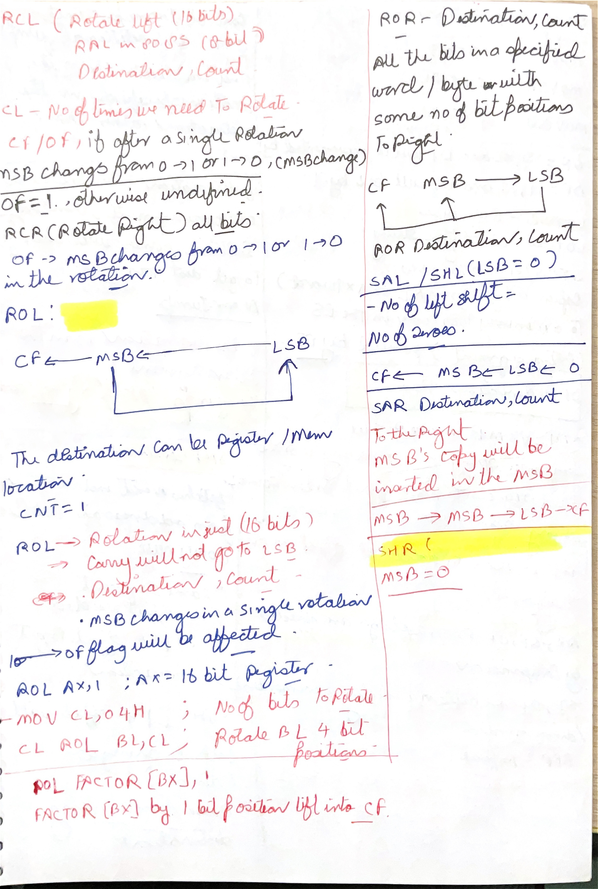</a>

Technical explanation: this page gives the core rotate/shift mental model. `RCL` and `RCR` rotate through carry, so the carry flag behaves like an extra bit attached to the operand. For `RCL`, the old `CF` enters the low bit and the old `MSB` goes to `CF`. For `RCR`, the old `CF` enters the high bit and the old `LSB` goes to `CF`. That is different from `ROL` and `ROR`, where the operand rotates internally and carry receives a copy of the bit that wrapped around.

The count rules matter. On original 8086 syntax, a rotate or shift count is either `1` or the value in `CL`. That is why examples such as `MOV CL,04H` followed by `ROL BL,CL` appear. The destination can be register or memory, but the instruction still operates on one byte or one word at that destination.

The shift instructions are not just rotates without wraparound. `SAL/SHL` shifts left, inserts zero into the low bit, and moves the old high bit into `CF`. `SAR` shifts right while preserving the sign bit, so it is suitable for signed divide-by-2 style movement. `SHR` shifts right and inserts zero into the high bit, so it is logical, not signed. For a one-bit operation, `OF` has defined meaning; for multi-bit counts, `OF` is not reliable.

### [scanned-2026-06-16-231727 p020](images/HandWrittenNotes/scanned-2026-06-16-231727/page-020.jpg)

<a href="images/HandWrittenNotes/scanned-2026-06-16-231727/page-020.jpg">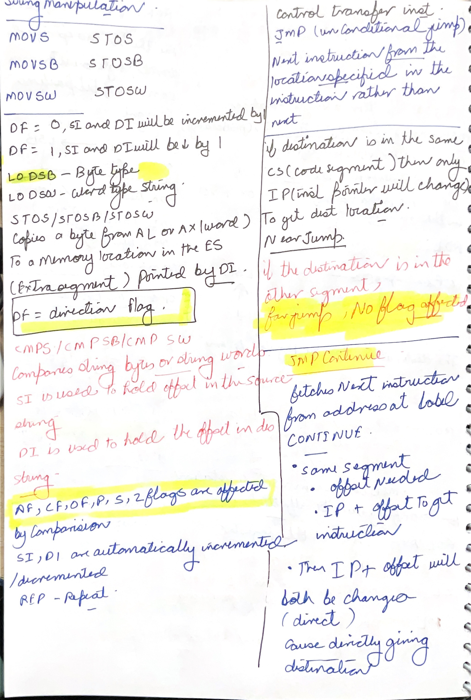</a>

Technical explanation: this page covers string manipulation and begins control transfer. `MOVS`, `MOVSB`, and `MOVSW` copy from `DS:SI` to `ES:DI`. `STOS`, `STOSB`, and `STOSW` store from `AL` or `AX` into `ES:DI`. `CMPS`, `CMPSB`, and `CMPSW` compare bytes or words at `DS:SI` and `ES:DI`. These instructions look short because their operands are implicit.

`DF` controls pointer movement. If `DF = 0`, `SI` and/or `DI` increment after the string operation. If `DF = 1`, they decrement. The step is 1 for byte operations and 2 for word operations. This is why `CLD` is common before forward string processing and `STD` is used only when backward movement is intended.

The jump section explains near direct jumps. A near jump stays in the current code segment, so only `IP` changes. Direct means the target displacement or offset is encoded in the instruction stream. `JMP CONTINUE` makes the next instruction come from the label `CONTINUE`, and queued instruction bytes from the old path are discarded.

### [scanned-2026-06-16-231727 p021](images/HandWrittenNotes/scanned-2026-06-16-231727/page-021.jpg)

<a href="images/HandWrittenNotes/scanned-2026-06-16-231727/page-021.jpg">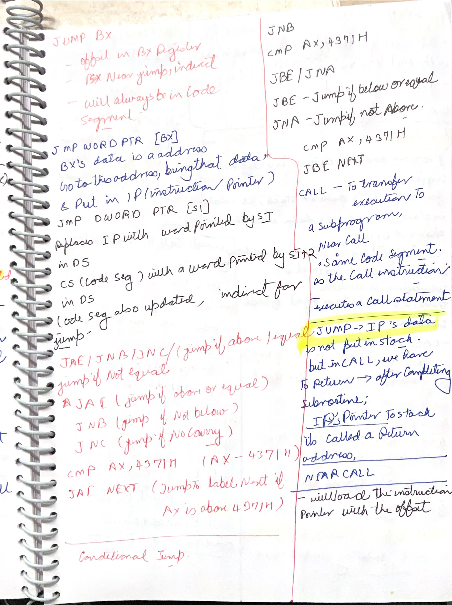</a>

Technical explanation: this page moves from direct jumps to indirect jumps and conditional jumps. `JMP BX` loads `IP` from `BX`, so it is near and register-indirect. `JMP WORD PTR [BX]` reads a word from memory at `DS:BX` and loads that word into `IP`. `JMP DWORD PTR [SI]` reads a far pointer from memory: offset and segment, so both `IP` and `CS` can change.

The conditional jump notes are unsigned comparisons. After `CMP AX,4371H`, the flags represent `AX - 4371H`. `JAE`, `JNB`, and `JNC` all mean the carry flag is clear, so unsigned `AX >= 4371H`. `JBE` and `JNA` mean unsigned below-or-equal, so they test `CF = 1` or `ZF = 1`. The jump instruction does not compare by itself; it only reads flags produced by the earlier `CMP`.

The `CALL` section explains why call is not the same as jump. A jump changes control flow without saving a return address. A call transfers control to a subroutine and saves the return address on the stack. Near call saves return `IP`; far call saves return `CS:IP`. This saved address is what allows `RET` to come back after the subroutine finishes.

### [scanned-2026-06-16-231727 p022](images/HandWrittenNotes/scanned-2026-06-16-231727/page-022.jpg)

<a href="images/HandWrittenNotes/scanned-2026-06-16-231727/page-022.jpg">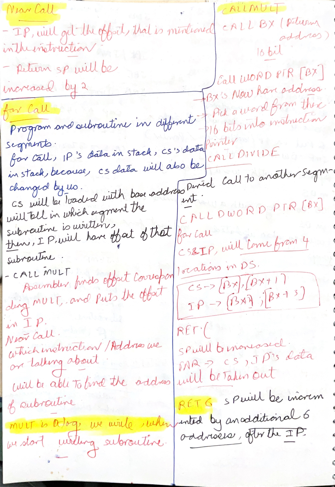</a>

Technical explanation: this page deepens near and far call behavior. A near call stays in the same code segment, so it pushes only the return offset and loads `IP` with the subroutine offset. A far call moves to another segment, so it pushes both return `CS` and return `IP`, then loads new `CS:IP`. The stack must preserve enough information to restore the exact caller location.

Indirect calls work the same way conceptually, but the destination address is read from a register or memory location. `CALL BX` uses the offset in `BX`. `CALL WORD PTR [BX]` reads a near target offset from memory. `CALL DWORD PTR [BX]` reads a far pointer from memory: offset and segment. Because 8086 is little-endian, the low byte of each word appears first in memory.

`RET` pops the saved return address. Near `RET` pops `IP`. Far `RET` pops `IP` and `CS`. `RET n` additionally increases `SP` by `n` after the return address is popped; that is used to remove stack parameters. This is why the note says the stack pointer is increased by an additional number of bytes.

### [scanned-2026-06-16-231727 p023](images/HandWrittenNotes/scanned-2026-06-16-231727/page-023.jpg)

<a href="images/HandWrittenNotes/scanned-2026-06-16-231727/page-023.jpg">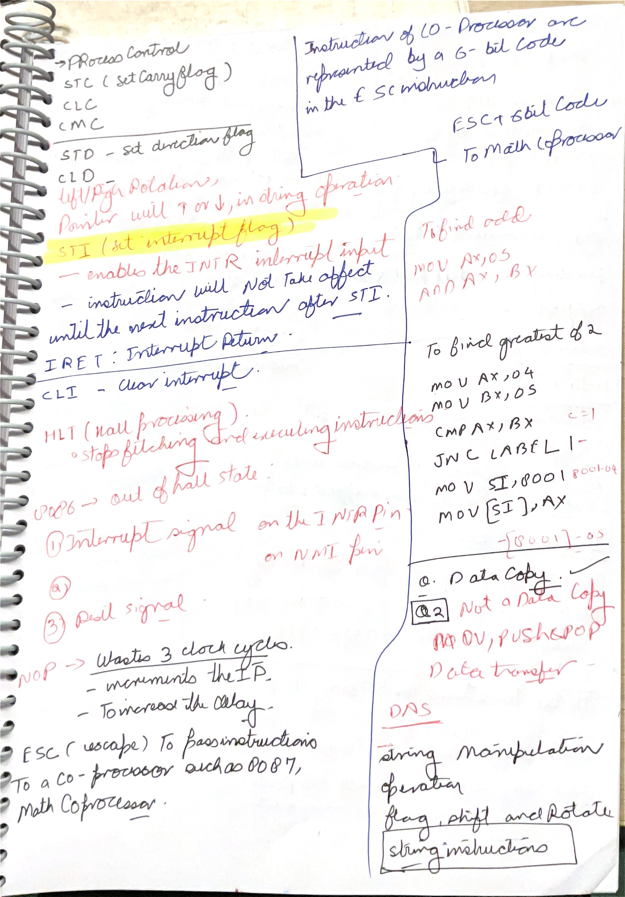</a>

Technical explanation: this page collects process-control instructions. `STC`, `CLC`, and `CMC` set, clear, and complement carry. `STD` and `CLD` set and clear the direction flag, changing string movement direction. `STI` sets the interrupt flag, enabling maskable interrupts through `INTR`; on 8086, recognition is delayed until after the next instruction. `CLI` clears the interrupt flag and disables maskable `INTR` recognition.

`HLT` stops instruction fetching/execution until an interrupt, reset, or similar external event resumes operation. `NOP` consumes time and advances `IP` without changing data state; it is useful for timing padding or reserving patch space. `ESC` passes an instruction escape code to a coprocessor such as 8087; the 8086 provides the bus/instruction mechanism while the coprocessor interprets the operation.

The right side has small program ideas. The "find greatest of two" pattern uses `CMP`, then a conditional jump based on flags. The data-copy question correctly rejects instructions that are not pure data-copy operations. For example, `DAS` is an adjust instruction, not a data-transfer instruction.

### [scanned-2026-06-16-231727 p024](images/HandWrittenNotes/scanned-2026-06-16-231727/page-024.jpg)

<a href="images/HandWrittenNotes/scanned-2026-06-16-231727/page-024.jpg">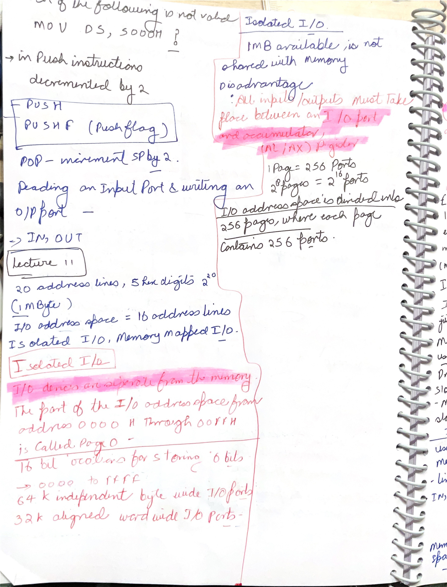</a>

Technical explanation: this page connects stack instructions with I/O organization. `PUSH` decrements `SP` by 2 and stores a word. `POPF` restores the flag register from the stack. That means the flag register can be saved and restored around code that might disturb condition codes or control flags.

The I/O part starts with `IN` and `OUT`. In isolated I/O, the processor uses a separate I/O address space, so I/O ports are not ordinary memory locations. Direct port forms encode an 8-bit port number, while variable port forms use `DX` for a 16-bit port number. Data still moves through `AL` for byte ports or `AX` for word ports.

The note describes I/O address space as `0000H-FFFFH`, divided into 256 pages of 256 ports. That is a useful way to remember 64K ports. The advantage of isolated I/O is that memory address space is not consumed by device registers and special `IN/OUT` instructions clearly identify I/O transfers. The disadvantage is that only accumulator-based I/O instructions are available, so normal memory instructions cannot operate directly on isolated ports.

### [scanned-2026-06-16-231851 p001](images/HandWrittenNotes/scanned-2026-06-16-231851/page-001.jpg)

<a href="images/HandWrittenNotes/scanned-2026-06-16-231851/page-001.jpg">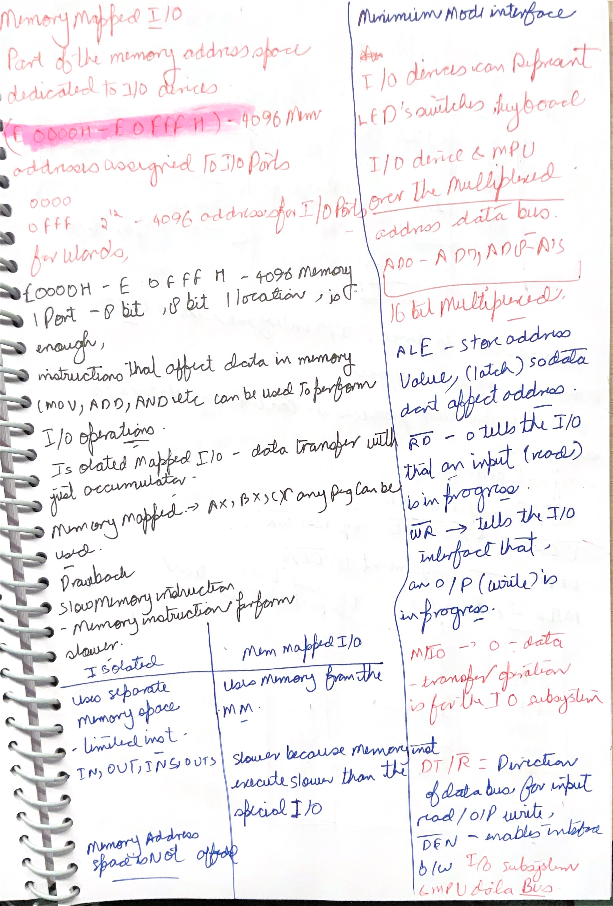</a>

Technical explanation: this page compares memory-mapped I/O and isolated I/O while beginning minimum-mode interface signals. In memory-mapped I/O, device registers occupy normal memory addresses. Therefore normal memory instructions such as `MOV`, `ADD`, or `AND` can operate on those device addresses. The drawback is that part of the memory address space is consumed by I/O devices, and memory-style bus timing may be slower or less specialized than isolated I/O.

In isolated I/O, I/O devices live in a separate port address space and are accessed by `IN` and `OUT`. The note says data transfer is usually through the accumulator, which means `AL` or `AX`. This separation keeps memory space free and makes I/O cycles explicit, but it limits the instruction forms.

The right side begins minimum-mode interface operation. `ALE` latches the address from multiplexed pins. `/RD` means a read operation is in progress. `/WR` means a write operation is in progress. `M/IO = 0` identifies I/O rather than memory for 8086 minimum mode. `DT/R` controls data direction through transceivers, and `DEN` enables the data bus interface.

### [scanned-2026-06-16-231851 p002](images/HandWrittenNotes/scanned-2026-06-16-231851/page-002.jpg)

<a href="images/HandWrittenNotes/scanned-2026-06-16-231851/page-002.jpg">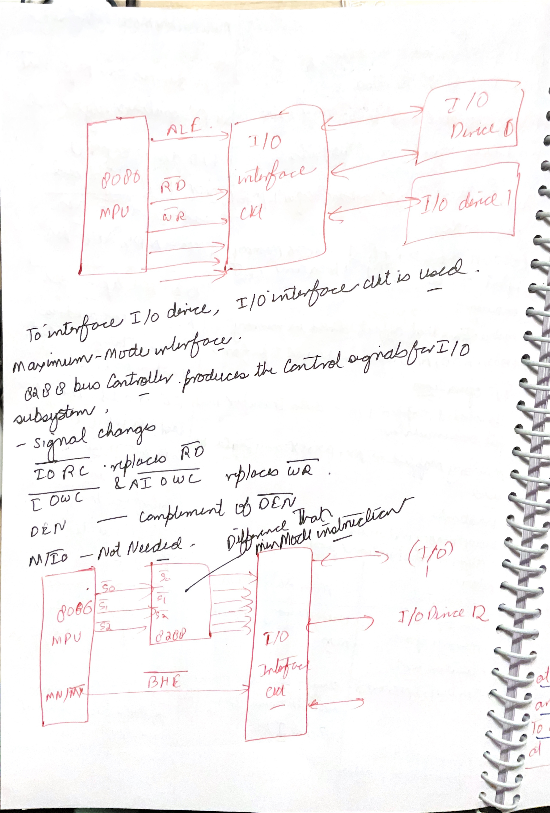</a>

Technical explanation: this page shows I/O interface circuits in minimum mode and maximum mode. In minimum mode, the 8086 directly supplies bus-control signals to the I/O interface circuit. The I/O interface then selects a device, buffers data, and converts raw bus timing into a device-friendly handshake.

In maximum mode, the 8288 bus controller sits between the processor status outputs and the external bus commands. The 8086 gives status lines, and the 8288 produces commands such as I/O read command and I/O write command. This is why the page notes signal changes: the max-mode system replaces the simple minimum-mode read/write outputs with bus-controller-generated commands.

The interface circuit is needed because a CPU bus is not the same as a peripheral connection. A peripheral may be slower, may need selection logic, may require buffering, and may not understand multiplexed address/data timing. The interface circuit protects timing and electrical correctness between processor and devices.

### [scanned-2026-06-16-231851 p003](images/HandWrittenNotes/scanned-2026-06-16-231851/page-003.jpg)

<a href="images/HandWrittenNotes/scanned-2026-06-16-231851/page-003.jpg">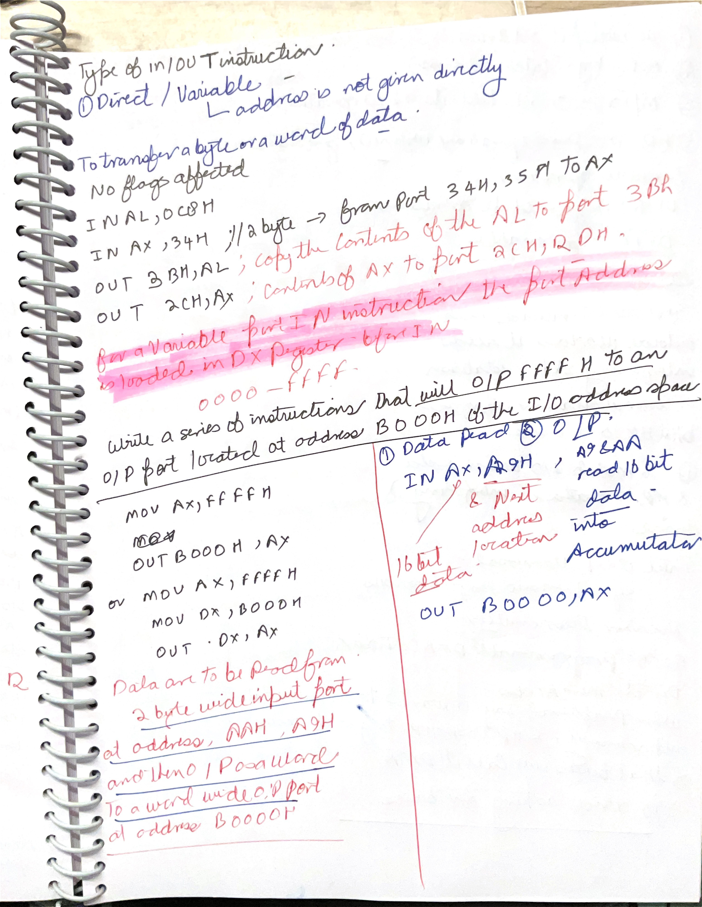</a>

Technical explanation: this page gives `IN` and `OUT` forms and examples. Direct I/O addressing places an 8-bit port number in the instruction, such as `IN AL,0C8H` or `OUT 3BH,AL`. Variable I/O addressing uses `DX`, so the port can range from `0000H` to `FFFFH`. The port address is not memory; it selects an I/O port in the isolated I/O address space.

For word I/O, `AX` is used and two adjacent byte ports are involved. For example, inputting a word from port `A9H` reads the low byte from `A9H` and the high byte from `AAH`. Outputting a word to port `B000H` should use `DX` because `B000H` cannot fit in the direct 8-bit port field:

```asm
MOV AX,0FFFFH
MOV DX,0B000H
OUT DX,AX
```

The handwritten page also shows the common `B0000H` confusion. A normal 8086 I/O port address is 16 bits, so valid port addresses are `0000H-FFFFH`. `B0000H` is five hex digits and is outside the normal isolated I/O port range; the intended address is almost certainly `B000H`.

### [scanned-2026-06-16-231851 p004](images/HandWrittenNotes/scanned-2026-06-16-231851/page-004.jpg)

<a href="images/HandWrittenNotes/scanned-2026-06-16-231851/page-004.jpg">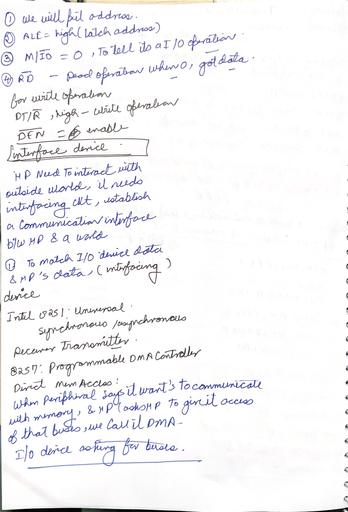</a>

Technical explanation: this page turns the I/O cycle into ordered steps. First, the processor places the port address on the multiplexed address/data bus. Then `ALE` goes high so external latch hardware can hold that address. Then `M/IO` identifies the cycle as I/O, and `/RD` or `/WR` tells the interface whether data is being read or written. For a write, `DT/R` selects CPU-to-device direction and `DEN` enables the bus transceiver. For a read, the device drives data back toward the CPU.

The "interface device" notes explain why specialized chips exist. The CPU should not directly manage every peripheral's electrical timing and data format. An interface chip matches CPU bus signals to peripheral requirements, handles selection, buffers data, and may convert serial/parallel formats or manage block transfers.

The page lists 8251 and 8257. The 8251 USART handles serial communication by converting parallel CPU data to serial data for transmission and serial data back to parallel data on reception. The 8257 DMA controller lets a peripheral request bus access so blocks can move between I/O and memory without the CPU executing an instruction for every byte.

### [scanned-2026-06-16-231851 p005](images/HandWrittenNotes/scanned-2026-06-16-231851/page-005.jpg)

<a href="images/HandWrittenNotes/scanned-2026-06-16-231851/page-005.jpg">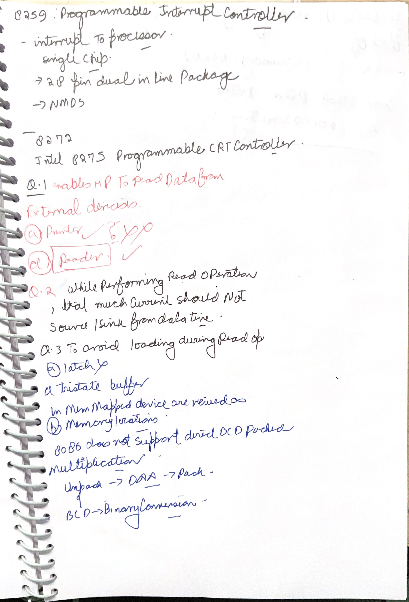</a>

Technical explanation: this page collects support chips and MCQ corrections. The 8259 is a programmable interrupt controller: it accepts multiple interrupt requests, prioritizes them, masks them if programmed, and presents a controlled interrupt request to the processor. The 8275 is a programmable CRT controller for display timing/interface work. The 8279 is a keyboard/display interface, separating keyboard scan/control from display drive work.

The input-device question asks what enables the microprocessor to read external data. In the option set, a joystick is the clear input device, while printer and display are output devices. A reader may sound input-related in general English, but the expected input-versus-output classification marks joystick as the best answer.

The read-current and loading questions are about bus electrical behavior. During a read, only the selected device should drive the data lines. Too much sourced or sunk current can disturb logic levels or damage/overload drivers. A tri-state buffer avoids loading because non-selected devices enter high impedance, electrically disconnecting themselves from the bus. The page also notes that memory-mapped devices are viewed as memory locations and that 8086 does not support direct packed-BCD multiplication as one instruction.

### [scanned-2026-06-16-231851 p006](images/HandWrittenNotes/scanned-2026-06-16-231851/page-006.jpg)

<a href="images/HandWrittenNotes/scanned-2026-06-16-231851/page-006.jpg">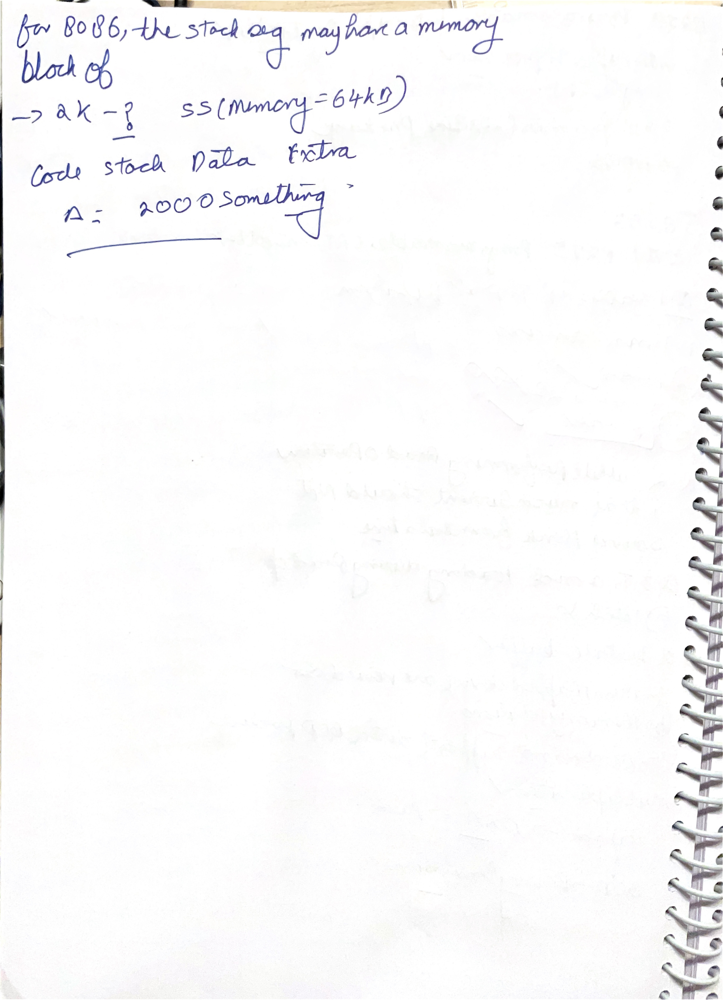</a>

Technical explanation: this page is a short stack-segment recap. In 8086, a segment register gives the segment base and a 16-bit offset selects a byte inside that segment. Since the offset range is `0000H` through `FFFFH`, one segment can cover `2^16 = 65536` bytes, which is 64 KB.

For the stack, `SS` gives the stack segment base and `SP` or `BP` gives the offset. So the maximum stack segment block is 64 KB, assuming the whole segment is available for stack use. The physical address is still formed as `SS x 10H + offset`; the 64 KB limit comes from the 16-bit offset range, not from the 20-bit physical address bus.

## Page-By-Page Explanation

### Page 1: RCL Operation

<a href="images/Day%2013/Screenshot%202026-06-16%20150814.png"></a>

`RCL destination,count` rotates left through the carry flag. This is not only a circular movement inside the operand. The old most significant bit moves into `CF`, and the old `CF` moves into the least significant bit.

Think of `CF` as an extra bit attached to the operand. For an 8-bit operand, `RCL` rotates through a 9-bit ring. For a 16-bit operand, it rotates through a 17-bit ring. This is why the incoming carry value matters before the instruction executes.

### Page 2: RCL Count And Flags

<a href="images/Day%2013/Screenshot%202026-06-16%20151006.png"></a>

The destination for `RCL` can be a register or memory operand. A one-bit rotate can be written with count `1`. For more than one bit, the count is loaded into `CL` and the instruction uses `RCL destination,CL`.

`RCL` affects `CF` and `OF`. For a one-bit rotate, `OF` has defined signed-overflow meaning based on the changed top bits. For multi-bit rotates, `OF` is undefined. `CF` always contains the most recently rotated-out bit.

### Page 3: RCL Clear Continuation

<a href="images/Day%2013/Screenshot%202026-06-16%20151018.png"></a>

This page repeats the `RCL` rules in a clearer view. The main point is that only `1` and `CL` are valid count forms for the original 8086 syntax.

Do not write a literal count such as `RCL AX,4` for original 8086 style. Load the count first:

```asm
MOV CL,04H
RCL AX,CL
```

### Page 4: ROL Operation

<a href="images/Day%2013/Screenshot%202026-06-16%20151920.png"></a>

`ROL destination,count` rotates left inside the operand. The old most significant bit moves into the least significant bit, and a copy of that outgoing bit is also placed into `CF`.

The difference from `RCL` is the incoming bit. `ROL` does not bring the old carry into the operand. `RCL` does. Therefore, `ROL` is a pure circular rotate of the operand, while `RCL` is a rotate through carry.

### Page 5: ROL Examples With Pointer

<a href="images/Day%2013/Screenshot%202026-06-16%20152435.png"></a>

The examples show the valid shapes of `ROL`. `ROL AX,1` rotates the word in `AX` left by one bit. `MOV CL,04H` followed by `ROL BL,CL` rotates the byte in `BL` left by four bit positions.

`ROL FACTOR[BX],1` rotates a memory operand at effective address `offset FACTOR + BX`. The operand size must be known to the assembler from the variable declaration or from an explicit `BYTE PTR` or `WORD PTR`.

### Page 6: ROL Examples Clear View

<a href="images/Day%2013/Screenshot%202026-06-16%20152443.png"></a>

This clearer page reinforces the same examples. The key trace rule is: every bit moves left, old `MSB` becomes new `LSB`, and `CF` receives a copy of the old `MSB`.

For multi-bit `ROL`, `CF` ends with the last bit rotated out of the most significant position. Earlier carry values from the same instruction are overwritten.

### Page 7: ROR Operation

<a href="images/Day%2013/Screenshot%202026-06-16%20152706.png"></a>

`ROR destination,count` rotates right inside the operand. The old least significant bit moves into the most significant bit, and a copy of that bit is placed into `CF`.

Again, this is circular rotate, not shift. No zero is inserted. No old carry is inserted. For multi-bit rotates, `CF` contains the last bit moved out of the least significant position.

### Page 8: SAL And SHL

<a href="images/Day%2013/Screenshot%202026-06-16%20153019.png"></a>

`SAL` and `SHL` are two names for the same operation on 8086. They shift all bits left, move the old most significant bit into `CF`, and insert `0` into the least significant bit.

This differs from `ROL` because the old `MSB` does not wrap around into `LSB`. For unsigned values, a left shift by one is like multiplying by 2 if no significant bit is lost. For signed values, `OF` after a one-bit shift is important because the sign may have changed incorrectly.

### Page 9: SAR

<a href="images/Day%2013/Screenshot%202026-06-16%20153217.png"></a>

`SAR destination,count` shifts right arithmetically. The least significant bit moves into `CF`, and the old most significant bit is copied back into the most significant position.

That copied sign bit is the whole purpose of `SAR`. It preserves the sign of signed two's-complement numbers while shifting right. For signed numbers, `SAR` is the shift form related to division by powers of two, while `SHR` would insert zero and is mainly for unsigned values.

### Page 10: MOVS String Instructions

<a href="images/Day%2013/Screenshot%202026-06-16%20153317.png"></a>

`MOVS`, `MOVSB`, and `MOVSW` copy a byte or word from a source string to a destination string. The source offset is in `SI` and normally uses `DS`; the destination offset is in `DI` and uses `ES`.

`MOVSB` moves one byte. `MOVSW` moves one word. When repeated with a repeat prefix, `CX` provides the count of elements to move. The instruction itself does not affect flags.

### Page 11: MOVS Direction Flag Behavior

<a href="images/Day%2013/Screenshot%202026-06-16%20153457.png"></a>

After each string move, `SI` and `DI` are automatically adjusted. If `DF = 0`, they increment: by 1 after a byte move and by 2 after a word move.

If `DF = 1`, they decrement by the same amount. This is why `CLD` is usually placed before forward string processing, and `STD` is used only when the string must be processed backward.

### Page 12: CMPS String Instructions

<a href="images/Day%2013/Screenshot%202026-06-16%20154003.png"></a>

`CMPS`, `CMPSB`, and `CMPSW` compare a byte or word from one string with a byte or word from another string. The source element is at `DS:SI`; the destination element is at `ES:DI`.

The comparison is performed like subtraction for flags, but the operands are not overwritten. `AF`, `CF`, `OF`, `PF`, `SF`, and `ZF` are affected. After the comparison, `SI` and `DI` are adjusted according to `DF`.

### Page 13: CMPS Continuation

<a href="images/Day%2013/Screenshot%202026-06-16%20154345.png"></a>

This page highlights direction and segment rules. If `DF` is set, `SI` and `DI` move backward. If `DF` is reset, they move forward. The size of the movement is 1 for byte strings and 2 for word strings.

`CMPS` can be combined with `REPE` or `REPNE` to compare multiple elements. `REPE CMPSB` keeps comparing while elements are equal, while `REPNE CMPSB` keeps comparing while they are not equal.

### Page 14: JMP Introduction

<a href="images/Day%2013/Screenshot%202026-06-16%20154506.png"></a>

`JMP` is an unconditional control-transfer instruction. It fetches the next instruction from the target location instead of from the next sequential address.

If the target is in the same segment, only `IP` changes; this is a near jump. If the target is in another segment, both `CS` and `IP` change; this is a far jump. This near/far distinction controls how much address information the instruction must supply.

### Page 15: Direct JMP Example

<a href="images/Day%2013/Screenshot%202026-06-16%20155546.png"></a>

`JMP CONTINUE` is a direct jump because the destination label is encoded by the assembler as part of the instruction. For a near jump, the encoded displacement changes `IP` so execution continues at the label.

For a far direct jump, the instruction includes both a new offset and a new segment value. In that case, the processor replaces both `IP` and `CS`.

### Page 16: Indirect Near JMP Through Register

<a href="images/Day%2013/Screenshot%202026-06-16%20155645.png"></a>

`JMP BX` is an indirect near jump. The new value of `IP` comes from `BX`, and `CS` remains unchanged.

This is indirect because the target address is not written as a label or immediate displacement in the instruction. The target is contained in a register at run time.

### Page 17: Indirect Memory JMP

<a href="images/Day%2013/Screenshot%202026-06-16%20155735.png"></a>

`JMP WORD PTR [BX]` is an indirect near jump through memory. The word stored at `DS:BX` is loaded into `IP`, and `CS` stays the same.

`JMP DWORD PTR [SI]` is an indirect far jump. The memory doubleword supplies both the new offset and the new segment. The first word becomes `IP`; the next word becomes `CS`.

### Page 18: JAE, JNB, And JNC

<a href="images/Day%2013/Screenshot%202026-06-16%20160110.png"></a>

`JAE`, `JNB`, and `JNC` are aliases based on the same flag test: jump if `CF = 0`. After `CMP AX,4371H`, this means unsigned `AX` is above or equal to `4371H`.

These are unsigned-condition jumps. Do not use them for signed greater-than or less-than logic; signed comparisons require jumps such as `JGE` or `JL`.

### Page 19: JNB Example Continuation

<a href="images/Day%2013/Screenshot%202026-06-16%20160429.png"></a>

This continuation shows the fall-through path after a comparison. If `CF = 0`, `JNB NEXT` transfers control to `NEXT`. If `CF = 1`, the jump is not taken and the next instruction, such as `ADD AL,BL`, executes.

The key habit is to read the conditional jump as a test of existing flags. The jump does not perform the comparison; the previous `CMP` or arithmetic instruction created the flag state.

### Page 20: JB, JC, And JNAE

<a href="images/Day%2013/Screenshot%202026-06-16%20160555.png"></a>

`JB`, `JC`, and `JNAE` all jump when `CF = 1`. After an unsigned `CMP`, this means the destination operand was below the source operand.

For example, after `CMP AX,4371H`, `JB NEXT` jumps if unsigned `AX < 4371H`. If `CF = 0`, the jump has no effect and execution continues with the next instruction.

### Page 21: JBE And JNA

<a href="images/Day%2013/Screenshot%202026-06-16%20162819.png"></a>

`JBE` and `JNA` jump when unsigned `destination <= source` after a comparison. The flag condition is:

```text
CF = 1 or ZF = 1
```

`CF = 1` covers below; `ZF = 1` covers equal. If both `CF` and `ZF` are zero, the destination is unsigned above the source, so `JBE` is not taken.

### Page 22: CALL Introduction

<a href="images/Day%2013/Screenshot%202026-06-16%20163148.png"></a>

`CALL` transfers control to a procedure and saves a return address on the stack. A near call is within the same code segment, so it saves only the offset of the next instruction and then loads a new `IP`.

A far call transfers to another segment. It must save enough information to return across segments, so it saves both the return offset and return segment, then loads a new `CS:IP`.

### Page 23: Far CALL Continuation

<a href="images/Day%2013/Screenshot%202026-06-16%20164419.png"></a>

This page explains the far call path. The processor loads `CS` with the segment base of the target procedure and loads `IP` with the offset of the first instruction in that target segment.

At the end of a far procedure, a far return restores both saved values from the stack. That is why far calls and far returns change the stack by more bytes than near calls and near returns.

### Page 24: CALL MULT And CALL BX

<a href="images/Day%2013/Screenshot%202026-06-16%20164504.png"></a>

`CALL MULT` is a direct near call. The assembler computes the displacement to the procedure named `MULT` and encodes it in the instruction.

`CALL BX` is an indirect near call. `BX` already contains the offset of the procedure's first instruction. The processor pushes the return offset and replaces `IP` with the value in `BX`.

### Page 25: CALL Near Examples Clear View

<a href="images/Day%2013/Screenshot%202026-06-16%20171134.png"></a>

This page repeats the direct and register-indirect near call examples in a clearer view. In both cases, `CS` remains the same because the procedure is in the same segment.

The return address is always the address of the instruction after the call. The called procedure does not need to know who called it; it only needs `RET` to pop the saved address.

### Page 26: CALL Memory And Far Procedure

<a href="images/Day%2013/Screenshot%202026-06-16%20171341.png"></a>

`CALL WORD PTR [BX]` is an indirect near call. The word at `DS:BX` supplies the new `IP`. The procedure is still inside the current `CS`.

`CALL DIVIDE` is shown as a far procedure call when `DIVIDE` is declared in another segment, such as with `PROC FAR`. A far call changes both `CS` and `IP`, and the matching return must restore both.

### Page 27: RET Introduction

<a href="images/Day%2013/Screenshot%202026-06-16%20172029.png"></a>

`RET` returns execution from a procedure to the instruction after the call that invoked it. For a near procedure, `RET` pops one word from the stack into `IP`.

This works because `CALL` pushed the return offset before jumping to the procedure. `RET` does not affect flags; it is a control-transfer and stack operation.

### Page 28: RET Far And RET Immediate

<a href="images/Day%2013/Screenshot%202026-06-16%20172252.png"></a>

For a far return, the processor pops the return offset into `IP` and then pops the return segment into `CS`. This restores the caller's full `CS:IP`.

`RET n` additionally increments `SP` by `n` after popping the return address. This is used to remove parameters that were passed on the stack. For example, `RET 6` clears six parameter bytes after the return address is restored.

### Page 29: STC, CLC, And CMC

<a href="images/Day%2013/Screenshot%202026-06-16%20172453.png"></a>

These process-control instructions modify only the carry flag. `STC` sets `CF = 1`, `CLC` clears `CF = 0`, and `CMC` complements the current carry flag.

They are often used before rotate-through-carry or multi-precision arithmetic. Since they do not affect other flags, other status flags keep their previous values.

### Page 30: STD And CLD

<a href="images/Day%2013/Screenshot%202026-06-16%20172522.png"></a>

`STD` sets the direction flag, making string instructions process backward by decrementing `SI` and `DI`. `CLD` clears the direction flag, making string instructions process forward by incrementing `SI` and `DI`.

These instructions do not affect other flags. Since string instructions depend heavily on `DF`, it is good practice to execute `CLD` before forward string operations instead of assuming the flag already has the desired value.

### Page 31: CLI And HLT

<a href="images/Day%2013/Screenshot%202026-06-16%20172934.png"></a>

`CLI` clears the interrupt flag, `IF = 0`. When `IF` is clear, maskable interrupts through `INTR` are disabled. Non-maskable interrupts are not controlled by `IF`.

`HLT` stops instruction fetching and execution until an interrupt or reset condition resumes control. In 8086, the processor enters a halt state; it does not mean program memory is erased or the machine is powered off.

### Page 32: NOP

<a href="images/Day%2013/Screenshot%202026-06-16%20173233.png"></a>

`NOP` performs no data operation. It consumes time and advances the instruction pointer to the next instruction.

It is used for small delays, alignment, patch space, and placeholder code. Since it changes no register or memory value and affects no flags, it is safe when the goal is only to spend cycles or reserve space.

### Page 33: ESC

<a href="images/Day%2013/Screenshot%202026-06-16%20173256.png"></a>

`ESC` is used to pass instructions to a coprocessor such as the 8087 math coprocessor. The 8086 fetches the instruction bytes, and the coprocessor observes the bus and interprets the coprocessor-specific operation.

In many cases, the 8086 itself treats `ESC` as having no ordinary CPU-side effect except possible memory operand access. The useful operation is performed by the coprocessor.

### Page 34: Addition And Subtraction Programs

<a href="images/Day%2013/Screenshot%202026-06-16%20173621.png"></a>

The addition program loads a value into `AX`, adds `BX`, stores the result at memory offset `8000H` through `SI`, and stops with `INT 03`. The subtraction program follows the same storage pattern but uses `SUB AX,BX`.

The screenshots are demonstration code, so `BX` must be assumed to contain the second operand before `ADD` or `SUB`, unless the full program initializes it elsewhere. The important idea is the result path: arithmetic result in `AX`, memory pointer in `SI`, then `MOV [SI],AX`.

### Page 35: Multiplication And Division Programs

<a href="images/Day%2013/Screenshot%202026-06-16%20173807.png"></a>

The multiplication program loads `AX = 0005H`, `BX = 0003H`, then executes `MUL BX`. Because `BX` is a word operand, the unsigned product is placed in `DX:AX`. For this small product, `AX` contains the low word result, and it is stored at `[SI]`.

The division program uses `DIV BX`. For word division, the dividend is `DX:AX`, quotient goes to `AX`, and remainder goes to `DX`. In a complete robust program, `DX` should be cleared before unsigned division when the dividend is meant to be only `AX`, for example `XOR DX,DX`.

### Page 36: Greatest Of Two And Average Of Numbers

<a href="images/Day%2013/Screenshot%202026-06-16%20173829.png"></a>

The greatest-of-two program compares `AX` and `BX` using `CMP AX,BX`. `JNC LABEL1` means jump if no carry, which after an unsigned compare means `AX >= BX`. The program then stores one of the two values through `SI`.

The average program initializes `AX = 0000H`, points `SI` to the source list at `8000H`, points `DI` to result address `8020H`, and uses `CX = 5` as the count. It adds each word from `[SI]`, advances `SI` by two bytes for the next word, loops with `LOOP`, divides by `CX`, and stores the result at `[DI]`. A careful version should preserve the divisor count before `LOOP` reduces `CX` to zero.

### Page 37: Greatest And Average Clear View

<a href="images/Day%2013/Screenshot%202026-06-16%20173844.png"></a>

This page gives a clearer view of the same two routines. The maximum routine is an unsigned comparison routine because it uses carry-based logic (`JNC`).

In the average routine, two `INC SI` instructions are used because each word is two bytes. That is the same reason `MOVSW` changes `SI` by two in string operations.

### Page 38: Greatest And Average Repeated View

<a href="images/Day%2013/Screenshot%202026-06-16%20173857.png"></a>

This repeated view reinforces two separate ideas: flag-based branching and counted looping. `CMP` creates flags; `JNC` reads the carry flag. `LOOP` decrements `CX` and jumps while `CX` is not zero.

When writing the average program yourself, keep the element count in a separate register or memory location before `LOOP` destroys `CX`, then use that saved count as the divisor.

### Page 39: Sum And Factorial Programs

<a href="images/Day%2013/Screenshot%202026-06-16%20174255.png"></a>

The sum program reads the count from `[SI]`, clears `AX`, uses `BX` as the running index/value, repeatedly increments `BX`, adds it to `AX`, compares `BX` with `CX`, and loops until the count is reached. The result is stored through `DI`.

The factorial program loads the number into `BX`, starts `AX = 0001H`, repeatedly multiplies by `BX`, decrements `BX`, and loops until `BX` becomes zero. Since `MUL BX` produces `DX:AX`, large factorials can overflow `AX`; this demo stores only the low word in `AX`.

### Page 40: Data Transfer Quiz

<a href="images/Day%2013/Screenshot%202026-06-16%20174625.png"></a>

The question asks which instruction is not a data copy or transfer instruction. `MOV`, `PUSH`, and `POP` all move data between registers, memory, and stack.

`DAS` is different. It is Decimal Adjust after Subtraction, an arithmetic-adjust instruction for packed BCD subtraction results in `AL`. So `DAS` is not a data-transfer instruction.

### Page 41: I/O Address Space

<a href="images/Day%2013/Screenshot%202026-06-16%20210529.png"></a>

The 8086 has an isolated I/O address space of 65,536 byte addresses, from `0000H` to `FFFFH`. Each I/O address is called a port.

I/O can be organized in two main ways. In isolated I/O, port addresses are separate from memory addresses and are accessed by special I/O instructions such as `IN` and `OUT`. In memory-mapped I/O, device registers occupy addresses in the normal memory address space.

### Page 42: Advantages Of Isolated I/O

<a href="images/Day%2013/Screenshot%202026-06-16%20211643.png"></a>

The first advantage is that the full memory address space remains available for memory, because I/O ports live in a separate address space.

The second advantage is clarity and instruction specialization. `IN` and `OUT` are specifically designed for I/O transfers, so the program makes a clear distinction between memory access and device access.

### Page 43: Isolated I/O Port Diagram

<a href="images/Day%2013/Screenshot%202026-06-16%20212537.png"></a>

The diagram shows isolated I/O port numbering from `0000H` through `FFFFH`. That is 64K port addresses.

The note about pages is a way to group the 16-bit port space: 256 ports per 8-bit page and 256 such pages. Immediate I/O instructions can directly encode only an 8-bit port number, while the `DX` form can address the full 16-bit port range.

### Page 44: Memory-Mapped I/O Advantages And Disadvantage

<a href="images/Day%2013/Screenshot%202026-06-16%20214257.png"></a>

In memory-mapped I/O, device registers are treated as memory locations. This means normal memory instructions such as `MOV`, `ADD`, `AND`, `XCHG`, and `SUB` can operate on I/O locations.

The advantage is flexibility: many instructions and registers can be used. The disadvantage is that part of the memory address space is consumed by device registers, and memory-style accesses may be slower than special I/O instructions in isolated I/O systems.

### Page 45: Isolated Versus Memory-Mapped I/O

<a href="images/Day%2013/Screenshot%202026-06-16%20220122.png"></a>

This comparison table summarizes the two approaches. Isolated I/O uses a separate I/O address space; memory-mapped I/O uses part of the normal memory address space.

Isolated I/O uses limited, special instructions such as `IN`, `OUT`, `INS`, and `OUTS`. Memory-mapped I/O can use normal memory-reference instructions. Isolated I/O preserves memory space and can be faster for I/O-specific transfers, while memory-mapped I/O offers richer instruction choices but reduces available memory address space.

### Page 46: Minimum Mode Interface

<a href="images/Day%2013/Screenshot%202026-06-16%20220810.png"></a>

This page moves from the software view of I/O into the hardware interface view. In minimum mode, the 8086 itself provides the bus-control signals needed by the interface circuitry. The structure is similar to memory interfacing because the processor still places address information on the bus, activates read/write control, and transfers data over the data bus.

The I/O devices can be LEDs, switches, keyboards, serial ports, printer ports, or other peripherals. Data moves between the MPU and these devices through an I/O interface circuit. Because `AD0-AD7` are multiplexed address/data lines, address information must be latched before the same lines are reused for data.

### Page 47: Minimum Mode I/O Signals

<a href="images/Day%2013/Screenshot%202026-06-16%20221331.png"></a>

This page names the main minimum-mode signals. `ALE` pulses high to tell external latch circuitry to capture the address. Active-low `RD` tells the interface an input read is in progress, and active-low `WR` tells it an output write is in progress.

`M/IO` distinguishes memory transfers from I/O transfers; in this slide, logic 0 marks an I/O operation. `DT/R` sets the data-bus direction for read or write, and `DEN` enables the external data-bus interface. These signals let the interface know when to latch an address, when to drive data, and when to receive data.

### Page 48: Minimum Mode I/O Interface Diagram

<a href="images/Day%2013/Screenshot%202026-06-16%20221703.png"></a>

The diagram shows the 8086 MPU connected to an I/O interface circuit. Address/data lines, `ALE`, `RD`, `WR`, `M/IO`, `DT/R`, `DEN`, and `BHE` reach the interface, and the interface connects to multiple I/O devices.

The `MN/MX` pin is tied for minimum mode, so the 8086 directly generates the bus-control signals. The I/O interface decodes the address, uses the control signals to determine read or write direction, and selects the correct I/O device.

### Page 49: Maximum Mode Interface

<a href="images/Day%2013/Screenshot%202026-06-16%20222147.png"></a>

In maximum mode, the 8086 does not directly provide all the same control signals. An 8288 bus controller produces the bus-control signals for the I/O subsystem.

The slide lists the signal changes: `IORC` replaces `RD` for I/O read control, `IOWC` and `AIOWC` replace `WR` for I/O write control, `DEN` polarity/meaning is handled through the bus-controller interface, and `M/IO` is no longer needed in the same direct form because the bus controller creates separate I/O read/write controls.

### Page 50: IN And OUT Instruction Forms

<a href="images/Day%2013/Screenshot%202026-06-16%20222823.png"></a>

This page returns to the software instruction view. `IN` and `OUT` have direct I/O forms and variable I/O forms. The direct form encodes an 8-bit port number in the instruction. The variable form uses `DX`, so it can access the full 16-bit I/O port range.

All basic `IN` and `OUT` data transfers use the accumulator. A byte transfer uses `AL`; a word transfer uses `AX`. So the device communicates with the MPU through `AL` or `AX`, while the port number is either immediate or supplied through `DX`.

### Page 51: IN And OUT Instruction Introduction Clear View

<a href="images/Day%2013/Screenshot%202026-06-16%20222948.png"></a>

This page is the same `IN`/`OUT` introduction without the bottom table visible. It emphasizes the two instruction classes: direct I/O and variable I/O.

Direct I/O puts the port number in the instruction. Variable I/O takes the port number from `DX`. Either form can transfer a byte or a word, but the data endpoint inside the processor is still the accumulator: `AL` for byte data and `AX` for word data.

### Page 52: IN And OUT Operation Table

<a href="images/Day%2013/Screenshot%202026-06-16%20223017.png"></a>

The table summarizes the exact formats. Input direct is `IN Acc, Port`, meaning accumulator receives data from the selected port. Input variable is `IN Acc, DX`, meaning the port address is in `DX`.

For output, direct form is `OUT Port, Acc`, and variable form is `OUT DX, Acc`. In both cases, the port receives data from the accumulator. `IN` and `OUT` do not affect flags, so any later conditional jump must depend on flags set by earlier instructions, not by the I/O transfer itself.

### Page 53: IN And OUT Examples

<a href="images/Day%2013/Screenshot%202026-06-16%20223136.png"></a>

The examples show byte and word I/O. `IN AL,0C8H` reads one byte from port `0C8H` into `AL`. `OUT 3BH,AL` writes the byte in `AL` to port `3BH`.

For word transfers, the 8086 uses two adjacent byte ports. `IN AX,34H` reads a word through ports `34H` and `35H`, and `OUT 2CH,AX` writes a word through ports `2CH` and `2DH`. For variable-port I/O, load the 16-bit port address into `DX` before executing `IN` or `OUT`.

### Page 54: IN And OUT Examples Clear View

<a href="images/Day%2013/Screenshot%202026-06-16%20223211.png"></a>

This page repeats the same examples with the full variable-port note visible. The key range is:

```text
DX can hold 0000H through FFFFH
```

That is why `DX` is required for ports outside the direct 8-bit immediate range. The accumulator remains the data register: `AL` for byte I/O and `AX` for word I/O.

### Page 55: Output Word To 16-Bit Port Example

<a href="images/Day%2013/Screenshot%202026-06-16%20223629.png"></a>

The task is to output `FFFFH` to I/O port address `B000H`. Since `B000H` is a 16-bit port address, the direct immediate form is not enough; original 8086 direct `OUT` encodes only an 8-bit port number.

The correct variable-port sequence is:

```asm
MOV AX,0FFFFH
MOV DX,0B000H
OUT DX,AX
```

`AX` holds the word data, and `DX` holds the 16-bit port address. The word output uses port `B000H` for the low byte and the next port for the high byte.

### Page 56: Read Two Byte Ports And Output A Word

<a href="images/Day%2013/Screenshot%202026-06-16%20224012.png"></a>

The input side uses two adjacent byte-wide ports, `A9H` and `AAH`, as one word input. `IN AX,A9H` reads a word into `AX`, with the low byte from port `A9H` and the high byte from port `AAH`.

For the output side, the same 16-bit port-address rule applies. If the intended output port is `B000H`, use:

```asm
IN  AX,0A9H
MOV DX,0B000H
OUT DX,AX
```

If the written address is truly `B0000H`, it is outside the 8086 I/O address range of `0000H` to `FFFFH`, so it cannot be addressed as a normal 8086 I/O port. In that case the question likely has a typographical extra zero.

### Page 57: 8086 Input Bus Cycle

<a href="images/Day%2013/Screenshot%202026-06-16%20224441.png"></a>

This timing diagram shows one 8086 I/O read bus cycle. During `T1`, the processor outputs address information on the multiplexed address/data lines, and `ALE` pulses so external latch circuitry can capture that address before the bus is reused for data.

During the middle of the cycle, `M/IO` identifies the transfer as I/O, active-low `RD` indicates a read operation, and `DEN` enables the data bus interface. The input device then drives data onto the data bus during the data phase, so the processor can sample it before the bus cycle ends.

### Page 58: 8086 Output Bus Cycle

<a href="images/Day%2013/Screenshot%202026-06-16%20224743.png"></a>

This page is labelled as an output bus cycle. The main timing idea is the same first step: during `T1`, the processor outputs the I/O address and pulses `ALE` so the address can be latched before the multiplexed bus is reused.

For a true I/O write cycle, the processor should drive data onto the data bus and the active-low `WR` signal should indicate the write operation. The visible screenshot still shows read-style labels such as `RD` and `DATA IN`, so treat it as a timing-shape reminder but remember the correction: input uses `RD` and device-to-CPU data flow; output uses `WR` and CPU-to-device data flow.

### Page 59: Interfacing Devices

<a href="images/Day%2013/Screenshot%202026-06-16%20224953.png"></a>

This page explains why interface devices are needed. A microprocessor communicates with the outside world through peripherals or I/O devices, but those devices may not produce or accept data in the exact electrical, timing, or format style the processor bus expects.

An input interface converts peripheral data into a processor-compatible format. An output interface converts processor data into the format required by the peripheral. Interface circuits simplify system design by handling selection, timing, buffering, and format conversion between the CPU bus and external devices.

### Page 60: Intel 8251 USART

<a href="images/Day%2013/Screenshot%202026-06-16%20225324.png"></a>

The Intel 8251 is a programmable communication interface, also called a USART: universal synchronous/asynchronous receiver/transmitter. It is compatible with 8085, 8086, and 8088 systems.

Its job is serial communication. On transmission, it accepts parallel data from the microprocessor and converts it into serial data. On reception, it accepts serial data, converts it into parallel format, and provides that parallel data to the CPU.

### Page 61: Intel 8257 DMA Controller

<a href="images/Day%2013/Screenshot%202026-06-16%20225828.png"></a>

The Intel 8257 is a programmable DMA controller. DMA means direct memory access: data can move between memory and an I/O device without the CPU executing one instruction for every byte.

The diagram shows four DMA channels, each with address and count registers. `DRQ0-DRQ3` are DMA request inputs from devices, and `DACK0-DACK3` acknowledge the selected device. The controller also has bus-control signals such as `HRQ` and `HLDA` to request and receive bus ownership from the processor, plus memory and I/O read/write controls for the actual transfer.

### Page 62: 8257 DMA Controller Summary

<a href="images/Day%2013/Screenshot%202026-06-16%20230006.png"></a>

This page explains where DMA is preferred. DMA is useful when a fast I/O device needs to transfer a block of data to memory, or memory needs to transfer a block of data to a fast I/O device. If the CPU handled every byte using normal instructions, it would waste time on repeated input/output and memory-transfer operations.

In a DMA transfer, the device and memory exchange data directly under control of the DMA controller. The 8257 has four channels, so four I/O devices can be connected. Each channel has a 16-bit address register and a 16-bit byte-count register. Before enabling a channel, the program initializes these registers so the DMA controller knows the starting memory address and how many bytes to transfer.

The listed operations are read, write, and verify. In DMA read/write, data is transferred between memory and an I/O device. In verify, the controller can perform the address/count sequencing without actual data movement, which is useful for checking or timing certain operations.

### Page 63: 8259 Interrupt Controller Introduction

<a href="images/Day%2013/Screenshot%202026-06-16%20230119.png"></a>

The 8259 is a programmable interrupt controller. It is used when several I/O devices need to interrupt the processor, especially when those interrupt requests must be organized through a limited number of processor interrupt inputs.

Instead of wiring many devices directly and handling priority externally, the 8259 accepts interrupt requests, decides which request should be served first, and then sends one interrupt request to the microprocessor. When the processor acknowledges the interrupt, the 8259 helps provide the correct interrupt information so the CPU can jump to the proper service routine.

The page notes that the 8259 is a single-chip controller, comes as a 28-pin dual in-line package, uses NMOS technology, and is compatible with 8085, 8086, and 8088 systems. The important exam idea is its role: it manages multiple interrupt sources in a programmable priority structure.

### Page 64: 8259 Internal Block Diagram

<a href="images/Day%2013/Screenshot%202026-06-16%20230216.png"></a>

The block diagram shows how the 8259 receives, prioritizes, masks, and services interrupt requests. `IR0` through `IR7` are interrupt request inputs from external devices. These requests first enter the interrupt request register, or `IRR`, which records pending interrupts.

The interrupt mask register, or `IMR`, decides which requests are allowed and which are temporarily blocked. A masked request is ignored until it is unmasked. After masking, the priority resolver selects the highest-priority pending request. When an interrupt is accepted for service, the in-service register, or `ISR`, records that the selected interrupt is currently being handled.

The control logic communicates with the processor using `INT` and active-low `INTA`. `INT` tells the CPU that an interrupt request exists, and `INTA` is the CPU's acknowledge signal. The data bus buffer connects the 8259 to `D0-D7`, while the read/write logic allows the CPU to initialize and read the 8259 through control words and status reads. The cascade buffer/comparator supports expanding the interrupt system by connecting multiple 8259 chips.

### Page 65: 8275 And 8279 Interface Devices

<a href="images/Day%2013/Screenshot%202026-06-16%20230334.png"></a>

This page lists two more programmable interface chips used with microprocessor systems. The Intel 8275 is a programmable CRT controller. Its role is to interface a CRT or raster-scan display with the microcomputer, so the CPU does not have to directly generate all display timing and control signals.

The Intel 8279 is a programmable keyboard/display interface. It has a keyboard section and a display section. The keyboard section handles keyboard interfacing, while the display section drives alphanumeric displays or indicator lights. The main idea is the same as the other interface chips: specialized hardware sits between the processor and a peripheral so the CPU can use programmed control instead of directly managing every signal detail.

### Page 66: Input Device Quiz

<a href="images/Day%2013/Screenshot%202026-06-16%20230517.png"></a>

This question asks which device enables the microprocessor to read data from external devices. In microprocessor terminology, reading external data means accepting input into the system.

Among the options, `joystick` is the clearest input device. A printer and display are output devices because the processor sends data to them. A reader can be an input-related device in general wording, but in this MCQ set the expected distinction is input versus output, so joystick is the best answer.

### Page 67: Read-Operation Current Quiz

<a href="images/Day%2013/Screenshot%202026-06-16%20230618.png"></a>

This question is about bus loading during a read operation. During a read, the selected external device drives the data bus and the processor samples that data. The data lines should not be forced to source or sink excessive current, because that can overload the bus driver, distort logic levels, or create contention if more than one device tries to drive the bus.

The marked answer is option `(c) sourced or sinked from data lines`. In better wording: during a read operation, care must be taken that excessive current is neither sourced from nor sunk into the data lines. Only the selected device should drive the bus, and all non-selected devices should remain electrically disconnected from the bus output path.

### Page 68: Read-Operation Loading Quiz

<a href="images/Day%2013/Screenshot%202026-06-16%20230708.png"></a>

This question asks which device is used to avoid loading during a read operation. The marked answer is `(d) tri-state buffer`.

A tri-state buffer has three output states: logic `0`, logic `1`, and high impedance. The high-impedance state is the important one here. When a peripheral is not selected, its tri-state buffer output is effectively disconnected from the data bus, so it does not load the bus or fight with another device. When the peripheral is selected for reading, the buffer is enabled and can safely drive the data lines.

### Page 69: Unsupported Operation Quiz

<a href="images/Day%2013/Screenshot%202026-06-16%20230746.png"></a>

This question asks what the 8086 does not support. The 8086 supports normal arithmetic operations, logical operations, and several decimal-adjust instructions used around BCD arithmetic.

The unsupported item here is `direct BCD packed multiplication`. The 8086 has binary multiply instructions such as `MUL` and `IMUL`, and it has BCD adjustment instructions for addition/subtraction style decimal correction, but it does not provide a single direct instruction for multiplying packed BCD operands. Such a task must be handled by a software routine.

### Page 70: Stack Segment Size Quiz

<a href="images/Day%2013/Screenshot%202026-06-16%20230851.png"></a>

This question asks the maximum memory block size of the 8086 stack segment. In 8086 segmentation, each segment is addressed by a 16-bit offset, so a segment can cover `0000H` through `FFFFH`.

That is `10000H` bytes, or 64 KB. Therefore the stack segment may have a maximum size of `64 K bytes`, assuming the stack is allowed to use the full segment range.

### Page 71: Stack Segment Marked Answer

<a href="images/Day%2013/Screenshot%202026-06-16%20231006.png"></a>

This page repeats the stack-segment size question and marks `64 K bytes` as the answer. The reason is the same: 8086 offsets are 16-bit values, so one segment can address `2^16` byte positions.

For the stack, `SS` gives the segment base and `SP`/`BP` provide offsets inside that segment. Since the offset range is `0000H` to `FFFFH`, the maximum block covered by the stack segment is 64 KB.

### Page 72: 8085 Non-Vectored Interrupt Quiz

<a href="images/Day%2013/Screenshot%202026-06-16%20232615.png"></a>

The answer is `INTR`. In the 8085, a vectored interrupt has a fixed service address known by the processor. `TRAP`, `RST 7.5`, `RST 6.5`, `RST 5.5`, and software `RST n` instructions are vectored because their target addresses are predetermined.

`INTR` is different. It is a general maskable interrupt request. When the processor accepts `INTR`, the external interrupting device must place an instruction, usually a `RST` instruction or a call sequence, on the data bus during interrupt acknowledge. That is why `INTR` is non-vectored: the processor does not internally know the service address.

### Page 73: Memory-Mapped I/O Address-Space Quiz

<a href="images/Day%2013/Screenshot%202026-06-16%20232707.png"></a>

With a 16-bit address bus, the total addressable space is `2^16 = 65536` byte locations, or 64K locations. In memory-mapped I/O, I/O devices do not live in a separate port-address space. They consume addresses from the same address space used by memory.

So the important word is "total." The system can have 64K addressable locations in all: some may be memory and some may be I/O registers. If every address is assigned to memory, then there are no memory-mapped I/O devices. If some addresses are assigned to I/O devices, the available memory locations reduce by the same amount.

### Page 74: 8085 Interrupt-Enable Reset Quiz

<a href="images/Day%2013/Screenshot%202026-06-16%20233116.png"></a>

The interrupt-enable flip-flop controls whether the 8085 will respond to maskable interrupts. It is set by `EI` and reset by `DI`. It is also cleared by system reset, because after reset the processor starts from a known disabled-interrupt state.

It is also reset when an interrupt is acknowledged. This prevents another maskable interrupt from immediately interrupting the current interrupt service routine unless the service routine deliberately executes `EI` again. Therefore the broad answer is: `DI`, system reset, or interrupt acknowledgement can reset the interrupt-enable flip-flop.

### Page 75: 8085 Software Interrupt Quiz

<a href="images/Day%2013/Screenshot%202026-06-16%20233334.png"></a>

The software interrupt in the options is `RST 7`. In the 8085, `RST 0` through `RST 7` are software instructions written into the program. When executed, they behave like one-byte call instructions to fixed addresses.

The hardware interrupt pins are different: `TRAP`, `RST 7.5`, `RST 6.5`, `RST 5.5`, and `INTR` are activated by external hardware. The confusion comes from the name `RST`: `RST 7.5` is a hardware interrupt pin, while `RST 7` is a software instruction.

### Page 76: SIM Incorrect-Statement Quiz

<a href="images/Day%2013/Screenshot%202026-06-16%20233419.png"></a>

The incorrect statement is the one claiming that `SIM` selectively masks all interrupts of the 8085. `SIM` can control the masks for `RST 5.5`, `RST 6.5`, and `RST 7.5`, and it can reset the `RST 7.5` latch. It does not selectively mask `TRAP`, because `TRAP` is non-maskable, and it is not the normal selective-mask mechanism for `INTR`.

The serial-output part is correct: bit `D7` of the accumulator is copied to `SOD` only when `D6`, the serial data enable bit, is 1. This page is useful because it ties two jobs of `SIM` together: interrupt masking/reset control and serial output control.

### Page 77: 8085 Interrupt Property Matching

<a href="images/Day%2013/Screenshot%202026-06-16%20233520.png"></a>

The matching is: `INTR` is non-vectored, `RST 5.5` is level sensitive, `RST 7.5` is edge sensitive, and `TRAP` is non-maskable. This is a compact way to revise the 8085 interrupt priority block.

`INTR` needs external hardware to supply the service instruction, so it is non-vectored. `RST 7.5` is latched on an edge, which is why it can be reset through `SIM`. `RST 5.5` and `RST 6.5` are level-sensitive maskable interrupts. `TRAP` has the highest priority and cannot be disabled by `DI`.

### Page 78: TRAP Vector-Address Quiz

<a href="images/Day%2013/Screenshot%202026-06-16%20233730.png"></a>

The answer is `0024H`. The 8085 `RST n` vector pattern is `n x 8`. `TRAP` is commonly treated as vector `4.5`, so its address is `4.5 x 8 = 36 decimal`, which is `24H`.

This address is fixed. When `TRAP` is accepted, the processor saves the current return address on the stack and transfers program control to `0024H`. That fixed target is why `TRAP` is a vectored interrupt.

### Page 79: 8085 Pin-Function Matching

<a href="images/Day%2013/Screenshot%202026-06-16%20233758.png"></a>

The matching is `RST 7.5 -> vectored interrupt`, `HOLD -> direct memory access request`, `IO/M -> selects I/O or memory`, and `ALE -> demultiplexes the address/data bus`.

`HOLD` is used when an external device, often a DMA controller, requests control of the system buses. `IO/M` tells external hardware whether the current bus cycle is a memory cycle or an I/O cycle. `ALE` is critical because `AD0-AD7` carry low address bits first and data later; the latch uses `ALE` to capture the address before the bus changes role.

### Page 80: Fastest Data-Transfer Scheme Quiz

<a href="images/Day%2013/Screenshot%202026-06-16%20233921.png"></a>

The screenshot marks `None`, but the technical rule to remember is that DMA is faster than programmed data transfer for block movement. In programmed transfer, the CPU executes instructions for each byte or word: read device, store memory, update pointer, update count, repeat. That costs many instruction cycles.

DMA lets a controller move data between memory and an I/O device after initial setup. The CPU is not executing one transfer instruction per data item, so the bus bandwidth is used more efficiently. If an exam uses this exact wording and its answer key treats "DMA-DTS" as invalid terminology, follow the key; conceptually, DMA is the fastest practical scheme among DMA and programmed transfer.

### Page 81: Highest-Efficiency DMA Mode Quiz

<a href="images/Day%2013/Screenshot%202026-06-16%20234006.png"></a>

The answer is burst mode of DMA transfer. In burst mode, the DMA controller takes control of the bus and transfers an entire block continuously before releasing the bus. That minimizes arbitration overhead and gives high transfer efficiency.

The tradeoff is CPU blocking. While the DMA controller owns the bus, the processor cannot use the system bus for normal memory or I/O access. Cycle stealing gives the CPU more opportunities to continue, but each DMA transfer has more interruption overhead.

### Page 82: Cycle-Stealing DMA Quiz

<a href="images/Day%2013/Screenshot%202026-06-16%20234019.png"></a>

Cycle stealing means the DMA controller transfers one byte or word by temporarily taking a bus cycle from the CPU. It does not keep the bus for a full block like burst mode.

That is why cycle stealing is a compromise. It slows the processor slightly because some bus cycles are taken away, but it allows the CPU and DMA activity to interleave. The key phrase is one transfer unit at a time, not an entire block at once.

### Page 83: 8254 Counter-Count Quiz

<a href="images/Day%2013/Screenshot%202026-06-16%20234057.png"></a>

The answer is `3`. The Intel 8254 programmable interval timer contains three independent 16-bit counters. Each counter can be programmed for timing, event counting, square-wave generation, rate generation, and related timing jobs.

The word "independent" matters. The three counters share the same chip interface to the processor, but each counter has its own count register and control behavior, so one chip can handle multiple timing channels.

### Page 84: 8259A Capability Quiz

<a href="images/Day%2013/Screenshot%202026-06-16%20234125.png"></a>

The page marks the first three statements as true. The central idea is that the 8259A manages up to eight interrupt request inputs, organizes them through priority and masking logic, and supplies vector information after the processor acknowledges an interrupt.

The statement about command words also needs careful wording. The 8259A is initialized using initialization command words, and later controlled using operation command words. In revision terms, remember the chip is programmable: the CPU writes command words to define interrupt vectoring, priority, masking, and operating mode.

### Page 85: Output-Mode Transfer Path Quiz

<a href="images/Day%2013/Screenshot%202026-06-16%20234226.png"></a>

The answer is accumulator and I/O device. In output mode, the processor sends data from its internal data path to an external port or interface device. For 8085 and many basic instruction descriptions, the accumulator is the normal source for `OUT`.

Do not confuse output mode with memory-to-I/O DMA movement. This question is asking the basic programmed-I/O direction: CPU accumulator data goes out through the selected port to the peripheral interface.

### Page 86: One-Word DMA Transfer Quiz

<a href="images/Day%2013/Screenshot%202026-06-16%20234303.png"></a>

The answer is cycle stealing. When the DMA technique transfers one word at a time and then gives the bus back, it is stealing individual bus cycles rather than holding the bus for the whole block.

Burst mode transfers a block continuously. Demand mode continues while the device keeps requesting service. Cycle stealing is the one-unit-at-a-time mode, useful when the CPU should keep making progress between DMA transfers.

### Page 87: Slow-Memory Wait-State Quiz

<a href="images/Day%2013/Screenshot%202026-06-16%20234308.png"></a>

The answer is causing the `READY` signal to go low. `READY` tells the processor whether the external memory or I/O device can complete the bus cycle at normal speed.

If memory is slow, external hardware holds `READY` low. The processor inserts wait states, stretching the bus cycle until valid data can be read or the write can be safely accepted. This is better than increasing clock frequency, which would make the timing problem worse.

### Page 88: DMA Program-Intervention Quiz

<a href="images/Day%2013/Screenshot%202026-06-16%20234415.png"></a>

The answer is without program intervention. More precisely, the CPU program initializes the DMA controller first: starting address, count, channel, direction, and mode. After that setup, the DMA controller performs the actual data movement without the CPU executing one instruction per data item.

That distinction is important. DMA is not magic or uncontrolled; it is programmed once, then the hardware controller performs the repetitive transfer work.

### Page 89: 8086 IVT Contents Quiz

<a href="images/Day%2013/Screenshot%202026-06-16%20234513.png"></a>

The 8086 interrupt vector table contains the starting `IP` and `CS` values of each interrupt service routine. Each vector is four bytes: two bytes for offset and two bytes for segment.

For interrupt type `n`, the vector begins at physical address `4n`. The CPU reads the offset and segment from that vector, loads them into `IP` and `CS`, and starts executing the interrupt service routine from that address.

### Page 90: 8086 Arithmetic Data-Types Quiz

<a href="images/Day%2013/Screenshot%202026-06-16%20234518.png"></a>

The course answer is all three: signed and unsigned numbers, ASCII data, and unpacked BCD data. The precise technical distinction is that the core arithmetic hardware works on binary values, while the instruction set provides signed/unsigned interpretations and adjustment instructions for decimal-coded data.

For example, `ADD` performs binary addition. `ADC`, `SUB`, and `SBB` also work on binary operands but the flags let you interpret results as signed or unsigned. Instructions such as `AAA`, `AAS`, `AAM`, and `AAD` help adjust ASCII or unpacked BCD digit operations around normal binary arithmetic.

### Page 91: 8086 Interrupt-Priority Quiz

<a href="images/Day%2013/Screenshot%202026-06-16%20234549.png"></a>

The marked answer is `NMI`, and for external interrupts that is the main rule: non-maskable interrupt has priority over maskable `INTR` and cannot be disabled by clearing `IF`.

For full technical accuracy, internal exceptions such as divide error are generated by instruction execution and have their own recognition timing. In this MCQ set, the intended contrast is among interrupt sources commonly taught as external or interrupt-type categories, so `NMI` is the expected answer.

### Page 92: 8086 Address-Bus Width Quiz

<a href="images/Day%2013/Screenshot%202026-06-16%20234606.png"></a>

The answer is `20`. The 8086 has a 20-bit physical address bus, so it can address `2^20` byte locations.

That equals 1 MB of physical address space. The internal registers are 16-bit, so the processor forms a 20-bit physical address using segment and offset: `physical address = segment x 10H + offset`.

### Page 93: 8086 Registers And Flags Quiz

<a href="images/Day%2013/Screenshot%202026-06-16%20234610.png"></a>

The course-style answer is thirteen 16-bit registers and nine active flags. The count depends on whether the flag register itself is counted as a register. A common study convention lists 13 named 16-bit registers apart from the flag register: `AX`, `BX`, `CX`, `DX`, `SP`, `BP`, `SI`, `DI`, `CS`, `DS`, `SS`, `ES`, and `IP`.

The 8086 flag register is 16 bits wide, but only nine flags are active: `CF`, `PF`, `AF`, `ZF`, `SF`, `TF`, `IF`, `DF`, and `OF`. The remaining flag-register bits are unused or reserved in the 8086 programming model.

### Page 94: BHE Signal Quiz

<a href="images/Day%2013/Screenshot%202026-06-16%20234629.png"></a>

The answer is `/BHE`, bus high enable. It is used to enable the higher byte of the 16-bit data bus, `D8-D15`.

8086 memory is organized into even and odd byte banks. `A0` selects the low bank, while `/BHE` selects the high bank. Together they allow byte and word transfers: low byte only, high byte only, or both bytes for a word transfer.

### Page 95: 8086 Active-Flags Count Quiz

<a href="images/Day%2013/Screenshot%202026-06-16%20234640.png"></a>

The answer is `9`. The 8086 flag register is 16 bits wide, but not all bit positions are active flags.

The active flags are six status flags and three control flags. Status flags are `CF`, `PF`, `AF`, `ZF`, `SF`, and `OF`. Control flags are `TF`, `IF`, and `DF`.

### Page 96: 8086 Memory-Segment Count Quiz

<a href="images/Day%2013/Screenshot%202026-06-16%20234648.png"></a>

The answer is `4`: code segment, data segment, stack segment, and extra segment. They are represented by `CS`, `DS`, `SS`, and `ES`.

Each segment register holds a 16-bit segment base value. The base is shifted left by four bits, then a 16-bit offset is added. This lets the 8086 use 16-bit registers while still generating 20-bit physical addresses.

### Page 97: 8086 Not-True Statement Quiz

<a href="images/Day%2013/Screenshot%202026-06-16%20234701.png"></a>

The statement that is not true is "16 bit address bus." The 8086 is a 16-bit processor and has a 16-bit data bus, but its address bus is 20 bits wide.

This distinction is a common exam trap. Data width describes how much data can be transferred in one bus operation or held in the main registers. Address width describes how many byte locations can be selected. For 8086, 20 address lines give 1 MB addressing.

### Page 98: 8086 Addressing-Mode Count Quiz

<a href="images/Day%2013/Screenshot%202026-06-16%20234707.png"></a>

The marked answer is `8`. Different books group addressing modes slightly differently, but the course grouping usually includes immediate, register, direct, register indirect, based, indexed, based-indexed, and relative or implied/string-related forms depending on the chapter.

The deeper point is not just the number. Addressing modes tell the processor where the operand comes from: inside the instruction, inside a register, at a memory offset, or at an effective address built from base/index registers plus displacement.

### Page 99: Interrupt-Vector-Table Size Quiz

<a href="images/Day%2013/Screenshot%202026-06-16%20234717.png"></a>

For 8086, the answer is 1 KB and 256 procedures. There are 256 interrupt types, numbered `00H` through `FFH`.

Each vector entry is 4 bytes: 2 bytes for `IP` and 2 bytes for `CS`. Therefore total vector table size is `256 x 4 = 1024 bytes`, which is 1 KB. The table starts at physical address `00000H`.

### Page 100: 8086 Memory Capacity Quiz

<a href="images/Day%2013/Screenshot%202026-06-16%20234725.png"></a>

The answer is 1 megabyte. The 8086 has 20 address lines, so it can generate `2^20` physical byte addresses.

`2^20 = 1,048,576` bytes, which is 1 MB in the conventional binary sense used for memory capacity. This is why segmentation exists in the 8086: 16-bit registers alone can name only 64 KB, but segment plus offset can reach the 1 MB space.

### Page 101: Physical-Address Bit-Width Quiz

<a href="images/Day%2013/Screenshot%202026-06-16%20234730.png"></a>

The answer is 20 bits. A physical address is the actual address placed on the address bus. For 8086, that bus has 20 address lines.

The CPU computes the physical address from a segment and an offset. Example: if `CS = 2000H` and `IP = 0100H`, the physical address is `20000H + 0100H = 20100H`.

### Page 102: AAD Before Arithmetic Quiz

<a href="images/Day%2013/Screenshot%202026-06-16%20234754.png"></a>

The answer is `AAD` when the intended operation is ASCII or unpacked BCD division. `AAD` means ASCII adjust before division. It converts two unpacked decimal digits in `AH:AL` into a binary number in `AL`.

The timing of the adjust instructions is the memory trick: `AAA` adjusts after addition, `AAS` after subtraction, `AAM` after multiplication, and `AAD` before division. That "before division" exception is why this MCQ appears.

### Page 103: Undefined Carry After Adjust Quiz

<a href="images/Day%2013/Screenshot%202026-06-16%20234807.png"></a>

The safe technical rule is: `AAA` defines `CF` and `AF`, and `ADC` definitely defines carry because carry is part of its operation. `AAM` leaves `CF` undefined. `AAD` also leaves `CF` undefined in the 8086 definition, so a single-answer MCQ may be depending on the chapter context.

If forced to choose from the visible set in the arithmetic-adjust sequence, choose `AAM` when the answer key expects one option. But while tracing programs, never use `CF` after `AAM` or `AAD` as meaningful unless a later instruction has set it again.

### Page 104: Logical AND Without Result Quiz

<a href="images/Day%2013/Screenshot%202026-06-16%20234815.png"></a>

The answer is `TEST`. `TEST` performs a bitwise AND internally, sets flags from that AND result, and then discards the result.

This makes `TEST` useful for checking whether selected bits are 0 or 1 without changing the destination operand. `AND` would store the result back into the destination; `TEST` only updates flags.

### Page 105: RCL Data-Path Quiz

<a href="images/Day%2013/Screenshot%202026-06-16%20234836.png"></a>

For `RCL`, the old carry flag is pushed into the least significant bit, and the old most significant bit is pushed into the carry flag. Carry acts like an extra bit connected to the operand.

This is the difference between `RCL` and `ROL`. In `ROL`, the old most significant bit wraps around into the least significant bit and is also copied into carry. In `RCL`, the old carry participates in the rotation path.

### Page 106: Repeat-Prefix Quiz

<a href="images/Day%2013/Screenshot%202026-06-16%20234846.png"></a>

The answer is `REP`. `REP` is placed before a string instruction to repeat it while `CX` is not zero. After each repetition, `CX` is decremented.

`REP MOVSB`, for example, copies a block of bytes from `DS:SI` to `ES:DI`. The direction flag controls whether `SI` and `DI` increment or decrement after each byte.

### Page 107: Call-Return Instruction Quiz

<a href="images/Day%2013/Screenshot%202026-06-16%20234856.png"></a>

The answer is `CALL, RET`. `CALL` transfers control to a subroutine and saves the return address on the stack. `RET` uses that saved return address to resume the caller.

`JMP` is not a subroutine call because it does not save a return address. Once execution jumps, there is no automatic way back unless the program manually branches back.

### Page 108: Unconditional-Transfer Quiz

<a href="images/Day%2013/Screenshot%202026-06-16%20234904.png"></a>

The answer is `JMP`. It unconditionally transfers control to the specified target address.

`CALL` also transfers control, but it is specifically for subroutines and saves a return address. `RET` returns from a subroutine. `IRET` returns from an interrupt service routine and restores flags as well as the return address.

### Page 109: HLT Exit-Source Quiz

<a href="images/Day%2013/Screenshot%202026-06-16%20234915.png"></a>

The answer is `HOLD`: it cannot force the processor out of the halt state. Interrupt request and reset can bring the processor out of `HLT`.

`HOLD` is a bus request mechanism. It asks the processor to release control of the buses for DMA-style activity. It does not make the CPU resume instruction execution from halt.

### Page 110: NOP Delay Quiz

<a href="images/Day%2013/Screenshot%202026-06-16%20235004.png"></a>

The answer is delay. `NOP` means no operation. It consumes instruction time while leaving registers, memory, and flags unchanged in any useful way.

`NOP` can be used for small timing adjustment, patch space, or alignment. It is not a memory-location instruction and it does not introduce a new address by itself.

### Page 111: Machine-Control Instruction Quiz

<a href="images/Day%2013/Screenshot%202026-06-16%20235009.png"></a>

The answer is `CLC` if the question asks which one is not a machine-control instruction. `CLC` clears the carry flag, so it belongs to flag-manipulation or flag-control instructions.

`HLT`, `LOCK`, and `ESC` are machine-control style instructions in the 8086 grouping. `HLT` stops instruction execution until an interrupt or reset. `LOCK` affects bus locking for certain memory operations. `ESC` is used for coprocessor escape sequences.

### Page 112: Microprocessor Single-Chip Quiz

<a href="images/Day%2013/Screenshot%202026-06-16%20235025.png"></a>

The answer is single chip. A microprocessor integrates the CPU functions of a computer onto one integrated circuit chip.

That does not mean the whole computer is one chip. Memory, I/O devices, clocks, address decoding, and support controllers can still be separate. The key definition is that the processor core itself is implemented as one chip.

### Page 113: Microprocessor Circuit-Type Quiz

<a href="images/Day%2013/Screenshot%202026-06-16%20235033.png"></a>

The answer is electronic circuit. A microprocessor is an electronic integrated circuit that functions as the CPU of a computer system.

It is not mechanical, and "processing" describes what it does rather than what kind of circuit it is. The processor fetches instructions, decodes them, executes arithmetic/logical/control operations, and coordinates data movement with memory and I/O.

### Page 114: Microprocessor Role Quiz

<a href="images/Day%2013/Screenshot%202026-06-16%20235043.png"></a>

The course answer is heart of the computer. Many textbooks also call the CPU the brain of the computer, but in this option set "heart" is the intended central-role word.

The reason is that the microprocessor coordinates the system: it fetches instructions, performs calculations, makes decisions using flags, and controls data transfers between registers, memory, and I/O devices.

### Page 115: Microprocessor Purpose Quiz

<a href="images/Day%2013/Screenshot%202026-06-16%20235050.png"></a>

The answer is processing. The purpose of the microprocessor is to control and perform processing tasks according to the stored program.

It can access memory and communicate with switches or devices, but those are mechanisms. The core purpose is instruction-controlled processing: arithmetic, logic, data movement, branching, and control.

### Page 116: First Digital Electronic Computer Quiz

<a href="images/Day%2013/Screenshot%202026-06-16%20235104.png"></a>

The expected course answer from the visible choices is likely `1940`. Historically, early electronic digital computer milestones span the 1940s, with machines such as Atanasoff-Berry Computer work around 1939-1942, Colossus in 1943, and ENIAC completed later in the 1940s.

For this microprocessor revision file, the practical point is chronology: electronic digital computing predates microprocessors by decades. Microprocessors came after the integrated circuit era made it possible to place CPU logic on a single chip.

### Page 117: Texas Instruments Invention Quiz

<a href="images/Day%2013/Screenshot%202026-06-16%20235112.png"></a>

The answer is integrated circuits. Jack Kilby at Texas Instruments demonstrated an early integrated circuit in 1958, and course material often rounds this into the late 1950s or 1960s integrated-circuit era.

This matters because microprocessors depend on integration density. Without integrated circuits, putting a full CPU on one chip would not be practical.

### Page 118: 8086 Processor Width Quiz

<a href="images/Day%2013/Screenshot%202026-06-16%20235116.png"></a>

The answer is 16-bit. The 8086 has 16-bit general-purpose registers and a 16-bit external data bus.

This is different from address width. The 8086 is a 16-bit processor but has a 20-bit address bus. So it can process 16-bit words while addressing up to 1 MB of memory.

### Page 119: 8086 16-Bit Data Transfer Quiz

<a href="images/Day%2013/Screenshot%202026-06-16%20235122.png"></a>

The answer is memory. The 8086 can read or write 16-bit data from or to memory because it has a 16-bit data bus and word-sized instructions.

If the word is aligned at an even address, it can be transferred efficiently using both byte banks. If it is unaligned, the processor may need more bus activity because the word spans two bank positions.

### Page 120: 8086 Address-Bus Width Repeat Quiz

<a href="images/Day%2013/Screenshot%202026-06-16%20235129.png"></a>

The answer is 20-bit. This repeats the central 8086 fact: data width is 16 bits, address width is 20 bits.

The processor reaches a 20-bit address by adding a 16-bit offset to a shifted segment base. That is why `CS:IP`, `DS:offset`, `SS:SP`, and `ES:DI` pairs appear throughout the 8086 notes.

### Page 121: 8086 Flag-Register Purpose Quiz

<a href="images/Day%2013/Screenshot%202026-06-16%20235138.png"></a>

The answer is the condition of the result of an ALU operation. Status flags record properties such as carry, zero, sign, parity, auxiliary carry, and overflow.

Flags are not the result itself. They are a compact status summary used by conditional jumps, arithmetic-with-carry instructions, decimal-adjust instructions, and interrupt/control behavior.

### Page 122: Execution-Unit Work Quiz

<a href="images/Day%2013/Screenshot%202026-06-16%20235143.png"></a>

The best answer from the options is decoding, with execution understood as the broader job. In the 8086 split, the bus interface unit fetches instruction bytes and handles bus/address work, while the execution unit decodes instructions and carries them out using the ALU, registers, and flags.

If the option set uses "processing" broadly, that can describe the EU's total job, but the architecture-specific contrast is BIU fetches and EU decodes/executes.

### Page 123: Sign-Flag Quiz

<a href="images/Day%2013/Screenshot%202026-06-16%20235201.png"></a>

`SF` is the sign flag. It copies the most significant bit of the result: bit 7 for byte results and bit 15 for word results.

In signed two's-complement interpretation, a most significant bit of 1 means the result is negative. That is why `SF` is tested by signed conditional jumps along with `OF` and `ZF`.

### Page 124: Carry-Flag Quiz

<a href="images/Day%2013/Screenshot%202026-06-16%20235204.png"></a>

`CF` is the carry flag. For addition, it records a carry out of the most significant bit. For subtraction, it records a borrow.

`CF` is essential for unsigned arithmetic and multi-precision arithmetic. Instructions such as `ADC` and `SBB` include `CF` in the next byte or word calculation, allowing larger-than-16-bit values to be processed piece by piece.

## Handwritten And Screenshot Deepening

Day 13 is wide because it finishes several 8086 instruction families and then revises older 8085 topics through MCQs. Read it in layers. First, understand the data path for rotate and shift instructions. Second, understand the implicit registers used by string instructions. Third, understand how jumps, calls, returns, interrupts, and I/O change control flow or bus activity. The handwritten pages are valuable because they show these layers on fewer pages than the screenshot sequence.

For rotate and shift instructions, always draw the operand bits plus `CF`. `RCL` and `RCR` include carry as an extra bit in the rotation path. `ROL` and `ROR` wrap bits inside the operand and copy the wrapped bit to carry. `SHL/SAL` inserts zero from the right, while `SAR` preserves the sign bit during right shift. If the page asks about `OF`, remember that overflow is only well-defined for one-bit rotate/shift counts in the basic 8086 rules; multi-bit overflow should not be used as a reliable result.

String instructions are short because their operands are hidden. `MOVS` reads from `DS:SI` and writes to `ES:DI`. `STOS` writes `AL` or `AX` to `ES:DI`. `LODS` reads from `DS:SI` into `AL` or `AX`. `CMPS` compares `DS:SI` with `ES:DI`. `SCAS` compares `AL` or `AX` with `ES:DI`. `DF` decides whether the pointers increment or decrement, and `CX` becomes the repeat counter when a `REP` prefix is used.

For control transfer, separate three questions: does it save a return address, does it stay in the same code segment, and where does the target address come from? `JMP` does not save a return address. `CALL` saves one. Near forms change only `IP`; far forms change `CS:IP`. Direct forms encode the target in the instruction; indirect forms read the target from a register or memory. `RET` restores what the matching call saved, and `RET n` also removes stack parameters.

The I/O pages should be tied to bus-cycle thinking from Day 02 and Day 08. Isolated I/O uses a separate port space and `IN`/`OUT`. Memory-mapped I/O uses ordinary memory addresses and ordinary memory instructions, but consumes memory address space. In minimum mode, the 8086 directly emits the needed bus-control signals. In maximum mode, the 8288 bus controller decodes status lines and generates command signals for the system bus.

The support-chip screenshots should be revised by purpose. 8251 handles serial communication, converting parallel CPU data to serial line data and back. 8257 handles DMA, moving blocks between memory and I/O without CPU intervention for each byte. 8259 handles interrupt priority, masking, request tracking, and interrupt acknowledgement. 8275 handles display control, and 8279 handles keyboard/display interfacing. If a chip number appears in an MCQ, first identify the system bottleneck it solves.

The final MCQ screenshots are useful because they force cross-day retrieval. `INTR` is non-vectored in 8085. `TRAP` is non-maskable and vectors to `0024H`. `SIM` controls selected masks, `SOD`, and `RST 7.5` reset behavior, but not every interrupt. `READY` low adds wait states. 8086 has a 20-bit address bus, 1 MB physical address space, four segment registers, and a 1 KB interrupt vector table. These questions should be answered by the underlying rule, not by remembering the option letter.

## Deep Revision Tables

### Rotate And Shift Summary

| Instruction | What enters vacant bit | What goes to `CF` | Main use |
| --- | --- | --- | --- |
| `RCL` | Old `CF` enters low bit | Old `MSB` | Multi-bit rotate through carry. |
| `ROL` | Old `MSB` enters low bit | Old `MSB` | Circular rotate left. |
| `ROR` | Old `LSB` enters high bit | Old `LSB` | Circular rotate right. |
| `SHL` / `SAL` | `0` enters low bit | Old `MSB` | Logical left shift, multiply-like operation. |
| `SAR` | Old `MSB` is copied | Old `LSB` | Signed right shift. |

### Unsigned Jump Summary

| Jump names | Flag test | Meaning after `CMP dest,src` |
| --- | --- | --- |
| `JAE`, `JNB`, `JNC` | `CF = 0` | `dest >= src` unsigned. |
| `JB`, `JC`, `JNAE` | `CF = 1` | `dest < src` unsigned. |
| `JBE`, `JNA` | `CF = 1` or `ZF = 1` | `dest <= src` unsigned. |

### Near And Far Control Transfer

| Instruction type | What changes | What is stored/restored |
| --- | --- | --- |
| Near `JMP` | `IP` | No return address. |
| Far `JMP` | `CS` and `IP` | No return address. |
| Near `CALL` | `IP` | Push return `IP`. |
| Far `CALL` | `CS` and `IP` | Push return `CS:IP`. |
| Near `RET` | `IP` | Pop return `IP`. |
| Far `RET` | `CS` and `IP` | Pop return `IP` and `CS`. |

## Points To Remember

- `RCL` uses carry as part of the rotation path; `ROL` does not.
- `SHL`/`SAL` insert zero into the low bit; `SAR` preserves the sign bit.
- `MOVS` uses `DS:SI` as source and `ES:DI` as destination.
- `DF = 0` moves string pointers forward; `DF = 1` moves them backward.
- `CMP` sets flags; conditional jumps only read those flags.
- `JAE/JNB/JNC` mean unsigned no carry.
- `JB/JC/JNAE` mean unsigned carry.
- `JBE/JNA` means unsigned below or equal.
- Near control transfers change only `IP`; far transfers change `CS:IP`.
- `CALL` saves a return address; `JMP` does not.
- `RET n` removes stack parameters after restoring the return address.
- `STC`, `CLC`, and `CMC` modify only carry.
- `STD` and `CLD` control string direction.
- `DAS` is not a data-transfer instruction.
- Isolated I/O uses separate port space; memory-mapped I/O uses memory addresses for devices.
- In minimum mode, the 8086 directly provides I/O bus-control signals.
- In maximum mode, the 8288 bus controller creates the I/O control signals.
- Direct `IN`/`OUT` uses an 8-bit port number; variable `IN`/`OUT` uses `DX`.
- 8257 handles DMA transfers so fast devices can exchange blocks with memory without CPU involvement for each byte.
- 8259 handles multiple interrupt requests, applies masks and priority, and presents a controlled interrupt request to the CPU.
- 8275 supports CRT/raster display interfacing; 8279 supports keyboard and display interfacing.
- In 8085, `INTR` is non-vectored, `TRAP` is non-maskable, `RST 7.5` is edge-triggered, and `RST 5.5` is level-sensitive.
- Memory-mapped I/O shares the normal address space; isolated I/O uses a separate port space.
- A 16-bit address bus gives 64K addressable locations; the 8086 has a 20-bit address bus and therefore 1 MB physical address space.
- The 8086 interrupt vector table has 256 entries, 4 bytes each, for a total of 1 KB.
- `TEST` performs AND for flags only; it does not store the AND result.
- `AAD` is used before unpacked BCD division; `AAA`, `AAS`, and `AAM` adjust after addition, subtraction, and multiplication.
- `READY` low inserts wait states for slow memory or I/O.
- `SF` is sign flag and `CF` is carry flag; flags describe ALU result conditions and guide conditional control flow.

## Sources

[S1] Intel Corporation, [The 8086 Family User's Manual, October 1979](https://www.ardent-tool.com/CPU/docs/Intel/808x/manuals/9800722-03.pdf). Used for 8086 rotate/shift, string, control-transfer, process-control, and I/O instruction behavior.

[S2] Intel Corporation, [iAPX 86,88 User's Manual, August 1981](https://www.dosdays.co.uk/media/intel/1981_iAPX_86_88_Users_Manual.pdf). Used for 8086 programming model, stack behavior, segmentation, I/O organization, and instruction details.
