# Day 5: Subtraction, Compare, Instruction Storage, and Rotate Operations

Day 5 is mostly about careful instruction execution. The screenshots cover subtraction with borrow, compare flags, how instruction bytes occupy memory addresses, and bit-level accumulator rotation. These topics are common in 8085 exam questions because one wrong assumption about carry, sign, or instruction length changes the final answer.

## Image Index

| No. | Image | Main idea |
| --- | --- | --- |
| 1 | [SBB/SUB borrow question 1](images/Day%205/day-5-sbb-subtract-with-borrow-question-1.png) | Subtracting a larger byte from a smaller byte sets carry and sign. |
| 2 | [SBB/SUB borrow question 2](images/Day%205/day-5-sbb-subtract-with-borrow-question-2.png) | Same subtraction idea, with two's-complement result. |
| 3 | [CMP B carry and zero flag question](images/Day%205/day-5-cmp-b-carry-zero-flags-question.png) | `CMP` compares by internal subtraction without changing accumulator. |
| 4 | [Instruction address placement example](images/Day%205/day-5-instruction-address-placement-example.png) | Multi-byte instructions occupy consecutive memory locations. |
| 5 | [Rotate and ORA accumulator question](images/Day%205/day-5-rotate-ora-accumulator-question.png) | Trace `ORA`, `RRC`, `RAL`, and carry effects on accumulator bits. |

## Handwritten Notes Linked To Day 5

These handwritten pages are the calculation layer for Day 5. For every arithmetic or rotate question, first write the accumulator in binary, then update flags from the final 8-bit result.

| Page | Handwritten note | How to revise it with the screenshots |
| --- | --- | --- |
| [till47 p011](images/HandWrittenNotes/till47/page-011.jpg) | 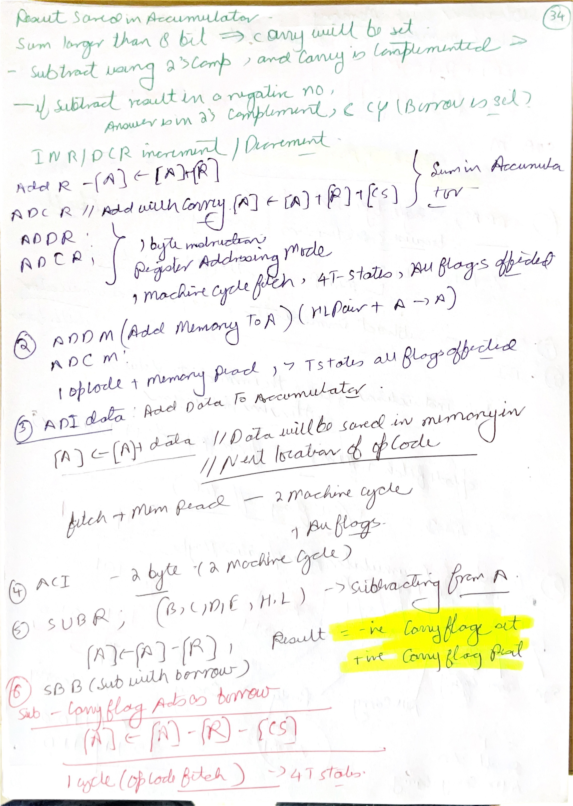 | Use with `SUB` and `SBB`. Carry means borrow in subtraction. |
| [till47 p012](images/HandWrittenNotes/till47/page-012.jpg) | 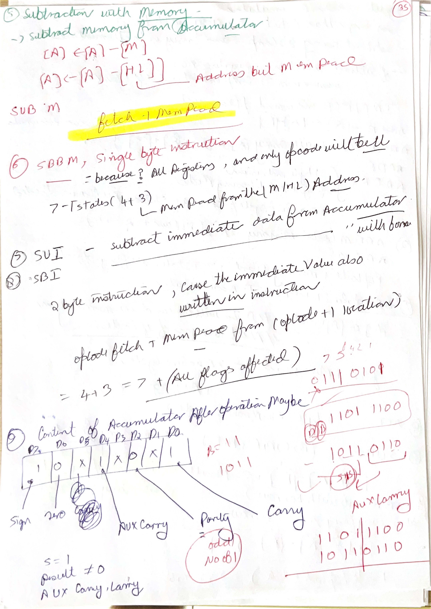 | Use with `SUI` and two's-complement result. Convert negative results back into 8-bit hex. |
| [till47 p013](images/HandWrittenNotes/till47/page-013.jpg) | 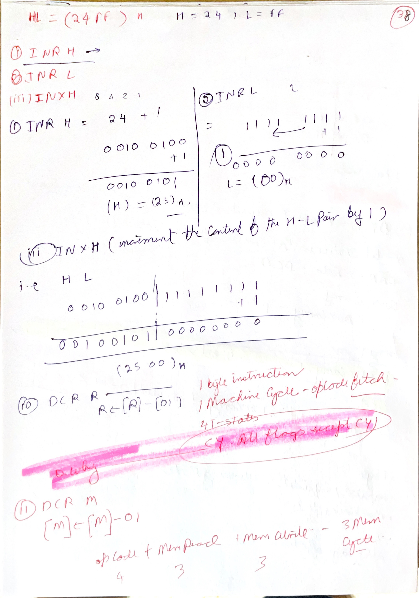 | Use with `INR`, `DCR`, `INX`, and `DCX`. Remember `INX/DCX` affect register pairs and do not update all normal arithmetic flags. |
| [till47 p014](images/HandWrittenNotes/till47/page-014.jpg) | 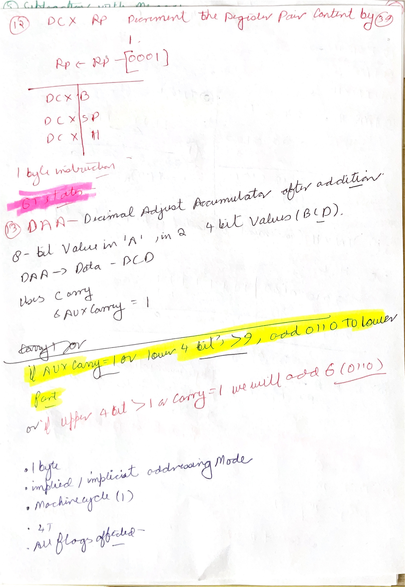 | Use with `DAA`. The auxiliary carry and lower nibble decide whether BCD correction is needed. |
| [till47 p015](images/HandWrittenNotes/till47/page-015.jpg) | 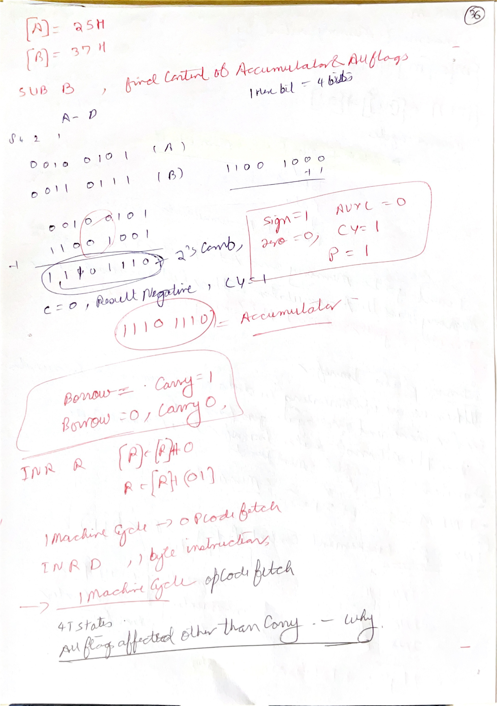 | Use with compare and subtraction. The flag result tells relation: `CY=1` means accumulator was smaller. |
| [till47 p016](images/HandWrittenNotes/till47/page-016.jpg) | 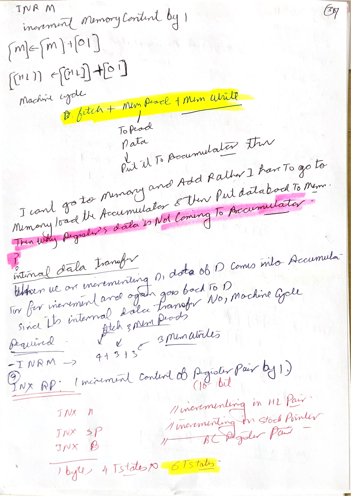 | Use with `INR M`. The operand is memory at `HL`, not the register pair itself. |
| [till47 p017](images/HandWrittenNotes/till47/page-017.jpg) | 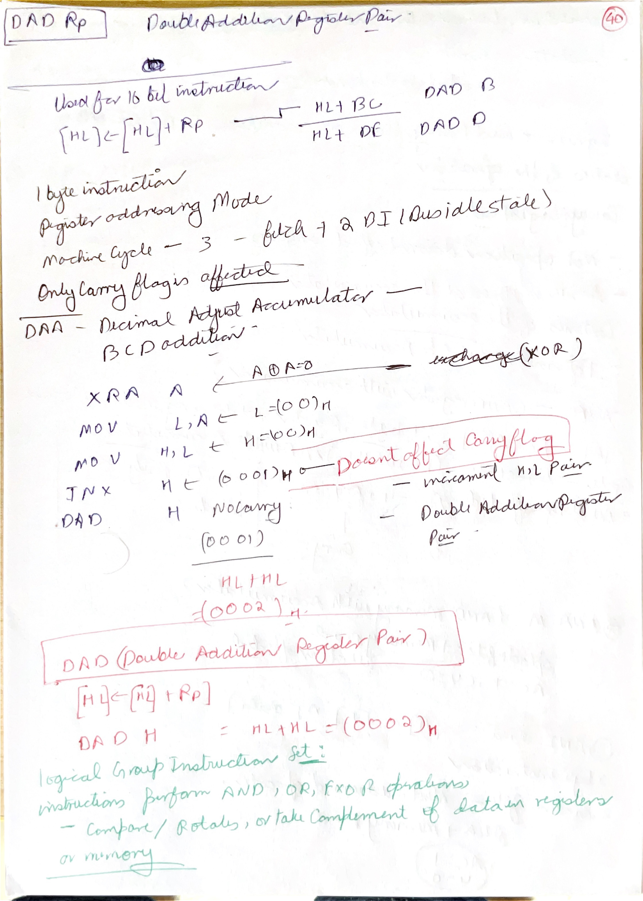 | Use with mixed traces involving `DAA`, `XRA`, and `DAD`. Separate 8-bit flag behavior from 16-bit register-pair behavior. |
| [till47 p018](images/HandWrittenNotes/till47/page-018.jpg) | 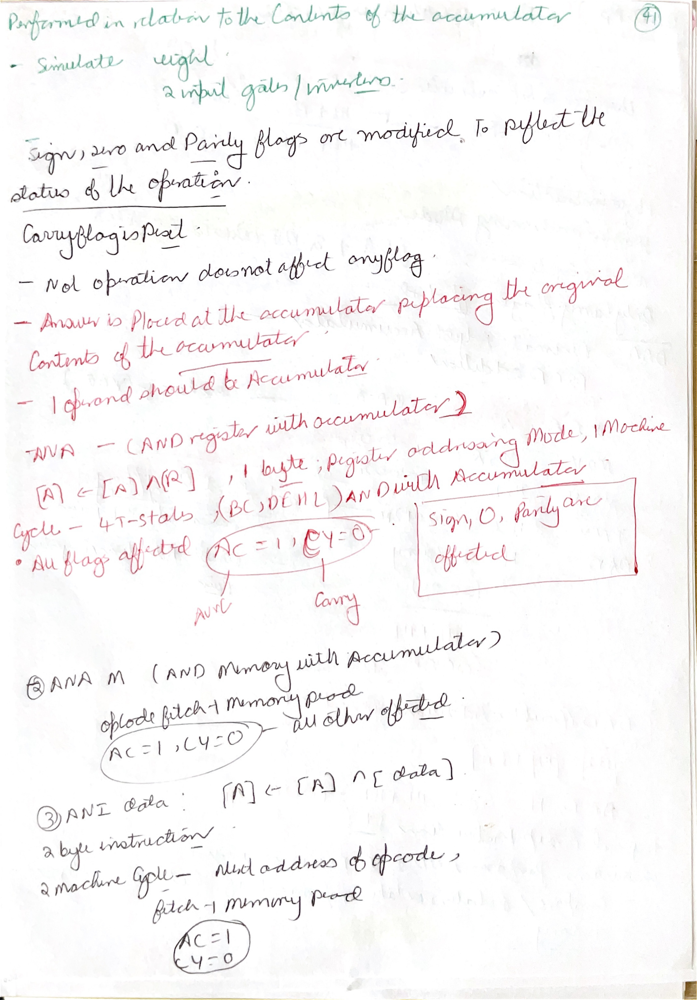 | Use with logical operations. Complement and logical instructions are bit-level operations, not decimal arithmetic. |
| [till47 p019](images/HandWrittenNotes/till47/page-019.jpg) | 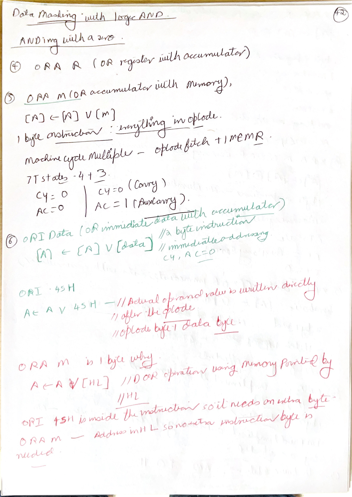 | Use with `ANA` and `ORA`. These instructions use the accumulator and update flags from the logical result. |
| [till47 p020](images/HandWrittenNotes/till47/page-020.jpg) | 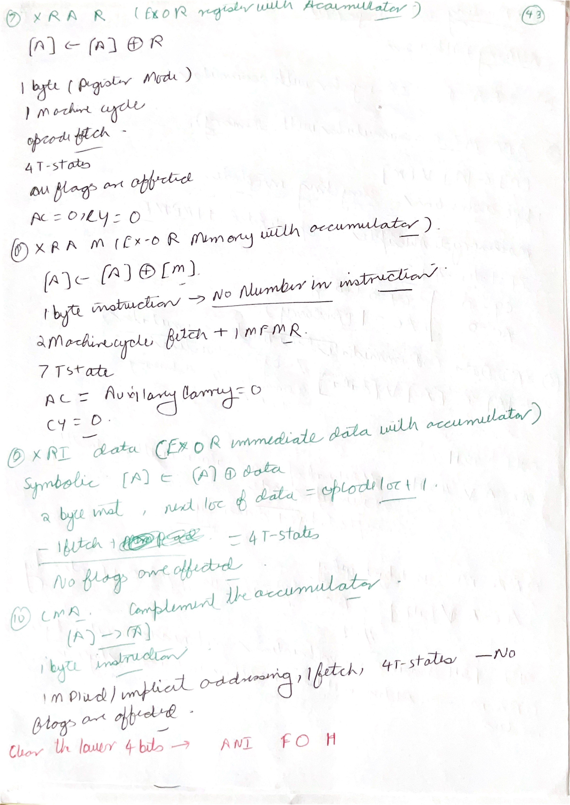 | Use with `XRA`, `XRI`, and `CMA`. XOR with self clears a value; complement flips every bit. |
| [till47 p021](images/HandWrittenNotes/till47/page-021.jpg) | 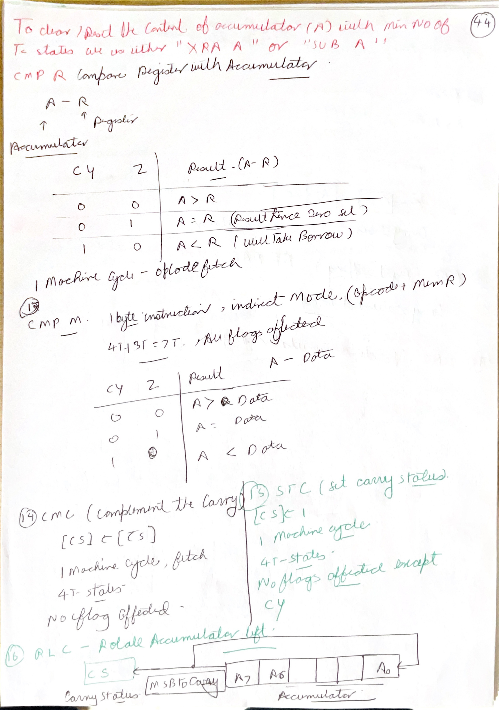 | Use with `CMP`, `STC`, and `CMC`. `CMP` affects flags only; `STC/CMC` affect carry directly. |
| [till47 p022](images/HandWrittenNotes/till47/page-022.jpg) | 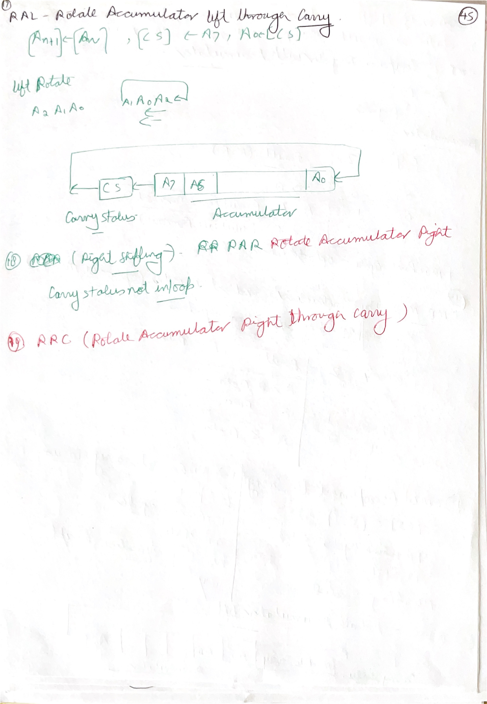 | Use with `RRC` and `RAL`. Mark the carry bit outside the accumulator before rotating. |
| [till47 p023](images/HandWrittenNotes/till47/page-023.jpg) | 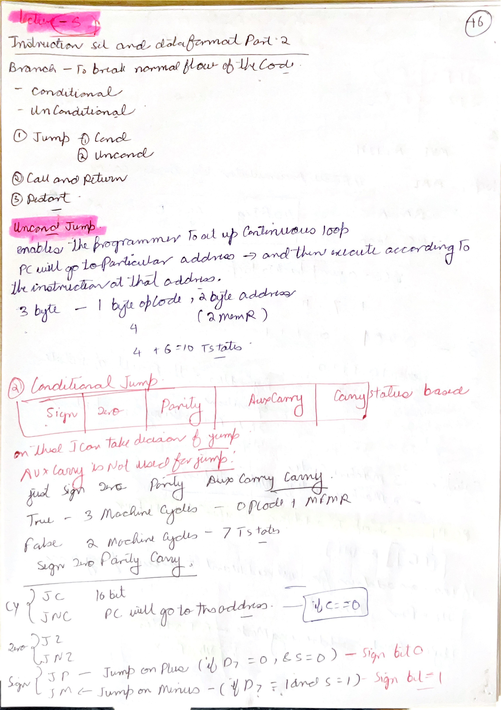 | Use with branch instructions. Branch conditions are just named tests of flag bits. |
| [till47 p024](images/HandWrittenNotes/till47/page-024.jpg) | 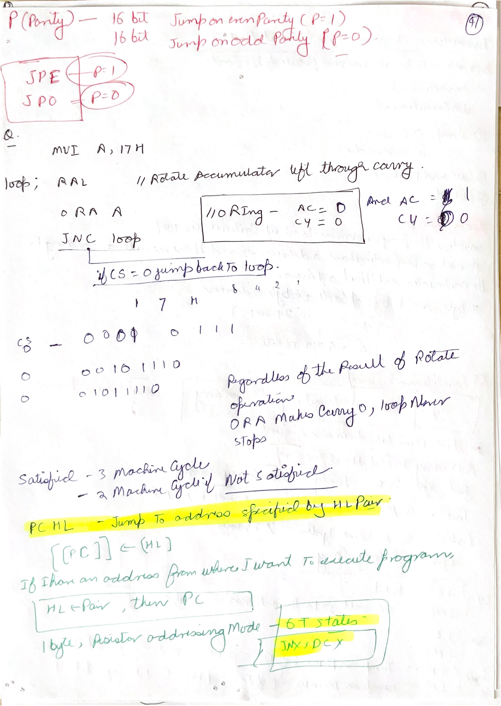 | Use with the rotate/branch practice screenshot. Trace `A` and `CY` after every rotate, then decide the jump. |

## 1. Subtraction and Borrow


The question uses:

```text
B = 49H
A = 3AH
```

For `SUB B`:

```text
A <- A - B
A <- 3AH - 49H
```

In decimal:

```text
3AH = 58
49H = 73
58 - 73 = -15
```

An 8-bit register cannot store `-15` directly as a signed decimal result. It stores the 8-bit two's-complement pattern:

```text
100H - 0FH = F1H
```

So:

```text
A = F1H
CY = 1
S = 1
```

Why `CY = 1`? In 8085 subtraction, carry indicates borrow. Since `A` was smaller than `B`, the subtraction required a borrow.

Why `S = 1`? The result `F1H` has MSB `1`, so the sign flag is set.

## 2. `SBB`: Subtract With Borrow


`SBB r` means:

```text
A <- A - r - CY
```

This is different from `SUB r`, which means:

```text
A <- A - r
```

Using the same values:

```text
A = 3AH
B = 49H
```

If old carry is `0`:

```text
SBB B = 3AH - 49H - 0 = F1H
```

If old carry is `1`:

```text
SBB B = 3AH - 49H - 1 = F0H
```

This is the reason many exam questions specify the previous carry flag before `SBB`. If it is not specified, you must be careful: either the problem assumes `CY = 0`, or the question is incomplete.

Common trap: after subtraction, `CY = 1` means borrow occurred. It does not mean the numerical result is positive.

## 3. `CMP B`: Compare Accumulator With Register


`CMP B` compares the accumulator with register `B` by internally calculating:

```text
A - B
```

but it does **not** store the result back in `A`. Only flags are affected.

For the screenshot's idea:

```text
A < B
```

then:

```text
CY = 1
Z = 0
```

Because:

- carry is set when the comparison needs a borrow, meaning `A < B`;
- zero is set only when `A = B`;
- the accumulator value remains unchanged after `CMP`.

Comparison rules:

| Relation | Carry flag | Zero flag |
| --- | --- | --- |
| `A < operand` | `CY = 1` | `Z = 0` |
| `A = operand` | `CY = 0` | `Z = 1` |
| `A > operand` | `CY = 0` | `Z = 0` |

Common trap: `CMP` is like subtraction for flags, but unlike `SUB`, it does not change accumulator contents.

## 4. Instruction Bytes in Memory


This screenshot shows how instructions are placed in memory. Each instruction occupies one, two, or three consecutive memory locations.

Examples:

| Instruction | Length | Memory layout |
| --- | --- | --- |
| `SUB M` | 1 byte | opcode only |
| `MVI A,20H` | 2 bytes | opcode, then `20H` |
| `LXI H,0701H` | 3 bytes | opcode, low byte `01H`, high byte `07H` |
| `JMP 2050H` | 3 bytes | opcode, low byte `50H`, high byte `20H` |

For 16-bit immediate data or addresses, the 8085 stores the low byte first and high byte second.

Example:

```asm
LXI H,0701H
```

is stored as:

```text
opcode for LXI H
01H
07H
```

Common trap: do not write `07H` before `01H` in memory. The register-pair display is `HL = 0701H`, but the instruction bytes are low byte first.

## 5. `ORA`, `RRC`, and `RAL` Trace


The program shown is:

```asm
MVI A,C4H
ORA A
RRC
RAL
RRC
```

Start:

```text
A = C4H = 1100 0100
```

`ORA A`:

```text
A <- A OR A = C4H
CY <- 0
```

Logical OR with itself does not change `A`, but it refreshes flags. For ordinary 8085 teaching, OR-type instructions reset carry.

`RRC` rotates accumulator right circular:

```text
before: A = 1100 0100
after:  A = 0110 0010 = 62H
CY = old D0 = 0
```

`RAL` rotates left through carry:

```text
before: A = 0110 0010, CY = 0
after:  A = 1100 0100 = C4H
CY = old D7 = 0
```

Final `RRC`:

```text
before: A = 1100 0100
after:  A = 0110 0010 = 62H
CY = 0
```

So the final accumulator is:

```text
A = 62H
```

Common trap: `RRC` and `RAL` are not the same kind of rotation. `RRC` is circular within the accumulator and copies old bit 0 to carry. `RAL` rotates through carry, so old carry enters bit 0 and old bit 7 becomes carry.

## Points To Remember

- In subtraction, carry means borrow.
- `SUB r` subtracts only the operand.
- `SBB r` subtracts operand plus old carry.
- `CMP r` changes flags but not accumulator.
- `A < operand` after compare gives `CY = 1`, `Z = 0`.
- Instruction length determines where the next instruction begins.
- For 16-bit immediate data, memory stores low byte first.
- `ORA A` can be used to update flags without changing `A`, but it resets carry in 8085 logic instruction behavior.
- `RRC` rotates right circular; `RAL` rotates left through carry.
- Always write binary when solving rotate questions.

## Sources

[S1] Intel Corporation, [MCS-80/85 Family User's Manual, January 1983](https://www.bitsavers.org/components/intel/MCS80/MCS80_85_Users_Manual_Jan83.pdf). Used for arithmetic/logical instruction behavior, carry/borrow meaning, flags, instruction length, immediate data order, and rotate instructions.

[S2] Intel Corporation, [8080/8085 Assembly Language Programming Manual, May 1981](https://www.bitsavers.org/pdf/intel/ISIS_II/9800301-04_8080_8085_Assembly_Language_Programming_Manual_May81.pdf). Used for instruction storage, mnemonic notation, and programming examples.
