# Day 6: Assignment Questions, Timing, Loops, and Register Tracing

Day 6 covers the May 30 assignment screenshots. The images are mostly exam-style 8085 questions: accumulator rotation, delay loops, T-state counting, register-pair tracing, stack effects, instruction timing, and flag behavior.

## Image Index

| No. | Image | Main idea |
| --- | --- | --- |
| 1 | [RRC rotate accumulator question](images/Day%206/day-6-rrc-rotate-accumulator-question.png) | Trace `STC`, `MVI`, repeated `RRC`, and final accumulator content. |
| 2 | [Delay loop T-states program question](images/Day%206/day-6-delay-loop-tstates-program-question.png) | Nested loop timing with instruction T-states. |
| 3 | [Delay loop T-states working](images/Day%206/day-6-delay-loop-tstates-working.png) | Working for loop iteration and T-state totals. |
| 4 | [Delay loop time answer](images/Day%206/day-6-delay-loop-time-answer.png) | Convert T-states into delay using clock frequency. |
| 5 | [XCHG register-pair program question](images/Day%206/day-6-xchg-register-pair-program-question.png) | Trace `MOV` and `XCHG` effects on `BC`, `DE`, and `HL`. |
| 6 | [Non-maskable interrupt data-line question](images/Day%206/day-6-non-maskable-interrupt-data-line-question.png) | Data-line value during non-maskable interrupt handling. |
| 7 | [Maximum T-states instruction question](images/Day%206/day-6-maximum-tstates-instruction-question.png) | Compare instruction execution time for `XRI`, `STA`, `CALL`, and `JMP`. |
| 8 | [Direct addressing instruction question](images/Day%206/day-6-direct-addressing-instruction-question.png) | Identify `STA address` as direct addressing. |
| 9 | [DAD and XCHG register-pair question](images/Day%206/day-6-dad-xchg-register-pair-question.png) | Trace `LXI`, `DAD`, and `XCHG`. |
| 10 | [HLT instruction effects question](images/Day%206/day-6-hlt-instruction-effects-question.png) | Effects of `HLT` on program execution and buses. |
| 11 | [XRA, SUI, ANA flags question](images/Day%206/day-6-xra-sui-ana-flags-question.png) | Logical/arithmetic instructions and flag outcomes. |
| 12 | [CMA, INR, memory complement question](images/Day%206/day-6-cma-inr-memory-complement-question.png) | One's-complement versus two's-complement behavior in a program. |
| 13 | [Mask high-order bits question](images/Day%206/day-6-mask-high-order-bits-question.png) | Use `ANI`/`ANA` masking to keep selected nibbles. |
| 14 | [Mask high-order bits solution](images/Day%206/day-6-mask-high-order-bits-solution.png) | Why masking is done through the accumulator. |
| 15 | [Stack PUSH/POP register trace question](images/Day%206/day-6-stack-push-pop-register-trace-question.png) | Trace `SP`, memory contents, `PUSH PSW`, `POP PSW`, and `POP H`. |
| 16 | [CALL/RET stack pointer question](images/Day%206/day-6-call-ret-stack-pointer-question.png) | Correct stack behavior for `CALL` and `RET`. |
| 17 | [Loop T-states total question](images/Day%206/day-6-loop-tstates-total-question.png) | Count T-states for a short decrement-and-jump loop. |
| 18 | [Loop T-cycles iteration question](images/Day%206/day-6-loop-tcycles-iteration-question.png) | Loop count and T-cycle calculation for `ORA`, `DCR`, and `JNZ`. |
| 19 | [Loop T-cycles iteration working](images/Day%206/day-6-loop-tcycles-iteration-working.png) | Working for total T-cycles and number of loop executions. |
| 20 | [Loop time and machine cycles question](images/Day%206/day-6-loop-time-machine-cycles-question.png) | Convert loop cycles into elapsed time and machine cycles. |
| 21 | [Loop time and machine cycles solution](images/Day%206/day-6-loop-time-machine-cycles-solution.png) | Final time and machine-cycle calculation. |
| 22 | [Conditional output port flags question](images/Day%206/day-6-conditional-output-port-flags-question.png) | Trace flags and output in a conditional `JC` program. |
| 23 | [Instruction clock order question](images/Day%206/day-6-instruction-clock-order-question.png) | Order instructions by clock requirement. |

## Handwritten Notes Linked To Day 6

Each handwritten page is shown first as a large full-page image. The explanation below the image adds the technical layer: instruction behavior, bus cycles, flags, timing, address formation, or hardware reason behind the note.

### [till73 p013](images/HandWrittenNotes/till73/page-013.jpg)

<a href="images/HandWrittenNotes/till73/page-013.jpg">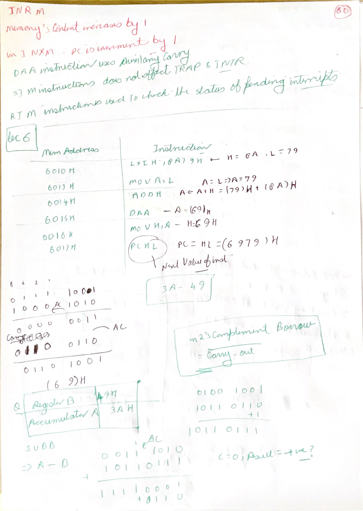</a>

Technical explanation: `INR` and `DCR` change an 8-bit register or memory byte, while `INX` and `DCX` change a 16-bit register pair. `INR/DCR` update most arithmetic flags but do not update carry, which is a frequent exam trap. `INX/DCX` are 16-bit pointer updates and do not set the normal arithmetic flags.

Flags are a compressed record of the last flag-affecting result. `S` copies bit 7, `Z` reports zero, `P` reports even parity, `AC` reports carry from bit 3 to bit 4, and `CY` reports carry out of bit 7. In subtraction, `CY` is interpreted as borrow. A common trace error is testing a flag after an instruction that did not update it.

### [till73 p014](images/HandWrittenNotes/till73/page-014.jpg)

<a href="images/HandWrittenNotes/till73/page-014.jpg">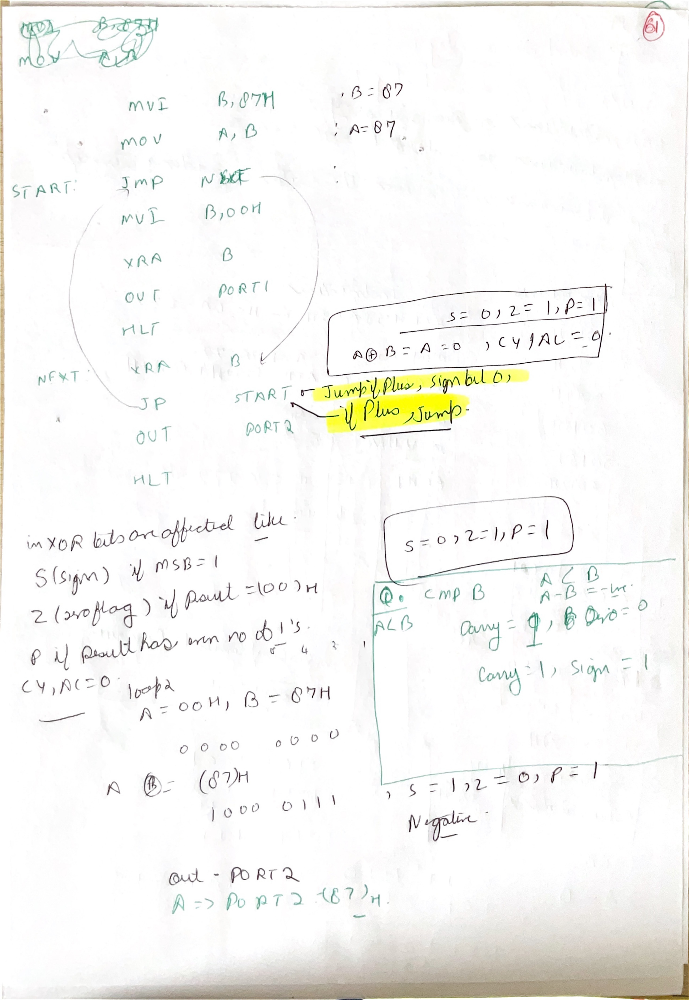</a>

Technical explanation: for program traces, keep a state table. Each row should list only what the current instruction changes: registers, flags, memory, `PC`, `SP`, or stack bytes. This prevents the common mistake of updating a value but forgetting the pointer that determines where the next memory access will happen.

When a page asks for final `S`, `Z`, `P`, `CY`, or `AC`, compute the actual 8-bit result first. Then derive flags from that result and the carry path. Do not update carry after `INR/DCR`, and do not assume data-transfer instructions refresh flags.

### [till73 p015](images/HandWrittenNotes/till73/page-015.jpg)

<a href="images/HandWrittenNotes/till73/page-015.jpg">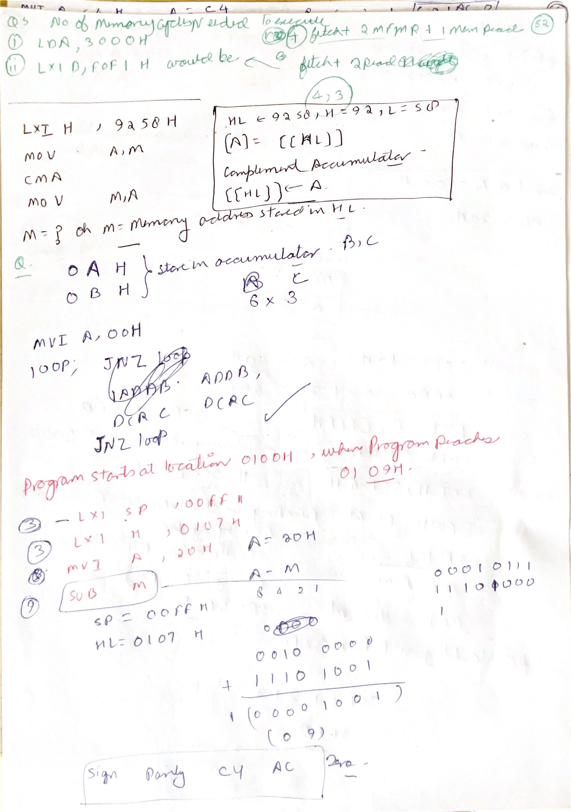</a>

Technical explanation: `INR` and `DCR` change an 8-bit register or memory byte, while `INX` and `DCX` change a 16-bit register pair. `INR/DCR` update most arithmetic flags but do not update carry, which is a frequent exam trap. `INX/DCX` are 16-bit pointer updates and do not set the normal arithmetic flags.

Flags are a compressed record of the last flag-affecting result. `S` copies bit 7, `Z` reports zero, `P` reports even parity, `AC` reports carry from bit 3 to bit 4, and `CY` reports carry out of bit 7. In subtraction, `CY` is interpreted as borrow. A common trace error is testing a flag after an instruction that did not update it.

`CMA` complements every accumulator bit and does not mean two's-complement negation by itself. `STC` sets carry, and `CMC` complements carry. These instructions are small but important because later rotate, subtract-with-borrow, or conditional branch instructions can depend on the carry value they leave behind.

### [till73 p016](images/HandWrittenNotes/till73/page-016.jpg)

<a href="images/HandWrittenNotes/till73/page-016.jpg">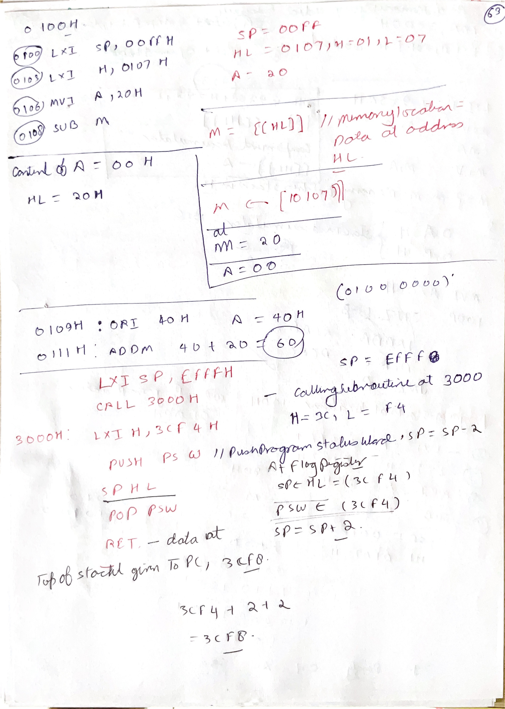</a>

Technical explanation: the 8085 stack grows toward lower memory addresses. On push-like operations, `SP` is decremented before bytes are stored; on pop-like operations, bytes are read and then `SP` is incremented. For register pairs, keep high and low bytes separate because the final memory layout determines what a later `POP` or `RET` reconstructs.

For program traces, keep a state table. Each row should list only what the current instruction changes: registers, flags, memory, `PC`, `SP`, or stack bytes. This prevents the common mistake of updating a value but forgetting the pointer that determines where the next memory access will happen.

### [till73 p017](images/HandWrittenNotes/till73/page-017.jpg)

<a href="images/HandWrittenNotes/till73/page-017.jpg">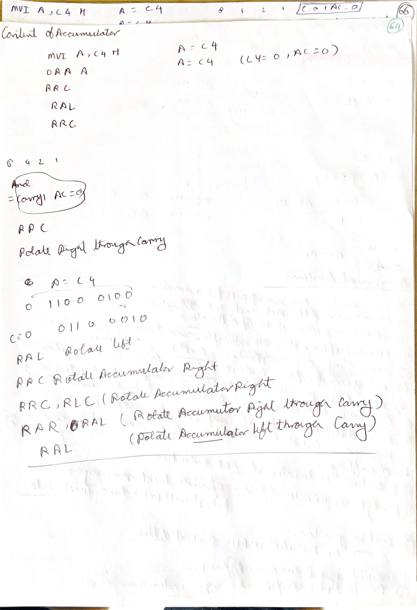</a>

Technical explanation: rotate instructions are best traced as eight accumulator bits plus a separate carry. `RLC` moves bit 7 into bit 0 and into `CY`; `RRC` moves bit 0 into bit 7 and into `CY`. `RAL` and `RAR` rotate through carry, so the old carry becomes part of the new accumulator and the outgoing accumulator bit becomes the new carry.

For rotate traces, write the old accumulator as bits `b7 ... b0` and write old `CY` separately. `RAL/RAR` depend on old carry, so two traces with the same accumulator can differ if the incoming carry differs. `RLC/RRC` do not use old carry in the same way.

### [till73 p018](images/HandWrittenNotes/till73/page-018.jpg)

<a href="images/HandWrittenNotes/till73/page-018.jpg">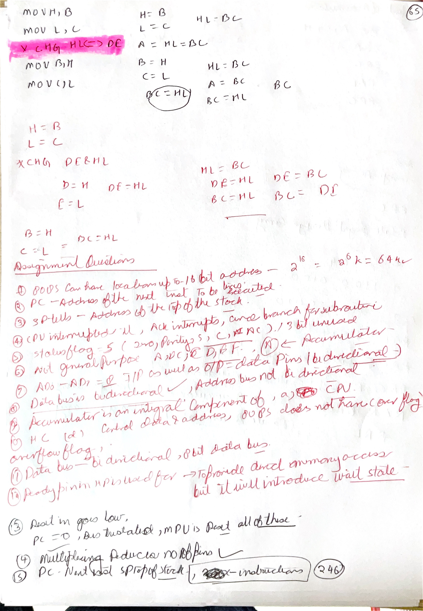</a>

Technical explanation: a T-state is one processor clock state. Instruction timing is the number of T-states multiplied by the clock period. The counts are not arbitrary: every external memory or I/O access needs a bus cycle. Opcode fetch has address output, `ALE`, memory read control, data capture, and decode work, so it is longer than a plain memory read. Extra operand bytes, memory operands, stack transfers, I/O transfers, and slow memory wait states all add timing cost.

A machine cycle is one external bus operation: opcode fetch, memory read, memory write, I/O read, I/O write, interrupt acknowledge, and so on. An instruction cycle is the whole instruction and can contain several machine cycles. This is why instruction length, addressing mode, and T-state count are connected: every extra byte or external operand has to be fetched, read, or written on the bus.

`XCHG` swaps `HL` with `DE`; it does not touch memory. `DAD rp` adds a 16-bit register pair to `HL` and stores the 16-bit result in `HL`, with carry out recorded in `CY`. When tracing these, combine each pair as a 16-bit number first, then split the result back into high and low registers.

### [till73 p019](images/HandWrittenNotes/till73/page-019.jpg)

<a href="images/HandWrittenNotes/till73/page-019.jpg">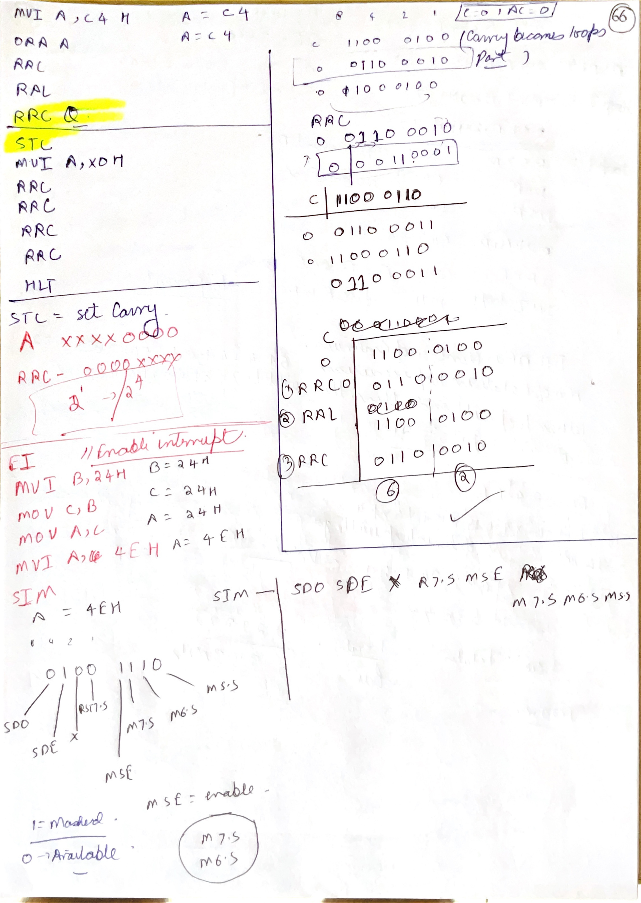</a>

Technical explanation: rotate instructions are best traced as eight accumulator bits plus a separate carry. `RLC` moves bit 7 into bit 0 and into `CY`; `RRC` moves bit 0 into bit 7 and into `CY`. `RAL` and `RAR` rotate through carry, so the old carry becomes part of the new accumulator and the outgoing accumulator bit becomes the new carry.

For program traces, keep a state table. Each row should list only what the current instruction changes: registers, flags, memory, `PC`, `SP`, or stack bytes. This prevents the common mistake of updating a value but forgetting the pointer that determines where the next memory access will happen.

### [till73 p020](images/HandWrittenNotes/till73/page-020.jpg)

<a href="images/HandWrittenNotes/till73/page-020.jpg">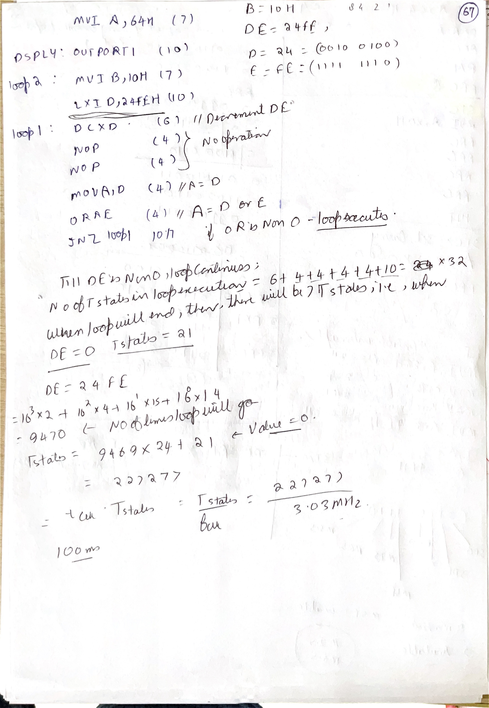</a>

Technical explanation: a T-state is one processor clock state. Instruction timing is the number of T-states multiplied by the clock period. The counts are not arbitrary: every external memory or I/O access needs a bus cycle. Opcode fetch has address output, `ALE`, memory read control, data capture, and decode work, so it is longer than a plain memory read. Extra operand bytes, memory operands, stack transfers, I/O transfers, and slow memory wait states all add timing cost.

A machine cycle is one external bus operation: opcode fetch, memory read, memory write, I/O read, I/O write, interrupt acknowledge, and so on. An instruction cycle is the whole instruction and can contain several machine cycles. This is why instruction length, addressing mode, and T-state count are connected: every extra byte or external operand has to be fetched, read, or written on the bus.

Delay-loop timing is derived, not guessed. Count setup instructions once, count the loop body for taken iterations, then count the final iteration separately because the conditional branch is not taken at the end. Convert the final T-state total into time using `delay = T-states x clock period`, where `clock period = 1 / clock frequency`.

### [till73 p021](images/HandWrittenNotes/till73/page-021.jpg)

<a href="images/HandWrittenNotes/till73/page-021.jpg">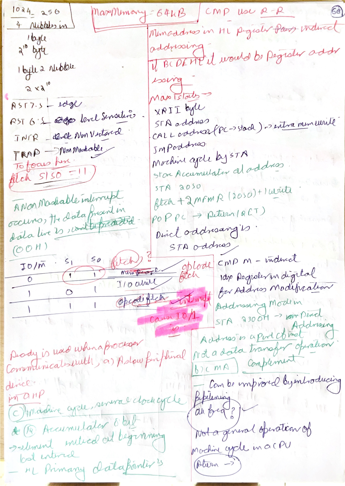</a>

Technical explanation: a T-state is one processor clock state. Instruction timing is the number of T-states multiplied by the clock period. The counts are not arbitrary: every external memory or I/O access needs a bus cycle. Opcode fetch has address output, `ALE`, memory read control, data capture, and decode work, so it is longer than a plain memory read. Extra operand bytes, memory operands, stack transfers, I/O transfers, and slow memory wait states all add timing cost.

A machine cycle is one external bus operation: opcode fetch, memory read, memory write, I/O read, I/O write, interrupt acknowledge, and so on. An instruction cycle is the whole instruction and can contain several machine cycles. This is why instruction length, addressing mode, and T-state count are connected: every extra byte or external operand has to be fetched, read, or written on the bus.

Addressing mode means where the operand comes from. Immediate addressing puts the operand in the instruction stream. Register addressing uses an internal register. Direct addressing stores the 16-bit memory address inside the instruction. Register-indirect addressing uses a register pair as a pointer. Implied addressing builds the operand into the instruction definition, such as accumulator, carry, or stack behavior.

8085 interrupts combine priority, masking, and vectoring. `TRAP` is highest priority and non-maskable. `RST 7.5`, `RST 6.5`, and `RST 5.5` are maskable vectored interrupts with fixed restart addresses: `RST n` maps to `n x 8`, so `RST 7.5` starts at `003CH`, `RST 6.5` at `0034H`, and `RST 5.5` at `002CH`. `INTR` is maskable and non-vectored, so external hardware must supply the instruction during acknowledge.

Support chips offload repeated interface work from the CPU. `8255` provides programmable parallel I/O ports, `8253` provides programmable timing/counting, `8257` manages DMA channels, and `8259` prioritizes and vectors interrupt requests. Devices such as `8272`, `8275`, and `8279` specialize further for floppy, display, keyboard, or display-control tasks.

### [till73 p022](images/HandWrittenNotes/till73/page-022.jpg)

<a href="images/HandWrittenNotes/till73/page-022.jpg">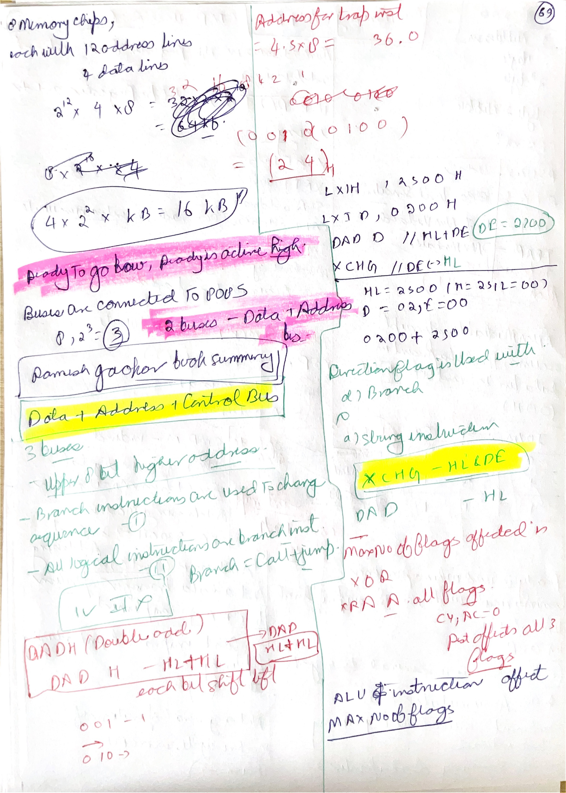</a>

Technical explanation: memory interfacing is mostly address decoding. A `4K x 8` chip has 4096 byte locations, so it needs 12 low-order address lines because `2^12 = 4096`. Higher address lines decide which chip or block is enabled. Full decoding uses enough high address bits to make one unique range; partial decoding can make the same chip respond at mirrored address ranges.

`XCHG` swaps `HL` with `DE`; it does not touch memory. `DAD rp` adds a 16-bit register pair to `HL` and stores the 16-bit result in `HL`, with carry out recorded in `CY`. When tracing these, combine each pair as a 16-bit number first, then split the result back into high and low registers.

### [till73 p023](images/HandWrittenNotes/till73/page-023.jpg)

<a href="images/HandWrittenNotes/till73/page-023.jpg">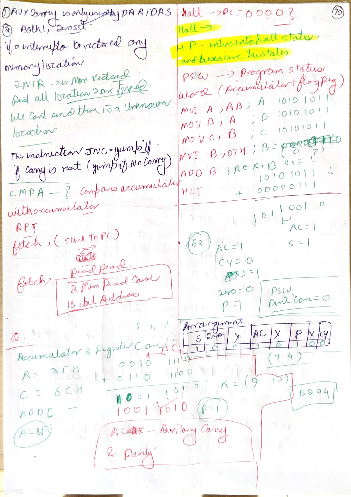</a>

Technical explanation: `XCHG` swaps `HL` with `DE`; it does not touch memory. `DAD rp` adds a 16-bit register pair to `HL` and stores the 16-bit result in `HL`, with carry out recorded in `CY`. When tracing these, combine each pair as a 16-bit number first, then split the result back into high and low registers.

8085 subtraction is performed through two's-complement addition internally. `SUB r` computes `A - r`; `SBB r` computes `A - r - CY`; `SUI data` subtracts an immediate byte. After subtraction, `CY=1` means a borrow was required. `CMP r` performs the same internal subtraction only for flags and leaves the accumulator unchanged.

Flags are a compressed record of the last flag-affecting result. `S` copies bit 7, `Z` reports zero, `P` reports even parity, `AC` reports carry from bit 3 to bit 4, and `CY` reports carry out of bit 7. In subtraction, `CY` is interpreted as borrow. A common trace error is testing a flag after an instruction that did not update it.

`CALL` is both a control-transfer instruction and a stack operation. The CPU fetches the target address, pushes the return address on the stack, and loads `PC` with the target. `RET` pops the saved address back into `PC`. The return address is the address of the next instruction after the call, not the call instruction's own address.

Branch instructions test existing state; they do not create the condition themselves. Conditional jumps, calls, and returns read flag bits left by earlier instructions. Timing can differ between taken and not-taken branches because the processor may or may not load the target address into `PC`. This is why loop timing must count the last failed branch separately.

### [till73 p024](images/HandWrittenNotes/till73/page-024.jpg)

<a href="images/HandWrittenNotes/till73/page-024.jpg">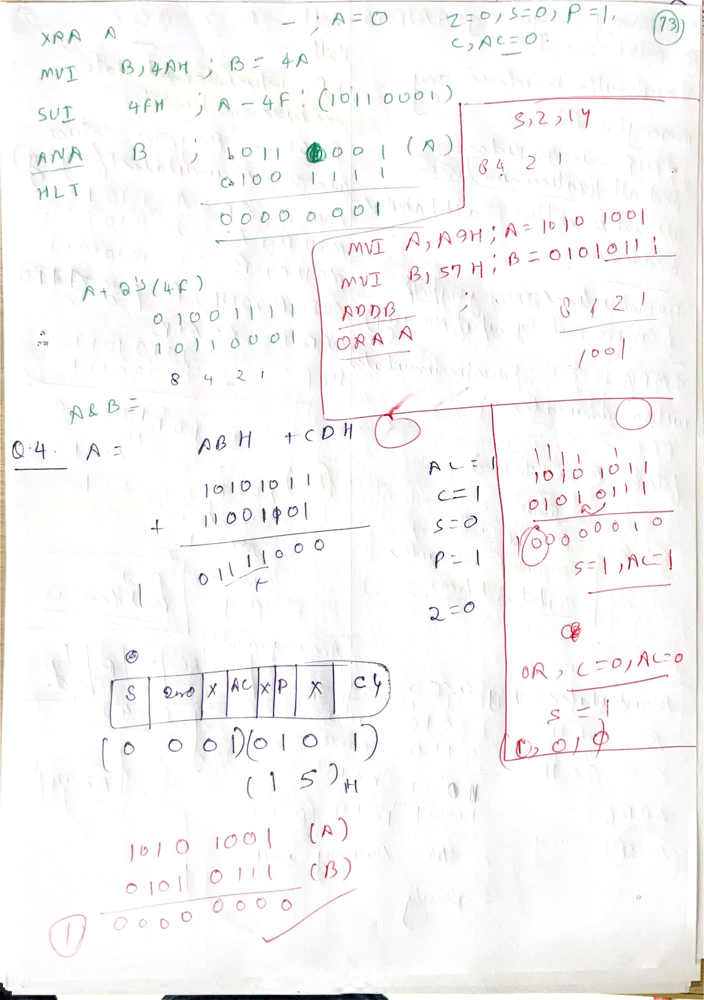</a>

Technical explanation: the ALU is where arithmetic and logical results are physically produced, but the useful output is not only the 8-bit result. The accumulator usually supplies one operand and receives the result, while the flag flip-flops record properties of that result. Carry is generated from bit 7, auxiliary carry from bit 3 to bit 4, zero from an all-zero result, sign from bit 7, and parity from the number of 1 bits. That is why exam traces must update flags from the actual binary result, not from the instruction name alone.

Flags are a compressed record of the last flag-affecting result. `S` copies bit 7, `Z` reports zero, `P` reports even parity, `AC` reports carry from bit 3 to bit 4, and `CY` reports carry out of bit 7. In subtraction, `CY` is interpreted as borrow. A common trace error is testing a flag after an instruction that did not update it.

8085 subtraction is performed through two's-complement addition internally. `SUB r` computes `A - r`; `SBB r` computes `A - r - CY`; `SUI data` subtracts an immediate byte. After subtraction, `CY=1` means a borrow was required. `CMP r` performs the same internal subtraction only for flags and leaves the accumulator unchanged.

Logical instructions operate bit by bit. `ANA` clears a bit unless both inputs have 1, `ORA` sets a bit if either input has 1, and `XRA` sets a bit only when the inputs differ. `XRA A` is a standard way to clear the accumulator to `00H`; it also updates flags, so later conditional jumps may depend on that clear operation.

For program traces, keep a state table. Each row should list only what the current instruction changes: registers, flags, memory, `PC`, `SP`, or stack bytes. This prevents the common mistake of updating a value but forgetting the pointer that determines where the next memory access will happen.

### [85completed p001](images/HandWrittenNotes/85completed/page-001.jpg)

<a href="images/HandWrittenNotes/85completed/page-001.jpg">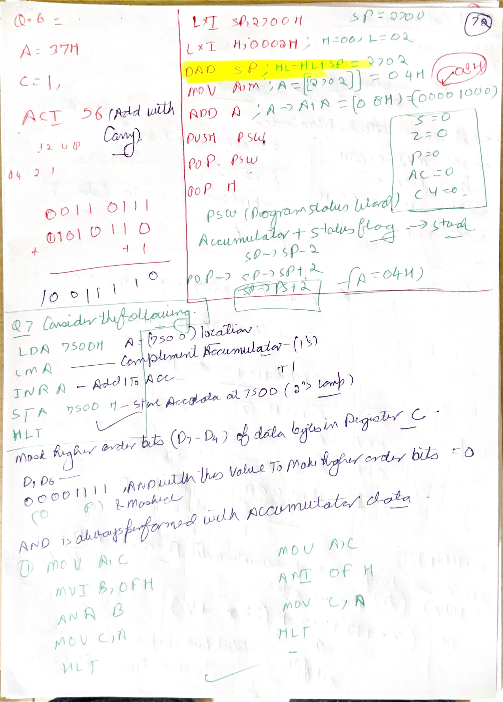</a>

Technical explanation: the ALU is where arithmetic and logical results are physically produced, but the useful output is not only the 8-bit result. The accumulator usually supplies one operand and receives the result, while the flag flip-flops record properties of that result. Carry is generated from bit 7, auxiliary carry from bit 3 to bit 4, zero from an all-zero result, sign from bit 7, and parity from the number of 1 bits. That is why exam traces must update flags from the actual binary result, not from the instruction name alone.

Flags are a compressed record of the last flag-affecting result. `S` copies bit 7, `Z` reports zero, `P` reports even parity, `AC` reports carry from bit 3 to bit 4, and `CY` reports carry out of bit 7. In subtraction, `CY` is interpreted as borrow. A common trace error is testing a flag after an instruction that did not update it.

8085 subtraction is performed through two's-complement addition internally. `SUB r` computes `A - r`; `SBB r` computes `A - r - CY`; `SUI data` subtracts an immediate byte. After subtraction, `CY=1` means a borrow was required. `CMP r` performs the same internal subtraction only for flags and leaves the accumulator unchanged.

For program traces, keep a state table. Each row should list only what the current instruction changes: registers, flags, memory, `PC`, `SP`, or stack bytes. This prevents the common mistake of updating a value but forgetting the pointer that determines where the next memory access will happen.

### [85completed p002](images/HandWrittenNotes/85completed/page-002.jpg)

<a href="images/HandWrittenNotes/85completed/page-002.jpg">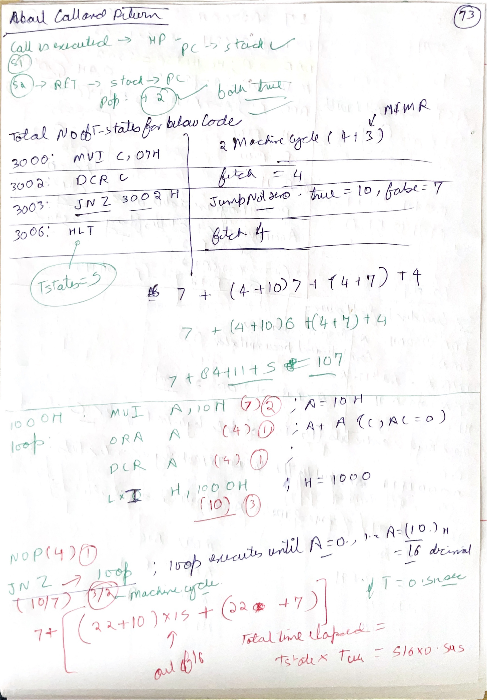</a>

Technical explanation: a T-state is one processor clock state. Instruction timing is the number of T-states multiplied by the clock period. The counts are not arbitrary: every external memory or I/O access needs a bus cycle. Opcode fetch has address output, `ALE`, memory read control, data capture, and decode work, so it is longer than a plain memory read. Extra operand bytes, memory operands, stack transfers, I/O transfers, and slow memory wait states all add timing cost.

A machine cycle is one external bus operation: opcode fetch, memory read, memory write, I/O read, I/O write, interrupt acknowledge, and so on. An instruction cycle is the whole instruction and can contain several machine cycles. This is why instruction length, addressing mode, and T-state count are connected: every extra byte or external operand has to be fetched, read, or written on the bus.

Delay-loop timing is derived, not guessed. Count setup instructions once, count the loop body for taken iterations, then count the final iteration separately because the conditional branch is not taken at the end. Convert the final T-state total into time using `delay = T-states x clock period`, where `clock period = 1 / clock frequency`.

### [85completed p003](images/HandWrittenNotes/85completed/page-003.jpg)

<a href="images/HandWrittenNotes/85completed/page-003.jpg">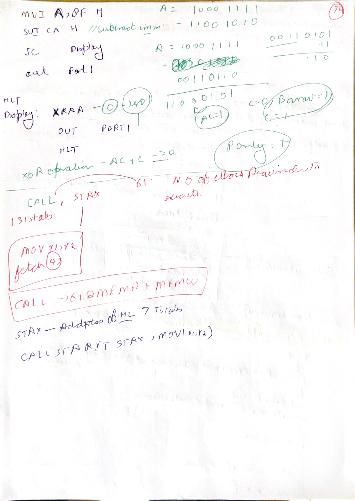</a>

Technical explanation: branch instructions test existing state; they do not create the condition themselves. Conditional jumps, calls, and returns read flag bits left by earlier instructions. Timing can differ between taken and not-taken branches because the processor may or may not load the target address into `PC`. This is why loop timing must count the last failed branch separately.

`CALL` is both a control-transfer instruction and a stack operation. The CPU fetches the target address, pushes the return address on the stack, and loads `PC` with the target. `RET` pops the saved address back into `PC`. The return address is the address of the next instruction after the call, not the call instruction's own address.

The 8085 stack grows toward lower memory addresses. On push-like operations, `SP` is decremented before bytes are stored; on pop-like operations, bytes are read and then `SP` is incremented. For register pairs, keep high and low bytes separate because the final memory layout determines what a later `POP` or `RET` reconstructs.

## Deep Revision Notes

Day 6 is not a new theory chapter as much as it is a solving chapter. The screenshots ask you to combine concepts from earlier days: instruction length, flags, register pairs, stack order, delay loops, and conditional branch timing. The safest method is to build a small trace table for every question.

### 1. Rotate Questions

Use the rotate screenshots with [till73 p017](images/HandWrittenNotes/till73/page-017.jpg), [till73 p019](images/HandWrittenNotes/till73/page-019.jpg), and [Day 6 image 1](images/Day%206/day-6-rrc-rotate-accumulator-question.png).

The four rotate instructions split into two families:

| Instruction | Old bit moved to carry | What enters the emptied bit |
| --- | --- | --- |
| `RLC` | Old `D7` | Old `D7` also enters `D0`. |
| `RRC` | Old `D0` | Old `D0` also enters `D7`. |
| `RAL` | Old `D7` | Old carry enters `D0`. |
| `RAR` | Old `D0` | Old carry enters `D7`. |

The exam mistake is to treat all rotates as circular. Only `RLC` and `RRC` are circular inside the accumulator. `RAL` and `RAR` rotate through carry, so the carry flag is part of the data path.

For any rotate trace, write:

```text
A before = b7 b6 b5 b4 b3 b2 b1 b0
CY before = c
instruction
A after = ...
CY after = ...
```

Then convert the final binary value back to hex. If you skip the binary row, it is very easy to lose the old carry bit.

### 2. Delay Loop And T-State Questions

Use [Day 6 images 2-4](images/Day%206/day-6-delay-loop-tstates-program-question.png), [Day 6 images 17-21](images/Day%206/day-6-loop-tstates-total-question.png), [till73 p020](images/HandWrittenNotes/till73/page-020.jpg), and [85completed p002](images/HandWrittenNotes/85completed/page-002.jpg).

Timing questions usually need two separate steps:

```text
total delay = total T-states x T-state period
T-state period = 1 / clock frequency
```

The important hidden detail is the conditional jump. A conditional jump generally has a different T-state count when the jump is taken versus when it is not taken. In a loop, this means:

```text
total loop T-states =
  repeated iterations where jump is taken
+ final iteration where jump is not taken
```

For a loop like:

```asm
LOOP: DCR C
      JNZ LOOP
```

if `C` starts at `N`, the decrement happens `N` times. `JNZ` is taken `N - 1` times and not taken once. That final not-taken branch is why the last iteration is counted separately.

When nested loops appear, solve from inside outward:

1. Count one full inner-loop execution.
2. Multiply it by the outer loop count.
3. Add setup instructions that run only once.
4. Convert T-states to time using the clock period.

### 3. Register-Pair Trace Questions

Use [Day 6 images 5 and 9](images/Day%206/day-6-xchg-register-pair-program-question.png), [till73 p018](images/HandWrittenNotes/till73/page-018.jpg), and [85completed p001](images/HandWrittenNotes/85completed/page-001.jpg).

For register-pair questions, always track both the pair and the individual registers:

| Instruction | Important effect |
| --- | --- |
| `LXI rp,data16` | Loads a 16-bit immediate value into a register pair. |
| `INX rp` | Adds one to the full 16-bit register pair. |
| `DAD rp` | Adds the selected register pair to `HL`; the result remains in `HL`. |
| `XCHG` | Exchanges `HL` and `DE`; `BC` is not involved. |
| `MOV r1,r2` | Copies one 8-bit register to another; source is unchanged. |

The key rule for `DAD`:

```text
HL <- HL + selected register pair
```

So `DAD B` means `HL <- HL + BC`, not `BC <- BC + HL`. `DAD D` means `HL <- HL + DE`. `DAD H` doubles `HL`.

### 4. Stack, `CALL`, `RET`, `PUSH`, And `POP`

Use [Day 6 images 15-16](images/Day%206/day-6-stack-push-pop-register-trace-question.png), [till73 p016](images/HandWrittenNotes/till73/page-016.jpg), and [85completed p003](images/HandWrittenNotes/85completed/page-003.jpg).

The 8085 stack grows downward. That gives the following mental model:

| Operation | What happens to `SP` | Main data movement |
| --- | --- | --- |
| `PUSH rp` | `SP` decreases by 2 | Register pair goes to stack memory. |
| `POP rp` | `SP` increases by 2 | Two stack bytes come into register pair. |
| `CALL addr` | `SP` decreases by 2 | Return address is pushed, then `PC <- addr`. |
| `RET` | `SP` increases by 2 | Return address is popped into `PC`. |

For `PUSH PSW`, the pair is special:

```text
PSW = accumulator A + flag register
```

For `POP H`, the low byte from the stack goes to `L`, and the high byte goes to `H`. After that, the register pair is displayed as `HL`, high byte first.

The reliable stack-trace method:

1. Write the initial `SP`.
2. Draw two memory boxes below it for each push.
3. Store low and high bytes carefully.
4. Move `SP` only after accounting for the bytes.
5. For pop, read from the current `SP`, then increase `SP`.

### 5. Logical, Masking, And Complement Questions

Use [Day 6 images 11-14](images/Day%206/day-6-xra-sui-ana-flags-question.png), [till73 p015](images/HandWrittenNotes/till73/page-015.jpg), [till73 p024](images/HandWrittenNotes/till73/page-024.jpg), and [till47 p020](images/HandWrittenNotes/till47/page-020.jpg).

Logical instructions should be solved bit by bit:

| Instruction | Meaning | Common use |
| --- | --- | --- |
| `ANA data/r/M` | `A <- A AND operand` | Mask bits; keep only selected positions. |
| `ORA data/r/M` | `A <- A OR operand` | Set selected bits. |
| `XRA data/r/M` | `A <- A XOR operand` | Toggle bits; `XRA A` clears `A`. |
| `CMA` | `A <- one's complement of A` | Flip every bit. |
| `ANI data` | `A <- A AND immediate data` | Mask with a fixed byte. |

For high-order-bit masking, choose a mask with `1`s where bits must be preserved and `0`s where bits must be cleared. Example:

```text
Keep high nibble only:
A    = xxxx yyyy
mask = 1111 0000 = F0H
ANA/ANI F0H -> xxxx 0000
```

For complement questions, separate one's complement and two's complement:

```text
one's complement = flip all bits
two's complement = flip all bits, then add 1
```

### 6. `HLT`, Direct Addressing, And Instruction Timing

Use [Day 6 images 7-10 and 23](images/Day%206/day-6-maximum-tstates-instruction-question.png), [till73 p021](images/HandWrittenNotes/till73/page-021.jpg), and [till73 p022](images/HandWrittenNotes/till73/page-022.jpg).

`HLT` stops normal instruction execution after the processor enters the halt state. It does not mean the chip has no clock or power; it means the processor is waiting in a halted state until a valid reset or interrupt-style event changes execution.

For direct addressing:

```asm
STA 2050H
```

means the 16-bit address is part of the instruction. The accumulator is stored at memory address `2050H`. That is different from register-indirect addressing, where the instruction uses a register pair such as `HL` to hold the address.

For maximum T-state questions, do not guess from instruction name alone. Ask:

1. How many bytes must be fetched?
2. Does it read or write memory?
3. Does it push or pop stack bytes?
4. Does it change `PC` through call/jump/return?
5. Does a conditional branch take the branch or fall through?

That is why stack and call instructions often take more time than simple register operations: they need extra memory cycles.

## Points To Remember

- `CALL` stores the return address on the stack; `RET` restores it by popping the address back.
- `RRC` rotates accumulator bit `D0` into both `D7` and carry.
- `DAD` always updates `HL`, regardless of the source register pair.
- In subtraction, carry means borrow.
- In loop timing, the last conditional jump may use a different T-state count.

## Sources

[S1] Intel Corporation, [MCS-80/85 Family User's Manual, January 1983](https://www.bitsavers.org/components/intel/MCS80/MCS80_85_Users_Manual_Jan83.pdf). Used for instruction timing, machine cycles, stack behavior, register-pair operations, interrupts, flags, and `HLT`.

[S2] Intel Corporation, [8080/8085 Assembly Language Programming Manual, May 1981](https://www.bitsavers.org/pdf/intel/ISIS_II/9800301-04_8080_8085_Assembly_Language_Programming_Manual_May81.pdf). Used for instruction meanings, rotate behavior, logical operations, branch conditions, and programming notation.
