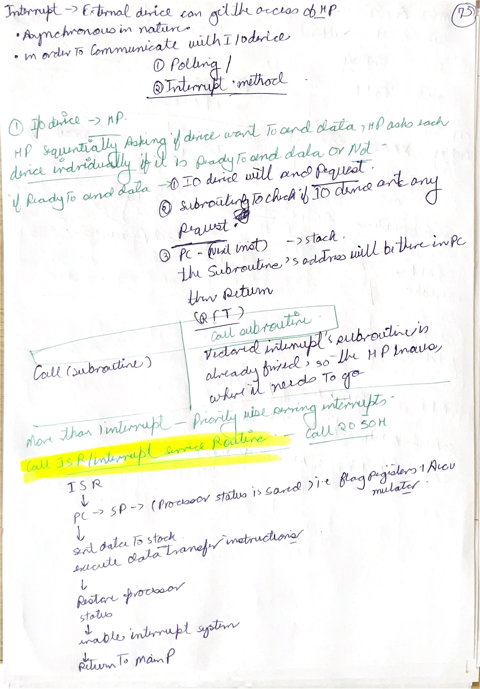
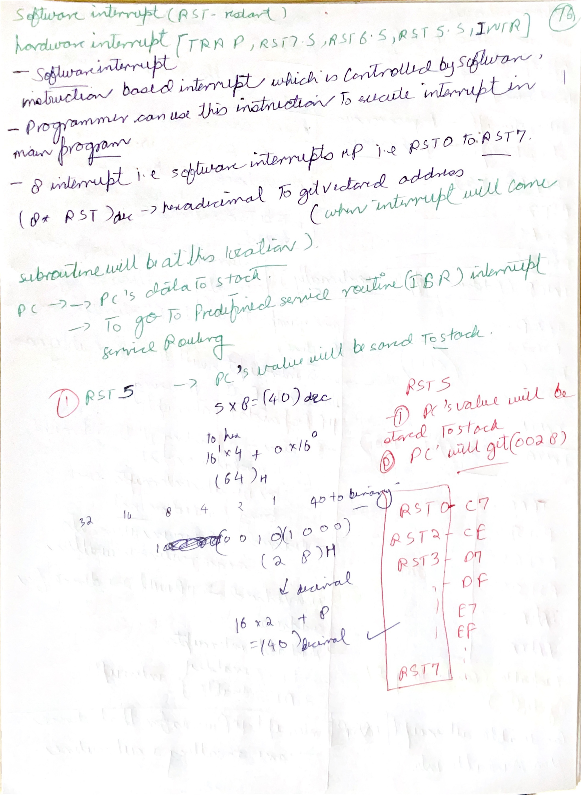
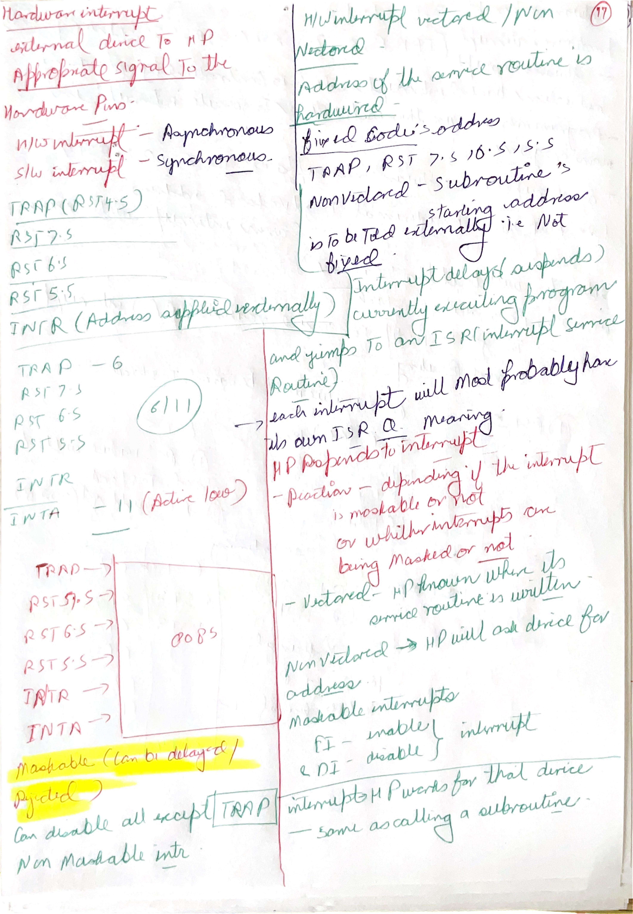
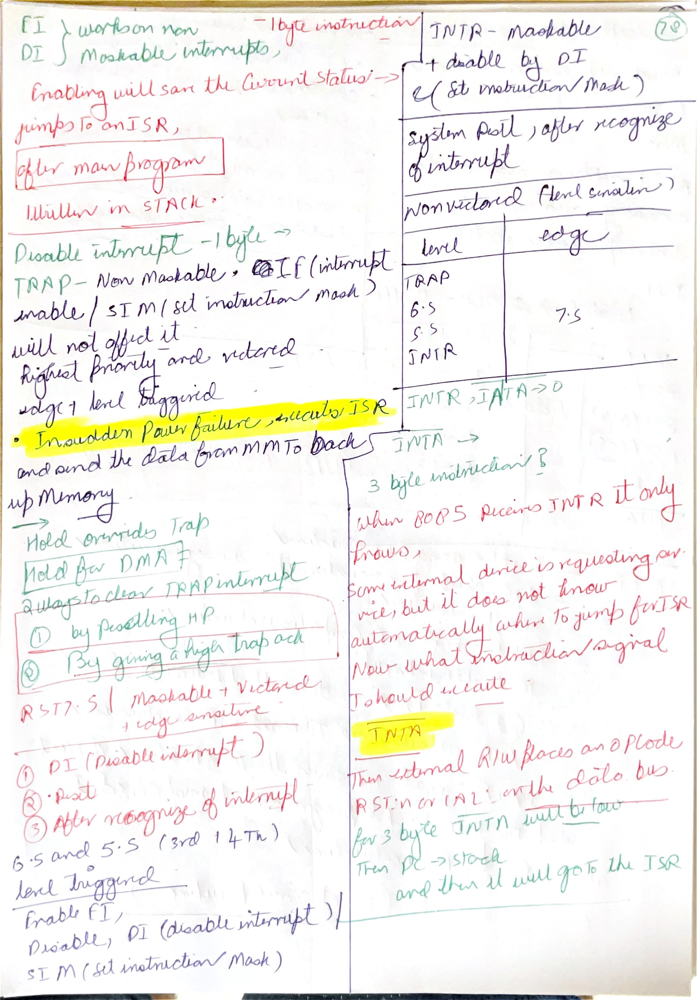
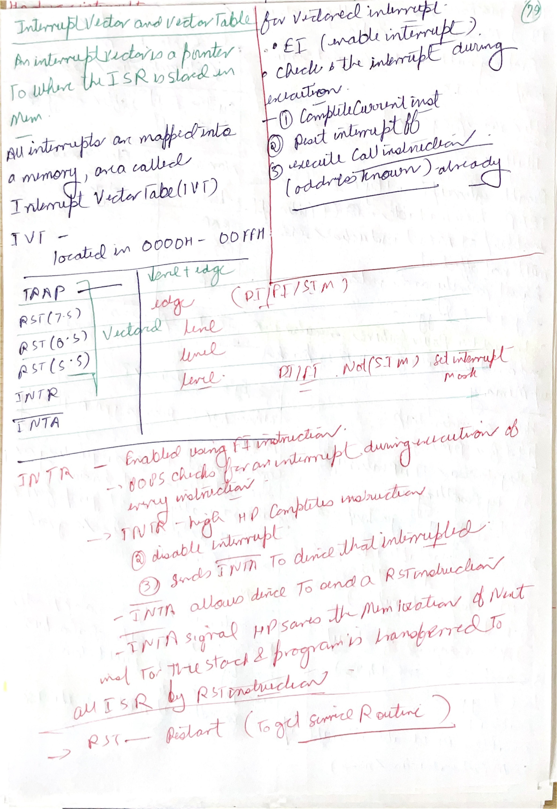
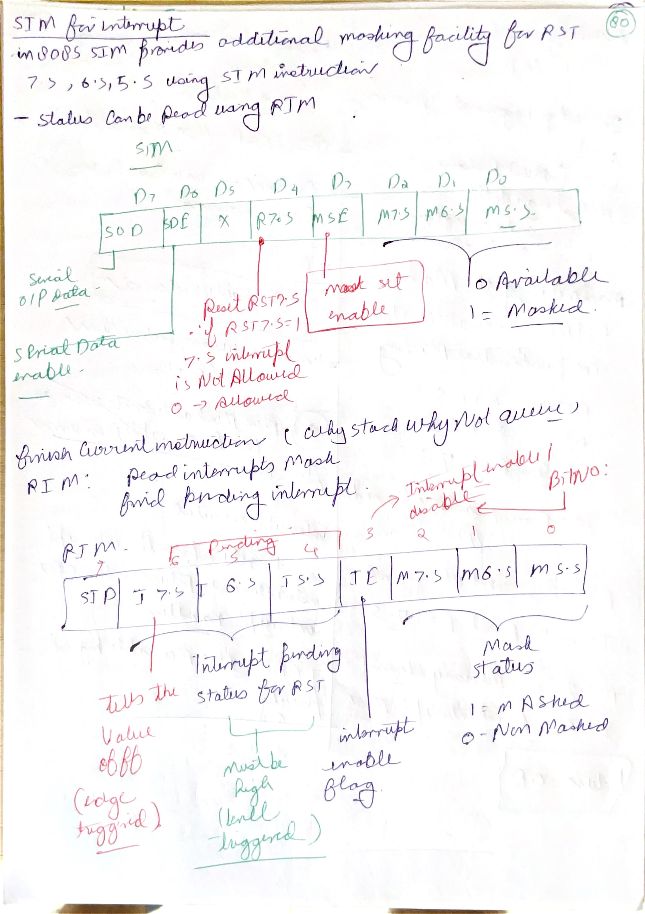
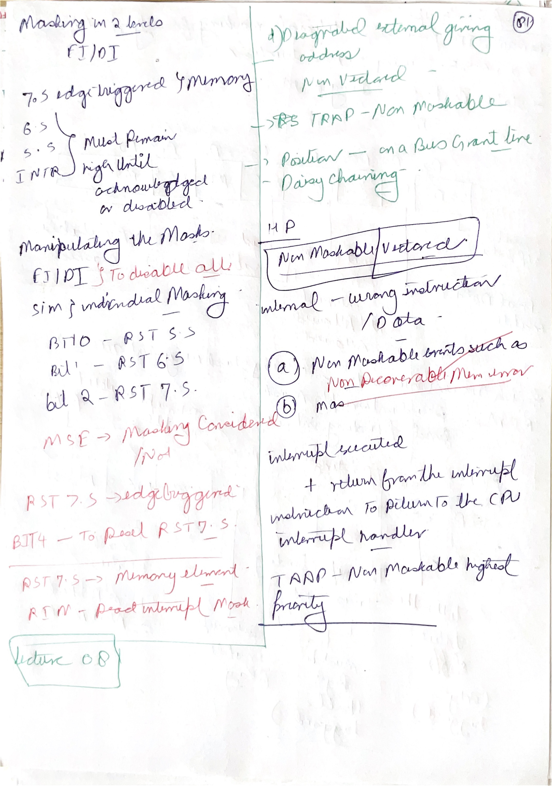
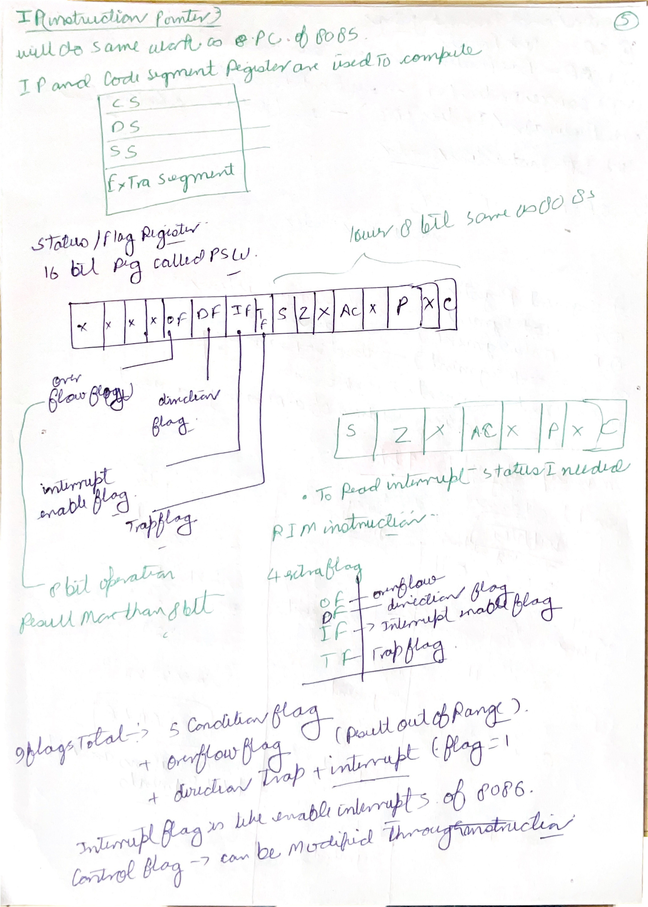

# Day 7: 8085 Interrupts, Vectoring, Priority, and Bus Arbitration

Day 7 covers the May 31 interrupt screenshots. The main idea is that an interrupt is a controlled break in normal program execution. The CPU pauses the current program, saves enough context to return later, branches to an interrupt service routine, performs the service work, and then returns.

## Image Index

| No. | Image | Main idea |
| --- | --- | --- |
| 1 | [Interrupt service routine flow](images/Day%207/day-7-interrupt-service-routine-flow.png) | Main program and ISR flow. |
| 2 | [Disable interrupt DI](images/Day%207/day-7-disable-interrupt-di.png) | `DI` disables maskable interrupts. |
| 3 | [TRAP non-maskable interrupt](images/Day%207/day-7-trap-non-maskable-interrupt.png) | `TRAP` is highest-priority, vectored, and non-maskable. |
| 4 | [RST 7.5 interrupt](images/Day%207/day-7-rst-75-interrupt.png) | `RST 7.5` is maskable, vectored, and edge sensitive. |
| 5 | [INTR acknowledge sequence](images/Day%207/day-7-intr-acknowledge-sequence.png) | `INTR` needs interrupt acknowledge and an externally supplied instruction. |
| 6 | [Interrupt vector table](images/Day%207/day-7-interrupt-vector-table.png) | Vector addresses and interrupt-service locations. |
| 7 | [Interrupt priority vector table](images/Day%207/day-7-interrupt-priority-vector-table.png) | Priority, maskable status, vectoring, and triggering. |
| 8 | [Maskable vectored interrupt process](images/Day%207/day-7-maskable-vectored-interrupt-process.png) | How the CPU accepts and services a maskable vectored interrupt. |
| 9 | [Interrupt mask flip-flop diagram](images/Day%207/day-7-interrupt-mask-flip-flop-diagram.png) | Mask flip-flops and pending state. |
| 10 | [Triggering levels: edge and level](images/Day%207/day-7-triggering-levels-edge-level.png) | Edge-triggered and level-triggered interrupt behavior. |
| 11 | [Bus arbitration daisy chaining question](images/Day%207/day-7-bus-arbitration-daisy-chaining-question.png) | Daisy chaining assigns priority by position. |
| 12 | [Non-maskable interrupt question](images/Day%207/day-7-non-maskable-interrupt-question.png) | Non-maskable interrupt use case. |
| 13 | [Interrupt handler question](images/Day%207/day-7-interrupt-handler-question.png) | Interrupt handler/ISR role. |
| 14 | [Non-maskable interrupt answer](images/Day%207/day-7-non-maskable-interrupt-answer.png) | Reinforces non-maskable interrupt meaning. |

## Handwritten Notes Linked To Day 7

| Page | Handwritten note | How to revise it with the screenshots |
| --- | --- | --- |
| [85completed p004](images/HandWrittenNotes/85completed/page-004.jpg) |  | Use with the ISR flow. It compares ordinary subroutine calls with interrupt-triggered service routines. |
| [85completed p005](images/HandWrittenNotes/85completed/page-005.jpg) |  | Use with vector addresses. It shows `RST n` address calculation and software/hardware interrupt meaning. |
| [85completed p006](images/HandWrittenNotes/85completed/page-006.jpg) |  | Use with the priority table. It separates `TRAP`, `RST 7.5`, `RST 6.5`, `RST 5.5`, and `INTR`. |
| [85completed p007](images/HandWrittenNotes/85completed/page-007.jpg) |  | Use with `INTR` and triggering levels. It explains edge versus level and why `INTR` is non-vectored. |
| [85completed p008](images/HandWrittenNotes/85completed/page-008.jpg) |  | Use with vector-table flow. It links `EI`, interrupt enable, pending state, and ISR branching. |
| [85completed p009](images/HandWrittenNotes/85completed/page-009.jpg) |  | Use with `SIM/RIM` and mask bits. It shows how the accumulator controls interrupt masks. |
| [85completed p010](images/HandWrittenNotes/85completed/page-010.jpg) |  | Use as final interrupt recap: priority, vectoring, masking, and `TRAP` behavior. |
| [85completed p019](images/HandWrittenNotes/85completed/page-019.jpg) |  | Use with `RIM`, mask status, pending bits, and the flag/PSW relationship. |

## 1. Interrupt Service Routine Flow


An **interrupt** is a request for service from an event that is outside the normal sequence of the current program. The event may be a hardware signal such as `TRAP`, `RST 7.5`, or `INTR`, or it may be a software restart instruction such as `RST n`.

The important sequence is:

```text
main program runs
interrupt request occurs
CPU finishes the current instruction
CPU accepts the interrupt if allowed
CPU saves return information
CPU branches to ISR
ISR performs service work
ISR returns to the interrupted program
```

An ISR is similar to a subroutine because both are service code blocks, but the trigger is different. A subroutine is called deliberately by the running program using `CALL`. An interrupt service routine is entered because an interrupt request has been accepted. That is why interrupt handling must be careful about saving registers and flags: the interrupted program did not necessarily expect the service routine to run at that exact point.

## 2. `DI`, `EI`, and Maskable Interrupts


The 8085 has an interrupt enable flip-flop for maskable interrupts. The instruction:

```asm
DI
```

disables maskable interrupts by resetting the interrupt-enable state. The instruction:

```asm
EI
```

enables maskable interrupts again.

This affects `RST 7.5`, `RST 6.5`, `RST 5.5`, and `INTR`. It does **not** disable `TRAP`, because `TRAP` is non-maskable.

Do not confuse a physical interrupt pin with CPU acceptance. A signal can physically arrive at a pin, but if it is masked or interrupts are disabled, the CPU may not service it. This distinction matters especially for `RST 7.5`, which can latch a pending edge.

## 3. `TRAP`, `RST 7.5`, `RST 6.5`, `RST 5.5`, and `INTR`


The 8085 interrupt priority is:

```text
TRAP > RST 7.5 > RST 6.5 > RST 5.5 > INTR
```

The practical comparison:

| Interrupt | Maskable | Vectored | Triggering | Service address idea |
| --- | --- | --- | --- | --- |
| `TRAP` | No | Yes | Edge and level | `0024H` |
| `RST 7.5` | Yes | Yes | Positive edge | `003CH` |
| `RST 6.5` | Yes | Yes | Level | `0034H` |
| `RST 5.5` | Yes | Yes | Level | `002CH` |
| `INTR` | Yes | No | Level | External hardware supplies instruction during acknowledge. |

`TRAP` is used for urgent events because it cannot be disabled by ordinary masking. `RST 7.5` is edge triggered, so it can remember a transition. `RST 6.5` and `RST 5.5` are level sensitive, so the request must remain active long enough to be recognized. `INTR` is the most flexible but also needs external hardware support because it is non-vectored.

For `INTR`, the CPU responds with interrupt acknowledge. External hardware must place an instruction on the data bus, commonly a restart or call instruction. That supplied instruction tells the CPU where to go.

## 4. Interrupt Vector Addresses


A **vectored interrupt** has a predefined service address. For restart-style vectors:

```text
RST n address = 8 x n
```

Examples:

| Interrupt | Calculation | Address |
| --- | --- | --- |
| `RST 5.5` | `5.5 x 8` | `002CH` |
| `RST 6.5` | `6.5 x 8` | `0034H` |
| `RST 7.5` | `7.5 x 8` | `003CH` |

`TRAP` uses `0024H`. The fractional-looking names `5.5`, `6.5`, and `7.5` are historical interrupt names, not decimal memory addresses. Always multiply by 8 and convert to hex.

The reason vectoring matters is speed and hardware simplicity. A vectored interrupt already has a known service address, so the CPU does not need external hardware to supply a full instruction. For `INTR`, there is no fixed vector, so external hardware must provide the next instruction during interrupt acknowledge.

## 5. Mask Flip-Flops, `SIM`, and `RIM`


`SIM` and `RIM` use the accumulator as a bit field.

`SIM` means **Set Interrupt Mask**. It writes control bits from `A`:

| Accumulator bit | `SIM` meaning |
| --- | --- |
| `D7` | Serial output data (`SOD`) |
| `D6` | Serial data enable |
| `D5` | Not normally used |
| `D4` | Reset `RST 7.5` latch |
| `D3` | Mask set enable |
| `D2` | Mask `RST 7.5` |
| `D1` | Mask `RST 6.5` |
| `D0` | Mask `RST 5.5` |

`RIM` means **Read Interrupt Mask**. It reads status into `A`, including interrupt masks, pending interrupt bits, interrupt enable status, and serial input status.

This is why the screenshots show flip-flops. A mask bit is not just a number in the accumulator; after `SIM`, it controls whether the interrupt input can be recognized. `RST 7.5` also has latch behavior, so an edge can be remembered until cleared or serviced.

## 6. Edge Triggering, Level Triggering, and Priority


Triggering tells what kind of signal the CPU recognizes:

| Triggering type | Meaning | 8085 example |
| --- | --- | --- |
| Edge triggered | Recognizes a transition from low to high. | `RST 7.5` |
| Level sensitive | Recognizes that the pin is held at active level. | `RST 6.5`, `RST 5.5`, `INTR` |
| Edge and level | Requires a special high-priority recognition condition. | `TRAP` |

Priority matters when more than one interrupt is pending. The CPU chooses the highest-priority accepted request. Masking matters before priority: a masked interrupt is blocked even if its physical request exists.

## 7. Bus Arbitration and Daisy Chaining


Daisy chaining is a hardware priority method. A bus-grant signal passes through devices in sequence. The first requesting device in the chain captures the grant and blocks it from reaching lower-priority devices.

The idea is:

```text
processor grants bus
grant reaches device 1 first
if device 1 needs bus, it takes it
otherwise grant passes to device 2
then to device 3, and so on
```

The device closest to the grant source has the highest priority. This is simple hardware, but it can starve lower-priority devices if high-priority devices request often.

## 8. Non-Maskable Interrupts and Interrupt Handlers


A non-maskable interrupt is used when the event is too important to ignore through ordinary interrupt masking. Examples in basic microprocessor courses include power failure warning, emergency shutdown, or other high-priority fault conditions.

An interrupt handler is the routine that services the interrupt. A good handler must:

1. Preserve any registers or flags it will disturb, if the interrupted program needs them.
2. Service the hardware or event.
3. Clear or acknowledge the request if required.
4. Restore saved state.
5. Return using the correct return instruction or interrupt return sequence.

The habit to build is this: an interrupt is not simply a jump. It is a controlled context change with a return path.

## Points To Remember

- `TRAP` has the highest priority and is non-maskable.
- `RST 7.5` is maskable, vectored, and edge sensitive.
- `RST 6.5` and `RST 5.5` are maskable, vectored, and level sensitive.
- `INTR` is maskable, non-vectored, and needs external hardware to supply an instruction.
- `DI` disables maskable interrupts; `EI` enables them.
- `SIM` writes interrupt masks; `RIM` reads interrupt/mask status.
- Vector address for `RST n` is `8 x n`.
- Daisy chaining gives priority by physical position in the grant chain.

## Sources

[S1] Intel Corporation, [MCS-80/85 Family User's Manual, January 1983](https://www.bitsavers.org/components/intel/MCS80/MCS80_85_Users_Manual_Jan83.pdf). Used for 8085 interrupt inputs, priority, vectoring, `INTR`, `TRAP`, mask behavior, and bus-control context.

[S2] Intel Corporation, [8080/8085 Assembly Language Programming Manual, May 1981](https://www.bitsavers.org/pdf/intel/ISIS_II/9800301-04_8080_8085_Assembly_Language_Programming_Manual_May81.pdf). Used for `DI`, `EI`, `SIM`, `RIM`, restart instructions, and interrupt-related programming notation.
