# Handwritten Notes Index

The handwritten PDFs in `HandWrittenNotes/` have been rendered into page images under `images/HandWrittenNotes/`. This index maps every page image to the day where it is most useful for revision. The day files embed the relevant pages directly with the video screenshots, page explanations, and an added day-level deepening section that explains how to study the handwritten notes together with the screenshots.

## PDF To Image Folders

| Source PDF | Rendered folder | Pages | Main coverage |
| --- | --- | ---: | --- |
| [8085-basics-pins-timing-memory-io.pdf](HandWrittenNotes/8085-basics-pins-timing-memory-io.pdf) | [images/HandWrittenNotes/till46](images/HandWrittenNotes/till46/) | 24 | 8085 basics, pins, timing, machine cycles, addressing, memory and I/O interfacing. |
| [8085-instruction-set-addressing-arithmetic-logic-branching.pdf](HandWrittenNotes/8085-instruction-set-addressing-arithmetic-logic-branching.pdf) | [images/HandWrittenNotes/till47](images/HandWrittenNotes/till47/) | 24 | Data transfer, addressing modes, arithmetic, logical instructions, rotates, branches. |
| [8085-stack-subroutines-sim-rim-timing-practice.pdf](HandWrittenNotes/8085-stack-subroutines-sim-rim-timing-practice.pdf) | [images/HandWrittenNotes/till73](images/HandWrittenNotes/till73/) | 24 | Stack, subroutines, branch practice, `SIM/RIM`, rotates, timing, flags, assignment traces. |
| [8085-interrupts-io-dma-support-chips-8086-transition.pdf](HandWrittenNotes/8085-interrupts-io-dma-support-chips-8086-transition.pdf) | [images/HandWrittenNotes/85completed](images/HandWrittenNotes/85completed/) | 22 | Late 8085: delay loops, interrupts, programmed I/O, DMA, support chips, 8086 transition. |
| [8086-pins-architecture-flags-addressing-io.pdf](HandWrittenNotes/8086-pins-architecture-flags-addressing-io.pdf) | [images/HandWrittenNotes/86tilllnow](images/HandWrittenNotes/86tilllnow/) | 12 | 8086 pins, min/max mode, BIU/EU, flags, addressing modes, interrupts, instruction set. |
| [8086-instructions-addressing-stack-arithmetic-logic-control-flow.pdf](HandWrittenNotes/8086-instructions-addressing-stack-arithmetic-logic-control-flow.pdf) | [images/HandWrittenNotes/scanned-2026-06-16-231727](images/HandWrittenNotes/scanned-2026-06-16-231727/) | 24 | 8086 pins, min/max mode, BIU/EU, flags, addressing, stack, arithmetic, rotate/string/control-transfer, and I/O. |
| [8086-io-interfacing-support-chips-mcqs.pdf](HandWrittenNotes/8086-io-interfacing-support-chips-mcqs.pdf) | [images/HandWrittenNotes/scanned-2026-06-16-231851](images/HandWrittenNotes/scanned-2026-06-16-231851/) | 6 | 8086 I/O organization, min/max mode interface, `IN/OUT`, support chips, bus-loading MCQs, and stack segment size. |
| [8051-microcontroller-architecture-memory-addressing-timers.pdf](HandWrittenNotes/8051-microcontroller-architecture-memory-addressing-timers.pdf) | [images/HandWrittenNotes/8051-microcontroller-notes](images/HandWrittenNotes/8051-microcontroller-notes/) | 8 | 8051 microcontroller overview, features, PSW/register banks, stack, DPTR/PC, ports, SBUF, timers, control pins, internal memory, addressing modes, and timer/counter control. |
| [8051-serial-port-programming-instruction-set-mcqs.pdf](HandWrittenNotes/8051-serial-port-programming-instruction-set-mcqs.pdf) | [images/HandWrittenNotes/8051-serial-port-programming-instruction-set-mcqs](images/HandWrittenNotes/8051-serial-port-programming-instruction-set-mcqs/) | 22 | 8051 timer continuation, `TCON`, serial port, `SBUF`, `SCON`, baud-rate generation, transmit/receive loops, 8096 comparison, MCQs, and 8051 instruction-set practice. |

## Page Map

| Page image | Best day | Topic to revise from the page |
| --- | --- | --- |
| [till46 page 001](images/HandWrittenNotes/till46/page-001.jpg) | [Day 01](Day%2001.md) | ALU, accumulator, flags, byte/nibble, carry and auxiliary carry. |
| [till46 page 002](images/HandWrittenNotes/till46/page-002.jpg) | [Day 01](Day%2001.md) | Accumulator, temporary registers, general-purpose registers, PC, SP, instruction register, timing/control. |
| [till46 page 003](images/HandWrittenNotes/till46/page-003.jpg) | [Day 01](Day%2001.md) | 8085 features: 8-bit data, 16-bit addressing, tri-state bus, interrupts, serial I/O. |
| [till46 page 004](images/HandWrittenNotes/till46/page-004.jpg) | [Day 01](Day%2001.md) | Pin diagram, clock, reset, `HOLD/HLDA`, `READY`, interrupts, address/data pins. |
| [till46 page 005](images/HandWrittenNotes/till46/page-005.jpg) | [Day 01](Day%2001.md) | `IO/M`, `S1`, `S0`, `ALE`, `/RD`, `/WR`, and status/control table. |
| [till46 page 006](images/HandWrittenNotes/till46/page-006.jpg) | [Day 01](Day%2001.md) | Multiplexed address/data bus, latch, `SID/SOD`, and interrupt pin grouping. |
| [till46 page 007](images/HandWrittenNotes/till46/page-007.jpg) | [Day 01](Day%2001.md) | 8085 interrupt vector address calculation and interrupt priority. |
| [till46 page 008](images/HandWrittenNotes/till46/page-008.jpg) | [Day 02](Day%2002.md) | Memory mapped I/O and I/O mapped I/O overview. |
| [till46 page 009](images/HandWrittenNotes/till46/page-009.jpg) | [Day 02](Day%2002.md) | `ALE`, machine cycle, `T`-state, and multiplexed bus timing. |
| [till46 page 010](images/HandWrittenNotes/till46/page-010.jpg) | [Day 02](Day%2002.md) | Instruction cycle versus machine cycle and status line decoding. |
| [till46 page 011](images/HandWrittenNotes/till46/page-011.jpg) | [Day 02](Day%2002.md) | Machine cycles, `T`-states, opcode fetch, memory read, and `ADD B` timing idea. |
| [till46 page 012](images/HandWrittenNotes/till46/page-012.jpg) | [Day 02](Day%2002.md) | Word, instruction, object code, address bus, data bus, and opcode idea. |
| [till46 page 013](images/HandWrittenNotes/till46/page-013.jpg) | [Day 02](Day%2002.md) | Opcode fetch timing diagram and `MVI B,05H` cycle sequence. |
| [till46 page 014](images/HandWrittenNotes/till46/page-014.jpg) | [Day 02](Day%2002.md) | `MVI B,05H`, immediate data byte, memory placement, and I/O read. |
| [till46 page 015](images/HandWrittenNotes/till46/page-015.jpg) | [Day 02](Day%2002.md) | Instruction set organization and addressing modes. |
| [till46 page 016](images/HandWrittenNotes/till46/page-016.jpg) | [Day 02](Day%2002.md) | Memory interfacing, chip select, and address decoding. |
| [till46 page 017](images/HandWrittenNotes/till46/page-017.jpg) | [Day 02](Day%2002.md) | ROM interfacing, address decoder, and address range examples. |
| [till46 page 018](images/HandWrittenNotes/till46/page-018.jpg) | [Day 02](Day%2002.md) | Memory mapped versus I/O mapped I/O, port width, and `IN/OUT`. |
| [till46 page 019](images/HandWrittenNotes/till46/page-019.jpg) | [Day 02](Day%2002.md) | `4K x 8`, address-line count, capacity, and highest-address calculation. |
| [till46 page 020](images/HandWrittenNotes/till46/page-020.jpg) | [Day 02](Day%2002.md) | Address decoding logic and chip-select generation. |
| [till46 page 021](images/HandWrittenNotes/till46/page-021.jpg) | [Day 02](Day%2002.md) | `LDA/STA`, instruction cycle, machine cycle, and T-state relation. |
| [till46 page 022](images/HandWrittenNotes/till46/page-022.jpg) | [Day 02](Day%2002.md) | Instruction-set classification by length, operation, and addressing mode. |
| [till46 page 023](images/HandWrittenNotes/till46/page-023.jpg) | [Day 02](Day%2002.md) | Register notation, memory symbol `M`, flags, and addressing symbols. |
| [till46 page 024](images/HandWrittenNotes/till46/page-024.jpg) | [Day 02](Day%2002.md) | Control-signal generation and one-byte instruction examples. |
| [till47 page 001](images/HandWrittenNotes/till47/page-001.jpg) | [Day 03](Day%2003.md) | Instruction byte length, addressing modes, `MVI`, `LDA`, and `JMP`. |
| [till47 page 002](images/HandWrittenNotes/till47/page-002.jpg) | [Day 03](Day%2003.md) | Implicit, memory, and register addressing plus flag layout. |
| [till47 page 003](images/HandWrittenNotes/till47/page-003.jpg) | [Day 03](Day%2003.md) | `MOV A,M`, `MOV M,R`, `LDA`, and `STA`. |
| [till47 page 004](images/HandWrittenNotes/till47/page-004.jpg) | [Day 03](Day%2003.md) | `MVI M,data`, `LXI H`, and register-indirect memory access. |
| [till47 page 005](images/HandWrittenNotes/till47/page-005.jpg) | [Day 03](Day%2003.md) | One-, two-, and three-byte instructions with `LDA`. |
| [till47 page 006](images/HandWrittenNotes/till47/page-006.jpg) | [Day 03](Day%2003.md) | `LDAX`, `STAX`, and register-pair indirect addressing. |
| [till47 page 007](images/HandWrittenNotes/till47/page-007.jpg) | [Day 03](Day%2003.md) | `LHLD`, `SHLD`, and low-byte/high-byte order. |
| [till47 page 008](images/HandWrittenNotes/till47/page-008.jpg) | [Day 03](Day%2003.md) | `LDAX`, `XCHG`, and memory/register-pair tracing. |
| [till47 page 009](images/HandWrittenNotes/till47/page-009.jpg) | [Day 03](Day%2003.md) | `LXI H`, `SHLD`, register-pair memory storage. |
| [till47 page 010](images/HandWrittenNotes/till47/page-010.jpg) | [Day 03](Day%2003.md) | `XCHG`, `DAD`, and register-pair trace practice. |
| [till47 page 011](images/HandWrittenNotes/till47/page-011.jpg) | [Day 05](Day%2005.md) | `SUB`, `SBB`, borrow, carry, and signed result. |
| [till47 page 012](images/HandWrittenNotes/till47/page-012.jpg) | [Day 05](Day%2005.md) | `SUI`, two's-complement subtraction, carry, sign, and auxiliary carry. |
| [till47 page 013](images/HandWrittenNotes/till47/page-013.jpg) | [Day 05](Day%2005.md) | `INR`, `DCR`, `INX`, and `DCX`. |
| [till47 page 014](images/HandWrittenNotes/till47/page-014.jpg) | [Day 05](Day%2005.md) | `DAA`, BCD correction, and auxiliary carry. |
| [till47 page 015](images/HandWrittenNotes/till47/page-015.jpg) | [Day 05](Day%2005.md) | Arithmetic comparison, borrow, sign, and zero flags. |
| [till47 page 016](images/HandWrittenNotes/till47/page-016.jpg) | [Day 05](Day%2005.md) | `INR M`, memory increment, and flags. |
| [till47 page 017](images/HandWrittenNotes/till47/page-017.jpg) | [Day 05](Day%2005.md) | `DAA`, `XRA`, `DAD`, and program trace. |
| [till47 page 018](images/HandWrittenNotes/till47/page-018.jpg) | [Day 05](Day%2005.md) | Logical instructions and complement behavior. |
| [till47 page 019](images/HandWrittenNotes/till47/page-019.jpg) | [Day 05](Day%2005.md) | `ORA`, `ANA`, memory operands, and logical flags. |
| [till47 page 020](images/HandWrittenNotes/till47/page-020.jpg) | [Day 05](Day%2005.md) | `XRA`, `XRI`, and `CMA`. |
| [till47 page 021](images/HandWrittenNotes/till47/page-021.jpg) | [Day 05](Day%2005.md) | `CMP`, `STC`, `CMC`, and rotate carry behavior. |
| [till47 page 022](images/HandWrittenNotes/till47/page-022.jpg) | [Day 05](Day%2005.md) | `RRC`, `RAL`, and accumulator/carry rotation. |
| [till47 page 023](images/HandWrittenNotes/till47/page-023.jpg) | [Day 05](Day%2005.md) | Branch instructions and conditional jump table. |
| [till47 page 024](images/HandWrittenNotes/till47/page-024.jpg) | [Day 05](Day%2005.md) | Rotate/branch practice and carry tracing. |
| [till73 page 001](images/HandWrittenNotes/till73/page-001.jpg) | [Day 04](Day%2004.md) | Subroutine, conditional/unconditional `CALL`, and repeated code. |
| [till73 page 002](images/HandWrittenNotes/till73/page-002.jpg) | [Day 04](Day%2004.md) | Conditional calls, conditional returns, flags, and stack use. |
| [till73 page 003](images/HandWrittenNotes/till73/page-003.jpg) | [Day 04](Day%2004.md) | Conditional return/call, subroutine return, and flag conditions. |
| [till73 page 004](images/HandWrittenNotes/till73/page-004.jpg) | [Day 04](Day%2004.md) | Program trace with `CALL`, register updates, and flags. |
| [till73 page 005](images/HandWrittenNotes/till73/page-005.jpg) | [Day 04](Day%2004.md) | `CALL`, `RET`, stack pointer, PSW, and push/pop purpose. |
| [till73 page 006](images/HandWrittenNotes/till73/page-006.jpg) | [Day 04](Day%2004.md) | `PUSH`, `POP`, `XTHL`, `SPHL`, and stack/register exchange. |
| [till73 page 007](images/HandWrittenNotes/till73/page-007.jpg) | [Day 04](Day%2004.md) | `CALL 1006H`, return address, `POP H`, and `SP` tracing. |
| [till73 page 008](images/HandWrittenNotes/till73/page-008.jpg) | [Day 04](Day%2004.md) | Stack trace with `PUSH`, `POP`, `DAD`, and register contents. |
| [till73 page 009](images/HandWrittenNotes/till73/page-009.jpg) | [Day 04](Day%2004.md) | `IN`, `OUT`, signed input loop, `RAL`, and carry test. |
| [till73 page 010](images/HandWrittenNotes/till73/page-010.jpg) | [Day 04](Day%2004.md) | `HLT`, `NOP`, `DI`, `EI`, and `SIM`. |
| [till73 page 011](images/HandWrittenNotes/till73/page-011.jpg) | [Day 04](Day%2004.md) | `RIM` bit fields, interrupt pending bits, and serial input. |
| [till73 page 012](images/HandWrittenNotes/till73/page-012.jpg) | [Day 04](Day%2004.md) | `SIM` mask bits, `SOD`, `SDE`, and interrupt masks. |
| [till73 page 013](images/HandWrittenNotes/till73/page-013.jpg) | [Day 06](Day%2006.md) | `INR M`, binary result, and carry/auxiliary-carry reasoning. |
| [till73 page 014](images/HandWrittenNotes/till73/page-014.jpg) | [Day 06](Day%2006.md) | Program trace with result, sign, zero, parity, and carry. |
| [till73 page 015](images/HandWrittenNotes/till73/page-015.jpg) | [Day 06](Day%2006.md) | Memory program practice, `CMA`, `INR`, and complement behavior. |
| [till73 page 016](images/HandWrittenNotes/till73/page-016.jpg) | [Day 06](Day%2006.md) | Stack/program trace and memory contents. |
| [till73 page 017](images/HandWrittenNotes/till73/page-017.jpg) | [Day 06](Day%2006.md) | Rotate instructions `RLC`, `RRC`, `RAL`, and `RAR`. |
| [till73 page 018](images/HandWrittenNotes/till73/page-018.jpg) | [Day 06](Day%2006.md) | `XCHG`, `DAD`, register pairs, `PC`, `SP`, and instruction cycles. |
| [till73 page 019](images/HandWrittenNotes/till73/page-019.jpg) | [Day 06](Day%2006.md) | Rotate trace and interrupt-related register examples. |
| [till73 page 020](images/HandWrittenNotes/till73/page-020.jpg) | [Day 06](Day%2006.md) | Delay loop and total T-state calculation. |
| [till73 page 021](images/HandWrittenNotes/till73/page-021.jpg) | [Day 06](Day%2006.md) | Flags, interrupts, instruction timing, and direct addressing recap. |
| [till73 page 022](images/HandWrittenNotes/till73/page-022.jpg) | [Day 06](Day%2006.md) | Memory block/address calculation and `DAD`. |
| [till73 page 023](images/HandWrittenNotes/till73/page-023.jpg) | [Day 06](Day%2006.md) | `DAD`, `CMP`, `RET`, flag register, and vector/non-vectored interrupt notes. |
| [till73 page 024](images/HandWrittenNotes/till73/page-024.jpg) | [Day 06](Day%2006.md) | `XRA`, `SUI`, `ANA`, final accumulator, and flags. |
| [85completed page 001](images/HandWrittenNotes/85completed/page-001.jpg) | [Day 06](Day%2006.md) | Loop/register trace, `ADD`, `MOV`, borrow/carry, and accumulator result. |
| [85completed page 002](images/HandWrittenNotes/85completed/page-002.jpg) | [Day 06](Day%2006.md) | Delay loop T-state calculation and loop iteration count. |
| [85completed page 003](images/HandWrittenNotes/85completed/page-003.jpg) | [Day 06](Day%2006.md) | Conditional output, flags, `CALL`, return address, and stack. |
| [85completed page 004](images/HandWrittenNotes/85completed/page-004.jpg) | [Day 07](Day%2007.md) | Interrupt purpose, ISR idea, subroutine comparison, and priority. |
| [85completed page 005](images/HandWrittenNotes/85completed/page-005.jpg) | [Day 07](Day%2007.md) | Software/hardware interrupts, vectors, and `RST` address examples. |
| [85completed page 006](images/HandWrittenNotes/85completed/page-006.jpg) | [Day 07](Day%2007.md) | Maskable/non-maskable interrupts, `TRAP`, `RST 7.5/6.5/5.5`, and `INTR`. |
| [85completed page 007](images/HandWrittenNotes/85completed/page-007.jpg) | [Day 07](Day%2007.md) | `INTR`, triggering, priority, ISR, and interrupt classes. |
| [85completed page 008](images/HandWrittenNotes/85completed/page-008.jpg) | [Day 07](Day%2007.md) | Interrupt vector table, `EI`, pending interrupts, and maskable vectoring. |
| [85completed page 009](images/HandWrittenNotes/85completed/page-009.jpg) | [Day 07](Day%2007.md) | `SIM` mask byte and `RIM` interrupt-mask status. |
| [85completed page 010](images/HandWrittenNotes/85completed/page-010.jpg) | [Day 07](Day%2007.md) | Interrupt masking, priority, and vectored/non-vectored recap. |
| [85completed page 011](images/HandWrittenNotes/85completed/page-011.jpg) | [Day 08](Day%2008.md) | Programmed I/O, I/O ports, and data-transfer modes. |
| [85completed page 012](images/HandWrittenNotes/85completed/page-012.jpg) | [Day 08](Day%2008.md) | Synchronous/asynchronous transfer, strobe, handshaking, and timing. |
| [85completed page 013](images/HandWrittenNotes/85completed/page-013.jpg) | [Day 08](Day%2008.md) | DMA basics, `HOLD/HLDA`, bus control, and DMA controller role. |
| [85completed page 014](images/HandWrittenNotes/85completed/page-014.jpg) | [Day 08](Day%2008.md) | DMA modes: burst, cycle stealing, and transfer-rate reasoning. |
| [85completed page 015](images/HandWrittenNotes/85completed/page-015.jpg) | [Day 08](Day%2008.md) | 8255 programmable peripheral interface and port grouping. |
| [85completed page 016](images/HandWrittenNotes/85completed/page-016.jpg) | [Day 08](Day%2008.md) | 8253 timer, 8257 DMA controller, and support-chip overview. |
| [85completed page 017](images/HandWrittenNotes/85completed/page-017.jpg) | [Day 08](Day%2008.md) | 8259, 8257, 8272, 8275, 8279, and peripheral-controller purposes. |
| [85completed page 018](images/HandWrittenNotes/85completed/page-018.jpg) | [Day 08](Day%2008.md) | Instruction-set/addressing/interrupt recap used to connect support chips back to 8085 programming. |
| [85completed page 019](images/HandWrittenNotes/85completed/page-019.jpg) | [Day 07](Day%2007.md) | `RIM`, interrupt pending bits, mask bits, and PSW/flag recap. |
| [85completed page 020](images/HandWrittenNotes/85completed/page-020.jpg) | [Day 02](Day%2002.md) | Instruction format, register notation, machine cycles, and addressing modes recap. |
| [85completed page 021](images/HandWrittenNotes/85completed/page-021.jpg) | [Day 09](Day%2009.md) | 8086 bus interface unit, execution unit, prefetch queue, and registers. |
| [85completed page 022](images/HandWrittenNotes/85completed/page-022.jpg) | [Day 09](Day%2009.md) | 8086 architecture sketch, BIU, EU, queue, and internal buses. |
| [86tilllnow page 001](images/HandWrittenNotes/86tilllnow/page-001.jpg) | [Day 09](Day%2009.md) | 8086 pin diagram, AD bus, 16-bit data bus, and min/max mode idea. |
| [86tilllnow page 002](images/HandWrittenNotes/86tilllnow/page-002.jpg) | [Day 09](Day%2009.md) | Minimum-mode and maximum-mode signal meanings. |
| [86tilllnow page 003](images/HandWrittenNotes/86tilllnow/page-003.jpg) | [Day 09](Day%2009.md) | `AD0-AD15`, `A16-A19/S3-S6`, `NMI`, `INTR`, and multiplexed 8086 signals. |
| [86tilllnow page 004](images/HandWrittenNotes/86tilllnow/page-004.jpg) | [Day 09](Day%2009.md) | 8086 minimum/maximum mode, control signals, and EU/BIU split. |
| [86tilllnow page 005](images/HandWrittenNotes/86tilllnow/page-005.jpg) | [Day 09](Day%2009.md) | 8086 ALU, flags, bus interface, queue, and address path sketch. |
| [86tilllnow page 006](images/HandWrittenNotes/86tilllnow/page-006.jpg) | [Day 09](Day%2009.md) | BIU/EU, segment registers, instruction queue, and memory segmentation. |
| [86tilllnow page 007](images/HandWrittenNotes/86tilllnow/page-007.jpg) | [Day 10](Day%2010.md) | 8086 flag register, trap/interrupt/direction flags, and stack addressing notes. |
| [86tilllnow page 008](images/HandWrittenNotes/86tilllnow/page-008.jpg) | [Day 10](Day%2010.md) | 8086 addressing modes, segment offset, physical address, and direct addressing. |
| [86tilllnow page 009](images/HandWrittenNotes/86tilllnow/page-009.jpg) | [Day 10](Day%2010.md) | Register, index, base, base-index, and interrupt notes. |
| [86tilllnow page 010](images/HandWrittenNotes/86tilllnow/page-010.jpg) | [Day 10](Day%2010.md) | `MOV` examples, direct/register addressing, and instruction operands. |
| [86tilllnow page 011](images/HandWrittenNotes/86tilllnow/page-011.jpg) | [Day 10](Day%2010.md) | `XLAT`, `IN`, `OUT`, I/O port addressing, and memory/addressing distinction. |
| [86tilllnow page 012](images/HandWrittenNotes/86tilllnow/page-012.jpg) | [Day 10](Day%2010.md) | Multiple branching and 8086 versus 8085 bus/address comparison. |
| [scanned-2026-06-16-231727 page 001](images/HandWrittenNotes/scanned-2026-06-16-231727/page-001.jpg) | [Day 09](Day%2009.md) | 8086 features, multiplexed pins, 20-bit address bus, `READY`, `TEST`, `BHE/S7`, and min/max selection. |
| [scanned-2026-06-16-231727 page 002](images/HandWrittenNotes/scanned-2026-06-16-231727/page-002.jpg) | [Day 09](Day%2009.md) | Minimum-mode versus maximum-mode control-signal ownership and 8086/8288 bus-control split. |
| [scanned-2026-06-16-231727 page 003](images/HandWrittenNotes/scanned-2026-06-16-231727/page-003.jpg) | [Day 09](Day%2009.md) | 8086 pin recap: `AD0-AD15`, 1 MB addressing, `READY`, `/RD`, `A16-A19`, `BHE/S7`, `NMI`, and `TEST`. |
| [scanned-2026-06-16-231727 page 004](images/HandWrittenNotes/scanned-2026-06-16-231727/page-004.jpg) | [Day 09](Day%2009.md) | Min/max mode signals, queue status, local bus priority, BIU/EU division, and instruction queue idea. |
| [scanned-2026-06-16-231727 page 005](images/HandWrittenNotes/scanned-2026-06-16-231727/page-005.jpg) | [Day 09](Day%2009.md) | Internal register groups, segment registers, BIU signals, and queue sketch. |
| [scanned-2026-06-16-231727 page 006](images/HandWrittenNotes/scanned-2026-06-16-231727/page-006.jpg) | [Day 09](Day%2009.md) | Branching, overlapped BIU/EU execution, relocation, general-purpose registers, pointer/index registers, and segments. |
| [scanned-2026-06-16-231727 page 007](images/HandWrittenNotes/scanned-2026-06-16-231727/page-007.jpg) | [Day 09](Day%2009.md) | Memory segments, 64 KB segment size, 8086 flag register, and control/status flags. |
| [scanned-2026-06-16-231727 page 008](images/HandWrittenNotes/scanned-2026-06-16-231727/page-008.jpg) | [Day 10](Day%2010.md) | Immediate, direct, register, register-indirect, displacement, and segment-offset addressing. |
| [scanned-2026-06-16-231727 page 009](images/HandWrittenNotes/scanned-2026-06-16-231727/page-009.jpg) | [Day 10](Day%2010.md) | Register, indirect, relative, indexed, based-indexed addressing and interrupt categories/vectoring. |
| [scanned-2026-06-16-231727 page 010](images/HandWrittenNotes/scanned-2026-06-16-231727/page-010.jpg) | [Day 10](Day%2010.md) | 8086 IVT size, type-vector calculation, `MOV` operand rules, and stack-related source/destination examples. |
| [scanned-2026-06-16-231727 page 011](images/HandWrittenNotes/scanned-2026-06-16-231727/page-011.jpg) | [Day 11](Day%2011.md) | `MOV`, physical address, `XCHG`, `LEA`, `LES`, and `PUSH` word-only stack rule. |
| [scanned-2026-06-16-231727 page 012](images/HandWrittenNotes/scanned-2026-06-16-231727/page-012.jpg) | [Day 11](Day%2011.md) | `POP`, effective-address calculation for stack-to-memory transfer, `PUSHF`, `IN/OUT`, and `MOV` examples. |
| [scanned-2026-06-16-231727 page 013](images/HandWrittenNotes/scanned-2026-06-16-231727/page-013.jpg) | [Day 12](Day%2012.md) | `ADD/ADC/SUB/SBB`, byte and word arrays, effective addresses, `DB/DW`, and multiply result-fit flags. |
| [scanned-2026-06-16-231727 page 014](images/HandWrittenNotes/scanned-2026-06-16-231727/page-014.jpg) | [Day 12](Day%2012.md) | `CBW`, unsigned `MUL`, signed `IMUL`, implicit operands, memory operand size, and `CF/OF` after multiplication. |
| [scanned-2026-06-16-231727 page 015](images/HandWrittenNotes/scanned-2026-06-16-231727/page-015.jpg) | [Day 12](Day%2012.md) | `DIV`, `IDIV`, quotient/remainder placement, type 0 interrupt, `CBW`, and `CWD`. |
| [scanned-2026-06-16-231727 page 016](images/HandWrittenNotes/scanned-2026-06-16-231727/page-016.jpg) | [Day 12](Day%2012.md) | `IDIV` examples, `INC/DEC`, `DAA`, BCD correction, and carry-preserving increment/decrement behavior. |
| [scanned-2026-06-16-231727 page 017](images/HandWrittenNotes/scanned-2026-06-16-231727/page-017.jpg) | [Day 12](Day%2012.md) | `DAS`, `AAA`, `AAM`, `AAD`, ASCII/unpacked BCD adjustment, and logical `AND`. |
| [scanned-2026-06-16-231727 page 018](images/HandWrittenNotes/scanned-2026-06-16-231727/page-018.jpg) | [Day 12](Day%2012.md) | `AAM` worked example, `XOR`, `NEG`, and `CMP` flag-only subtraction. |
| [scanned-2026-06-16-231727 page 019](images/HandWrittenNotes/scanned-2026-06-16-231727/page-019.jpg) | [Day 13](Day%2013.md) | `RCL`, `RCR`, `ROL`, `ROR`, `SAL/SHL`, `SAR`, counts, `CF`, and `OF`. |
| [scanned-2026-06-16-231727 page 020](images/HandWrittenNotes/scanned-2026-06-16-231727/page-020.jpg) | [Day 13](Day%2013.md) | `MOVS`, `STOS`, `CMPS`, `LODS`, direction flag, `REP`, and near jump behavior. |
| [scanned-2026-06-16-231727 page 021](images/HandWrittenNotes/scanned-2026-06-16-231727/page-021.jpg) | [Day 13](Day%2013.md) | Indirect jumps, conditional unsigned jumps, `CALL`, near call return address, and stack reason for calls. |
| [scanned-2026-06-16-231727 page 022](images/HandWrittenNotes/scanned-2026-06-16-231727/page-022.jpg) | [Day 13](Day%2013.md) | Near/far calls, indirect calls, `RET`, `RET n`, and stack cleanup rules. |
| [scanned-2026-06-16-231727 page 023](images/HandWrittenNotes/scanned-2026-06-16-231727/page-023.jpg) | [Day 13](Day%2013.md) | Process-control instructions, interrupt enable/disable, `HLT`, `NOP`, `ESC`, sample programs, and review questions. |
| [scanned-2026-06-16-231727 page 024](images/HandWrittenNotes/scanned-2026-06-16-231727/page-024.jpg) | [Day 13](Day%2013.md) | `PUSH/POPF`, `IN/OUT`, isolated I/O page/port organization, and isolated I/O advantages/disadvantages. |
| [scanned-2026-06-16-231851 page 001](images/HandWrittenNotes/scanned-2026-06-16-231851/page-001.jpg) | [Day 13](Day%2013.md) | Memory-mapped I/O, isolated I/O comparison, min-mode interface signals, `ALE`, `/RD`, `/WR`, `M/IO`, `DT/R`, and `DEN`. |
| [scanned-2026-06-16-231851 page 002](images/HandWrittenNotes/scanned-2026-06-16-231851/page-002.jpg) | [Day 13](Day%2013.md) | Minimum and maximum mode I/O interface diagrams, 8288 controller, and max-mode I/O control signal substitution. |
| [scanned-2026-06-16-231851 page 003](images/HandWrittenNotes/scanned-2026-06-16-231851/page-003.jpg) | [Day 13](Day%2013.md) | Direct and variable `IN/OUT`, `DX` port addressing, output to `B000H`, and word input/output examples. |
| [scanned-2026-06-16-231851 page 004](images/HandWrittenNotes/scanned-2026-06-16-231851/page-004.jpg) | [Day 13](Day%2013.md) | I/O bus-cycle steps, interface-device need, 8251 USART, 8257 DMA, and peripheral-to-memory bus ownership. |
| [scanned-2026-06-16-231851 page 005](images/HandWrittenNotes/scanned-2026-06-16-231851/page-005.jpg) | [Day 13](Day%2013.md) | 8259, 8275, 8279, input-device quiz, bus current/loading quiz, memory-mapped device view, and unsupported direct BCD multiplication. |
| [scanned-2026-06-16-231851 page 006](images/HandWrittenNotes/scanned-2026-06-16-231851/page-006.jpg) | [Day 13](Day%2013.md) | Stack segment maximum-size recap: 16-bit offset range gives 64 KB per segment. |
| [8051-microcontroller-notes page 001](images/HandWrittenNotes/8051-microcontroller-notes/page-001.jpg) | [Day 14](Day%2014.md) | 8051 microcontroller system boundary, integrated resources, and microprocessor-versus-microcontroller comparison. |
| [8051-microcontroller-notes page 002](images/HandWrittenNotes/8051-microcontroller-notes/page-002.jpg) | [Day 14](Day%2014.md) | 8051 features, register banks, PSW bank select bits, stack pointer reset, DPTR bytes, and PC behavior. |
| [8051-microcontroller-notes page 003](images/HandWrittenNotes/8051-microcontroller-notes/page-003.jpg) | [Day 14](Day%2014.md) | Port SFR latches, input setup, `SBUF`, timer pairs, and control registers. |
| [8051-microcontroller-notes page 004](images/HandWrittenNotes/8051-microcontroller-notes/page-004.jpg) | [Day 14](Day%2014.md) | `PSEN`, `ALE`, `EA`, reset, oscillator, internal memory sections, and SFR-region cautions. |
| [8051-microcontroller-notes page 005](images/HandWrittenNotes/8051-microcontroller-notes/page-005.jpg) | [Day 14](Day%2014.md) | Bit-addressable RAM, SFRs, external memory, internal RAM regions, and Port 0/Port 2 bus roles. |
| [8051-microcontroller-notes page 006](images/HandWrittenNotes/8051-microcontroller-notes/page-006.jpg) | [Day 14](Day%2014.md) | Register-bank ranges, bit-addressable/general RAM ranges, pin roles, `PSEN`, `ALE`, and external-memory use. |
| [8051-microcontroller-notes page 007](images/HandWrittenNotes/8051-microcontroller-notes/page-007.jpg) | [Day 14](Day%2014.md) | Addressing modes, immediate data, direct/SFR addressing, register-indirect examples, DPTR split, and invalid register-transfer forms. |
| [8051-microcontroller-notes page 008](images/HandWrittenNotes/8051-microcontroller-notes/page-008.jpg) | [Day 14](Day%2014.md) | I/O port input/output behavior, external-memory port multiplexing, timers/counters, `TMOD`, mode table, and auto-reload. |
| [Day 14 DPTR/register handwritten image](images/Day%2014/day-14-register-addressing-dptr-handwritten-note.jpg) | [Day 14](Day%2014.md) | `MOV DPTR,#4521H`, `DPH/DPL` split, and why arbitrary register-to-register moves are not a general 8051 form. |
| [8051 serial/instruction page 001](images/HandWrittenNotes/8051-serial-port-programming-instruction-set-mcqs/page-001.jpg) | [Day 15](Day%2015.md) | Timer/counter `C/T`, `GATE`, software/hardware run control, `TRx`, and Mode 0 13-bit timer behavior. |
| [8051 serial/instruction page 002](images/HandWrittenNotes/8051-serial-port-programming-instruction-set-mcqs/page-002.jpg) | [Day 15](Day%2015.md) | Mode 1 16-bit timer, Mode 2 auto-reload, Mode 3 split timer, and Timer 1 behavior in Mode 3. |
| [8051 serial/instruction page 003](images/HandWrittenNotes/8051-serial-port-programming-instruction-set-mcqs/page-003.jpg) | [Day 15](Day%2015.md) | `TCON` bit layout, timer overflow flags, run bits, and external interrupt trigger/status bits. |
| [8051 serial/instruction page 004](images/HandWrittenNotes/8051-serial-port-programming-instruction-set-mcqs/page-004.jpg) | [Day 15](Day%2015.md) | Timer Mode 1 delay procedure: load `THx/TLx`, start `TRx`, poll `TFx`, clear/reload, and repeat. |
| [8051 serial/instruction page 005](images/HandWrittenNotes/8051-serial-port-programming-instruction-set-mcqs/page-005.jpg) | [Day 15](Day%2015.md) | Serial port overview, `SBUF` transmit/receive buffers, `SCON`, baud clock, `TXD/RXD`, and Timer 1. |
| [8051 serial/instruction page 006](images/HandWrittenNotes/8051-serial-port-programming-instruction-set-mcqs/page-006.jpg) | [Day 15](Day%2015.md) | `SCON` bits, serial mode select, receive enable, ninth-bit fields, and `TI/RI` flag service. |
| [8051 serial/instruction page 007](images/HandWrittenNotes/8051-serial-port-programming-instruction-set-mcqs/page-007.jpg) | [Day 15](Day%2015.md) | Serial modes 0 to 3, shift-register mode, UART framing, ninth-bit modes, and fixed versus variable baud. |
| [8051 serial/instruction page 008](images/HandWrittenNotes/8051-serial-port-programming-instruction-set-mcqs/page-008.jpg) | [Day 15](Day%2015.md) | Baud-rate derivation using oscillator frequency, machine-cycle clock, Timer 1 overflow, `SMOD`, and `TH1`. |
| [8051 serial/instruction page 009](images/HandWrittenNotes/8051-serial-port-programming-instruction-set-mcqs/page-009.jpg) | [Day 15](Day%2015.md) | `PCON`, `SMOD`, baud-rate doubling, fixed baud in modes 0/2, and Timer 1-derived baud in modes 1/3. |
| [8051 serial/instruction page 010](images/HandWrittenNotes/8051-serial-port-programming-instruction-set-mcqs/page-010.jpg) | [Day 15](Day%2015.md) | `TH1` reload examples, negative reload values, and standard baud-rate table reasoning. |
| [8051 serial/instruction page 011](images/HandWrittenNotes/8051-serial-port-programming-instruction-set-mcqs/page-011.jpg) | [Day 15](Day%2015.md) | Ninth-bit serial communication, `SM2` multiprocessor filtering, `RB8/TB8`, `PCON`, and fixed baud notes. |
| [8051 serial/instruction page 012](images/HandWrittenNotes/8051-serial-port-programming-instruction-set-mcqs/page-012.jpg) | [Day 15](Day%2015.md) | Receive-side framing, `RXD`, start/data/stop bits, receive `SBUF`, and `RI` polling sequence. |
| [8051 serial/instruction page 013](images/HandWrittenNotes/8051-serial-port-programming-instruction-set-mcqs/page-013.jpg) | [Day 15](Day%2015.md) | Transmit and receive polling flows using `SBUF`, `TXD`, `RXD`, `TI`, and `RI`. |
| [8051 serial/instruction page 014](images/HandWrittenNotes/8051-serial-port-programming-instruction-set-mcqs/page-014.jpg) | [Day 15](Day%2015.md) | Receive recap, Intel 8096/MCS-96 features, and 8051 architecture MCQ anchors. |
| [8051 serial/instruction page 015](images/HandWrittenNotes/8051-serial-port-programming-instruction-set-mcqs/page-015.jpg) | [Day 15](Day%2015.md) | Reset values, port/SFR facts, Mode 1 UART, 11.0592 MHz timing, SBUF transmit, 8255/CRC MCQs. |
| [8051 serial/instruction page 016](images/HandWrittenNotes/8051-serial-port-programming-instruction-set-mcqs/page-016.jpg) | [Day 15](Day%2015.md) | Data-transfer instructions, `MOV`, `MOVC`, `MOVX`, code memory, external data memory, ports, and `ALE`. |
| [8051 serial/instruction page 017](images/HandWrittenNotes/8051-serial-port-programming-instruction-set-mcqs/page-017.jpg) | [Day 15](Day%2015.md) | `SWAP`, `XCH`, `PUSH`, `POP`, `ADD`, `ADDC`, and `SUBB` accumulator/stack behavior. |
| [8051 serial/instruction page 018](images/HandWrittenNotes/8051-serial-port-programming-instruction-set-mcqs/page-018.jpg) | [Day 15](Day%2015.md) | `MUL`, `DIV`, `INC`, `DEC`, logical operations, rotates, and indexed jump behavior. |
| [8051 serial/instruction page 019](images/HandWrittenNotes/8051-serial-port-programming-instruction-set-mcqs/page-019.jpg) | [Day 15](Day%2015.md) | Branch and jump instructions: `JC`, `DJNZ`, `JZ`, `JNZ`, `SJMP`, `AJMP`, and range/condition rules. |
| [8051 serial/instruction page 020](images/HandWrittenNotes/8051-serial-port-programming-instruction-set-mcqs/page-020.jpg) | [Day 15](Day%2015.md) | `AJMP` 11-bit target formation, same-2 KB code-block limit, and short/local jump distinction. |
| [8051 serial/instruction page 021](images/HandWrittenNotes/8051-serial-port-programming-instruction-set-mcqs/page-021.jpg) | [Day 15](Day%2015.md) | `LCALL`, `ACALL`, `RET`, `RETI`, return-address stack storage, and interrupt return behavior. |
| [8051 serial/instruction page 022](images/HandWrittenNotes/8051-serial-port-programming-instruction-set-mcqs/page-022.jpg) | [Day 15](Day%2015.md) | Final 8051 instruction MCQs: accumulator destinations, indirect operands, `CJNE`, BCD adjust, and flag effects. |

## Handwritten Depth Pass By Day

This section is only for handwritten material. It does not add new video-screenshot topics. It deepens the existing notebook pages by explaining why each handwritten page group matters, how to reason through the examples, and what to check during revision. The details below were checked against Intel-authored manuals/datasheets and the MCS-51 user manual so the additions stay tied to the notebook content instead of becoming unrelated theory.

### Day 01: 8085 CPU Core, Flags, Pins, And First Interrupt Map

Handwritten pages: [till46 p001](images/HandWrittenNotes/till46/page-001.jpg) to [till46 p007](images/HandWrittenNotes/till46/page-007.jpg).

These pages should be read as the hardware foundation for every later 8085 program trace. The accumulator and ALU pages are not just naming blocks; they explain the path by which an 8-bit result is produced and then summarized into flags. For every handwritten arithmetic example later, first compute the 8-bit result, then derive `S`, `Z`, `AC`, `P`, and `CY` from that result. Do not update flags from the instruction name alone, because instructions such as `INX`, `DCX`, `PUSH`, `POP`, and many data-transfer operations do not affect the same flags as arithmetic or logical operations.

The pin and bus pages are the bridge from software to hardware. The 8085 has a 16-bit address space, but the lower address byte shares pins with the data bus as `AD0-AD7`. That is why `ALE` is central: it tells external hardware when to latch the low address before those same pins carry data. The handwritten interrupt vector calculations also belong here because they make the fixed interrupt entry points concrete: `RST n` starts at `8 x n`, so `RST 7.5`, `RST 6.5`, and `RST 5.5` map to `003CH`, `0034H`, and `002CH`.

Revision rule: whenever a page shows a register, pin, or flag, ask whether it is internal CPU state, an external bus signal, or a control/status bit. Mixing those categories is the source of most early 8085 mistakes.

### Day 02: Bus Cycles, Timing, Address Decoding, And I/O Spaces

Handwritten pages: [till46 p008](images/HandWrittenNotes/till46/page-008.jpg) to [till46 p024](images/HandWrittenNotes/till46/page-024.jpg), plus [85completed p020](images/HandWrittenNotes/85completed/page-020.jpg).

These notes deepen the difference between an instruction and the bus work needed to execute it. An instruction cycle is the whole instruction. A machine cycle is one external bus operation, such as opcode fetch, memory read, memory write, I/O read, or I/O write. A `T`-state is a single clock state inside those machine cycles. Therefore, when the handwritten pages ask for timing, count bus operations first; the T-state total follows from the type and number of machine cycles.

The memory and I/O pages should be studied as address-selection problems. Memory-mapped I/O consumes normal memory addresses and uses memory control signals; isolated I/O uses the I/O address space and instructions such as `IN` and `OUT`. Address decoding is the hardware process that turns high-order address bits into a chip-select line. For a memory size such as `4K x 8`, the `4K` part means `2^12` byte locations, so 12 address lines select locations inside the chip and the remaining high-order address lines can be decoded for chip selection.

Revision rule: in every timing or interfacing problem, write three rows: address lines used, control signal active, and data direction. That keeps `ALE`, `/RD`, `/WR`, `IO/M`, chip select, and bus direction from becoming a memorized but disconnected table.

### Day 03: 8085 Data Transfer And Addressing In Real Traces

Handwritten pages: [till47 p001](images/HandWrittenNotes/till47/page-001.jpg) to [till47 p010](images/HandWrittenNotes/till47/page-010.jpg).

These handwritten pages are about finding the operand, not just naming the instruction. `MOV A,M` means the source is the memory byte pointed to by `HL`; `MOV M,R` means the destination is the memory byte pointed to by `HL`. `LDA` and `STA` carry a full 16-bit address in the instruction stream, so they are three-byte instructions. `LDAX` and `STAX` use only `BC` or `DE` as indirect register pairs, while `LHLD` and `SHLD` move two consecutive memory bytes and must be traced in low-byte/high-byte order.

The `XCHG`, `DAD`, and register-pair pages should be traced with byte ownership marked explicitly. `XCHG` swaps `HL` with `DE`; it does not touch memory. `DAD rp` adds a 16-bit register pair to `HL`; only the carry flag is affected from the 16-bit addition. The note pages are valuable because they force you to distinguish register contents, memory contents, and addresses written inside the instruction.

Revision rule: before executing any data-transfer instruction, label each operand as immediate data, register, memory through `HL`, memory through `BC/DE`, or direct 16-bit address. Once the operand source is correct, the trace usually becomes straightforward.

### Day 04: Subroutines, Stack Byte Order, Branching, SIM, And RIM

Handwritten pages: [till73 p001](images/HandWrittenNotes/till73/page-001.jpg) to [till73 p012](images/HandWrittenNotes/till73/page-012.jpg).

The subroutine pages should be read around one invariant: `CALL` saves the return address on the stack, and `RET` rebuilds the program counter from the stack. The stack grows toward lower addresses in 8085 systems. When tracing `CALL`, `PUSH`, `POP`, and `RET`, always track the stack pointer after each byte-level operation, not only after the instruction. This makes return-address questions, accidental `POP H` effects, and stack-corruption problems much easier.

The conditional branch/call/return pages use flags produced by earlier instructions. A conditional branch does not calculate the condition; it only tests a stored flag. This is why the page groups mix arithmetic traces with `JC`, `JNC`, `JZ`, `JNZ`, `CC`, `CNC`, `RC`, and `RNC`. The `SIM/RIM` pages add a different kind of bit reasoning: the accumulator becomes a packed control/status byte for interrupt masks, serial output/input, pending interrupt status, and interrupt-enable status.

Revision rule: for stack pages, draw memory vertically and move `SP` byte by byte. For branch pages, write the flag source instruction beside the branch, because the branch is only as correct as the flag state it tests.

### Day 05: 8085 Arithmetic, Logical Instructions, Rotates, And Branch Conditions

Handwritten pages: [till47 p011](images/HandWrittenNotes/till47/page-011.jpg) to [till47 p024](images/HandWrittenNotes/till47/page-024.jpg).

These pages deepen arithmetic through flag interpretation. `SUB` and `SBB` perform subtraction; in 8085 flag language, `CY` after subtraction represents borrow. `SUI` is immediate subtraction. `INR` and `DCR` update most arithmetic flags but do not affect carry, while `INX` and `DCX` are 16-bit register-pair operations that do not update the flags. `DAA` must be studied as a correction after BCD addition, using lower-nibble and upper-nibble correction driven by the result and auxiliary/carry conditions.

The logical and rotate pages separate two data paths. `ANA`, `ORA`, `XRA`, `CMA`, and `CMP` operate on the accumulator result or flag state. `CMP` is especially important because it subtracts for flags without storing the subtraction result in the accumulator. Rotates (`RLC`, `RRC`, `RAL`, `RAR`) move bits through or around the carry flag, so carry is part of the data path for `RAL/RAR` but not the same way for `RLC/RRC`.

Revision rule: make a three-column trace: accumulator before, operation in binary, flags after. For rotate pages, draw bit 7, bit 0, and `CY` before writing the final accumulator.

### Day 06: Mixed 8085 Program Traces, Delay Loops, DAD, Stack, And Timing

Handwritten pages: [till73 p013](images/HandWrittenNotes/till73/page-013.jpg) to [till73 p024](images/HandWrittenNotes/till73/page-024.jpg), plus [85completed p001](images/HandWrittenNotes/85completed/page-001.jpg) to [85completed p003](images/HandWrittenNotes/85completed/page-003.jpg).

These pages are intentionally mixed because they train full-program tracing instead of isolated instruction recall. The `INR M`, `CMA`, `XRA`, `SUI`, `ANA`, `CMP`, `DAD`, and rotate examples require you to preserve state across several instructions. The deepest rule is to separate visible result from side effects. Some instructions change accumulator and flags, some change only flags, some change register pairs, and some change memory through `HL`.

The delay-loop pages are timing pages disguised as programming examples. Count the body T-states for each loop pass, then account separately for the final branch evaluation if its timing differs when the branch is not taken. The stack and interrupt recaps on these pages also matter because they connect program flow to saved return addresses and vectoring behavior.

Revision rule: for mixed traces, create a table with `A`, `B`, `C`, `D`, `E`, `H`, `L`, `HL`, memory touched, flags, `PC`, and `SP`. Only update a column when the instruction actually affects it.

### Day 07: 8085 Interrupt Priority, Masking, Vectoring, SIM, And RIM

Handwritten pages: [85completed p004](images/HandWrittenNotes/85completed/page-004.jpg) to [85completed p010](images/HandWrittenNotes/85completed/page-010.jpg), plus [85completed p019](images/HandWrittenNotes/85completed/page-019.jpg).

The interrupt pages should be studied as three separate questions: can the interrupt be masked, where does execution go, and what priority does it have? `TRAP` is non-maskable and highest priority. `RST 7.5`, `RST 6.5`, and `RST 5.5` are maskable vectored interrupts. `INTR` is maskable and non-vectored, so external hardware supplies the instruction during interrupt acknowledge. The fixed-vector pages are important because the vector is not arbitrary; restart-style vectors are derived from the restart number.

`SIM` and `RIM` are not ordinary arithmetic/data instructions. They interpret accumulator bits as a control byte or status byte. `SIM` controls mask bits, mask-set enable, serial output enable/data, and reset of the `RST 7.5` latch. `RIM` reads mask status, pending interrupt status, global interrupt-enable state, and serial input data. These pages should be revised by labelling all eight accumulator bits before interpreting the byte.

Revision rule: never answer an interrupt question from priority alone. Always include maskability, vector address or supplied instruction, and whether `EI/DI` or `SIM` masking affects it.

### Day 08: Programmed I/O, Handshaking, DMA, And Support Chips

Handwritten pages: [85completed p011](images/HandWrittenNotes/85completed/page-011.jpg) to [85completed p018](images/HandWrittenNotes/85completed/page-018.jpg).

These notes explain why support chips exist around a CPU. Programmed I/O is simple but CPU-heavy: the processor explicitly executes input/output instructions and often polls status. Handshaking adds control signals so a fast CPU and slower peripheral can coordinate when data is valid or accepted. DMA changes the ownership model: a DMA controller requests the bus, the CPU acknowledges when it can release the bus, and the controller supplies addresses and control signals for the transfer.

The chip pages should be grouped by the job each IC removes from the CPU. `8255` adds programmable parallel I/O ports. `8253` adds programmable timing/counting channels. `8257` adds multi-channel DMA support. `8259` adds interrupt prioritization and vector handling. `8272`, `8275`, and `8279` specialize in floppy, display, keyboard, and display-control use cases. The point is not to memorize part numbers alone; it is to understand which repeated hardware task each chip performs.

Revision rule: for each support chip, answer three things: what external device problem it solves, what signals/registers the CPU programs, and whether the CPU remains the bus master during the actual transfer.

### Day 09: 8086 Pins, BIU/EU Split, Segmentation, And Prefetch

Handwritten pages: [85completed p021](images/HandWrittenNotes/85completed/page-021.jpg) to [85completed p022](images/HandWrittenNotes/85completed/page-022.jpg), [86tilllnow p001](images/HandWrittenNotes/86tilllnow/page-001.jpg) to [86tilllnow p006](images/HandWrittenNotes/86tilllnow/page-006.jpg), and [scanned-2026-06-16-231727 p001](images/HandWrittenNotes/scanned-2026-06-16-231727/page-001.jpg) to [scanned-2026-06-16-231727 p007](images/HandWrittenNotes/scanned-2026-06-16-231727/page-007.jpg).

These pages mark the shift from 8085 to 8086. The 8086 has a 16-bit data bus and 20-bit address bus, but many pins are multiplexed to keep the package practical. `AD0-AD15` carry address first and data later; `A16-A19/S3-S6` combine high-address and status use. `BHE/S7` matters because byte selection on a 16-bit bus depends on whether the low bank, high bank, or both banks are active.

The BIU/EU pages explain why 8086 execution is not a simple fetch-then-execute model. The Bus Interface Unit forms physical addresses, fetches instruction bytes, manages the prefetch queue, and performs memory/I/O transfers. The Execution Unit decodes and executes instructions using the ALU, general registers, and flags. Segmentation is the address bridge: a 16-bit segment value shifted left four bits plus a 16-bit offset forms a 20-bit physical address.

Revision rule: for every 8086 address, write `segment x 10H + offset`. For every pin question, first decide whether the chip is in minimum mode or maximum mode, because several pins change meaning.

### Day 10: 8086 Flags, Addressing Modes, Interrupt Vectoring, MOV/IN/OUT, And Branches

Handwritten pages: [86tilllnow p007](images/HandWrittenNotes/86tilllnow/page-007.jpg) to [86tilllnow p012](images/HandWrittenNotes/86tilllnow/page-012.jpg), plus [scanned-2026-06-16-231727 p008](images/HandWrittenNotes/scanned-2026-06-16-231727/page-008.jpg) to [scanned-2026-06-16-231727 p010](images/HandWrittenNotes/scanned-2026-06-16-231727/page-010.jpg).

These pages deepen the 8086 programmer model. The flag register has status flags and control flags. `CF`, `PF`, `AF`, `ZF`, `SF`, and `OF` describe results; `TF`, `IF`, and `DF` control stepping, maskable interrupt recognition, and string direction. Addressing-mode pages must be solved in two phases: form the effective offset from base/index/displacement pieces, then combine it with the correct segment base.

The interrupt-vector and data-transfer pages require exact byte thinking. The 8086 interrupt vector table uses four bytes per interrupt type: offset low/high and segment low/high. `MOV` allows many register/memory forms but not general memory-to-memory transfer. `IN` and `OUT` use I/O port addressing, with direct 8-bit port numbers or variable port addresses through `DX`. Branch notes must distinguish unsigned and signed conditions because the tested flag combinations differ.

Revision rule: in 8086 handwritten problems, never stop at "addressing mode." Compute the effective offset, choose the default segment, form the physical address when asked, and only then move the byte or word.

### Day 11: 8086 Data Movement, Effective Address, Far Pointers, And Stack Words

Handwritten pages: [scanned-2026-06-16-231727 p011](images/HandWrittenNotes/scanned-2026-06-16-231727/page-011.jpg) to [scanned-2026-06-16-231727 p012](images/HandWrittenNotes/scanned-2026-06-16-231727/page-012.jpg).

These pages focus on instructions where address and content are easy to confuse. `LEA` loads an effective offset; it does not read the memory byte or word at that address. `LES` loads a far pointer, so the memory operand supplies both an offset and the `ES` segment value. `XCHG` swaps operands according to allowed register/memory forms. `MOV` copies data but still follows size and addressing restrictions.

The stack notes deepen word ordering. On 8086, stack operations move words, and the stack grows downward. A `PUSH` decrements `SP` by two and stores a word; `POP` reads a word and increments `SP` by two. When a page shows stack-to-memory or memory-to-stack movement, keep low byte/high byte layout separate from the logical 16-bit word value.

Revision rule: when you see brackets, decide whether the instruction wants the address itself or the content at that address. `LEA` wants the address calculation; most memory operands want the content.

### Day 12: 8086 Arithmetic, Multiplication, Division, BCD/ASCII Adjust, Logical, NEG, And CMP

Handwritten pages: [scanned-2026-06-16-231727 p013](images/HandWrittenNotes/scanned-2026-06-16-231727/page-013.jpg) to [scanned-2026-06-16-231727 p018](images/HandWrittenNotes/scanned-2026-06-16-231727/page-018.jpg).

These pages are mostly about implicit operands and result placement. `ADD/ADC` and `SUB/SBB` are direct arithmetic families; carry-in or borrow-in changes the operation. `MUL` and `IMUL` use implicit accumulator operands and produce double-width results: byte multiply uses `AL` and returns `AX`; word multiply uses `AX` and returns `DX:AX`. `DIV` and `IDIV` also use implicit dividends and fixed quotient/remainder destinations; an oversized quotient or division by zero triggers the divide-error path.

The adjustment instructions are context-sensitive. `DAA` and `DAS` correct packed BCD after addition/subtraction. `AAA`, `AAM`, and `AAD` belong to unpacked/ASCII-style decimal adjustment workflows. `NEG` replaces an operand with its two's complement and sets flags from that operation. `CMP` performs subtraction for flags without storing the result.

Revision rule: for every arithmetic page, write operand size first. Then write implicit registers, result registers, and which flags are meaningful. This prevents byte/word and signed/unsigned mistakes.

### Day 13: 8086 Rotates/Shifts, Strings, Control Transfer, Process Control, I/O, And Interface Chips

Handwritten pages: [scanned-2026-06-16-231727 p019](images/HandWrittenNotes/scanned-2026-06-16-231727/page-019.jpg) to [scanned-2026-06-16-231727 p024](images/HandWrittenNotes/scanned-2026-06-16-231727/page-024.jpg), plus [scanned-2026-06-16-231851 p001](images/HandWrittenNotes/scanned-2026-06-16-231851/page-001.jpg) to [scanned-2026-06-16-231851 p006](images/HandWrittenNotes/scanned-2026-06-16-231851/page-006.jpg).

The rotate/shift pages should be revised by drawing the data path. `ROL/ROR` rotate inside the operand, while `RCL/RCR` include the carry flag as an extra bit. `SAL/SHL` shift left and insert zero; `SAR` preserves the sign bit during right shift. For multi-bit counts, flag interpretation can be more limited, so use the instruction definition instead of assuming every flag remains meaningful.

The string pages are about implicit pointers and direction. `MOVS`, `CMPS`, `SCAS`, `LODS`, and `STOS` use `SI`, `DI`, `DS`, `ES`, and `DF` in specific ways. `REP` repeats based on `CX`, while compare/scan repeat forms also depend on `ZF`. The call/return pages deepen stack flow: near calls save only `IP`; far calls save `CS:IP`; `RET n` returns and then releases parameter bytes. The I/O interface pages connect this software model back to bus signals and support chips, including why min/max mode changes control-signal ownership and why memory-mapped and isolated I/O are decoded differently.

Revision rule: for control-transfer pages, write what is pushed on the stack. For string pages, write which pointer changes and whether `DF` increments or decrements it. For I/O pages, write whether the address is a memory address or an I/O port address.

### Day 14: 8051 Microcontroller System, SFRs, Bit Addressing, Ports, Addressing Modes, And Timers

Handwritten pages: [8051-microcontroller-notes p001](images/HandWrittenNotes/8051-microcontroller-notes/page-001.jpg) to [8051-microcontroller-notes p008](images/HandWrittenNotes/8051-microcontroller-notes/page-008.jpg), plus the standalone [Day 14 DPTR/register handwritten image](images/Day%2014/day-14-register-addressing-dptr-handwritten-note.jpg).

These pages should be read as the transition from microprocessor-system thinking to microcontroller-system thinking. The 8051 integrates CPU, internal program memory, internal data RAM, ports, timers/counters, serial interface, interrupt control, and SFRs into one control-oriented device. Its memory model is different from the 8085/8086 path: program memory, internal data memory, SFR direct addresses, bit-addressable RAM, and external data memory are distinct spaces with different access instructions.

The SFR and addressing pages are where many mistakes happen. `PSW` selects register banks through `RS1 RS0`; `SP` is an 8-bit SFR and starts at `07H` on the classic 8051; `DPTR` is a 16-bit data pointer split into `DPH` and `DPL`; `PC` is 16 bits but is changed through control flow, not by a normal `MOV PC,data` form. The standalone handwritten image reinforces that `MOV DPTR,#4521H` loads `DPH=45H` and `DPL=21H`, while arbitrary `MOV Rn,Rm` register-to-register transfer is not the general 8051 style.

The port and timer pages should be revised as SFR-controlled hardware. Port latches are not the same as physical pin voltage in every case, especially for classic quasi-bidirectional input use and Port 0 external-bus operation. Timer modes are selected through `TMOD`; run and overflow control/status are in `TCON`. In Mode 2, `THx` stores the reload value and `TLx` counts, which explains why the later Day 14 timer screenshots emphasize clearing `TFx` and the distinction between reload and flag handling.

Revision rule: for every 8051 instruction, ask which address space it touches. For every port/timer question, name the SFR first, then the hardware behavior that SFR controls.

### Day 15: 8051 Serial Port, Timer Baud Generation, 8096 Comparison, MCQs, And Instruction Set

Handwritten pages: [8051-serial-port-programming-instruction-set-mcqs p001](images/HandWrittenNotes/8051-serial-port-programming-instruction-set-mcqs/page-001.jpg) to [8051-serial-port-programming-instruction-set-mcqs p022](images/HandWrittenNotes/8051-serial-port-programming-instruction-set-mcqs/page-022.jpg).

These pages should be read as the second half of the 8051 block. Pages 001-004 finish timer/counter control, which belongs with Day 15 because serial baud-rate programming depends on Timer 1. The timer notes build a chain: `TMOD` selects timer/counter operation and mode, `TCON` supplies run and overflow flags, software starts the timer through `TRx`, and polling or interrupts respond to `TFx`. Mode 2 auto-reload is especially important because `TH1` can repeatedly reload `TL1`, producing the regular overflow stream used by common Mode 1 UART examples.

Pages 005-013 are the serial-port core. `SBUF` is one software-visible SFR name at `99H`, but the hardware has separate transmit and receive buffers behind it. `SCON` at `98H` selects the serial mode and holds `TI/RI` event flags. The serial modes must be learned as frame format plus baud source: Mode 0 is shift-register style, Mode 1 is 8-bit UART with variable baud, Mode 2 is 9-bit UART with fixed oscillator-derived baud, and Mode 3 is 9-bit UART with variable baud. `PCON.7` (`SMOD`) doubles supported baud rates, while Timer 1 Mode 2 and `TH1` reload values provide the usual programmable baud path.

Pages 014-015 are MCQ consolidation. Keep classic 8051 facts separate from 8096 facts: 8051 is the 8-bit MCS-51 controller with 40-pin package, four 8-bit ports, 128 bytes internal RAM, 4 KB classic on-chip ROM, `DPTR`, `PSW`, `SBUF`, `SCON`, and bit-addressable control style. 8096 belongs to Intel's 16-bit MCS-96 line, so notes about 16-bit CPU orientation, ADC/PWM, faster math/control features, and expanded control applications should not be mixed back into 8051 register questions.

Pages 016-022 are instruction-set revision. The safe method is to classify every instruction by destination, source address space, and flag effect. `MOVC` reads code memory through `A+DPTR` or `A+PC`; `MOVX` reaches external data memory through `@DPTR` or `@R0/@R1`; `SWAP` changes nibbles inside `A`; `XCH` exchanges `A` with a byte operand; `PUSH` pre-increments `SP`; `POP` reads then decrements `SP`; `ADD/ADDC/SUBB` are accumulator-centered; and call/return forms depend on the stack. For branches, do not memorize only the mnemonic: write the tested condition and the target range (`SJMP` relative, `AJMP/ACALL` same 2 KB block, long forms full code space).

Revision rule: for serial pages, draw the data flow (`SBUF` to shift register to `TXD`, and `RXD` to shift register to receive `SBUF`). For instruction pages, make a three-column trace: destination, source/address space, and flag effect.

## Web-Checked Primary Reference Spine

These references were used only to verify and deepen the handwritten-note explanations above:

- Intel, [MCS-80/85 Family User's Manual](http://retro.hansotten.nl/uploads/sdk85/8085_UserManual.pdf): 8085 CPU, pins, bus cycles, interrupts, and support-chip family context.
- Intel, [8080/8085 Assembly Language Programming Manual](https://bitsavers.trailing-edge.com/components/intel/MCS80/9800301D_8080_8085_Assembly_Language_Programming_Manual_May81.pdf): 8085 instruction behavior, operands, flags, and assembler-level reasoning.
- Intel, [The 8086 Family User's Manual](https://edge.edx.org/c4x/BITSPilani/EEE231/asset/8086_family_Users_Manual_1_.pdf): 8086 architecture, BIU/EU, segmentation, instructions, flags, stack, interrupts, and I/O.
- Intel, [MCS-51 Microcontroller Family User's Manual](https://bitsavers.trailing-edge.com/components/intel/8051/MCS-51_Users_Manual_Feb94.pdf): 8051 memory spaces, SFRs, ports, timers, serial interface, interrupts, and instruction behavior.
- Intel, [MCS-51 Instruction Set](https://www.keil.com/dd/docs/datashts/intel/ism51.pdf): 8051 addressing forms, `MOVX`, `MOVC`, bit instructions, and instruction restrictions.
- Intel, [1991 Intel 16-Bit Embedded Controller Handbook](https://bitsavers.trailing-edge.com/components/intel/_dataBooks/1991_Intel_16-Bit_Embedded_Controller_Handbook.pdf): 8096/MCS-96 family context used to separate 16-bit controller facts from 8051 facts.
- Intel, [8255A Programmable Peripheral Interface](http://aturing.umcs.maine.edu/~meadow/courses/cos335/Intel8255A.pdf), [8253 Programmable Interval Timer](https://www.alldatasheet.com/datasheet-pdf/pdf/66099/INTEL/8253.html), [8257 Programmable DMA Controller](https://www.eecs.northwestern.edu/~ypa448/Microp/8257.pdf), and [8259A Programmable Interrupt Controller](https://pdos.csail.mit.edu/6.828/2010/readings/hardware/8259A.pdf): support-chip roles used in Day 08 and Day 13 handwritten notes.

## Expanded Page Notes

The original handwritten sets are displayed below as large full-page images. The explanation below each image is not a caption; it adds the technical reason behind the page: instruction semantics, bus-cycle/T-state derivation, flag behavior, stack byte order, interrupt vectoring, DMA bus ownership, or 8086 address formation.

The two 8086 scanned PDFs from 2026-06-16 are mapped in the table above and explained directly inside [Day 09](Day%2009.md), [Day 10](Day%2010.md), [Day 11](Day%2011.md), [Day 12](Day%2012.md), and [Day 13](Day%2013.md). The first 8051 handwritten PDF is mapped to [Day 14](Day%2014.md) because it matches the 8051 architecture, memory, addressing, and timer screenshots. The new 22-page 8051 handwritten PDF is mapped to [Day 15](Day%2015.md) because it continues timers into serial-port programming, MCQs, 8096 comparison, and instruction-set practice. That keeps each handwritten page next to the matching video-screenshot topic instead of separating it from the day where it should be revised. Every day file now also includes a `Handwritten And Screenshot Deepening` section to connect page images, handwritten notes, and exam-style reasoning.

### `8085-basics-pins-timing-memory-io.pdf`

#### [till46 page 001](images/HandWrittenNotes/till46/page-001.jpg)

Technical explanation: the ALU is where arithmetic and logical results are physically produced, but the useful output is not only the 8-bit result. The accumulator usually supplies one operand and receives the result, while the flag flip-flops record properties of that result. Carry is generated from bit 7, auxiliary carry from bit 3 to bit 4, zero from an all-zero result, sign from bit 7, and parity from the number of 1 bits. That is why exam traces must update flags from the actual binary result, not from the instruction name alone.

Flags are a compressed record of the last flag-affecting result. `S` copies bit 7, `Z` reports zero, `P` reports even parity, `AC` reports carry from bit 3 to bit 4, and `CY` reports carry out of bit 7. In subtraction, `CY` is interpreted as borrow. A common trace error is testing a flag after an instruction that did not update it.

#### [till46 page 002](images/HandWrittenNotes/till46/page-002.jpg)

Technical explanation: the ALU is where arithmetic and logical results are physically produced, but the useful output is not only the 8-bit result. The accumulator usually supplies one operand and receives the result, while the flag flip-flops record properties of that result. Carry is generated from bit 7, auxiliary carry from bit 3 to bit 4, zero from an all-zero result, sign from bit 7, and parity from the number of 1 bits. That is why exam traces must update flags from the actual binary result, not from the instruction name alone.

Flags are a compressed record of the last flag-affecting result. `S` copies bit 7, `Z` reports zero, `P` reports even parity, `AC` reports carry from bit 3 to bit 4, and `CY` reports carry out of bit 7. In subtraction, `CY` is interpreted as borrow. A common trace error is testing a flag after an instruction that did not update it.

The 8085 register set mixes 8-bit storage and 16-bit addressing. `B`, `C`, `D`, `E`, `H`, and `L` are 8-bit registers, but `BC`, `DE`, and `HL` can be used as 16-bit pairs. `HL` has the special memory role: `M` means the memory byte addressed by `HL`. `PC` and `SP` are 16-bit because program bytes and stack bytes live in the 64 KB memory space.

Separate opcode bytes from operand bytes. The opcode selects the operation; following bytes may be immediate data, a port number, a low address byte, or a high address byte. One-byte instructions encode everything in the opcode. Two-byte instructions usually add one data or port byte. Three-byte instructions usually add a 16-bit address or 16-bit immediate value, stored low byte first in memory.

A T-state is one processor clock state. Instruction timing is the number of T-states multiplied by the clock period. The counts are not arbitrary: every external memory or I/O access needs a bus cycle. Opcode fetch has address output, `ALE`, memory read control, data capture, and decode work, so it is longer than a plain memory read. Extra operand bytes, memory operands, stack transfers, I/O transfers, and slow memory wait states all add timing cost.

A machine cycle is one external bus operation: opcode fetch, memory read, memory write, I/O read, I/O write, interrupt acknowledge, and so on. An instruction cycle is the whole instruction and can contain several machine cycles. This is why instruction length, addressing mode, and T-state count are connected: every extra byte or external operand has to be fetched, read, or written on the bus.

#### [till46 page 003](images/HandWrittenNotes/till46/page-003.jpg)

Technical explanation: the 8085 is an 8-bit processor because its main data path and accumulator are 8 bits wide, but it can address 16-bit memory locations, giving `2^16 = 65536` byte addresses. The tri-state bus matters because the processor, memory, I/O devices, and DMA hardware may need to share external lines. Only the selected device should drive the bus; otherwise two devices could electrically fight each other.

8085 interrupts combine priority, masking, and vectoring. `TRAP` is highest priority and non-maskable. `RST 7.5`, `RST 6.5`, and `RST 5.5` are maskable vectored interrupts with fixed restart addresses: `RST n` maps to `n x 8`, so `RST 7.5` starts at `003CH`, `RST 6.5` at `0034H`, and `RST 5.5` at `002CH`. `INTR` is maskable and non-vectored, so external hardware must supply the instruction during acknowledge.

8085 serial I/O is bit-oriented. `SID` is the serial input data pin and `SOD` is the serial output data pin. They are controlled through `RIM` and `SIM`, not through normal parallel `IN` and `OUT` port transfers. Serial transfer moves one bit under software control; normal I/O ports move an 8-bit byte through the data bus.

#### [till46 page 004](images/HandWrittenNotes/till46/page-004.jpg)

Technical explanation: the 8085 pin diagram becomes technical when pins are grouped by bus role. `A8-A15` carry the high address. `AD0-AD7` are multiplexed: low address first, data later. `/RD` and `/WR` are active-low control outputs, while `IO/M`, `S1`, and `S0` identify the current bus cycle. `READY` can insert wait states, and `HOLD/HLDA` hands bus ownership to DMA hardware.

DMA transfers data without the CPU executing every byte transfer. A DMA controller requests the bus with `HOLD`; the 8085 responds with `HLDA` after it can release the bus. During DMA, the controller supplies addresses and read/write control for memory or I/O. The CPU is temporarily not the bus master, which is why DMA improves block-transfer efficiency.

#### [till46 page 005](images/HandWrittenNotes/till46/page-005.jpg)

Technical explanation: `IO/M`, `S1`, and `S0` tell external hardware what type of machine cycle is occurring. That status decoding is how the system distinguishes opcode fetch, memory read, memory write, I/O read, I/O write, interrupt acknowledge, halt, and bus idle behavior. `/RD` and `/WR` then provide the actual read/write strobes, so status lines describe the cycle and control lines perform the transfer.

A machine cycle is one external bus operation: opcode fetch, memory read, memory write, I/O read, I/O write, interrupt acknowledge, and so on. An instruction cycle is the whole instruction and can contain several machine cycles. This is why instruction length, addressing mode, and T-state count are connected: every extra byte or external operand has to be fetched, read, or written on the bus.

`ALE` exists because the lower address and data share `AD0-AD7`. During the first T-state of a bus cycle the low address is valid on those pins, so an external latch captures it when `ALE` pulses. After that, the same pins can become the bidirectional data bus. Without the latch, memory decoding would lose `A0-A7` before the read or write finished.

A T-state is one processor clock state. Instruction timing is the number of T-states multiplied by the clock period. The counts are not arbitrary: every external memory or I/O access needs a bus cycle. Opcode fetch has address output, `ALE`, memory read control, data capture, and decode work, so it is longer than a plain memory read. Extra operand bytes, memory operands, stack transfers, I/O transfers, and slow memory wait states all add timing cost.

#### [till46 page 006](images/HandWrittenNotes/till46/page-006.jpg)

Technical explanation: `ALE` exists because the lower address and data share `AD0-AD7`. During the first T-state of a bus cycle the low address is valid on those pins, so an external latch captures it when `ALE` pulses. After that, the same pins can become the bidirectional data bus. Without the latch, memory decoding would lose `A0-A7` before the read or write finished.

A T-state is one processor clock state. Instruction timing is the number of T-states multiplied by the clock period. The counts are not arbitrary: every external memory or I/O access needs a bus cycle. Opcode fetch has address output, `ALE`, memory read control, data capture, and decode work, so it is longer than a plain memory read. Extra operand bytes, memory operands, stack transfers, I/O transfers, and slow memory wait states all add timing cost.

8085 serial I/O is bit-oriented. `SID` is the serial input data pin and `SOD` is the serial output data pin. They are controlled through `RIM` and `SIM`, not through normal parallel `IN` and `OUT` port transfers. Serial transfer moves one bit under software control; normal I/O ports move an 8-bit byte through the data bus.

#### [till46 page 007](images/HandWrittenNotes/till46/page-007.jpg)

Technical explanation: 8085 interrupts combine priority, masking, and vectoring. `TRAP` is highest priority and non-maskable. `RST 7.5`, `RST 6.5`, and `RST 5.5` are maskable vectored interrupts with fixed restart addresses: `RST n` maps to `n x 8`, so `RST 7.5` starts at `003CH`, `RST 6.5` at `0034H`, and `RST 5.5` at `002CH`. `INTR` is maskable and non-vectored, so external hardware must supply the instruction during acknowledge.

For vector questions, derive the address instead of memorizing the table blindly. A restart interrupt uses `RST n -> n x 8`, so `RST 5.5`, `RST 6.5`, and `RST 7.5` map to `002CH`, `0034H`, and `003CH`. Priority and masking then decide whether that vector is actually accepted.

#### [till46 page 008](images/HandWrittenNotes/till46/page-008.jpg)

<a href="images/HandWrittenNotes/till46/page-008.jpg">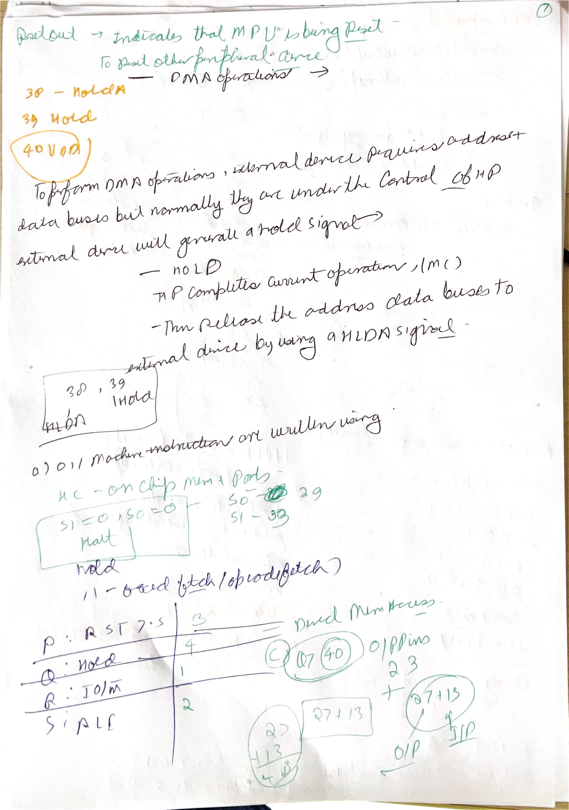</a>

Technical explanation: memory-mapped I/O and I/O-mapped I/O differ in address space and control signaling. Memory-mapped I/O uses ordinary 16-bit memory addresses and memory-style read/write cycles. I/O-mapped I/O uses `IN` and `OUT` with an 8-bit port address and I/O control cycles. The data bus still carries the byte; the difference is how external decoding selects memory versus a device.

The practical exam distinction is address width and instruction choice. Memory-mapped I/O can use memory instructions and the full 16-bit address bus; I/O-mapped I/O uses the `IN/OUT` instruction format and an 8-bit port number. The external decoder and `IO/M` status decide which device responds.

#### [till46 page 009](images/HandWrittenNotes/till46/page-009.jpg)

<a href="images/HandWrittenNotes/till46/page-009.jpg">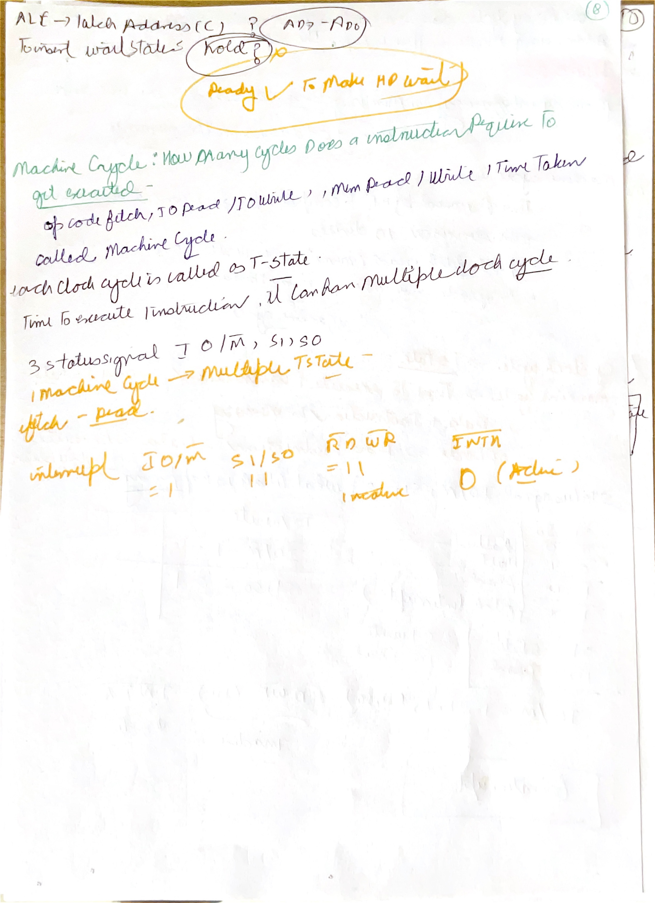</a>

Technical explanation: `ALE` exists because the lower address and data share `AD0-AD7`. During the first T-state of a bus cycle the low address is valid on those pins, so an external latch captures it when `ALE` pulses. After that, the same pins can become the bidirectional data bus. Without the latch, memory decoding would lose `A0-A7` before the read or write finished.

A T-state is one processor clock state. Instruction timing is the number of T-states multiplied by the clock period. The counts are not arbitrary: every external memory or I/O access needs a bus cycle. Opcode fetch has address output, `ALE`, memory read control, data capture, and decode work, so it is longer than a plain memory read. Extra operand bytes, memory operands, stack transfers, I/O transfers, and slow memory wait states all add timing cost.

A machine cycle is one external bus operation: opcode fetch, memory read, memory write, I/O read, I/O write, interrupt acknowledge, and so on. An instruction cycle is the whole instruction and can contain several machine cycles. This is why instruction length, addressing mode, and T-state count are connected: every extra byte or external operand has to be fetched, read, or written on the bus.

#### [till46 page 010](images/HandWrittenNotes/till46/page-010.jpg)

<a href="images/HandWrittenNotes/till46/page-010.jpg">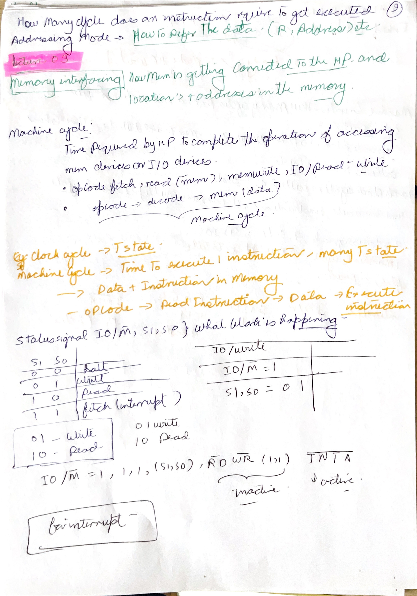</a>

Technical explanation: `IO/M`, `S1`, and `S0` tell external hardware what type of machine cycle is occurring. That status decoding is how the system distinguishes opcode fetch, memory read, memory write, I/O read, I/O write, interrupt acknowledge, halt, and bus idle behavior. `/RD` and `/WR` then provide the actual read/write strobes, so status lines describe the cycle and control lines perform the transfer.

A machine cycle is one external bus operation: opcode fetch, memory read, memory write, I/O read, I/O write, interrupt acknowledge, and so on. An instruction cycle is the whole instruction and can contain several machine cycles. This is why instruction length, addressing mode, and T-state count are connected: every extra byte or external operand has to be fetched, read, or written on the bus.

A T-state is one processor clock state. Instruction timing is the number of T-states multiplied by the clock period. The counts are not arbitrary: every external memory or I/O access needs a bus cycle. Opcode fetch has address output, `ALE`, memory read control, data capture, and decode work, so it is longer than a plain memory read. Extra operand bytes, memory operands, stack transfers, I/O transfers, and slow memory wait states all add timing cost.

#### [till46 page 011](images/HandWrittenNotes/till46/page-011.jpg)

<a href="images/HandWrittenNotes/till46/page-011.jpg">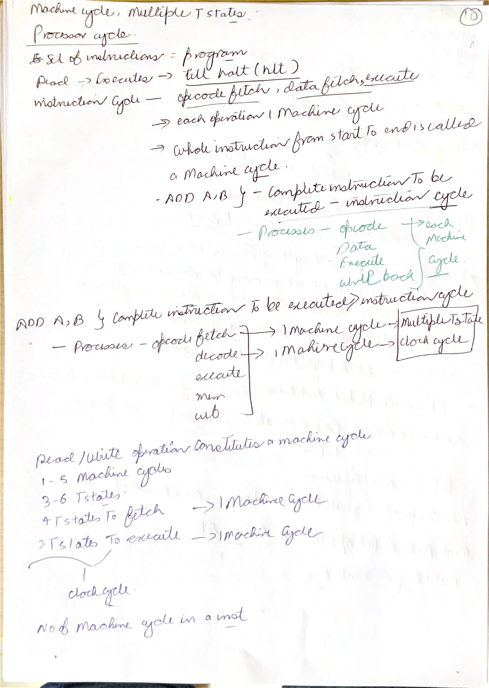</a>

Technical explanation: a T-state is one processor clock state. Instruction timing is the number of T-states multiplied by the clock period. The counts are not arbitrary: every external memory or I/O access needs a bus cycle. Opcode fetch has address output, `ALE`, memory read control, data capture, and decode work, so it is longer than a plain memory read. Extra operand bytes, memory operands, stack transfers, I/O transfers, and slow memory wait states all add timing cost.

A machine cycle is one external bus operation: opcode fetch, memory read, memory write, I/O read, I/O write, interrupt acknowledge, and so on. An instruction cycle is the whole instruction and can contain several machine cycles. This is why instruction length, addressing mode, and T-state count are connected: every extra byte or external operand has to be fetched, read, or written on the bus.

Opcode fetch is not just any memory read. The `PC` is placed on the address bus, `ALE` latches the low address, `/RD` enables memory output, and the opcode enters the instruction register. The CPU then decodes that byte to know whether more bytes, a memory access, an I/O cycle, a stack operation, or only internal execution is required.

#### [till46 page 012](images/HandWrittenNotes/till46/page-012.jpg)

<a href="images/HandWrittenNotes/till46/page-012.jpg">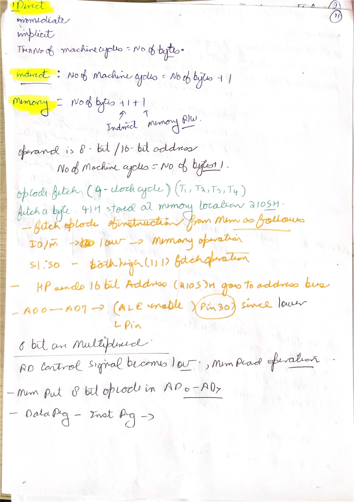</a>

Technical explanation: separate opcode bytes from operand bytes. The opcode selects the operation; following bytes may be immediate data, a port number, a low address byte, or a high address byte. One-byte instructions encode everything in the opcode. Two-byte instructions usually add one data or port byte. Three-byte instructions usually add a 16-bit address or 16-bit immediate value, stored low byte first in memory.

When object code is placed in memory, `PC` steps through bytes, not mnemonics. If the opcode says the instruction has operand bytes, the following memory locations are consumed as data/address bytes. This is why a trace must increment `PC` by instruction length before deciding the next instruction address.

#### [till46 page 013](images/HandWrittenNotes/till46/page-013.jpg)

<a href="images/HandWrittenNotes/till46/page-013.jpg">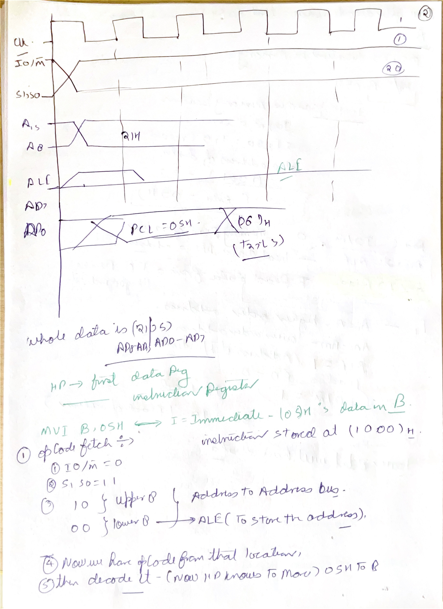</a>

Technical explanation: a T-state is one processor clock state. Instruction timing is the number of T-states multiplied by the clock period. The counts are not arbitrary: every external memory or I/O access needs a bus cycle. Opcode fetch has address output, `ALE`, memory read control, data capture, and decode work, so it is longer than a plain memory read. Extra operand bytes, memory operands, stack transfers, I/O transfers, and slow memory wait states all add timing cost.

A machine cycle is one external bus operation: opcode fetch, memory read, memory write, I/O read, I/O write, interrupt acknowledge, and so on. An instruction cycle is the whole instruction and can contain several machine cycles. This is why instruction length, addressing mode, and T-state count are connected: every extra byte or external operand has to be fetched, read, or written on the bus.

Opcode fetch is not just any memory read. The `PC` is placed on the address bus, `ALE` latches the low address, `/RD` enables memory output, and the opcode enters the instruction register. The CPU then decodes that byte to know whether more bytes, a memory access, an I/O cycle, a stack operation, or only internal execution is required.

`MVI B,05H` is a clean timing example because the first byte is the opcode and the second byte is immediate data. The CPU fetches the opcode from the address in `PC`, increments `PC`, then performs a memory read for `05H` and loads it into `B`. The data byte is not executed as an instruction; it is consumed as the operand selected by the opcode.

#### [till46 page 014](images/HandWrittenNotes/till46/page-014.jpg)

<a href="images/HandWrittenNotes/till46/page-014.jpg">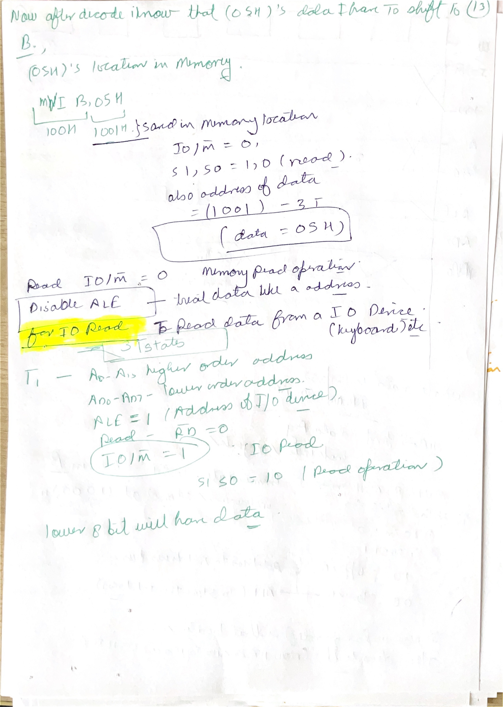</a>

Technical explanation: `MVI B,05H` is a clean timing example because the first byte is the opcode and the second byte is immediate data. The CPU fetches the opcode from the address in `PC`, increments `PC`, then performs a memory read for `05H` and loads it into `B`. The data byte is not executed as an instruction; it is consumed as the operand selected by the opcode.

A T-state is one processor clock state. Instruction timing is the number of T-states multiplied by the clock period. The counts are not arbitrary: every external memory or I/O access needs a bus cycle. Opcode fetch has address output, `ALE`, memory read control, data capture, and decode work, so it is longer than a plain memory read. Extra operand bytes, memory operands, stack transfers, I/O transfers, and slow memory wait states all add timing cost.

#### [till46 page 015](images/HandWrittenNotes/till46/page-015.jpg)

<a href="images/HandWrittenNotes/till46/page-015.jpg">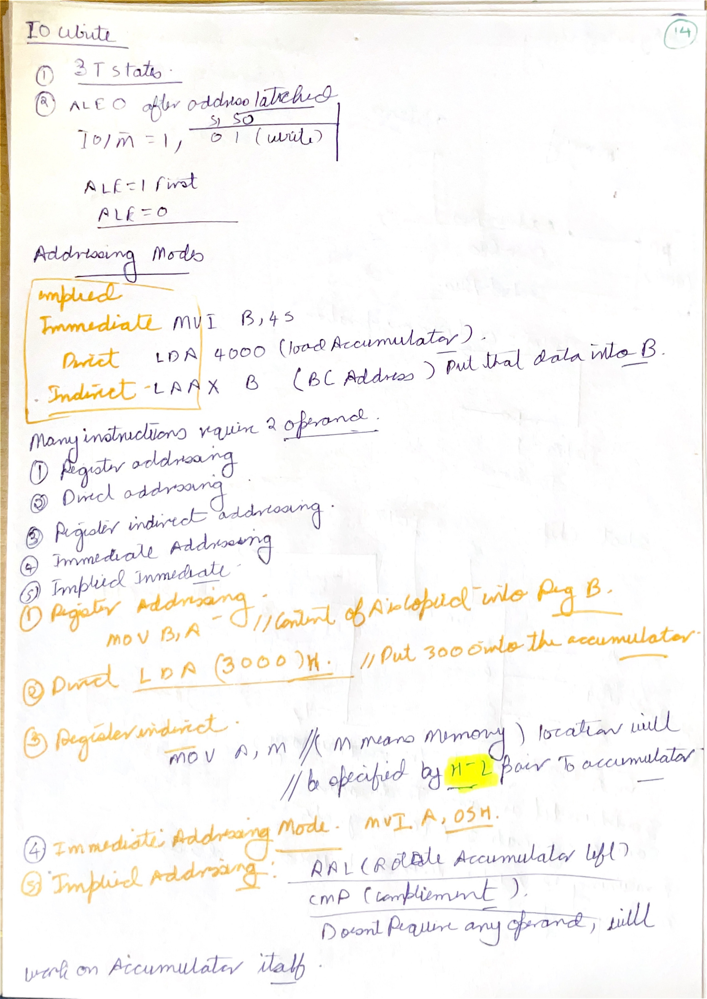</a>

Technical explanation: separate opcode bytes from operand bytes. The opcode selects the operation; following bytes may be immediate data, a port number, a low address byte, or a high address byte. One-byte instructions encode everything in the opcode. Two-byte instructions usually add one data or port byte. Three-byte instructions usually add a 16-bit address or 16-bit immediate value, stored low byte first in memory.

Addressing mode means where the operand comes from. Immediate addressing puts the operand in the instruction stream. Register addressing uses an internal register. Direct addressing stores the 16-bit memory address inside the instruction. Register-indirect addressing uses a register pair as a pointer. Implied addressing builds the operand into the instruction definition, such as accumulator, carry, or stack behavior.

#### [till46 page 016](images/HandWrittenNotes/till46/page-016.jpg)

<a href="images/HandWrittenNotes/till46/page-016.jpg">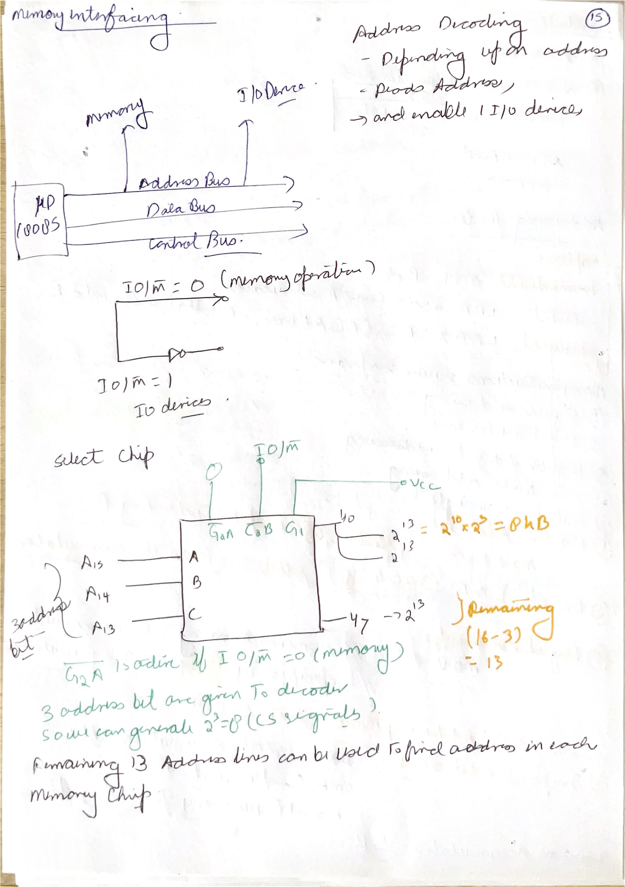</a>

Technical explanation: memory interfacing is mostly address decoding. A `4K x 8` chip has 4096 byte locations, so it needs 12 low-order address lines because `2^12 = 4096`. Higher address lines decide which chip or block is enabled. Full decoding uses enough high address bits to make one unique range; partial decoding can make the same chip respond at mirrored address ranges.

For chip-select problems, write the address range in binary and mark which high-order bits are constant. Those constant high bits feed the decoder. The low bits go into the chip as internal address inputs, so changing them selects a location inside the chip rather than selecting a different chip.

#### [till46 page 017](images/HandWrittenNotes/till46/page-017.jpg)

<a href="images/HandWrittenNotes/till46/page-017.jpg">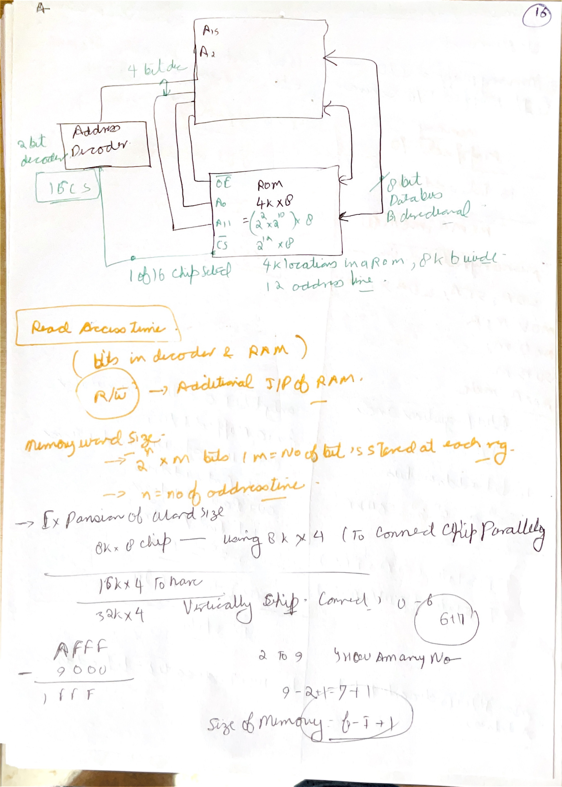</a>

Technical explanation: memory interfacing is mostly address decoding. A `4K x 8` chip has 4096 byte locations, so it needs 12 low-order address lines because `2^12 = 4096`. Higher address lines decide which chip or block is enabled. Full decoding uses enough high address bits to make one unique range; partial decoding can make the same chip respond at mirrored address ranges.

A ROM interface example is solved by separating capacity from placement. Capacity gives the number of low address lines. Placement gives the high address pattern. The decoder asserts chip select only when the high address bits match that pattern and the processor performs a memory read cycle.

#### [till46 page 018](images/HandWrittenNotes/till46/page-018.jpg)

<a href="images/HandWrittenNotes/till46/page-018.jpg">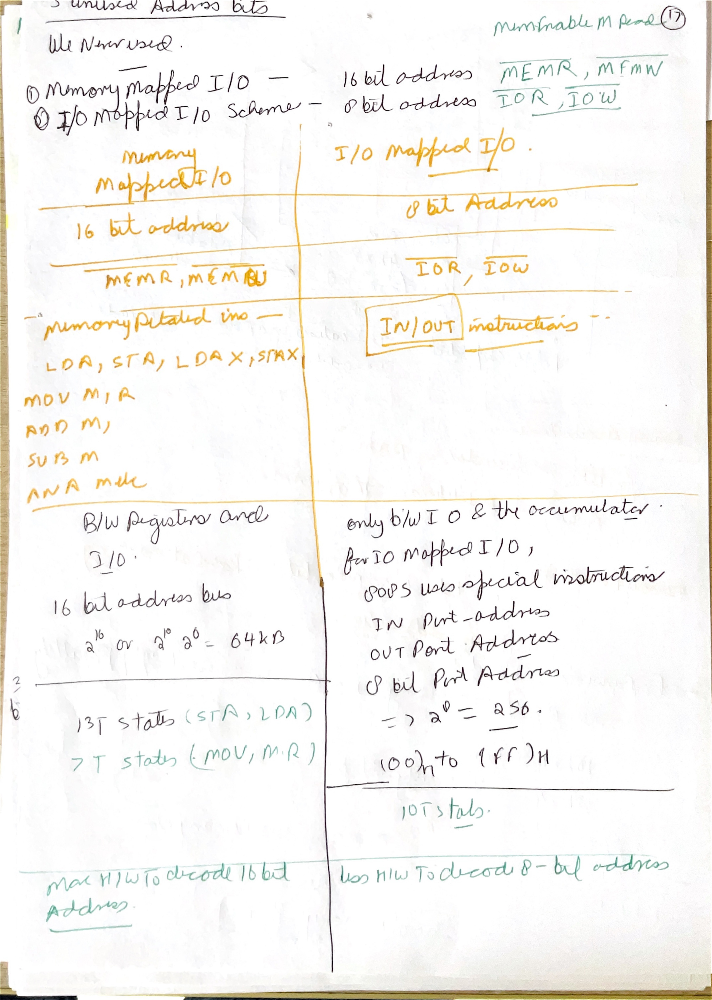</a>

Technical explanation: memory-mapped I/O and I/O-mapped I/O differ in address space and control signaling. Memory-mapped I/O uses ordinary 16-bit memory addresses and memory-style read/write cycles. I/O-mapped I/O uses `IN` and `OUT` with an 8-bit port address and I/O control cycles. The data bus still carries the byte; the difference is how external decoding selects memory versus a device.

In I/O-mapped transfer, the accumulator is usually the data endpoint: `IN port` loads `A`, and `OUT port` sends `A`. In memory-mapped transfer, ordinary memory instructions can target a device address, but that also consumes part of the memory address space.

#### [till46 page 019](images/HandWrittenNotes/till46/page-019.jpg)

<a href="images/HandWrittenNotes/till46/page-019.jpg">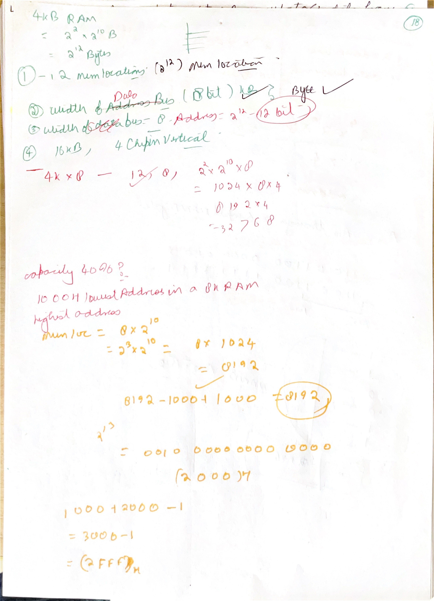</a>

Technical explanation: memory interfacing is mostly address decoding. A `4K x 8` chip has 4096 byte locations, so it needs 12 low-order address lines because `2^12 = 4096`. Higher address lines decide which chip or block is enabled. Full decoding uses enough high address bits to make one unique range; partial decoding can make the same chip respond at mirrored address ranges.

Highest-address questions use `last = base + size - 1`. For `4K`, the size is `1000H`, not decimal 4000. If the starting address is aligned, the low 12 bits run from `000H` to `FFFH` while the decoded high bits remain fixed.

#### [till46 page 020](images/HandWrittenNotes/till46/page-020.jpg)

<a href="images/HandWrittenNotes/till46/page-020.jpg">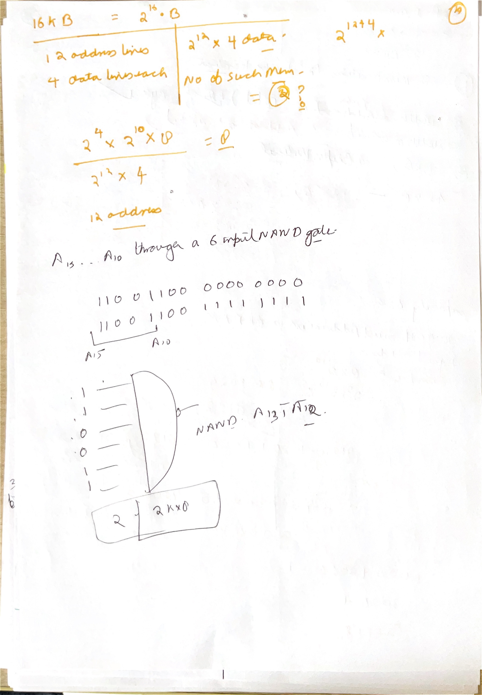</a>

Technical explanation: memory interfacing is mostly address decoding. A `4K x 8` chip has 4096 byte locations, so it needs 12 low-order address lines because `2^12 = 4096`. Higher address lines decide which chip or block is enabled. Full decoding uses enough high address bits to make one unique range; partial decoding can make the same chip respond at mirrored address ranges.

Partial decoding is a common hidden issue. If not all high-order lines are decoded, multiple address ranges can select the same chip. Full decoding avoids this aliasing by using enough high bits to make exactly one intended address block active.

#### [till46 page 021](images/HandWrittenNotes/till46/page-021.jpg)

<a href="images/HandWrittenNotes/till46/page-021.jpg">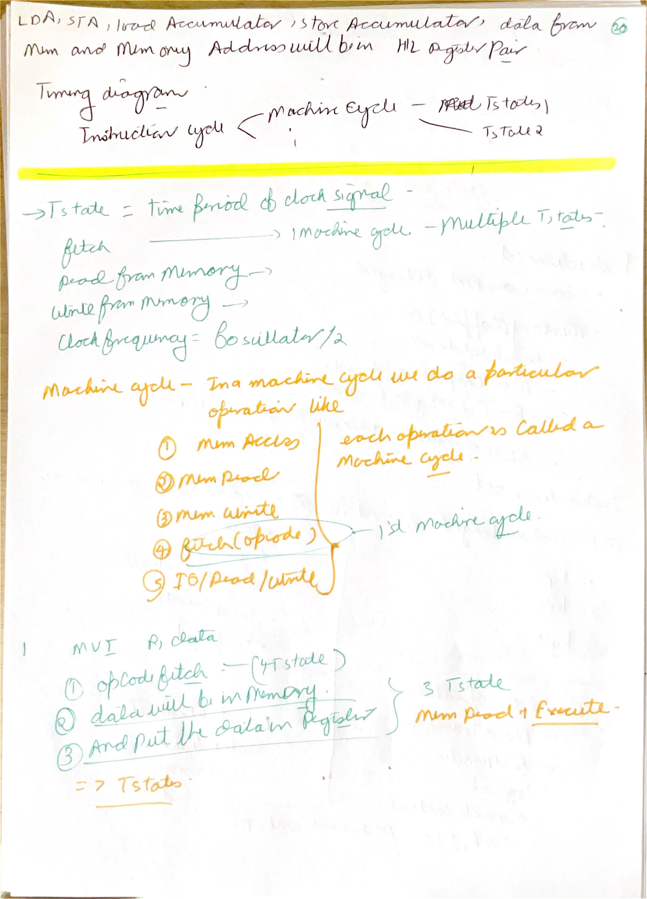</a>

Technical explanation: a T-state is one processor clock state. Instruction timing is the number of T-states multiplied by the clock period. The counts are not arbitrary: every external memory or I/O access needs a bus cycle. Opcode fetch has address output, `ALE`, memory read control, data capture, and decode work, so it is longer than a plain memory read. Extra operand bytes, memory operands, stack transfers, I/O transfers, and slow memory wait states all add timing cost.

A machine cycle is one external bus operation: opcode fetch, memory read, memory write, I/O read, I/O write, interrupt acknowledge, and so on. An instruction cycle is the whole instruction and can contain several machine cycles. This is why instruction length, addressing mode, and T-state count are connected: every extra byte or external operand has to be fetched, read, or written on the bus.

#### [till46 page 022](images/HandWrittenNotes/till46/page-022.jpg)

<a href="images/HandWrittenNotes/till46/page-022.jpg">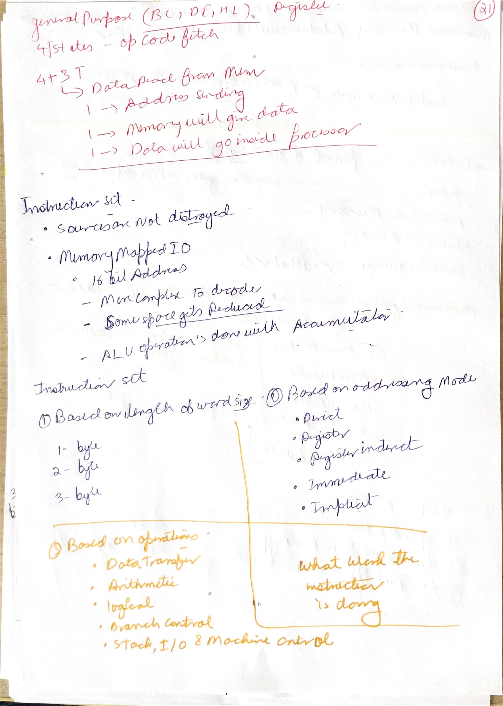</a>

Technical explanation: separate opcode bytes from operand bytes. The opcode selects the operation; following bytes may be immediate data, a port number, a low address byte, or a high address byte. One-byte instructions encode everything in the opcode. Two-byte instructions usually add one data or port byte. Three-byte instructions usually add a 16-bit address or 16-bit immediate value, stored low byte first in memory.

Classification by length, operation, and addressing mode is useful because it predicts bus activity. A data-transfer instruction may be one byte if register-only, two bytes if immediate/port-based, or three bytes if a 16-bit address is embedded in the instruction.

#### [till46 page 023](images/HandWrittenNotes/till46/page-023.jpg)

<a href="images/HandWrittenNotes/till46/page-023.jpg">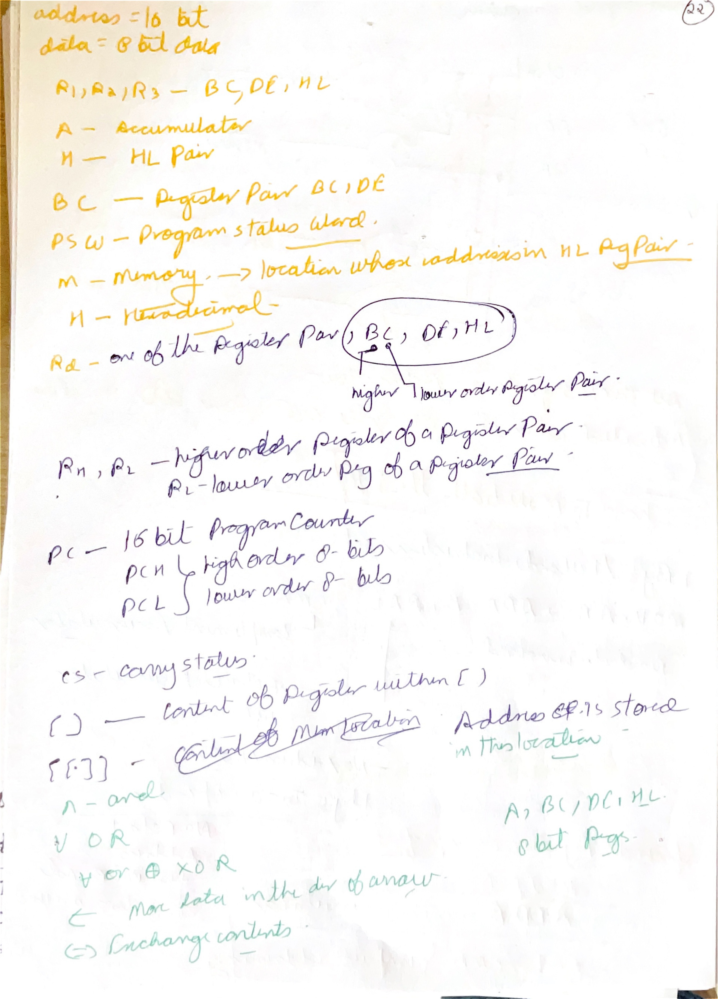</a>

Technical explanation: the 8085 register set mixes 8-bit storage and 16-bit addressing. `B`, `C`, `D`, `E`, `H`, and `L` are 8-bit registers, but `BC`, `DE`, and `HL` can be used as 16-bit pairs. `HL` has the special memory role: `M` means the memory byte addressed by `HL`. `PC` and `SP` are 16-bit because program bytes and stack bytes live in the 64 KB memory space.

Separate opcode bytes from operand bytes. The opcode selects the operation; following bytes may be immediate data, a port number, a low address byte, or a high address byte. One-byte instructions encode everything in the opcode. Two-byte instructions usually add one data or port byte. Three-byte instructions usually add a 16-bit address or 16-bit immediate value, stored low byte first in memory.

Addressing mode means where the operand comes from. Immediate addressing puts the operand in the instruction stream. Register addressing uses an internal register. Direct addressing stores the 16-bit memory address inside the instruction. Register-indirect addressing uses a register pair as a pointer. Implied addressing builds the operand into the instruction definition, such as accumulator, carry, or stack behavior.

#### [till46 page 024](images/HandWrittenNotes/till46/page-024.jpg)

<a href="images/HandWrittenNotes/till46/page-024.jpg">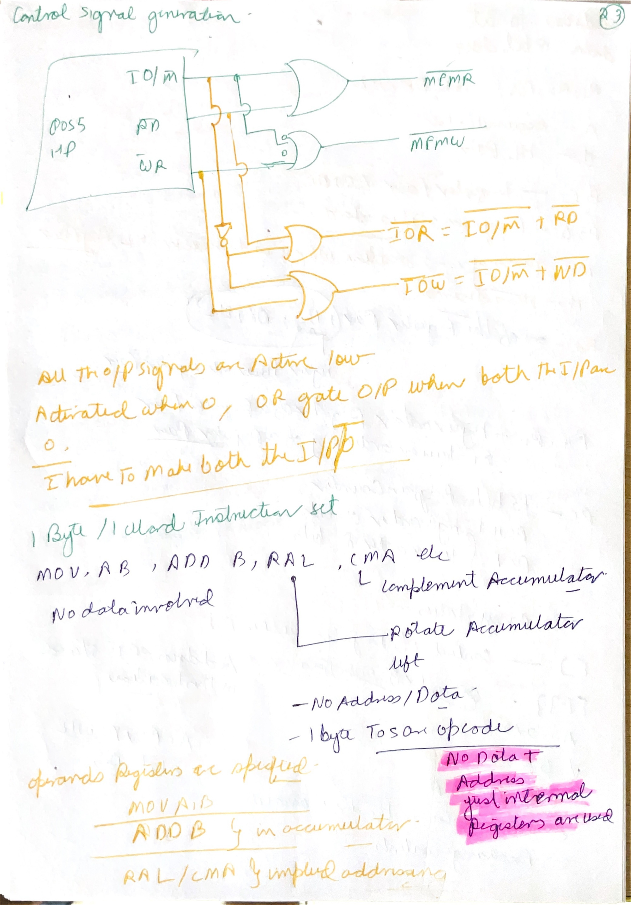</a>

Technical explanation: separate opcode bytes from operand bytes. The opcode selects the operation; following bytes may be immediate data, a port number, a low address byte, or a high address byte. One-byte instructions encode everything in the opcode. Two-byte instructions usually add one data or port byte. Three-byte instructions usually add a 16-bit address or 16-bit immediate value, stored low byte first in memory.

Control-signal generation is the bridge between the decoded instruction and the outside bus. After opcode fetch, the control unit chooses whether to assert memory read, memory write, I/O read, I/O write, interrupt acknowledge, or no external transfer. That is why a one-byte instruction can still take multiple T-states: the CPU must fetch and decode the opcode even when no explicit operand byte follows.

### `8085-instruction-set-addressing-arithmetic-logic-branching.pdf`

#### [till47 page 001](images/HandWrittenNotes/till47/page-001.jpg)

Technical explanation: separate opcode bytes from operand bytes. The opcode selects the operation; following bytes may be immediate data, a port number, a low address byte, or a high address byte. One-byte instructions encode everything in the opcode. Two-byte instructions usually add one data or port byte. Three-byte instructions usually add a 16-bit address or 16-bit immediate value, stored low byte first in memory.

Addressing mode means where the operand comes from. Immediate addressing puts the operand in the instruction stream. Register addressing uses an internal register. Direct addressing stores the 16-bit memory address inside the instruction. Register-indirect addressing uses a register pair as a pointer. Implied addressing builds the operand into the instruction definition, such as accumulator, carry, or stack behavior.

Data-transfer instructions do not all cost the same in hardware. Register-to-register movement happens inside the CPU after opcode fetch. Direct memory instructions such as `LDA` and `STA` must fetch two address bytes and then perform a memory read or write. `LHLD` and `SHLD` transfer two memory bytes because `HL` is 16 bits while memory is byte-wide.

Direct addressing and register-indirect addressing differ in where the effective address comes from. `LDA 2050H` contains the address bytes in the instruction. `MOV A,M`, `MOV M,R`, or `MVI M,data` does not contain the final memory address; the address is already in `HL`. Changing `HL` changes the accessed memory byte without changing the opcode.

#### [till47 page 002](images/HandWrittenNotes/till47/page-002.jpg)

Technical explanation: addressing mode means where the operand comes from. Immediate addressing puts the operand in the instruction stream. Register addressing uses an internal register. Direct addressing stores the 16-bit memory address inside the instruction. Register-indirect addressing uses a register pair as a pointer. Implied addressing builds the operand into the instruction definition, such as accumulator, carry, or stack behavior.

Keep flag layout separate from addressing mode. Addressing mode tells where the operand comes from; flags tell what happened after an ALU-style result. A data-transfer instruction may use an addressing mode without changing flags, so a later conditional branch may still be testing older flag values.

#### [till47 page 003](images/HandWrittenNotes/till47/page-003.jpg)

Technical explanation: data-transfer instructions do not all cost the same in hardware. Register-to-register movement happens inside the CPU after opcode fetch. Direct memory instructions such as `LDA` and `STA` must fetch two address bytes and then perform a memory read or write. `LHLD` and `SHLD` transfer two memory bytes because `HL` is 16 bits while memory is byte-wide.

Direct addressing and register-indirect addressing differ in where the effective address comes from. `LDA 2050H` contains the address bytes in the instruction. `MOV A,M`, `MOV M,R`, or `MVI M,data` does not contain the final memory address; the address is already in `HL`. Changing `HL` changes the accessed memory byte without changing the opcode.

#### [till47 page 004](images/HandWrittenNotes/till47/page-004.jpg)

Technical explanation: for `MVI M,data`, `M` is not a separate register. It means `[HL]`, the memory byte at the address currently stored in the `HL` pair. Therefore `LXI H,addr16` must come first when the target memory address is not already in `HL`; `LXI` loads the pointer, and `MVI M,data` writes the immediate byte through that pointer. The instruction bytes and data/address bytes must be separated when tracing: `LXI H,2050H` fetches opcode, low byte `50H`, high byte `20H`; then `MVI M,32H` fetches its opcode and data byte `32H`, and writes `32H` into memory location `2050H`.

The timing follows the bus cycles. `LXI H,addr16` is opcode fetch 4T + low-byte memory read 3T + high-byte memory read 3T = 10T. `MVI M,data` is opcode fetch 4T + immediate-byte memory read 3T + memory write to `[HL]` 3T = 10T. `MVI B,data` lacks that final external memory write, so it is shorter even though the mnemonic family is the same.

Direct addressing and register-indirect addressing differ in where the effective address comes from. `LDA 2050H` contains the address bytes in the instruction. `MOV A,M`, `MOV M,R`, or `MVI M,data` does not contain the final memory address; the address is already in `HL`. Changing `HL` changes the accessed memory byte without changing the opcode.

`LXI rp,data16` loads a 16-bit register pair using the two bytes after the opcode. The low byte is fetched first and loaded into the lower register of the pair; the high byte is fetched next and loaded into the higher register. For `LXI H,2050H`, the final state is `H=20H`, `L=50H`, so `M` now refers to memory address `2050H`.

#### [till47 page 005](images/HandWrittenNotes/till47/page-005.jpg)

Technical explanation: separate opcode bytes from operand bytes. The opcode selects the operation; following bytes may be immediate data, a port number, a low address byte, or a high address byte. One-byte instructions encode everything in the opcode. Two-byte instructions usually add one data or port byte. Three-byte instructions usually add a 16-bit address or 16-bit immediate value, stored low byte first in memory.

Data-transfer instructions do not all cost the same in hardware. Register-to-register movement happens inside the CPU after opcode fetch. Direct memory instructions such as `LDA` and `STA` must fetch two address bytes and then perform a memory read or write. `LHLD` and `SHLD` transfer two memory bytes because `HL` is 16 bits while memory is byte-wide.

Direct addressing and register-indirect addressing differ in where the effective address comes from. `LDA 2050H` contains the address bytes in the instruction. `MOV A,M`, `MOV M,R`, or `MVI M,data` does not contain the final memory address; the address is already in `HL`. Changing `HL` changes the accessed memory byte without changing the opcode.

#### [till47 page 006](images/HandWrittenNotes/till47/page-006.jpg)

Technical explanation: `LDAX` and `STAX` use register-pair indirect addressing through `BC` or `DE`; `MOV A,M` and `MOV M,A` use `HL` through the symbol `M`. The effective address is not stored in the instruction bytes. The opcode selects which pair supplies the address, and the bus performs a memory read or write at that 16-bit address.

`LDAX` and `STAX` are restricted in the 8085: they use `BC` or `DE` as the pointer, not `HL`. If the handwritten example changes `B/C` or `D/E` before the instruction, the effective memory address changes even though the instruction mnemonic is unchanged.

#### [till47 page 007](images/HandWrittenNotes/till47/page-007.jpg)

Technical explanation: `LHLD addr` and `SHLD addr` are direct 16-bit memory transfers involving `HL`. The address bytes are part of the instruction, low byte first. `LHLD 2050H` loads `L` from `2050H` and `H` from `2051H`; `SHLD 2050H` stores `L` at `2050H` and `H` at `2051H`. The low-address/low-register pairing is the key detail.

The timing comes from the extra bus transfers. `LHLD` and `SHLD` fetch the opcode and two address bytes, then perform two data memory reads or writes. That gives five machine cycles and commonly 16 T-states: `4T + 3T + 3T + 3T + 3T`.

#### [till47 page 008](images/HandWrittenNotes/till47/page-008.jpg)

Technical explanation: `LDAX` and `STAX` use register-pair indirect addressing through `BC` or `DE`; `MOV A,M` and `MOV M,A` use `HL` through the symbol `M`. The effective address is not stored in the instruction bytes. The opcode selects which pair supplies the address, and the bus performs a memory read or write at that 16-bit address.

`XCHG` swaps `HL` with `DE`; it does not touch memory. `DAD rp` adds a 16-bit register pair to `HL` and stores the 16-bit result in `HL`, with carry out recorded in `CY`. When tracing these, combine each pair as a 16-bit number first, then split the result back into high and low registers.

#### [till47 page 009](images/HandWrittenNotes/till47/page-009.jpg)

Technical explanation: `LXI rp,data16` loads a 16-bit register pair using the two bytes after the opcode. The low byte is fetched first and loaded into the lower register of the pair; the high byte is fetched next and loaded into the higher register. For `LXI H,2050H`, the final state is `H=20H`, `L=50H`, so `M` now refers to memory address `2050H`.

`LHLD addr` and `SHLD addr` are direct 16-bit memory transfers involving `HL`. The address bytes are part of the instruction, low byte first. `LHLD 2050H` loads `L` from `2050H` and `H` from `2051H`; `SHLD 2050H` stores `L` at `2050H` and `H` at `2051H`. The low-address/low-register pairing is the key detail.

#### [till47 page 010](images/HandWrittenNotes/till47/page-010.jpg)

Technical explanation: `XCHG` swaps `HL` with `DE`; it does not touch memory. `DAD rp` adds a 16-bit register pair to `HL` and stores the 16-bit result in `HL`, with carry out recorded in `CY`. When tracing these, combine each pair as a 16-bit number first, then split the result back into high and low registers.

For program traces, keep a state table. Each row should list only what the current instruction changes: registers, flags, memory, `PC`, `SP`, or stack bytes. This prevents the common mistake of updating a value but forgetting the pointer that determines where the next memory access will happen.

#### [till47 page 011](images/HandWrittenNotes/till47/page-011.jpg)

Technical explanation: 8085 subtraction is performed through two's-complement addition internally. `SUB r` computes `A - r`; `SBB r` computes `A - r - CY`; `SUI data` subtracts an immediate byte. After subtraction, `CY=1` means a borrow was required. `CMP r` performs the same internal subtraction only for flags and leaves the accumulator unchanged.

Flags are a compressed record of the last flag-affecting result. `S` copies bit 7, `Z` reports zero, `P` reports even parity, `AC` reports carry from bit 3 to bit 4, and `CY` reports carry out of bit 7. In subtraction, `CY` is interpreted as borrow. A common trace error is testing a flag after an instruction that did not update it.

#### [till47 page 012](images/HandWrittenNotes/till47/page-012.jpg)

Technical explanation: the ALU is where arithmetic and logical results are physically produced, but the useful output is not only the 8-bit result. The accumulator usually supplies one operand and receives the result, while the flag flip-flops record properties of that result. Carry is generated from bit 7, auxiliary carry from bit 3 to bit 4, zero from an all-zero result, sign from bit 7, and parity from the number of 1 bits. That is why exam traces must update flags from the actual binary result, not from the instruction name alone.

Flags are a compressed record of the last flag-affecting result. `S` copies bit 7, `Z` reports zero, `P` reports even parity, `AC` reports carry from bit 3 to bit 4, and `CY` reports carry out of bit 7. In subtraction, `CY` is interpreted as borrow. A common trace error is testing a flag after an instruction that did not update it.

8085 subtraction is performed through two's-complement addition internally. `SUB r` computes `A - r`; `SBB r` computes `A - r - CY`; `SUI data` subtracts an immediate byte. After subtraction, `CY=1` means a borrow was required. `CMP r` performs the same internal subtraction only for flags and leaves the accumulator unchanged.

`CMA` complements every accumulator bit and does not mean two's-complement negation by itself. `STC` sets carry, and `CMC` complements carry. These instructions are small but important because later rotate, subtract-with-borrow, or conditional branch instructions can depend on the carry value they leave behind.

#### [till47 page 013](images/HandWrittenNotes/till47/page-013.jpg)

Technical explanation: `INR` and `DCR` change an 8-bit register or memory byte, while `INX` and `DCX` change a 16-bit register pair. `INR/DCR` update most arithmetic flags but do not update carry, which is a frequent exam trap. `INX/DCX` are 16-bit pointer updates and do not set the normal arithmetic flags.

Flags are a compressed record of the last flag-affecting result. `S` copies bit 7, `Z` reports zero, `P` reports even parity, `AC` reports carry from bit 3 to bit 4, and `CY` reports carry out of bit 7. In subtraction, `CY` is interpreted as borrow. A common trace error is testing a flag after an instruction that did not update it.

#### [till47 page 014](images/HandWrittenNotes/till47/page-014.jpg)

Technical explanation: the ALU is where arithmetic and logical results are physically produced, but the useful output is not only the 8-bit result. The accumulator usually supplies one operand and receives the result, while the flag flip-flops record properties of that result. Carry is generated from bit 7, auxiliary carry from bit 3 to bit 4, zero from an all-zero result, sign from bit 7, and parity from the number of 1 bits. That is why exam traces must update flags from the actual binary result, not from the instruction name alone.

Flags are a compressed record of the last flag-affecting result. `S` copies bit 7, `Z` reports zero, `P` reports even parity, `AC` reports carry from bit 3 to bit 4, and `CY` reports carry out of bit 7. In subtraction, `CY` is interpreted as borrow. A common trace error is testing a flag after an instruction that did not update it.

`DAA` is not a normal binary addition. It corrects the accumulator after BCD addition by adding `06H` to the lower nibble when needed and `60H` to the upper nibble when needed. The decision depends on nibble values and `AC/CY`. Use it only after an addition intended to represent packed BCD digits.

#### [till47 page 015](images/HandWrittenNotes/till47/page-015.jpg)

Technical explanation: 8085 subtraction is performed through two's-complement addition internally. `SUB r` computes `A - r`; `SBB r` computes `A - r - CY`; `SUI data` subtracts an immediate byte. After subtraction, `CY=1` means a borrow was required. `CMP r` performs the same internal subtraction only for flags and leaves the accumulator unchanged.

Flags are a compressed record of the last flag-affecting result. `S` copies bit 7, `Z` reports zero, `P` reports even parity, `AC` reports carry from bit 3 to bit 4, and `CY` reports carry out of bit 7. In subtraction, `CY` is interpreted as borrow. A common trace error is testing a flag after an instruction that did not update it.

#### [till47 page 016](images/HandWrittenNotes/till47/page-016.jpg)

Technical explanation: `INR` and `DCR` change an 8-bit register or memory byte, while `INX` and `DCX` change a 16-bit register pair. `INR/DCR` update most arithmetic flags but do not update carry, which is a frequent exam trap. `INX/DCX` are 16-bit pointer updates and do not set the normal arithmetic flags.

Flags are a compressed record of the last flag-affecting result. `S` copies bit 7, `Z` reports zero, `P` reports even parity, `AC` reports carry from bit 3 to bit 4, and `CY` reports carry out of bit 7. In subtraction, `CY` is interpreted as borrow. A common trace error is testing a flag after an instruction that did not update it.

#### [till47 page 017](images/HandWrittenNotes/till47/page-017.jpg)

Technical explanation: `XCHG` swaps `HL` with `DE`; it does not touch memory. `DAD rp` adds a 16-bit register pair to `HL` and stores the 16-bit result in `HL`, with carry out recorded in `CY`. When tracing these, combine each pair as a 16-bit number first, then split the result back into high and low registers.

`DAA` is not a normal binary addition. It corrects the accumulator after BCD addition by adding `06H` to the lower nibble when needed and `60H` to the upper nibble when needed. The decision depends on nibble values and `AC/CY`. Use it only after an addition intended to represent packed BCD digits.

Logical instructions operate bit by bit. `ANA` clears a bit unless both inputs have 1, `ORA` sets a bit if either input has 1, and `XRA` sets a bit only when the inputs differ. `XRA A` is a standard way to clear the accumulator to `00H`; it also updates flags, so later conditional jumps may depend on that clear operation.

For program traces, keep a state table. Each row should list only what the current instruction changes: registers, flags, memory, `PC`, `SP`, or stack bytes. This prevents the common mistake of updating a value but forgetting the pointer that determines where the next memory access will happen.

#### [till47 page 018](images/HandWrittenNotes/till47/page-018.jpg)

Technical explanation: logical instructions operate bit by bit. `ANA` clears a bit unless both inputs have 1, `ORA` sets a bit if either input has 1, and `XRA` sets a bit only when the inputs differ. `XRA A` is a standard way to clear the accumulator to `00H`; it also updates flags, so later conditional jumps may depend on that clear operation.

`CMA` complements every accumulator bit and does not mean two's-complement negation by itself. `STC` sets carry, and `CMC` complements carry. These instructions are small but important because later rotate, subtract-with-borrow, or conditional branch instructions can depend on the carry value they leave behind.

#### [till47 page 019](images/HandWrittenNotes/till47/page-019.jpg)

Technical explanation: logical instructions operate bit by bit. `ANA` clears a bit unless both inputs have 1, `ORA` sets a bit if either input has 1, and `XRA` sets a bit only when the inputs differ. `XRA A` is a standard way to clear the accumulator to `00H`; it also updates flags, so later conditional jumps may depend on that clear operation.

Memory operands add a bus read before the logical operation. For example, `ORA M` first reads the byte at `[HL]`, then ORs it with `A`. The result goes back to `A`, and the flags describe the logical result, not the address or the memory byte by itself.

#### [till47 page 020](images/HandWrittenNotes/till47/page-020.jpg)

Technical explanation: logical instructions operate bit by bit. `ANA` clears a bit unless both inputs have 1, `ORA` sets a bit if either input has 1, and `XRA` sets a bit only when the inputs differ. `XRA A` is a standard way to clear the accumulator to `00H`; it also updates flags, so later conditional jumps may depend on that clear operation.

`CMA` complements every accumulator bit and does not mean two's-complement negation by itself. `STC` sets carry, and `CMC` complements carry. These instructions are small but important because later rotate, subtract-with-borrow, or conditional branch instructions can depend on the carry value they leave behind.

#### [till47 page 021](images/HandWrittenNotes/till47/page-021.jpg)

Technical explanation: 8085 subtraction is performed through two's-complement addition internally. `SUB r` computes `A - r`; `SBB r` computes `A - r - CY`; `SUI data` subtracts an immediate byte. After subtraction, `CY=1` means a borrow was required. `CMP r` performs the same internal subtraction only for flags and leaves the accumulator unchanged.

Flags are a compressed record of the last flag-affecting result. `S` copies bit 7, `Z` reports zero, `P` reports even parity, `AC` reports carry from bit 3 to bit 4, and `CY` reports carry out of bit 7. In subtraction, `CY` is interpreted as borrow. A common trace error is testing a flag after an instruction that did not update it.

`CMA` complements every accumulator bit and does not mean two's-complement negation by itself. `STC` sets carry, and `CMC` complements carry. These instructions are small but important because later rotate, subtract-with-borrow, or conditional branch instructions can depend on the carry value they leave behind.

Rotate instructions are best traced as eight accumulator bits plus a separate carry. `RLC` moves bit 7 into bit 0 and into `CY`; `RRC` moves bit 0 into bit 7 and into `CY`. `RAL` and `RAR` rotate through carry, so the old carry becomes part of the new accumulator and the outgoing accumulator bit becomes the new carry.

#### [till47 page 022](images/HandWrittenNotes/till47/page-022.jpg)

Technical explanation: the ALU is where arithmetic and logical results are physically produced, but the useful output is not only the 8-bit result. The accumulator usually supplies one operand and receives the result, while the flag flip-flops record properties of that result. Carry is generated from bit 7, auxiliary carry from bit 3 to bit 4, zero from an all-zero result, sign from bit 7, and parity from the number of 1 bits. That is why exam traces must update flags from the actual binary result, not from the instruction name alone.

Flags are a compressed record of the last flag-affecting result. `S` copies bit 7, `Z` reports zero, `P` reports even parity, `AC` reports carry from bit 3 to bit 4, and `CY` reports carry out of bit 7. In subtraction, `CY` is interpreted as borrow. A common trace error is testing a flag after an instruction that did not update it.

Rotate instructions are best traced as eight accumulator bits plus a separate carry. `RLC` moves bit 7 into bit 0 and into `CY`; `RRC` moves bit 0 into bit 7 and into `CY`. `RAL` and `RAR` rotate through carry, so the old carry becomes part of the new accumulator and the outgoing accumulator bit becomes the new carry.

#### [till47 page 023](images/HandWrittenNotes/till47/page-023.jpg)

Technical explanation: branch instructions test existing state; they do not create the condition themselves. Conditional jumps, calls, and returns read flag bits left by earlier instructions. Timing can differ between taken and not-taken branches because the processor may or may not load the target address into `PC`. This is why loop timing must count the last failed branch separately.

For condition-code questions, translate the mnemonic into a flag test: zero/non-zero checks `Z`, carry/no-carry checks `CY`, plus/minus checks `S`, and parity checks `P`. The branch is only meaningful if a previous instruction has updated the relevant flag.

#### [till47 page 024](images/HandWrittenNotes/till47/page-024.jpg)

Technical explanation: rotate instructions are best traced as eight accumulator bits plus a separate carry. `RLC` moves bit 7 into bit 0 and into `CY`; `RRC` moves bit 0 into bit 7 and into `CY`. `RAL` and `RAR` rotate through carry, so the old carry becomes part of the new accumulator and the outgoing accumulator bit becomes the new carry.

Branch instructions test existing state; they do not create the condition themselves. Conditional jumps, calls, and returns read flag bits left by earlier instructions. Timing can differ between taken and not-taken branches because the processor may or may not load the target address into `PC`. This is why loop timing must count the last failed branch separately.

### `8085-stack-subroutines-sim-rim-timing-practice.pdf`

#### [till73 page 001](images/HandWrittenNotes/till73/page-001.jpg)

<a href="images/HandWrittenNotes/till73/page-001.jpg">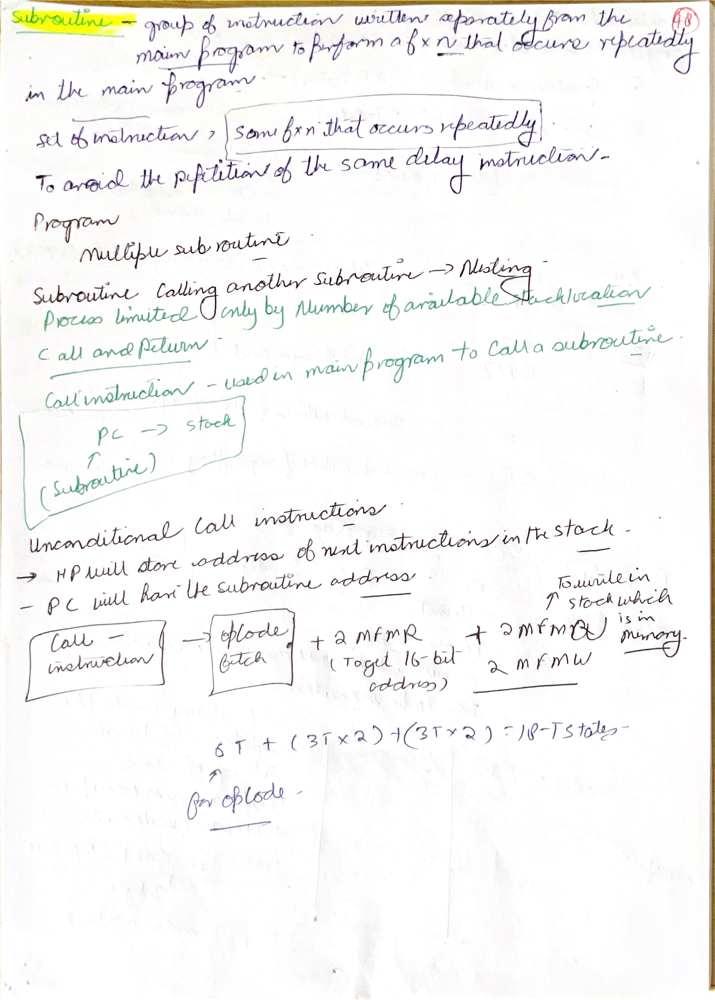</a>

Technical explanation: `CALL` is both a control-transfer instruction and a stack operation. The CPU fetches the target address, pushes the return address on the stack, and loads `PC` with the target. `RET` pops the saved address back into `PC`. The return address is the address of the next instruction after the call, not the call instruction's own address.

Branch instructions test existing state; they do not create the condition themselves. Conditional jumps, calls, and returns read flag bits left by earlier instructions. Timing can differ between taken and not-taken branches because the processor may or may not load the target address into `PC`. This is why loop timing must count the last failed branch separately.

#### [till73 page 002](images/HandWrittenNotes/till73/page-002.jpg)

<a href="images/HandWrittenNotes/till73/page-002.jpg">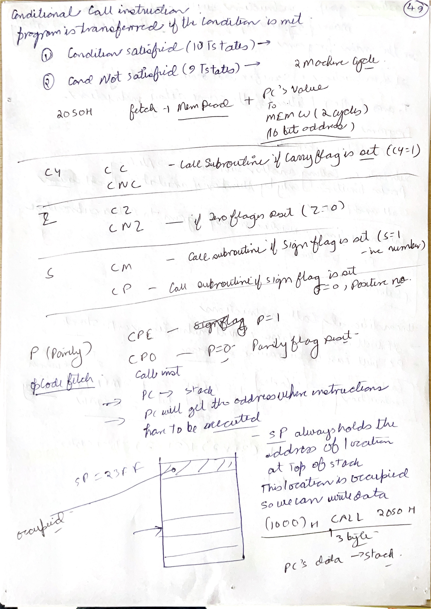</a>

Technical explanation: `CALL` is both a control-transfer instruction and a stack operation. The CPU fetches the target address, pushes the return address on the stack, and loads `PC` with the target. `RET` pops the saved address back into `PC`. The return address is the address of the next instruction after the call, not the call instruction's own address.

Branch instructions test existing state; they do not create the condition themselves. Conditional jumps, calls, and returns read flag bits left by earlier instructions. Timing can differ between taken and not-taken branches because the processor may or may not load the target address into `PC`. This is why loop timing must count the last failed branch separately.

The 8085 stack grows toward lower memory addresses. On push-like operations, `SP` is decremented before bytes are stored; on pop-like operations, bytes are read and then `SP` is incremented. For register pairs, keep high and low bytes separate because the final memory layout determines what a later `POP` or `RET` reconstructs.

#### [till73 page 003](images/HandWrittenNotes/till73/page-003.jpg)

<a href="images/HandWrittenNotes/till73/page-003.jpg">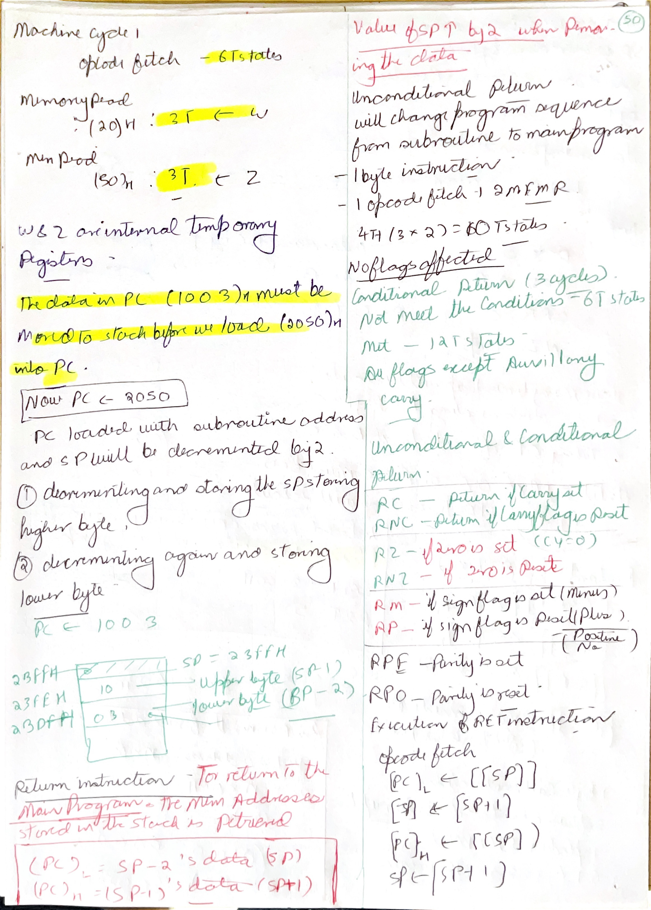</a>

Technical explanation: `CALL` is both a control-transfer instruction and a stack operation. The CPU fetches the target address, pushes the return address on the stack, and loads `PC` with the target. `RET` pops the saved address back into `PC`. The return address is the address of the next instruction after the call, not the call instruction's own address.

Branch instructions test existing state; they do not create the condition themselves. Conditional jumps, calls, and returns read flag bits left by earlier instructions. Timing can differ between taken and not-taken branches because the processor may or may not load the target address into `PC`. This is why loop timing must count the last failed branch separately.

#### [till73 page 004](images/HandWrittenNotes/till73/page-004.jpg)

<a href="images/HandWrittenNotes/till73/page-004.jpg">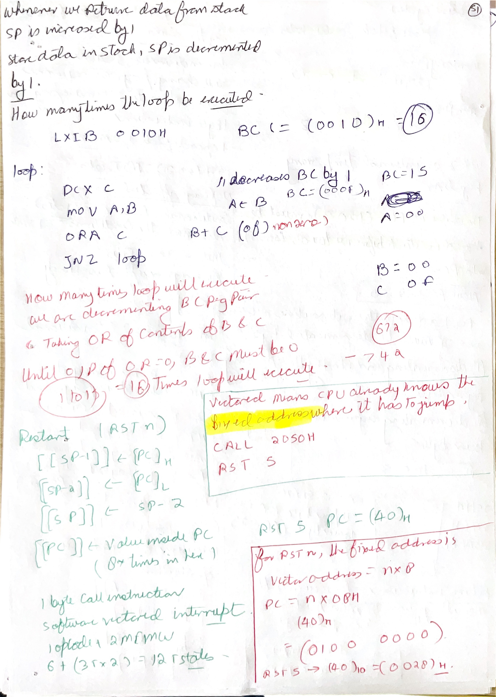</a>

Technical explanation: `CALL` is both a control-transfer instruction and a stack operation. The CPU fetches the target address, pushes the return address on the stack, and loads `PC` with the target. `RET` pops the saved address back into `PC`. The return address is the address of the next instruction after the call, not the call instruction's own address.

Branch instructions test existing state; they do not create the condition themselves. Conditional jumps, calls, and returns read flag bits left by earlier instructions. Timing can differ between taken and not-taken branches because the processor may or may not load the target address into `PC`. This is why loop timing must count the last failed branch separately.

For program traces, keep a state table. Each row should list only what the current instruction changes: registers, flags, memory, `PC`, `SP`, or stack bytes. This prevents the common mistake of updating a value but forgetting the pointer that determines where the next memory access will happen.

#### [till73 page 005](images/HandWrittenNotes/till73/page-005.jpg)

<a href="images/HandWrittenNotes/till73/page-005.jpg">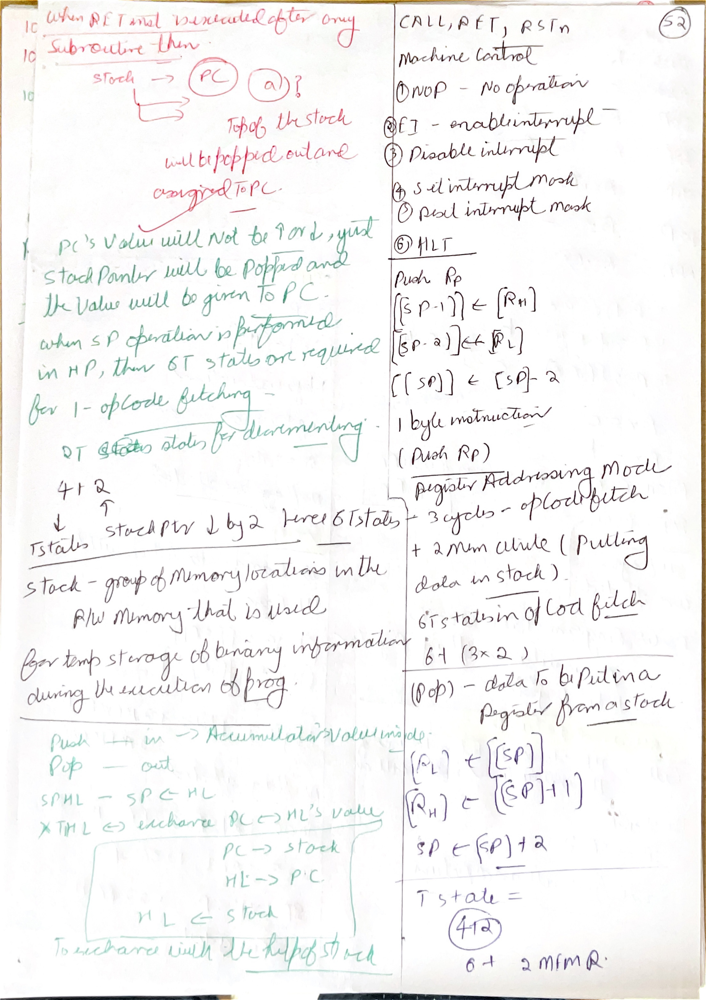</a>

Technical explanation: `CALL` is both a control-transfer instruction and a stack operation. The CPU fetches the target address, pushes the return address on the stack, and loads `PC` with the target. `RET` pops the saved address back into `PC`. The return address is the address of the next instruction after the call, not the call instruction's own address.

Branch instructions test existing state; they do not create the condition themselves. Conditional jumps, calls, and returns read flag bits left by earlier instructions. Timing can differ between taken and not-taken branches because the processor may or may not load the target address into `PC`. This is why loop timing must count the last failed branch separately.

The 8085 stack grows toward lower memory addresses. On push-like operations, `SP` is decremented before bytes are stored; on pop-like operations, bytes are read and then `SP` is incremented. For register pairs, keep high and low bytes separate because the final memory layout determines what a later `POP` or `RET` reconstructs.

#### [till73 page 006](images/HandWrittenNotes/till73/page-006.jpg)

<a href="images/HandWrittenNotes/till73/page-006.jpg">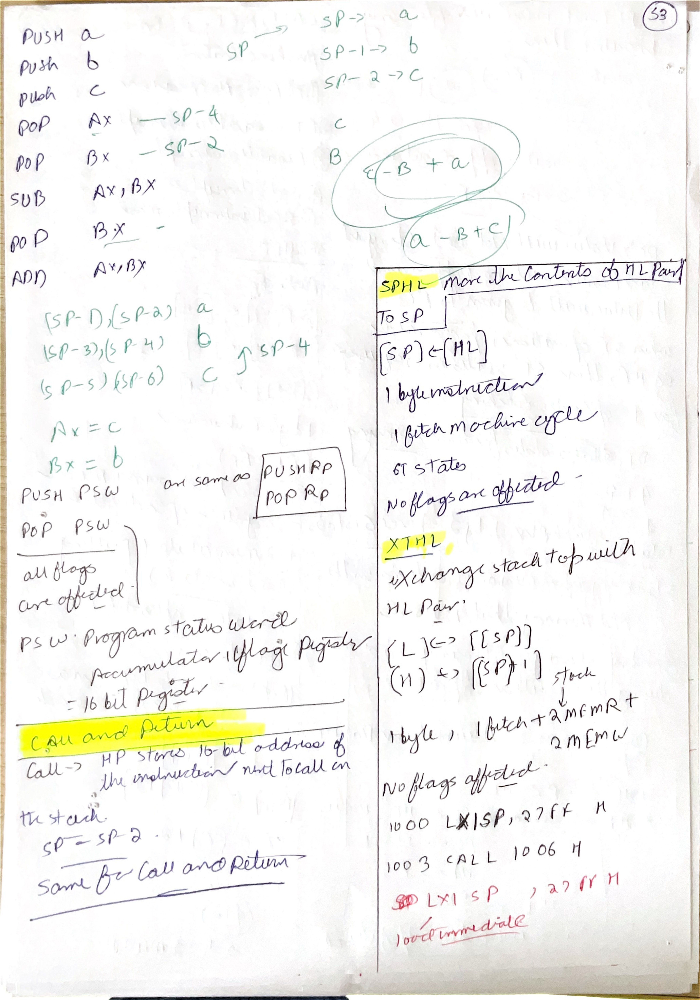</a>

Technical explanation: the 8085 stack grows toward lower memory addresses. On push-like operations, `SP` is decremented before bytes are stored; on pop-like operations, bytes are read and then `SP` is incremented. For register pairs, keep high and low bytes separate because the final memory layout determines what a later `POP` or `RET` reconstructs.

`XTHL` exchanges `L` and `H` with the two bytes at the top of the stack, while `SPHL` copies `HL` into `SP`. They are not arithmetic instructions. Their value is that they let software manipulate stack-resident 16-bit values, temporary addresses, or return-address-like data without ordinary byte-by-byte loads.

#### [till73 page 007](images/HandWrittenNotes/till73/page-007.jpg)

<a href="images/HandWrittenNotes/till73/page-007.jpg">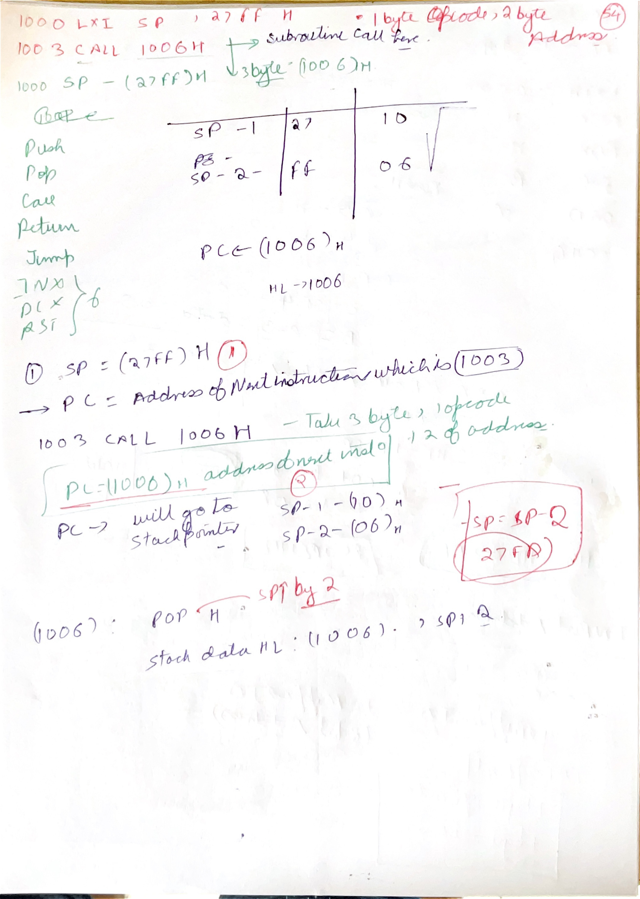</a>

Technical explanation: `CALL` is both a control-transfer instruction and a stack operation. The CPU fetches the target address, pushes the return address on the stack, and loads `PC` with the target. `RET` pops the saved address back into `PC`. The return address is the address of the next instruction after the call, not the call instruction's own address.

Branch instructions test existing state; they do not create the condition themselves. Conditional jumps, calls, and returns read flag bits left by earlier instructions. Timing can differ between taken and not-taken branches because the processor may or may not load the target address into `PC`. This is why loop timing must count the last failed branch separately.

The 8085 stack grows toward lower memory addresses. On push-like operations, `SP` is decremented before bytes are stored; on pop-like operations, bytes are read and then `SP` is incremented. For register pairs, keep high and low bytes separate because the final memory layout determines what a later `POP` or `RET` reconstructs.

#### [till73 page 008](images/HandWrittenNotes/till73/page-008.jpg)

<a href="images/HandWrittenNotes/till73/page-008.jpg">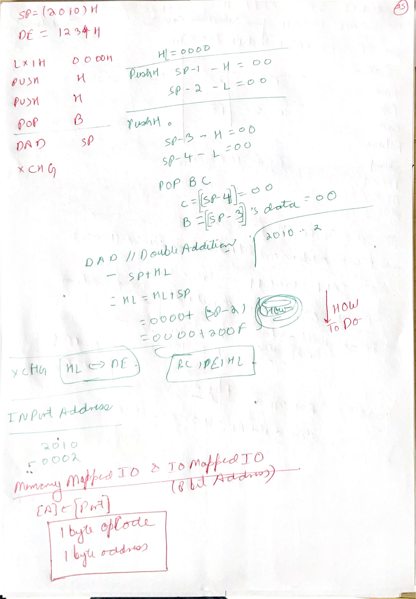</a>

Technical explanation: `XCHG` swaps `HL` with `DE`; it does not touch memory. `DAD rp` adds a 16-bit register pair to `HL` and stores the 16-bit result in `HL`, with carry out recorded in `CY`. When tracing these, combine each pair as a 16-bit number first, then split the result back into high and low registers.

The 8085 stack grows toward lower memory addresses. On push-like operations, `SP` is decremented before bytes are stored; on pop-like operations, bytes are read and then `SP` is incremented. For register pairs, keep high and low bytes separate because the final memory layout determines what a later `POP` or `RET` reconstructs.

For program traces, keep a state table. Each row should list only what the current instruction changes: registers, flags, memory, `PC`, `SP`, or stack bytes. This prevents the common mistake of updating a value but forgetting the pointer that determines where the next memory access will happen.

#### [till73 page 009](images/HandWrittenNotes/till73/page-009.jpg)

<a href="images/HandWrittenNotes/till73/page-009.jpg">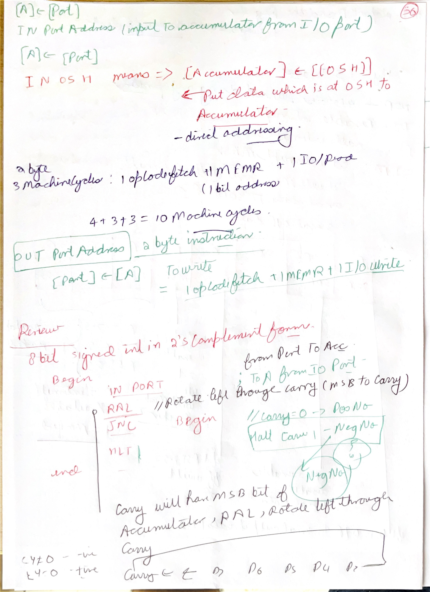</a>

Technical explanation: rotate instructions are best traced as eight accumulator bits plus a separate carry. `RLC` moves bit 7 into bit 0 and into `CY`; `RRC` moves bit 0 into bit 7 and into `CY`. `RAL` and `RAR` rotate through carry, so the old carry becomes part of the new accumulator and the outgoing accumulator bit becomes the new carry.

`IN` and `OUT` move bytes through the accumulator but do not by themselves create signed arithmetic meaning. If the program uses `RAL` and then tests carry, the sign bit or selected bit is being moved into `CY` deliberately. The branch decision is therefore based on the rotated bit, not on a fresh comparison instruction.

#### [till73 page 010](images/HandWrittenNotes/till73/page-010.jpg)

<a href="images/HandWrittenNotes/till73/page-010.jpg">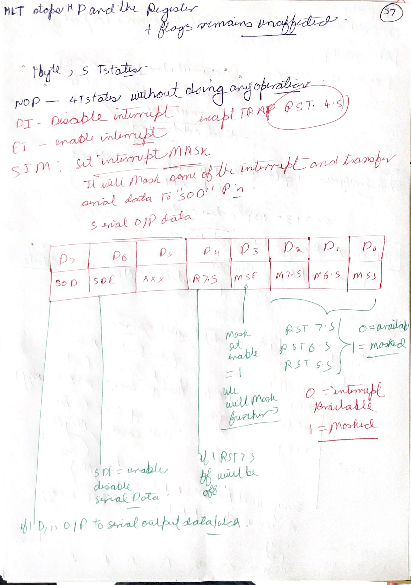</a>

Technical explanation: `SIM` and `RIM` treat the accumulator as a packed control/status byte. For `SIM`, bits control interrupt masks, mask-set enable, `RST 7.5` reset, serial data enable, and serial output data. For `RIM`, bits report mask status, interrupt enable, pending interrupt requests, and serial input data. Label each bit before interpreting the byte.

`NOP`, `HLT`, `DI`, `EI`, and `SIM` are control-oriented instructions. `NOP` only consumes time, `HLT` stops execution until interrupt/reset, `DI/EI` change interrupt enable state, and `SIM` uses accumulator bits as control fields. Their operands are implied by CPU control logic rather than fetched as ordinary data bytes.

#### [till73 page 011](images/HandWrittenNotes/till73/page-011.jpg)

<a href="images/HandWrittenNotes/till73/page-011.jpg">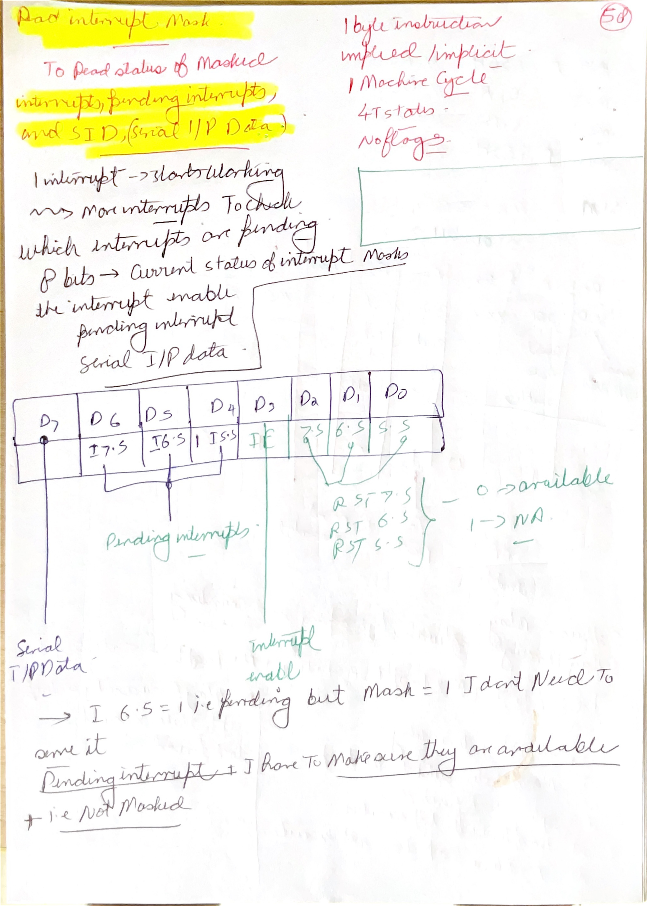</a>

Technical explanation: `SIM` and `RIM` treat the accumulator as a packed control/status byte. For `SIM`, bits control interrupt masks, mask-set enable, `RST 7.5` reset, serial data enable, and serial output data. For `RIM`, bits report mask status, interrupt enable, pending interrupt requests, and serial input data. Label each bit before interpreting the byte.

8085 serial I/O is bit-oriented. `SID` is the serial input data pin and `SOD` is the serial output data pin. They are controlled through `RIM` and `SIM`, not through normal parallel `IN` and `OUT` port transfers. Serial transfer moves one bit under software control; normal I/O ports move an 8-bit byte through the data bus.

#### [till73 page 012](images/HandWrittenNotes/till73/page-012.jpg)

<a href="images/HandWrittenNotes/till73/page-012.jpg">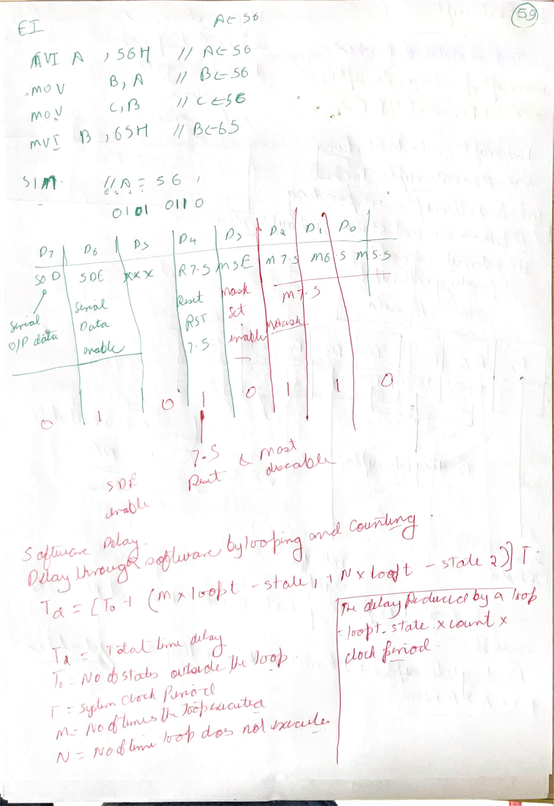</a>

Technical explanation: `SIM` and `RIM` treat the accumulator as a packed control/status byte. For `SIM`, bits control interrupt masks, mask-set enable, `RST 7.5` reset, serial data enable, and serial output data. For `RIM`, bits report mask status, interrupt enable, pending interrupt requests, and serial input data. Label each bit before interpreting the byte.

8085 serial I/O is bit-oriented. `SID` is the serial input data pin and `SOD` is the serial output data pin. They are controlled through `RIM` and `SIM`, not through normal parallel `IN` and `OUT` port transfers. Serial transfer moves one bit under software control; normal I/O ports move an 8-bit byte through the data bus.

#### [till73 page 013](images/HandWrittenNotes/till73/page-013.jpg)

Technical explanation: `INR` and `DCR` change an 8-bit register or memory byte, while `INX` and `DCX` change a 16-bit register pair. `INR/DCR` update most arithmetic flags but do not update carry, which is a frequent exam trap. `INX/DCX` are 16-bit pointer updates and do not set the normal arithmetic flags.

Flags are a compressed record of the last flag-affecting result. `S` copies bit 7, `Z` reports zero, `P` reports even parity, `AC` reports carry from bit 3 to bit 4, and `CY` reports carry out of bit 7. In subtraction, `CY` is interpreted as borrow. A common trace error is testing a flag after an instruction that did not update it.

#### [till73 page 014](images/HandWrittenNotes/till73/page-014.jpg)

Technical explanation: for program traces, keep a state table. Each row should list only what the current instruction changes: registers, flags, memory, `PC`, `SP`, or stack bytes. This prevents the common mistake of updating a value but forgetting the pointer that determines where the next memory access will happen.

When a page asks for final `S`, `Z`, `P`, `CY`, or `AC`, compute the actual 8-bit result first. Then derive flags from that result and the carry path. Do not update carry after `INR/DCR`, and do not assume data-transfer instructions refresh flags.

#### [till73 page 015](images/HandWrittenNotes/till73/page-015.jpg)

Technical explanation: `INR` and `DCR` change an 8-bit register or memory byte, while `INX` and `DCX` change a 16-bit register pair. `INR/DCR` update most arithmetic flags but do not update carry, which is a frequent exam trap. `INX/DCX` are 16-bit pointer updates and do not set the normal arithmetic flags.

Flags are a compressed record of the last flag-affecting result. `S` copies bit 7, `Z` reports zero, `P` reports even parity, `AC` reports carry from bit 3 to bit 4, and `CY` reports carry out of bit 7. In subtraction, `CY` is interpreted as borrow. A common trace error is testing a flag after an instruction that did not update it.

`CMA` complements every accumulator bit and does not mean two's-complement negation by itself. `STC` sets carry, and `CMC` complements carry. These instructions are small but important because later rotate, subtract-with-borrow, or conditional branch instructions can depend on the carry value they leave behind.

#### [till73 page 016](images/HandWrittenNotes/till73/page-016.jpg)

Technical explanation: the 8085 stack grows toward lower memory addresses. On push-like operations, `SP` is decremented before bytes are stored; on pop-like operations, bytes are read and then `SP` is incremented. For register pairs, keep high and low bytes separate because the final memory layout determines what a later `POP` or `RET` reconstructs.

For program traces, keep a state table. Each row should list only what the current instruction changes: registers, flags, memory, `PC`, `SP`, or stack bytes. This prevents the common mistake of updating a value but forgetting the pointer that determines where the next memory access will happen.

#### [till73 page 017](images/HandWrittenNotes/till73/page-017.jpg)

Technical explanation: rotate instructions are best traced as eight accumulator bits plus a separate carry. `RLC` moves bit 7 into bit 0 and into `CY`; `RRC` moves bit 0 into bit 7 and into `CY`. `RAL` and `RAR` rotate through carry, so the old carry becomes part of the new accumulator and the outgoing accumulator bit becomes the new carry.

For rotate traces, write the old accumulator as bits `b7 ... b0` and write old `CY` separately. `RAL/RAR` depend on old carry, so two traces with the same accumulator can differ if the incoming carry differs. `RLC/RRC` do not use old carry in the same way.

#### [till73 page 018](images/HandWrittenNotes/till73/page-018.jpg)

Technical explanation: a T-state is one processor clock state. Instruction timing is the number of T-states multiplied by the clock period. The counts are not arbitrary: every external memory or I/O access needs a bus cycle. Opcode fetch has address output, `ALE`, memory read control, data capture, and decode work, so it is longer than a plain memory read. Extra operand bytes, memory operands, stack transfers, I/O transfers, and slow memory wait states all add timing cost.

A machine cycle is one external bus operation: opcode fetch, memory read, memory write, I/O read, I/O write, interrupt acknowledge, and so on. An instruction cycle is the whole instruction and can contain several machine cycles. This is why instruction length, addressing mode, and T-state count are connected: every extra byte or external operand has to be fetched, read, or written on the bus.

`XCHG` swaps `HL` with `DE`; it does not touch memory. `DAD rp` adds a 16-bit register pair to `HL` and stores the 16-bit result in `HL`, with carry out recorded in `CY`. When tracing these, combine each pair as a 16-bit number first, then split the result back into high and low registers.

#### [till73 page 019](images/HandWrittenNotes/till73/page-019.jpg)

Technical explanation: rotate instructions are best traced as eight accumulator bits plus a separate carry. `RLC` moves bit 7 into bit 0 and into `CY`; `RRC` moves bit 0 into bit 7 and into `CY`. `RAL` and `RAR` rotate through carry, so the old carry becomes part of the new accumulator and the outgoing accumulator bit becomes the new carry.

For program traces, keep a state table. Each row should list only what the current instruction changes: registers, flags, memory, `PC`, `SP`, or stack bytes. This prevents the common mistake of updating a value but forgetting the pointer that determines where the next memory access will happen.

#### [till73 page 020](images/HandWrittenNotes/till73/page-020.jpg)

Technical explanation: a T-state is one processor clock state. Instruction timing is the number of T-states multiplied by the clock period. The counts are not arbitrary: every external memory or I/O access needs a bus cycle. Opcode fetch has address output, `ALE`, memory read control, data capture, and decode work, so it is longer than a plain memory read. Extra operand bytes, memory operands, stack transfers, I/O transfers, and slow memory wait states all add timing cost.

A machine cycle is one external bus operation: opcode fetch, memory read, memory write, I/O read, I/O write, interrupt acknowledge, and so on. An instruction cycle is the whole instruction and can contain several machine cycles. This is why instruction length, addressing mode, and T-state count are connected: every extra byte or external operand has to be fetched, read, or written on the bus.

Delay-loop timing is derived, not guessed. Count setup instructions once, count the loop body for taken iterations, then count the final iteration separately because the conditional branch is not taken at the end. Convert the final T-state total into time using `delay = T-states x clock period`, where `clock period = 1 / clock frequency`.

#### [till73 page 021](images/HandWrittenNotes/till73/page-021.jpg)

Technical explanation: a T-state is one processor clock state. Instruction timing is the number of T-states multiplied by the clock period. The counts are not arbitrary: every external memory or I/O access needs a bus cycle. Opcode fetch has address output, `ALE`, memory read control, data capture, and decode work, so it is longer than a plain memory read. Extra operand bytes, memory operands, stack transfers, I/O transfers, and slow memory wait states all add timing cost.

A machine cycle is one external bus operation: opcode fetch, memory read, memory write, I/O read, I/O write, interrupt acknowledge, and so on. An instruction cycle is the whole instruction and can contain several machine cycles. This is why instruction length, addressing mode, and T-state count are connected: every extra byte or external operand has to be fetched, read, or written on the bus.

Addressing mode means where the operand comes from. Immediate addressing puts the operand in the instruction stream. Register addressing uses an internal register. Direct addressing stores the 16-bit memory address inside the instruction. Register-indirect addressing uses a register pair as a pointer. Implied addressing builds the operand into the instruction definition, such as accumulator, carry, or stack behavior.

8085 interrupts combine priority, masking, and vectoring. `TRAP` is highest priority and non-maskable. `RST 7.5`, `RST 6.5`, and `RST 5.5` are maskable vectored interrupts with fixed restart addresses: `RST n` maps to `n x 8`, so `RST 7.5` starts at `003CH`, `RST 6.5` at `0034H`, and `RST 5.5` at `002CH`. `INTR` is maskable and non-vectored, so external hardware must supply the instruction during acknowledge.

Support chips offload repeated interface work from the CPU. `8255` provides programmable parallel I/O ports, `8253` provides programmable timing/counting, `8257` manages DMA channels, and `8259` prioritizes and vectors interrupt requests. Devices such as `8272`, `8275`, and `8279` specialize further for floppy, display, keyboard, or display-control tasks.

#### [till73 page 022](images/HandWrittenNotes/till73/page-022.jpg)

Technical explanation: memory interfacing is mostly address decoding. A `4K x 8` chip has 4096 byte locations, so it needs 12 low-order address lines because `2^12 = 4096`. Higher address lines decide which chip or block is enabled. Full decoding uses enough high address bits to make one unique range; partial decoding can make the same chip respond at mirrored address ranges.

`XCHG` swaps `HL` with `DE`; it does not touch memory. `DAD rp` adds a 16-bit register pair to `HL` and stores the 16-bit result in `HL`, with carry out recorded in `CY`. When tracing these, combine each pair as a 16-bit number first, then split the result back into high and low registers.

#### [till73 page 023](images/HandWrittenNotes/till73/page-023.jpg)

Technical explanation: `XCHG` swaps `HL` with `DE`; it does not touch memory. `DAD rp` adds a 16-bit register pair to `HL` and stores the 16-bit result in `HL`, with carry out recorded in `CY`. When tracing these, combine each pair as a 16-bit number first, then split the result back into high and low registers.

8085 subtraction is performed through two's-complement addition internally. `SUB r` computes `A - r`; `SBB r` computes `A - r - CY`; `SUI data` subtracts an immediate byte. After subtraction, `CY=1` means a borrow was required. `CMP r` performs the same internal subtraction only for flags and leaves the accumulator unchanged.

Flags are a compressed record of the last flag-affecting result. `S` copies bit 7, `Z` reports zero, `P` reports even parity, `AC` reports carry from bit 3 to bit 4, and `CY` reports carry out of bit 7. In subtraction, `CY` is interpreted as borrow. A common trace error is testing a flag after an instruction that did not update it.

`CALL` is both a control-transfer instruction and a stack operation. The CPU fetches the target address, pushes the return address on the stack, and loads `PC` with the target. `RET` pops the saved address back into `PC`. The return address is the address of the next instruction after the call, not the call instruction's own address.

Branch instructions test existing state; they do not create the condition themselves. Conditional jumps, calls, and returns read flag bits left by earlier instructions. Timing can differ between taken and not-taken branches because the processor may or may not load the target address into `PC`. This is why loop timing must count the last failed branch separately.

#### [till73 page 024](images/HandWrittenNotes/till73/page-024.jpg)

Technical explanation: the ALU is where arithmetic and logical results are physically produced, but the useful output is not only the 8-bit result. The accumulator usually supplies one operand and receives the result, while the flag flip-flops record properties of that result. Carry is generated from bit 7, auxiliary carry from bit 3 to bit 4, zero from an all-zero result, sign from bit 7, and parity from the number of 1 bits. That is why exam traces must update flags from the actual binary result, not from the instruction name alone.

Flags are a compressed record of the last flag-affecting result. `S` copies bit 7, `Z` reports zero, `P` reports even parity, `AC` reports carry from bit 3 to bit 4, and `CY` reports carry out of bit 7. In subtraction, `CY` is interpreted as borrow. A common trace error is testing a flag after an instruction that did not update it.

8085 subtraction is performed through two's-complement addition internally. `SUB r` computes `A - r`; `SBB r` computes `A - r - CY`; `SUI data` subtracts an immediate byte. After subtraction, `CY=1` means a borrow was required. `CMP r` performs the same internal subtraction only for flags and leaves the accumulator unchanged.

Logical instructions operate bit by bit. `ANA` clears a bit unless both inputs have 1, `ORA` sets a bit if either input has 1, and `XRA` sets a bit only when the inputs differ. `XRA A` is a standard way to clear the accumulator to `00H`; it also updates flags, so later conditional jumps may depend on that clear operation.

For program traces, keep a state table. Each row should list only what the current instruction changes: registers, flags, memory, `PC`, `SP`, or stack bytes. This prevents the common mistake of updating a value but forgetting the pointer that determines where the next memory access will happen.

### `8085-interrupts-io-dma-support-chips-8086-transition.pdf`

#### [85completed page 001](images/HandWrittenNotes/85completed/page-001.jpg)

Technical explanation: the ALU is where arithmetic and logical results are physically produced, but the useful output is not only the 8-bit result. The accumulator usually supplies one operand and receives the result, while the flag flip-flops record properties of that result. Carry is generated from bit 7, auxiliary carry from bit 3 to bit 4, zero from an all-zero result, sign from bit 7, and parity from the number of 1 bits. That is why exam traces must update flags from the actual binary result, not from the instruction name alone.

Flags are a compressed record of the last flag-affecting result. `S` copies bit 7, `Z` reports zero, `P` reports even parity, `AC` reports carry from bit 3 to bit 4, and `CY` reports carry out of bit 7. In subtraction, `CY` is interpreted as borrow. A common trace error is testing a flag after an instruction that did not update it.

8085 subtraction is performed through two's-complement addition internally. `SUB r` computes `A - r`; `SBB r` computes `A - r - CY`; `SUI data` subtracts an immediate byte. After subtraction, `CY=1` means a borrow was required. `CMP r` performs the same internal subtraction only for flags and leaves the accumulator unchanged.

For program traces, keep a state table. Each row should list only what the current instruction changes: registers, flags, memory, `PC`, `SP`, or stack bytes. This prevents the common mistake of updating a value but forgetting the pointer that determines where the next memory access will happen.

#### [85completed page 002](images/HandWrittenNotes/85completed/page-002.jpg)

Technical explanation: a T-state is one processor clock state. Instruction timing is the number of T-states multiplied by the clock period. The counts are not arbitrary: every external memory or I/O access needs a bus cycle. Opcode fetch has address output, `ALE`, memory read control, data capture, and decode work, so it is longer than a plain memory read. Extra operand bytes, memory operands, stack transfers, I/O transfers, and slow memory wait states all add timing cost.

A machine cycle is one external bus operation: opcode fetch, memory read, memory write, I/O read, I/O write, interrupt acknowledge, and so on. An instruction cycle is the whole instruction and can contain several machine cycles. This is why instruction length, addressing mode, and T-state count are connected: every extra byte or external operand has to be fetched, read, or written on the bus.

Delay-loop timing is derived, not guessed. Count setup instructions once, count the loop body for taken iterations, then count the final iteration separately because the conditional branch is not taken at the end. Convert the final T-state total into time using `delay = T-states x clock period`, where `clock period = 1 / clock frequency`.

#### [85completed page 003](images/HandWrittenNotes/85completed/page-003.jpg)

Technical explanation: branch instructions test existing state; they do not create the condition themselves. Conditional jumps, calls, and returns read flag bits left by earlier instructions. Timing can differ between taken and not-taken branches because the processor may or may not load the target address into `PC`. This is why loop timing must count the last failed branch separately.

`CALL` is both a control-transfer instruction and a stack operation. The CPU fetches the target address, pushes the return address on the stack, and loads `PC` with the target. `RET` pops the saved address back into `PC`. The return address is the address of the next instruction after the call, not the call instruction's own address.

The 8085 stack grows toward lower memory addresses. On push-like operations, `SP` is decremented before bytes are stored; on pop-like operations, bytes are read and then `SP` is incremented. For register pairs, keep high and low bytes separate because the final memory layout determines what a later `POP` or `RET` reconstructs.

#### [85completed page 004](images/HandWrittenNotes/85completed/page-004.jpg)

Technical explanation: 8085 interrupts combine priority, masking, and vectoring. `TRAP` is highest priority and non-maskable. `RST 7.5`, `RST 6.5`, and `RST 5.5` are maskable vectored interrupts with fixed restart addresses: `RST n` maps to `n x 8`, so `RST 7.5` starts at `003CH`, `RST 6.5` at `0034H`, and `RST 5.5` at `002CH`. `INTR` is maskable and non-vectored, so external hardware must supply the instruction during acknowledge.

`CALL` is both a control-transfer instruction and a stack operation. The CPU fetches the target address, pushes the return address on the stack, and loads `PC` with the target. `RET` pops the saved address back into `PC`. The return address is the address of the next instruction after the call, not the call instruction's own address.

Branch instructions test existing state; they do not create the condition themselves. Conditional jumps, calls, and returns read flag bits left by earlier instructions. Timing can differ between taken and not-taken branches because the processor may or may not load the target address into `PC`. This is why loop timing must count the last failed branch separately.

#### [85completed page 005](images/HandWrittenNotes/85completed/page-005.jpg)

Technical explanation: 8085 interrupts combine priority, masking, and vectoring. `TRAP` is highest priority and non-maskable. `RST 7.5`, `RST 6.5`, and `RST 5.5` are maskable vectored interrupts with fixed restart addresses: `RST n` maps to `n x 8`, so `RST 7.5` starts at `003CH`, `RST 6.5` at `0034H`, and `RST 5.5` at `002CH`. `INTR` is maskable and non-vectored, so external hardware must supply the instruction during acknowledge.

Software interrupts execute a restart-like instruction, while hardware interrupts arrive through pins and priority logic. In both cases, the useful technical question is where control goes next and whether the return address or processor state must be preserved before the ISR runs.

#### [85completed page 006](images/HandWrittenNotes/85completed/page-006.jpg)

Technical explanation: 8085 interrupts combine priority, masking, and vectoring. `TRAP` is highest priority and non-maskable. `RST 7.5`, `RST 6.5`, and `RST 5.5` are maskable vectored interrupts with fixed restart addresses: `RST n` maps to `n x 8`, so `RST 7.5` starts at `003CH`, `RST 6.5` at `0034H`, and `RST 5.5` at `002CH`. `INTR` is maskable and non-vectored, so external hardware must supply the instruction during acknowledge.

Maskable interrupts can be disabled or masked; non-maskable `TRAP` cannot be ignored by the normal interrupt-enable mechanism. `RST 7.5` is edge-sensitive and latched, while `RST 6.5` and `RST 5.5` are level-sensitive. That difference matters when deciding whether a request remains pending.

#### [85completed page 007](images/HandWrittenNotes/85completed/page-007.jpg)

Technical explanation: 8085 interrupts combine priority, masking, and vectoring. `TRAP` is highest priority and non-maskable. `RST 7.5`, `RST 6.5`, and `RST 5.5` are maskable vectored interrupts with fixed restart addresses: `RST n` maps to `n x 8`, so `RST 7.5` starts at `003CH`, `RST 6.5` at `0034H`, and `RST 5.5` at `002CH`. `INTR` is maskable and non-vectored, so external hardware must supply the instruction during acknowledge.

`INTR` is non-vectored, so the external device or interrupt controller must provide the instruction during interrupt acknowledge. This is why `INTA` exists: it gives external hardware a controlled point to place the restart or call instruction on the data bus.

#### [85completed page 008](images/HandWrittenNotes/85completed/page-008.jpg)

Technical explanation: 8085 interrupts combine priority, masking, and vectoring. `TRAP` is highest priority and non-maskable. `RST 7.5`, `RST 6.5`, and `RST 5.5` are maskable vectored interrupts with fixed restart addresses: `RST n` maps to `n x 8`, so `RST 7.5` starts at `003CH`, `RST 6.5` at `0034H`, and `RST 5.5` at `002CH`. `INTR` is maskable and non-vectored, so external hardware must supply the instruction during acknowledge.

Pending interrupt questions are state questions. `EI` enables maskable recognition after the instruction boundary, mask bits can still block individual restart lines, and priority decides which accepted request is serviced first. A pending request is not the same as an immediately executed request.

#### [85completed page 009](images/HandWrittenNotes/85completed/page-009.jpg)

Technical explanation: `SIM` and `RIM` treat the accumulator as a packed control/status byte. For `SIM`, bits control interrupt masks, mask-set enable, `RST 7.5` reset, serial data enable, and serial output data. For `RIM`, bits report mask status, interrupt enable, pending interrupt requests, and serial input data. Label each bit before interpreting the byte.

For `SIM/RIM`, always decode the accumulator bit-by-bit. A mask bit, a pending bit, and the global interrupt-enable state are different facts. Mixing those fields is the usual reason students get interrupt-status questions wrong.

#### [85completed page 010](images/HandWrittenNotes/85completed/page-010.jpg)

Technical explanation: 8085 interrupts combine priority, masking, and vectoring. `TRAP` is highest priority and non-maskable. `RST 7.5`, `RST 6.5`, and `RST 5.5` are maskable vectored interrupts with fixed restart addresses: `RST n` maps to `n x 8`, so `RST 7.5` starts at `003CH`, `RST 6.5` at `0034H`, and `RST 5.5` at `002CH`. `INTR` is maskable and non-vectored, so external hardware must supply the instruction during acknowledge.

Addressing mode means where the operand comes from. Immediate addressing puts the operand in the instruction stream. Register addressing uses an internal register. Direct addressing stores the 16-bit memory address inside the instruction. Register-indirect addressing uses a register pair as a pointer. Implied addressing builds the operand into the instruction definition, such as accumulator, carry, or stack behavior.

Support chips offload repeated interface work from the CPU. `8255` provides programmable parallel I/O ports, `8253` provides programmable timing/counting, `8257` manages DMA channels, and `8259` prioritizes and vectors interrupt requests. Devices such as `8272`, `8275`, and `8279` specialize further for floppy, display, keyboard, or display-control tasks.

#### [85completed page 011](images/HandWrittenNotes/85completed/page-011.jpg)

Technical explanation: programmed I/O means the CPU explicitly executes instructions to move each byte between an I/O port and a register, usually the accumulator. The port address selects the external device, and the control signals decide whether the transfer is input or output. This is simple hardware but consumes CPU time because the processor must poll or execute transfer instructions for every data movement.

Memory-mapped I/O and I/O-mapped I/O differ in address space and control signaling. Memory-mapped I/O uses ordinary 16-bit memory addresses and memory-style read/write cycles. I/O-mapped I/O uses `IN` and `OUT` with an 8-bit port address and I/O control cycles. The data bus still carries the byte; the difference is how external decoding selects memory versus a device.

#### [85completed page 012](images/HandWrittenNotes/85completed/page-012.jpg)

Technical explanation: a T-state is one processor clock state. Instruction timing is the number of T-states multiplied by the clock period. The counts are not arbitrary: every external memory or I/O access needs a bus cycle. Opcode fetch has address output, `ALE`, memory read control, data capture, and decode work, so it is longer than a plain memory read. Extra operand bytes, memory operands, stack transfers, I/O transfers, and slow memory wait states all add timing cost.

A machine cycle is one external bus operation: opcode fetch, memory read, memory write, I/O read, I/O write, interrupt acknowledge, and so on. An instruction cycle is the whole instruction and can contain several machine cycles. This is why instruction length, addressing mode, and T-state count are connected: every extra byte or external operand has to be fetched, read, or written on the bus.

Synchronous transfer assumes timing agreement; asynchronous transfer needs extra signals because the device and CPU are not guaranteed to be ready at the same moment. Strobe transfer uses a signal to mark valid data. Handshaking adds request/acknowledge style feedback, so the sender knows the receiver actually accepted the byte. The extra signals reduce timing assumptions but increase interface complexity.

#### [85completed page 013](images/HandWrittenNotes/85completed/page-013.jpg)

Technical explanation: DMA transfers data without the CPU executing every byte transfer. A DMA controller requests the bus with `HOLD`; the 8085 responds with `HLDA` after it can release the bus. During DMA, the controller supplies addresses and read/write control for memory or I/O. The CPU is temporarily not the bus master, which is why DMA improves block-transfer efficiency.

The HOLD/HLDA sequence is a bus-arbitration protocol. The DMA controller requests bus control, the CPU finishes a safe point in its current bus use, asserts `HLDA`, and tri-states the bus lines. Only then can the DMA controller drive addresses and read/write controls.

#### [85completed page 014](images/HandWrittenNotes/85completed/page-014.jpg)

Technical explanation: DMA modes are tradeoffs between CPU pause time and transfer speed. Burst mode holds the bus for a block and is fastest for the device but stalls the CPU longer. Cycle stealing takes one bus cycle at a time, reducing CPU disruption but lowering peak transfer rate. Demand or transparent styles vary bus ownership based on device need or CPU idle periods.

DMA transfers data without the CPU executing every byte transfer. A DMA controller requests the bus with `HOLD`; the 8085 responds with `HLDA` after it can release the bus. During DMA, the controller supplies addresses and read/write control for memory or I/O. The CPU is temporarily not the bus master, which is why DMA improves block-transfer efficiency.

#### [85completed page 015](images/HandWrittenNotes/85completed/page-015.jpg)

Technical explanation: support chips offload repeated interface work from the CPU. `8255` provides programmable parallel I/O ports, `8253` provides programmable timing/counting, `8257` manages DMA channels, and `8259` prioritizes and vectors interrupt requests. Devices such as `8272`, `8275`, and `8279` specialize further for floppy, display, keyboard, or display-control tasks.

For 8255 questions, separate the physical ports from the programmed mode. Ports A and B are 8-bit ports, Port C can be split into control/handshake bits, and the control word selects mode and direction. The chip is programmable because software configures that behavior instead of rewiring the interface.

#### [85completed page 016](images/HandWrittenNotes/85completed/page-016.jpg)

Technical explanation: DMA transfers data without the CPU executing every byte transfer. A DMA controller requests the bus with `HOLD`; the 8085 responds with `HLDA` after it can release the bus. During DMA, the controller supplies addresses and read/write control for memory or I/O. The CPU is temporarily not the bus master, which is why DMA improves block-transfer efficiency.

Support chips offload repeated interface work from the CPU. `8255` provides programmable parallel I/O ports, `8253` provides programmable timing/counting, `8257` manages DMA channels, and `8259` prioritizes and vectors interrupt requests. Devices such as `8272`, `8275`, and `8279` specialize further for floppy, display, keyboard, or display-control tasks.

#### [85completed page 017](images/HandWrittenNotes/85completed/page-017.jpg)

Technical explanation: support chips offload repeated interface work from the CPU. `8255` provides programmable parallel I/O ports, `8253` provides programmable timing/counting, `8257` manages DMA channels, and `8259` prioritizes and vectors interrupt requests. Devices such as `8272`, `8275`, and `8279` specialize further for floppy, display, keyboard, or display-control tasks.

Choose the support chip by the hardware problem: many interrupt sources suggest `8259`, block data transfer suggests `8257`, periodic timing suggests `8253`, and keyboard/display interfacing suggests `8279`. The CPU still runs the program, but these chips remove repetitive external-control work.

#### [85completed page 018](images/HandWrittenNotes/85completed/page-018.jpg)

Technical explanation: addressing mode means where the operand comes from. Immediate addressing puts the operand in the instruction stream. Register addressing uses an internal register. Direct addressing stores the 16-bit memory address inside the instruction. Register-indirect addressing uses a register pair as a pointer. Implied addressing builds the operand into the instruction definition, such as accumulator, carry, or stack behavior.

8085 interrupts combine priority, masking, and vectoring. `TRAP` is highest priority and non-maskable. `RST 7.5`, `RST 6.5`, and `RST 5.5` are maskable vectored interrupts with fixed restart addresses: `RST n` maps to `n x 8`, so `RST 7.5` starts at `003CH`, `RST 6.5` at `0034H`, and `RST 5.5` at `002CH`. `INTR` is maskable and non-vectored, so external hardware must supply the instruction during acknowledge.

Support chips offload repeated interface work from the CPU. `8255` provides programmable parallel I/O ports, `8253` provides programmable timing/counting, `8257` manages DMA channels, and `8259` prioritizes and vectors interrupt requests. Devices such as `8272`, `8275`, and `8279` specialize further for floppy, display, keyboard, or display-control tasks.

#### [85completed page 019](images/HandWrittenNotes/85completed/page-019.jpg)

Technical explanation: the 8085 stack grows toward lower memory addresses. On push-like operations, `SP` is decremented before bytes are stored; on pop-like operations, bytes are read and then `SP` is incremented. For register pairs, keep high and low bytes separate because the final memory layout determines what a later `POP` or `RET` reconstructs.

`SIM` and `RIM` treat the accumulator as a packed control/status byte. For `SIM`, bits control interrupt masks, mask-set enable, `RST 7.5` reset, serial data enable, and serial output data. For `RIM`, bits report mask status, interrupt enable, pending interrupt requests, and serial input data. Label each bit before interpreting the byte.

Addressing mode means where the operand comes from. Immediate addressing puts the operand in the instruction stream. Register addressing uses an internal register. Direct addressing stores the 16-bit memory address inside the instruction. Register-indirect addressing uses a register pair as a pointer. Implied addressing builds the operand into the instruction definition, such as accumulator, carry, or stack behavior.

8085 interrupts combine priority, masking, and vectoring. `TRAP` is highest priority and non-maskable. `RST 7.5`, `RST 6.5`, and `RST 5.5` are maskable vectored interrupts with fixed restart addresses: `RST n` maps to `n x 8`, so `RST 7.5` starts at `003CH`, `RST 6.5` at `0034H`, and `RST 5.5` at `002CH`. `INTR` is maskable and non-vectored, so external hardware must supply the instruction during acknowledge.

Support chips offload repeated interface work from the CPU. `8255` provides programmable parallel I/O ports, `8253` provides programmable timing/counting, `8257` manages DMA channels, and `8259` prioritizes and vectors interrupt requests. Devices such as `8272`, `8275`, and `8279` specialize further for floppy, display, keyboard, or display-control tasks.

#### [85completed page 020](images/HandWrittenNotes/85completed/page-020.jpg)

<a href="images/HandWrittenNotes/85completed/page-020.jpg">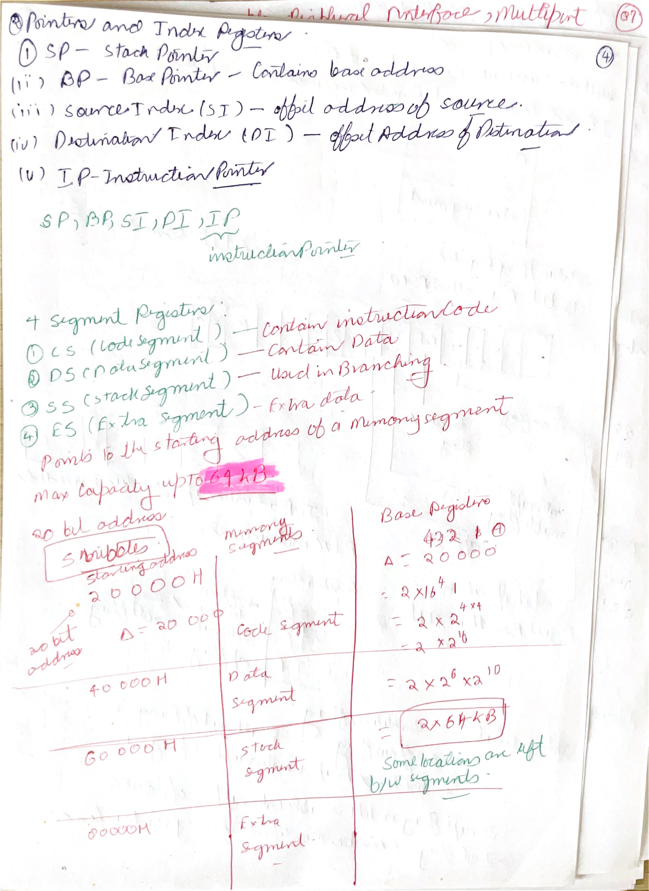</a>

Technical explanation: the 8085 register set mixes 8-bit storage and 16-bit addressing. `B`, `C`, `D`, `E`, `H`, and `L` are 8-bit registers, but `BC`, `DE`, and `HL` can be used as 16-bit pairs. `HL` has the special memory role: `M` means the memory byte addressed by `HL`. `PC` and `SP` are 16-bit because program bytes and stack bytes live in the 64 KB memory space.

Separate opcode bytes from operand bytes. The opcode selects the operation; following bytes may be immediate data, a port number, a low address byte, or a high address byte. One-byte instructions encode everything in the opcode. Two-byte instructions usually add one data or port byte. Three-byte instructions usually add a 16-bit address or 16-bit immediate value, stored low byte first in memory.

A T-state is one processor clock state. Instruction timing is the number of T-states multiplied by the clock period. The counts are not arbitrary: every external memory or I/O access needs a bus cycle. Opcode fetch has address output, `ALE`, memory read control, data capture, and decode work, so it is longer than a plain memory read. Extra operand bytes, memory operands, stack transfers, I/O transfers, and slow memory wait states all add timing cost.

A machine cycle is one external bus operation: opcode fetch, memory read, memory write, I/O read, I/O write, interrupt acknowledge, and so on. An instruction cycle is the whole instruction and can contain several machine cycles. This is why instruction length, addressing mode, and T-state count are connected: every extra byte or external operand has to be fetched, read, or written on the bus.

Addressing mode means where the operand comes from. Immediate addressing puts the operand in the instruction stream. Register addressing uses an internal register. Direct addressing stores the 16-bit memory address inside the instruction. Register-indirect addressing uses a register pair as a pointer. Implied addressing builds the operand into the instruction definition, such as accumulator, carry, or stack behavior.

8085 interrupts combine priority, masking, and vectoring. `TRAP` is highest priority and non-maskable. `RST 7.5`, `RST 6.5`, and `RST 5.5` are maskable vectored interrupts with fixed restart addresses: `RST n` maps to `n x 8`, so `RST 7.5` starts at `003CH`, `RST 6.5` at `0034H`, and `RST 5.5` at `002CH`. `INTR` is maskable and non-vectored, so external hardware must supply the instruction during acknowledge.

Support chips offload repeated interface work from the CPU. `8255` provides programmable parallel I/O ports, `8253` provides programmable timing/counting, `8257` manages DMA channels, and `8259` prioritizes and vectors interrupt requests. Devices such as `8272`, `8275`, and `8279` specialize further for floppy, display, keyboard, or display-control tasks.

#### [85completed page 021](images/HandWrittenNotes/85completed/page-021.jpg)

<a href="images/HandWrittenNotes/85completed/page-021.jpg">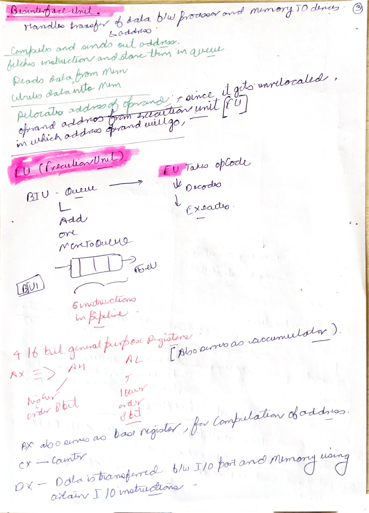</a>

Technical explanation: the 8086 architecture separates bus work from execution work. The Bus Interface Unit forms addresses, fetches instruction bytes, manages the prefetch queue, and performs memory/I/O transfers. The Execution Unit decodes and executes instructions using registers, ALU, and flags. This overlap improves bus use when the prefetch queue is not empty.

The prefetch queue is the key difference from a simple 8085-style fetch/execute picture. The BIU can fetch instruction bytes while the EU executes previous bytes, but branches or jumps can flush that queue because the next bytes are no longer from the old sequential path.

#### [85completed page 022](images/HandWrittenNotes/85completed/page-022.jpg)

<a href="images/HandWrittenNotes/85completed/page-022.jpg">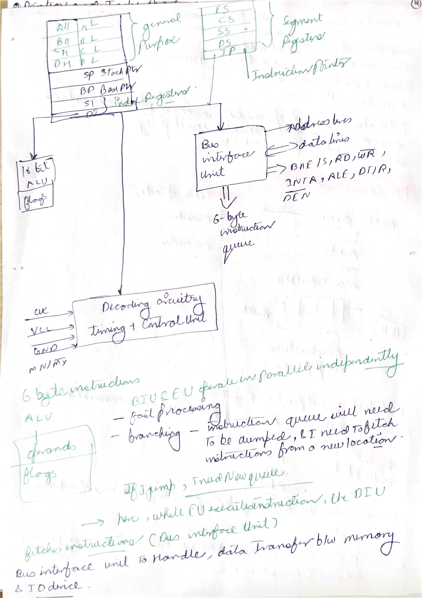</a>

Technical explanation: the 8086 architecture separates bus work from execution work. The Bus Interface Unit forms addresses, fetches instruction bytes, manages the prefetch queue, and performs memory/I/O transfers. The Execution Unit decodes and executes instructions using registers, ALU, and flags. This overlap improves bus use when the prefetch queue is not empty.

In 8086 architecture sketches, always trace an address through segment register plus offset before thinking about the external bus. The internal EU may compute an effective offset, but the BIU forms the physical 20-bit address and performs the actual memory or I/O cycle.

### `8086-pins-architecture-flags-addressing-io.pdf`

#### [86tilllnow page 001](images/HandWrittenNotes/86tilllnow/page-001.jpg)

<a href="images/HandWrittenNotes/86tilllnow/page-001.jpg">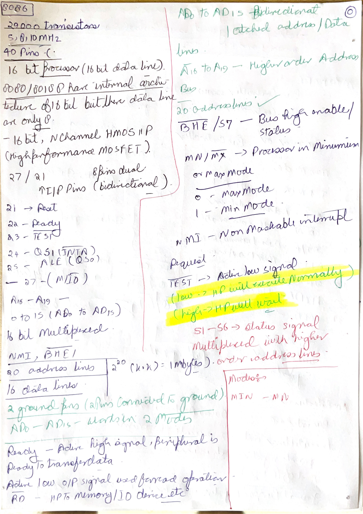</a>

Technical explanation: the 8086 multiplexes `AD0-AD15` as address/data lines and `A16-A19/S3-S6` as high-address/status lines to fit a 20-bit address bus and 16-bit data bus into a 40-pin package. As with the 8085, external latching is required because the same pins carry different information during different parts of a bus cycle.

Minimum mode is meant for simpler single-processor systems where the 8086 itself supplies bus-control signals. Maximum mode is for systems with external bus-control logic, coprocessors, or multiprocessor-style coordination. The selected mode changes the meaning of several pins, so pin diagrams must be read together with the mode.

#### [86tilllnow page 002](images/HandWrittenNotes/86tilllnow/page-002.jpg)

<a href="images/HandWrittenNotes/86tilllnow/page-002.jpg">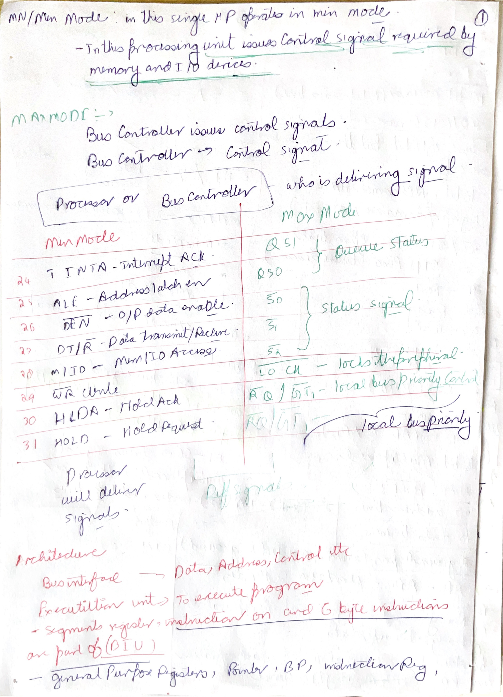</a>

Technical explanation: minimum mode is meant for simpler single-processor systems where the 8086 itself supplies bus-control signals. Maximum mode is for systems with external bus-control logic, coprocessors, or multiprocessor-style coordination. The selected mode changes the meaning of several pins, so pin diagrams must be read together with the mode.

The 8086 multiplexes `AD0-AD15` as address/data lines and `A16-A19/S3-S6` as high-address/status lines to fit a 20-bit address bus and 16-bit data bus into a 40-pin package. As with the 8085, external latching is required because the same pins carry different information during different parts of a bus cycle.

#### [86tilllnow page 003](images/HandWrittenNotes/86tilllnow/page-003.jpg)

<a href="images/HandWrittenNotes/86tilllnow/page-003.jpg">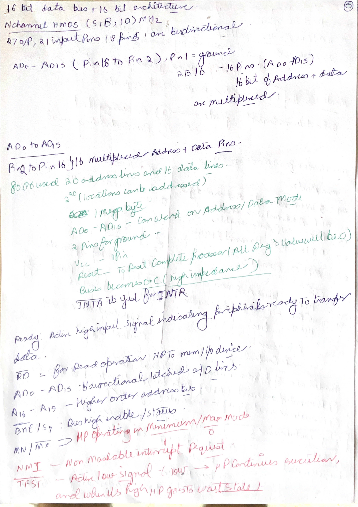</a>

Technical explanation: the 8086 multiplexes `AD0-AD15` as address/data lines and `A16-A19/S3-S6` as high-address/status lines to fit a 20-bit address bus and 16-bit data bus into a 40-pin package. As with the 8085, external latching is required because the same pins carry different information during different parts of a bus cycle.

Minimum mode is meant for simpler single-processor systems where the 8086 itself supplies bus-control signals. Maximum mode is for systems with external bus-control logic, coprocessors, or multiprocessor-style coordination. The selected mode changes the meaning of several pins, so pin diagrams must be read together with the mode.

#### [86tilllnow page 004](images/HandWrittenNotes/86tilllnow/page-004.jpg)

<a href="images/HandWrittenNotes/86tilllnow/page-004.jpg">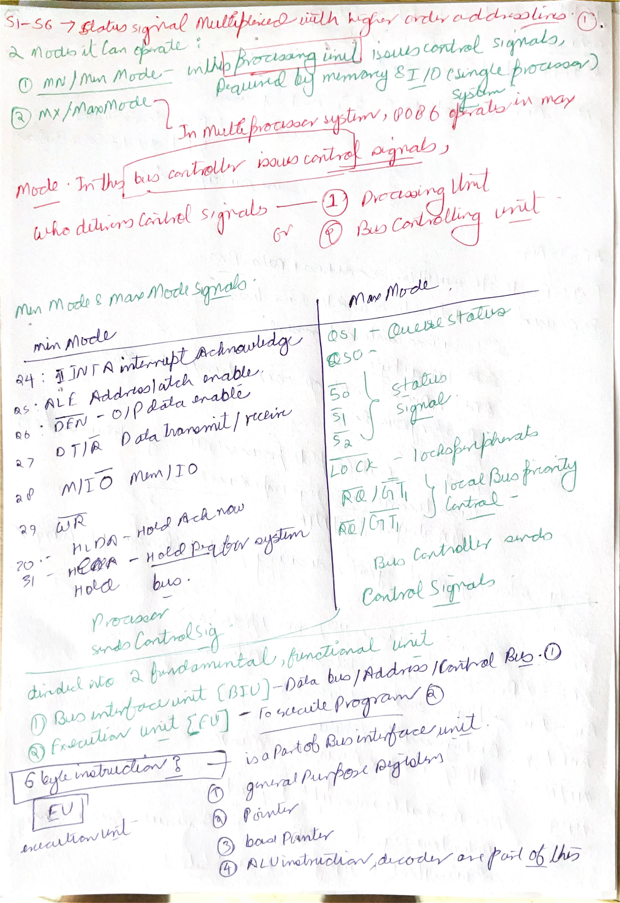</a>

Technical explanation: minimum mode is meant for simpler single-processor systems where the 8086 itself supplies bus-control signals. Maximum mode is for systems with external bus-control logic, coprocessors, or multiprocessor-style coordination. The selected mode changes the meaning of several pins, so pin diagrams must be read together with the mode.

The 8086 multiplexes `AD0-AD15` as address/data lines and `A16-A19/S3-S6` as high-address/status lines to fit a 20-bit address bus and 16-bit data bus into a 40-pin package. As with the 8085, external latching is required because the same pins carry different information during different parts of a bus cycle.

The 8086 architecture separates bus work from execution work. The Bus Interface Unit forms addresses, fetches instruction bytes, manages the prefetch queue, and performs memory/I/O transfers. The Execution Unit decodes and executes instructions using registers, ALU, and flags. This overlap improves bus use when the prefetch queue is not empty.

#### [86tilllnow page 005](images/HandWrittenNotes/86tilllnow/page-005.jpg)

<a href="images/HandWrittenNotes/86tilllnow/page-005.jpg">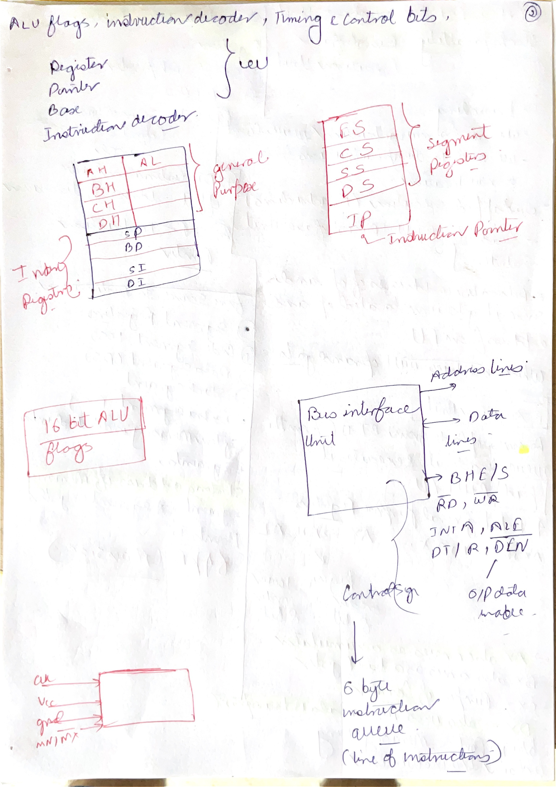</a>

Technical explanation: the 8086 architecture separates bus work from execution work. The Bus Interface Unit forms addresses, fetches instruction bytes, manages the prefetch queue, and performs memory/I/O transfers. The Execution Unit decodes and executes instructions using registers, ALU, and flags. This overlap improves bus use when the prefetch queue is not empty.

8086 flags include status flags and control flags. `CF`, `PF`, `AF`, `ZF`, `SF`, and `OF` describe arithmetic/logical results. `TF` enables single-step trap behavior, `IF` controls maskable interrupt recognition, and `DF` controls string-instruction direction. Do not map the 8086 flag register directly onto the 8085 flag register; overflow, trap, interrupt, and direction behavior are important additions.

#### [86tilllnow page 006](images/HandWrittenNotes/86tilllnow/page-006.jpg)

<a href="images/HandWrittenNotes/86tilllnow/page-006.jpg">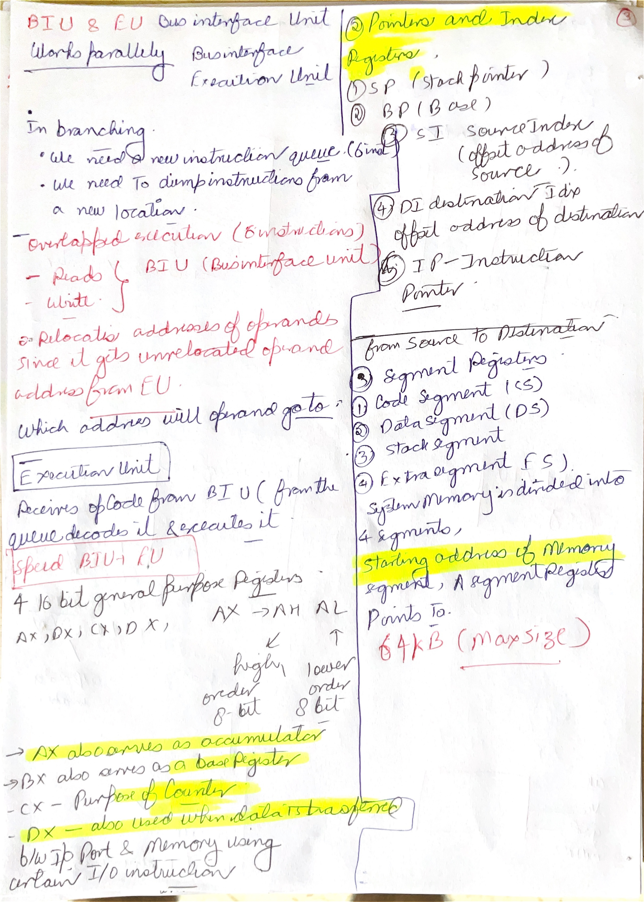</a>

Technical explanation: the 8086 architecture separates bus work from execution work. The Bus Interface Unit forms addresses, fetches instruction bytes, manages the prefetch queue, and performs memory/I/O transfers. The Execution Unit decodes and executes instructions using registers, ALU, and flags. This overlap improves bus use when the prefetch queue is not empty.

8086 physical addresses are formed from `segment:offset`. The segment value is shifted left four bits and the 16-bit offset is added: `physical = segment x 10H + offset`. This produces a 20-bit address and allows access to 1 MB even though most visible registers are 16 bits. Different segment:offset pairs can refer to the same physical address.

#### [86tilllnow page 007](images/HandWrittenNotes/86tilllnow/page-007.jpg)

Technical explanation: 8086 flags include status flags and control flags. `CF`, `PF`, `AF`, `ZF`, `SF`, and `OF` describe arithmetic/logical results. `TF` enables single-step trap behavior, `IF` controls maskable interrupt recognition, and `DF` controls string-instruction direction. Do not map the 8086 flag register directly onto the 8085 flag register; overflow, trap, interrupt, and direction behavior are important additions.

8086 stack references normally use the `SS` segment with `SP` or `BP` as the offset source. A push reduces `SP` before storing a word, and a pop reads the word before increasing `SP`. This is still stack-in-memory behavior, but the 8086 explanation must include segmentation because the physical stack address is formed from `SS:SP` or `SS:BP`.

#### [86tilllnow page 008](images/HandWrittenNotes/86tilllnow/page-008.jpg)

Technical explanation: 8086 physical addresses are formed from `segment:offset`. The segment value is shifted left four bits and the 16-bit offset is added: `physical = segment x 10H + offset`. This produces a 20-bit address and allows access to 1 MB even though most visible registers are 16 bits. Different segment:offset pairs can refer to the same physical address.

8086 addressing modes form an effective offset from registers, base registers, index registers, and displacement. That offset is then combined with a segment base. Code fetch normally uses `CS:IP`, stack access uses `SS`, many data accesses use `DS`, and some string or extra-segment operations use `ES`.

#### [86tilllnow page 009](images/HandWrittenNotes/86tilllnow/page-009.jpg)

Technical explanation: 8086 addressing modes form an effective offset from registers, base registers, index registers, and displacement. That offset is then combined with a segment base. Code fetch normally uses `CS:IP`, stack access uses `SS`, many data accesses use `DS`, and some string or extra-segment operations use `ES`.

8086 interrupts use a vector table rather than the 8085 restart-address pattern. Each interrupt type has a four-byte entry containing offset and segment, so the vector address is `type x 4`. `NMI` is non-maskable, `INTR` is maskable through `IF`, and software `INT n` uses the same vectoring idea. That is why 8086 interrupt tracing must load both `CS` and `IP`, not just a single 16-bit program counter.

#### [86tilllnow page 010](images/HandWrittenNotes/86tilllnow/page-010.jpg)

Technical explanation: for 8086 data-transfer instructions, identify source, destination, operand size, and address form. `MOV` copies between allowed register/memory forms but not arbitrary memory-to-memory forms. `IN` and `OUT` use I/O port addressing. `XLAT` performs a table lookup using `AL` as an index, so the effective table address must be derived before the moved byte is known.

8086 addressing modes form an effective offset from registers, base registers, index registers, and displacement. That offset is then combined with a segment base. Code fetch normally uses `CS:IP`, stack access uses `SS`, many data accesses use `DS`, and some string or extra-segment operations use `ES`.

#### [86tilllnow page 011](images/HandWrittenNotes/86tilllnow/page-011.jpg)

Technical explanation: for 8086 data-transfer instructions, identify source, destination, operand size, and address form. `MOV` copies between allowed register/memory forms but not arbitrary memory-to-memory forms. `IN` and `OUT` use I/O port addressing. `XLAT` performs a table lookup using `AL` as an index, so the effective table address must be derived before the moved byte is known.

8086 addressing modes form an effective offset from registers, base registers, index registers, and displacement. That offset is then combined with a segment base. Code fetch normally uses `CS:IP`, stack access uses `SS`, many data accesses use `DS`, and some string or extra-segment operations use `ES`.

#### [86tilllnow page 012](images/HandWrittenNotes/86tilllnow/page-012.jpg)

Technical explanation: 8086 branch instructions modify instruction flow by changing `IP` and sometimes `CS`. Short and near branches stay in the current code segment; far transfers also change `CS`. Conditional branches test flags such as `ZF`, `CF`, `SF`, and `OF`, so signed and unsigned comparisons use different branch conditions even if the previous comparison instruction was the same.

Compared with the 8085, the 8086 has a wider external data bus, a 20-bit address space, segmentation, a prefetch queue, richer addressing modes, and a more complex flag model. That is why an 8086 trace often begins by forming `segment:offset`, while an 8085 trace usually begins with a direct 16-bit address or a register-pair pointer.

### `8051-microcontroller-architecture-memory-addressing-timers.pdf`

#### [8051-microcontroller-notes page 001](images/HandWrittenNotes/8051-microcontroller-notes/page-001.jpg)

Technical explanation: this page introduces the 8051 as a microcontroller system. The handwritten list of ROM, RAM, decoder, I/O devices, peripheral devices, interrupt control, and programmable I/O explains why a microcontroller is not just a small microprocessor. The 8051 integrates control-oriented hardware blocks that would otherwise need extra interface chips around a CPU.

The microprocessor-versus-microcontroller comparison should be revised as a system-design contrast. A microprocessor-based system can be more flexible because memory and peripherals are chosen externally, but it needs more support hardware and bus wiring. A microcontroller is less flexible but has on-chip RAM, ROM/program memory, I/O, timers, serial interface, and interrupt handling, so it is suited for embedded control where compactness and direct I/O matter more than arbitrary expansion.

#### [8051-microcontroller-notes page 002](images/HandWrittenNotes/8051-microcontroller-notes/page-002.jpg)

<a href="images/HandWrittenNotes/8051-microcontroller-notes/page-002.jpg">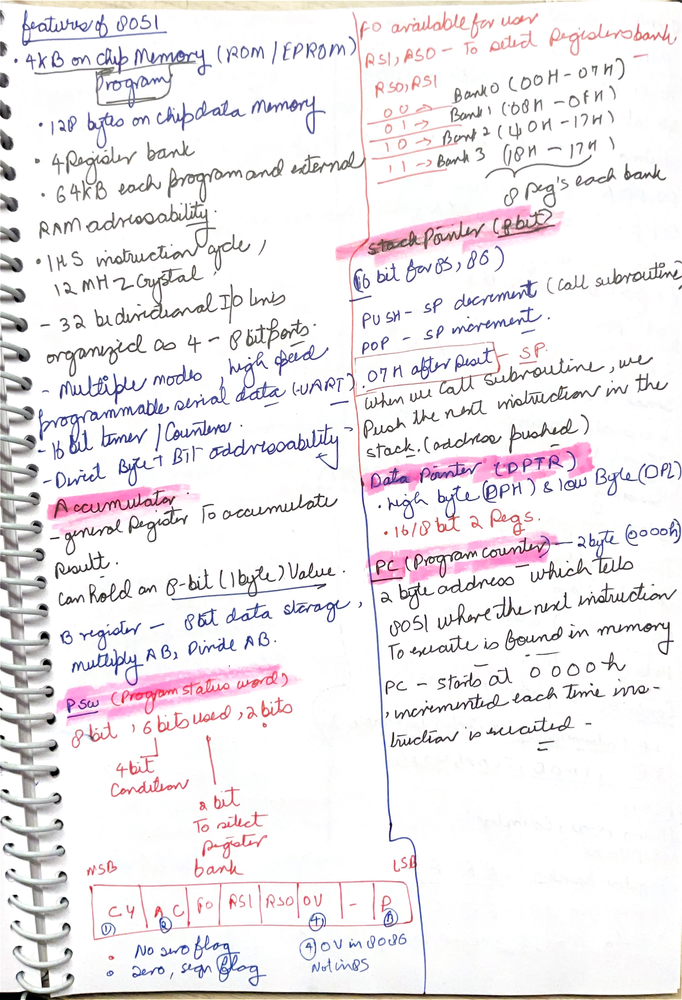</a>

Technical explanation: this page is the 8051 feature checklist. It captures 4 KB on-chip program memory, 128 bytes on-chip data memory, four register banks, 64 KB program/external memory addressability, 32 bidirectional I/O lines, 16-bit timer/counters, serial communication, direct byte access, and bit addressability. These should be studied as access capabilities: where code lives, where data lives, which registers select banks, and how software reaches pins and peripherals.

The page also connects features to register behavior. `RS1` and `RS0` in `PSW` choose the active bank, so `R0-R7` do not always mean addresses `00H-07H`. `SP=07H` after reset means the first default stack location is just above Bank 0 unless software moves the stack. `DPTR` is a 16-bit pointer split into `DPH` and `DPL`, while PC is a 16-bit code pointer that starts at `0000H` and changes through normal sequencing, jumps, calls, returns, interrupts, and reset.

#### [8051-microcontroller-notes page 003](images/HandWrittenNotes/8051-microcontroller-notes/page-003.jpg)

Technical explanation: the port notes explain why 8051 I/O is controlled through SFR latches. `P0`, `P1`, `P2`, and `P3` are not only external pins; they are software-visible SFRs connected to port latch hardware. To read an external input reliably on classic quasi-bidirectional ports, the latch is first written high so the pin is released for external driving.

The `SBUF`, timer, and control-register notes show the 8051 control plane. Writing `SBUF` loads the transmit buffer, while reading `SBUF` reads the receive buffer. `TH0/TL0` and `TH1/TL1` are timer/counter byte pairs. `IE`, `IP`, `TMOD`, `TCON`, `SCON`, and `PCON` configure interrupt enabling, priorities, timer modes/status, serial mode/status, and power/serial-related control. The key skill is linking each SFR to the hardware block it controls.

#### [8051-microcontroller-notes page 004](images/HandWrittenNotes/8051-microcontroller-notes/page-004.jpg)

<a href="images/HandWrittenNotes/8051-microcontroller-notes/page-004.jpg">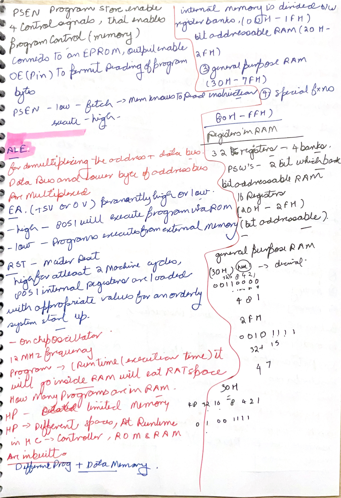</a>

Technical explanation: this page explains the external-memory control signals. `PSEN` is an active-low output used for external program-memory reads. `ALE` marks the phase when Port 0 carries the low address byte, allowing external hardware to latch `A0-A7` before Port 0 carries data. `EA` selects program-memory source: high permits internal program memory use on classic 8051 parts, while low forces external code fetches.

The same page ties reset, oscillator, and memory organization together. `RST` places the chip into a defined start-up state when held high long enough, and the oscillator gives the timing base for machine cycles. The internal memory notes split RAM into register banks, bit-addressable RAM, general-purpose RAM, and SFR space. This separation is essential because the same numeric-looking address can mean different things depending on direct, indirect, SFR, code, or external-data access.

#### [8051-microcontroller-notes page 005](images/HandWrittenNotes/8051-microcontroller-notes/page-005.jpg)

<a href="images/HandWrittenNotes/8051-microcontroller-notes/page-005.jpg">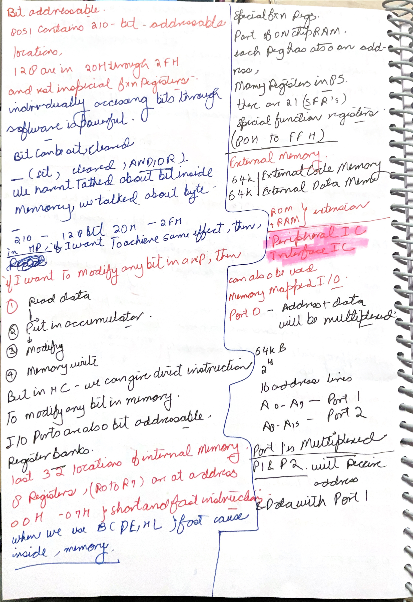</a>

Technical explanation: this page explains bit addressability. The 8051 has 128 bit-addressable bits in internal RAM addresses `20H-2FH`, plus bit-addressable SFR bits, often taught together as 210 bit-addressable locations. Bit instructions can set, clear, test, `AND`, or `OR` individual bits directly, avoiding manual byte read-mask-write sequences.

The SFR and external-memory notes prevent a common mistake: `80H-FFH` is the direct-address SFR range, not ordinary general RAM. Some addresses are unimplemented, and implemented ones map to hardware control/status registers. The external-memory section says the 8051 can address external code memory and external data memory, with Port 0 multiplexing low address/data and Port 2 supplying high address bits during external bus cycles.

#### [8051-microcontroller-notes page 006](images/HandWrittenNotes/8051-microcontroller-notes/page-006.jpg)

Technical explanation: this page gives the internal RAM ranges in revision form. `00H-1FH` is register-bank space, `20H-2FH` is bit-addressable RAM, and `30H-7FH` is general-purpose RAM. The note also connects bit-addressable RAM to direct bit operations such as `SETB bit` and `CLR bit`, which explains why the 8051 is strong for control applications that frequently manipulate single flags or output lines.

The pin notes map logical port names to the 40-pin package. Port 1 uses pins `1-8`, reset is pin `9`, Port 3 uses pins `10-17`, ground is pin `20`, Port 2 uses pins `21-28`, `PSEN` is pin `29`, `ALE` is pin `30`, and Port 0 uses pins `32-39`. During external-memory operation, those ports are no longer just ordinary I/O: Port 0 carries multiplexed low address/data and Port 2 carries high address lines.

#### [8051-microcontroller-notes page 007](images/HandWrittenNotes/8051-microcontroller-notes/page-007.jpg)

<a href="images/HandWrittenNotes/8051-microcontroller-notes/page-007.jpg">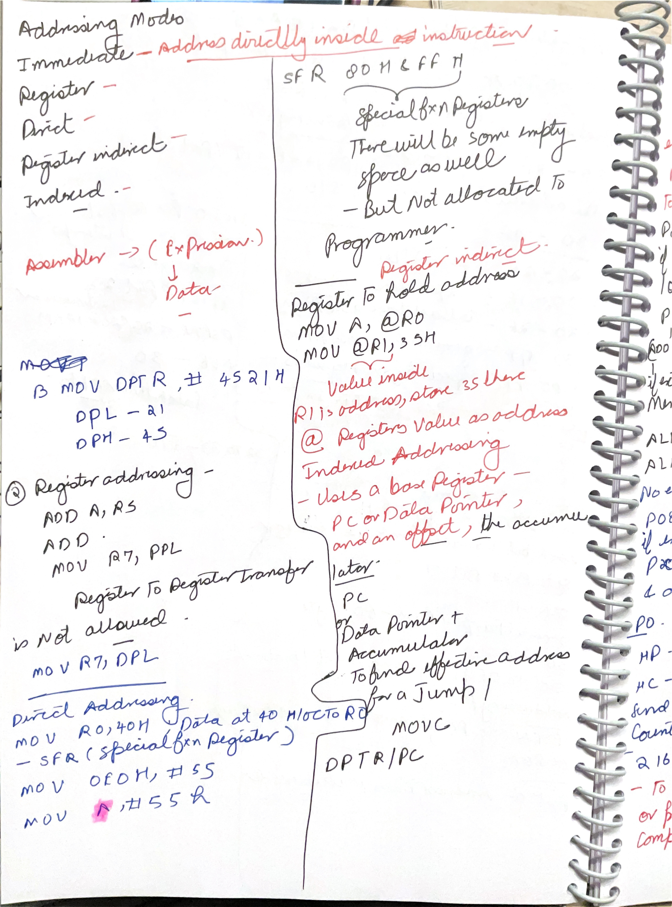</a>

Technical explanation: this page classifies addressing modes into immediate, register, direct, register-indirect, and indexed forms. Immediate addressing places data directly in the instruction. Register addressing names the active-bank registers. Direct addressing gives a fixed internal RAM or SFR byte address. Register-indirect addressing uses a register as a pointer, usually `@R0` or `@R1`. Indexed addressing uses a base such as `DPTR` or `PC` plus accumulator offset for code-memory table lookup.

The examples are valuable because they show legal and illegal forms. `MOV DPTR,#4521H` is valid because DPTR can load a 16-bit immediate, producing `DPH=45H` and `DPL=21H`. `MOV R7,DPL` is marked invalid because arbitrary register-to-register movement is not generally available in that form. Direct/SFR examples such as `MOV A,40H`, `MOV 0F0H,#55H`, and immediate constants with `#` should be traced by asking whether the operand is an address, a register, or literal data.

#### [8051-microcontroller-notes page 008](images/HandWrittenNotes/8051-microcontroller-notes/page-008.jpg)

<a href="images/HandWrittenNotes/8051-microcontroller-notes/page-008.jpg">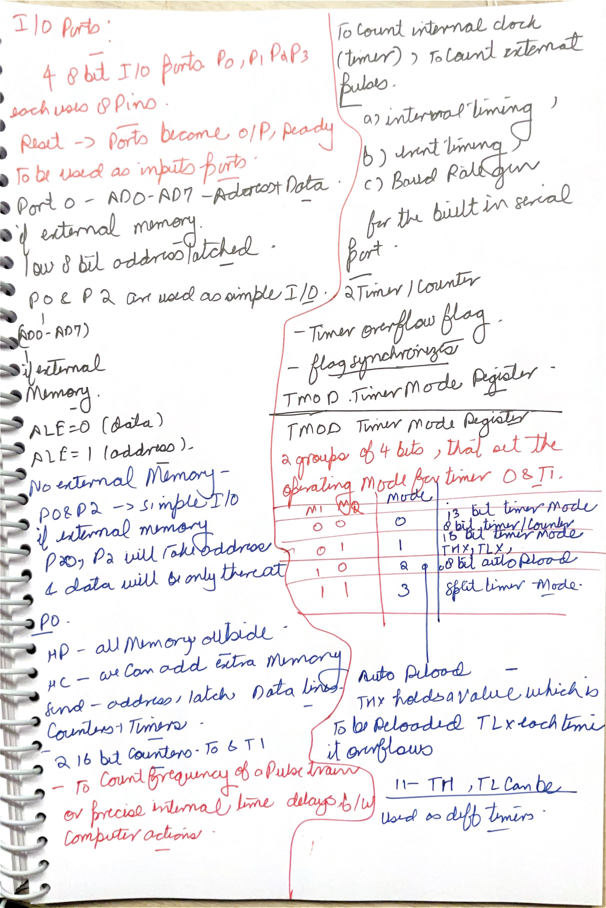</a>

Technical explanation: this page ties port behavior to external-memory use. The 8051 has four 8-bit I/O ports. After reset, port latches are high, but input use still depends on writing the latch high so the external signal can drive the pin. Port 0 becomes `AD0-AD7` during external-memory cycles, so the low address must be latched before the same pins are reused for data.

The timer/counter half explains `TMOD` at the operating-mode level. A timer counts internal clock pulses and is used for interval timing, delays, and baud-rate support. A counter counts external pulses on timer input pins. The `M1 M0` table selects Mode 0 as 13-bit mode, Mode 1 as 16-bit mode, Mode 2 as 8-bit auto-reload, and Mode 3 as split timer mode. In auto-reload, `THx` stores the reload value and `TLx` is reloaded after overflow, making repeated timing intervals easier to generate.

### `8051-serial-port-programming-instruction-set-mcqs.pdf`

#### [8051 serial/instruction page 001](images/HandWrittenNotes/8051-serial-port-programming-instruction-set-mcqs/page-001.jpg)

<a href="images/HandWrittenNotes/8051-serial-port-programming-instruction-set-mcqs/page-001.jpg">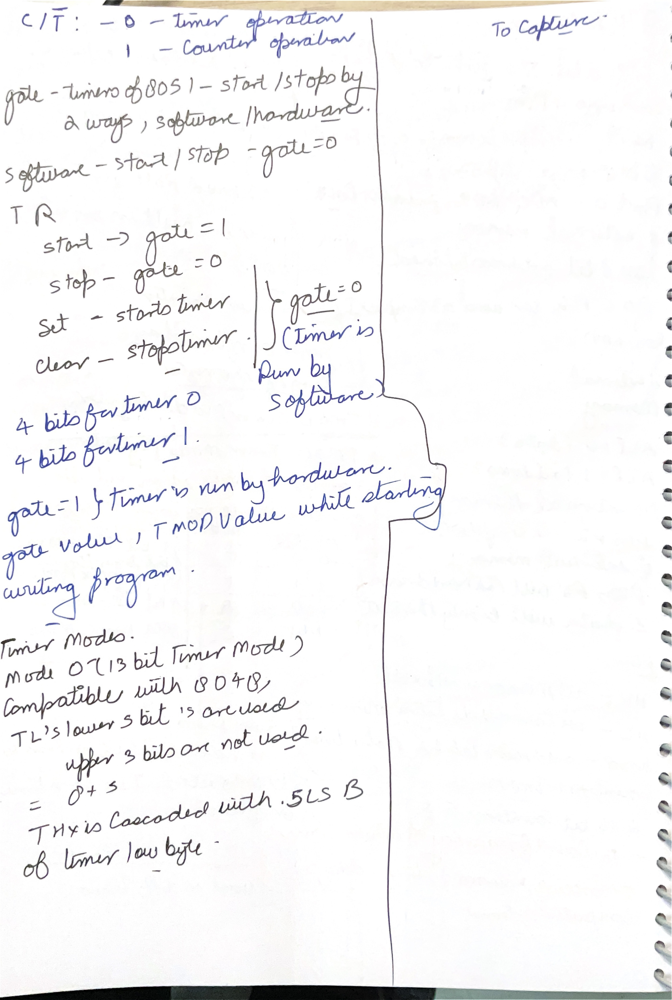</a>

Technical explanation: this page completes the `TMOD` control model. `C/T` chooses whether the timer block counts internal machine-cycle pulses or external input transitions. `GATE` chooses whether software alone controls running through `TRx`, or whether an external interrupt pin must also permit the timer. Mode 0 is a 13-bit compatibility mode, so only five low bits of `TLx` combine with `THx`; it should not be confused with the normal 16-bit range of Mode 1.

#### [8051 serial/instruction page 002](images/HandWrittenNotes/8051-serial-port-programming-instruction-set-mcqs/page-002.jpg)

<a href="images/HandWrittenNotes/8051-serial-port-programming-instruction-set-mcqs/page-002.jpg">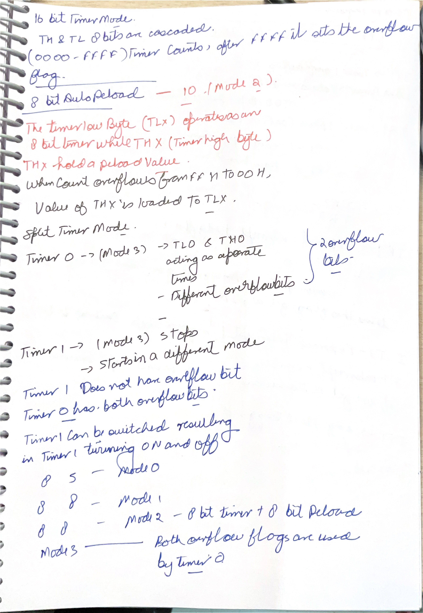</a>

Technical explanation: Mode 1 cascades `THx` and `TLx` into a 16-bit up-counter that sets `TFx` after rollover. Mode 2 uses `TLx` as the active 8-bit counter and `THx` as the automatic reload value, which is why it is useful for repeated intervals and serial baud generation. Mode 3 splits Timer 0 into two 8-bit timers and changes Timer 1's ordinary overflow/interrupt behavior, so it must be treated as a special case.

#### [8051 serial/instruction page 003](images/HandWrittenNotes/8051-serial-port-programming-instruction-set-mcqs/page-003.jpg)

<a href="images/HandWrittenNotes/8051-serial-port-programming-instruction-set-mcqs/page-003.jpg">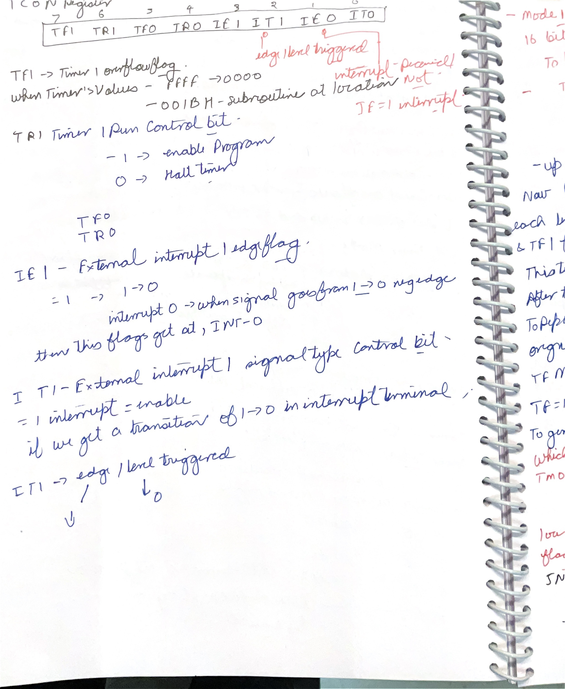</a>

Technical explanation: `TCON` is split between timer control/status and external interrupt control/status. `TF1/TR1/TF0/TR0` belong to timers; `IE1/IT1/IE0/IT0` belong to external interrupt flags and trigger selection. The page is useful because it prevents treating `TRx` and `TFx` as the same idea: `TRx` enables counting, while `TFx` reports that rollover occurred.

#### [8051 serial/instruction page 004](images/HandWrittenNotes/8051-serial-port-programming-instruction-set-mcqs/page-004.jpg)

<a href="images/HandWrittenNotes/8051-serial-port-programming-instruction-set-mcqs/page-004.jpg">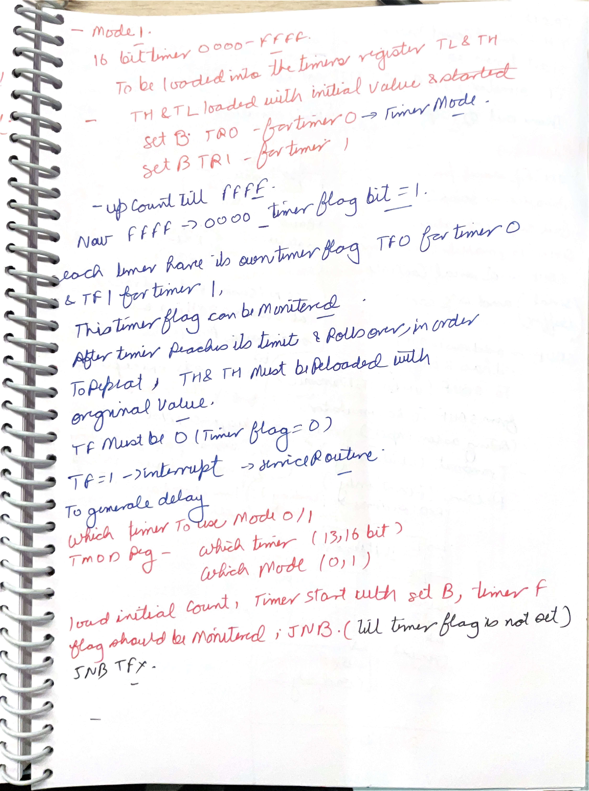</a>

Technical explanation: the timer delay procedure is load, start, poll, clear, reload, repeat. In Mode 1, software loads `THx/TLx`, sets `TRx`, waits for `TFx`, then clears the flag and reloads for another identical delay. `JNB TFx,label` is the polling idiom: keep looping while the overflow flag is still `0`. This same polling discipline later appears again as `JNB TI` or `JNB RI` for serial flags.

#### [8051 serial/instruction page 005](images/HandWrittenNotes/8051-serial-port-programming-instruction-set-mcqs/page-005.jpg)

<a href="images/HandWrittenNotes/8051-serial-port-programming-instruction-set-mcqs/page-005.jpg">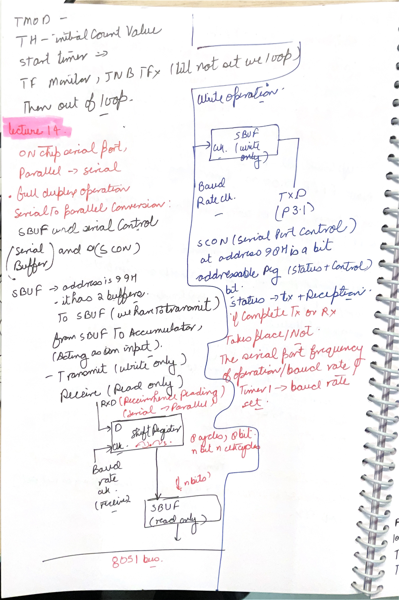</a>

Technical explanation: this page introduces the serial-port data path. The CPU writes or reads bytes, while the serial port shifts bits on `TXD` and `RXD`. `SBUF` is the data doorway, but write and read access go to different internal buffers. `SCON` selects mode and reports status. Timer 1 appears in the diagram because variable-baud serial modes commonly use Timer 1 overflow as their time base.

#### [8051 serial/instruction page 006](images/HandWrittenNotes/8051-serial-port-programming-instruction-set-mcqs/page-006.jpg)

<a href="images/HandWrittenNotes/8051-serial-port-programming-instruction-set-mcqs/page-006.jpg">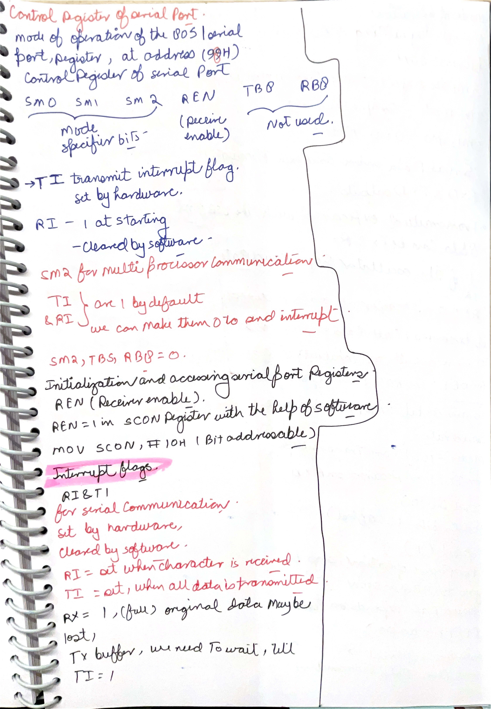</a>

Technical explanation: `SCON` contains mode bits (`SM0/SM1`), multiprocessor filtering (`SM2`), receive enable (`REN`), ninth-bit transmit/receive fields (`TB8/RB8`), and event flags (`TI/RI`). Hardware sets `TI` and `RI`; software clears them after handling. That makes `SCON` both a configuration register and a synchronization point between program code and serial hardware.

#### [8051 serial/instruction page 007](images/HandWrittenNotes/8051-serial-port-programming-instruction-set-mcqs/page-007.jpg)

<a href="images/HandWrittenNotes/8051-serial-port-programming-instruction-set-mcqs/page-007.jpg">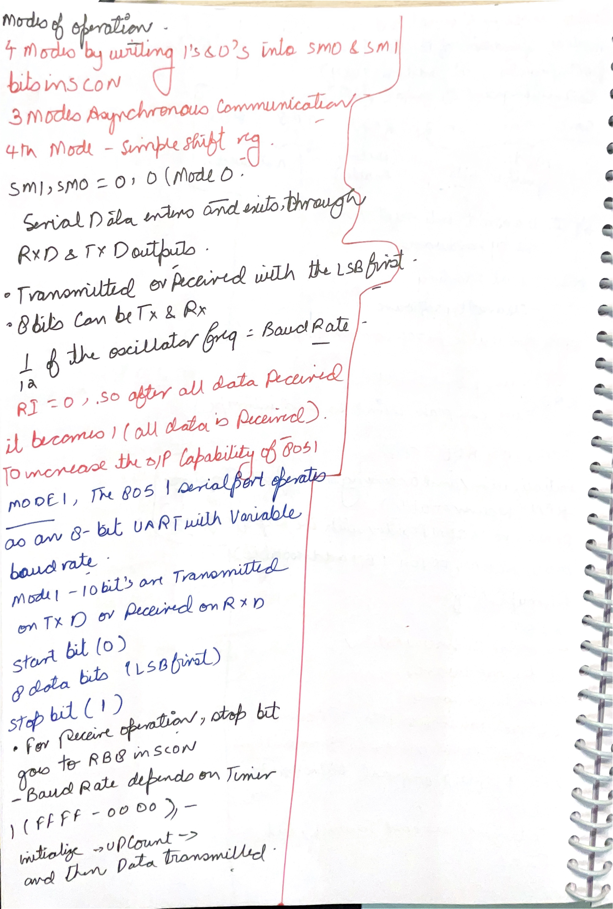</a>

Technical explanation: the mode table should be memorized with meaning, not only bit patterns. Mode 0 is shift-register transfer. Mode 1 is 8-bit UART with start and stop bits and variable baud. Mode 2 is 9-bit UART with fixed oscillator-derived baud. Mode 3 is 9-bit UART with variable baud. This is why `SM0/SM1` must always be studied together with frame size and baud source.

#### [8051 serial/instruction page 008](images/HandWrittenNotes/8051-serial-port-programming-instruction-set-mcqs/page-008.jpg)

<a href="images/HandWrittenNotes/8051-serial-port-programming-instruction-set-mcqs/page-008.jpg">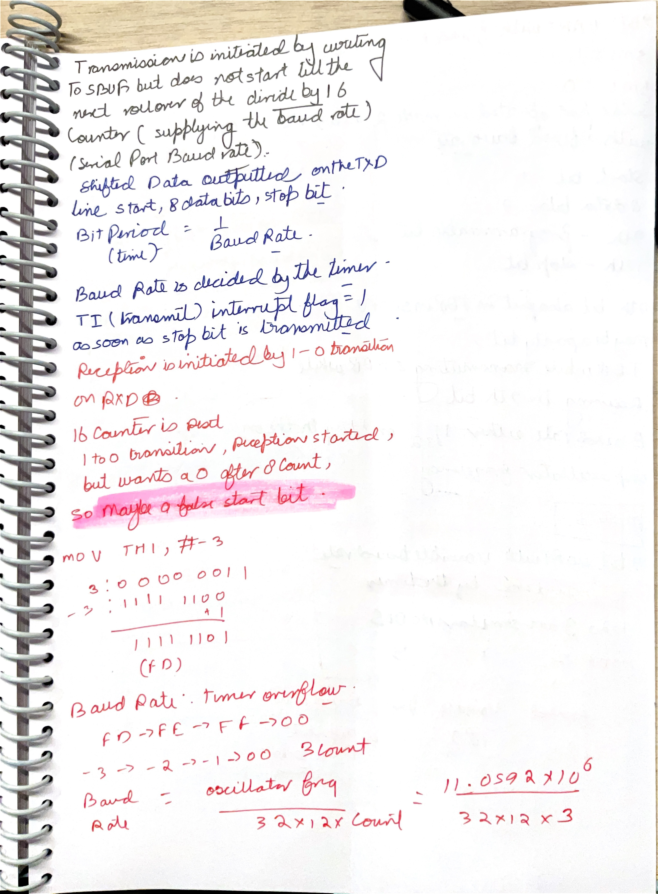</a>

Technical explanation: baud-rate calculation starts with oscillator frequency. On a classic 12-clock 8051, the machine-cycle frequency is `fosc/12`, so `11.0592 MHz` becomes `921.6 kHz`. Timer 1 overflow is derived from that count rate and the `TH1` reload. Serial divider logic and `SMOD` then determine the final bit rate. Standard baud rates are easiest to derive when these stages are kept separate.

#### [8051 serial/instruction page 009](images/HandWrittenNotes/8051-serial-port-programming-instruction-set-mcqs/page-009.jpg)

<a href="images/HandWrittenNotes/8051-serial-port-programming-instruction-set-mcqs/page-009.jpg">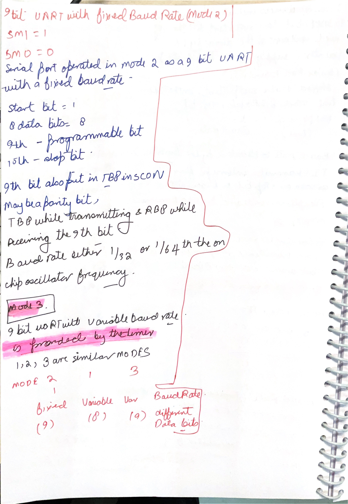</a>

Technical explanation: `SMOD` is `PCON.7` and doubles supported serial baud rates when set. It resets to `0`, so doubled baud is a deliberate software choice. Mode 0 and Mode 2 have fixed oscillator-derived timing; Mode 1 and Mode 3 commonly use Timer 1. Separating fixed baud from timer-derived baud prevents mistakes when solving serial-mode questions.

#### [8051 serial/instruction page 010](images/HandWrittenNotes/8051-serial-port-programming-instruction-set-mcqs/page-010.jpg)

<a href="images/HandWrittenNotes/8051-serial-port-programming-instruction-set-mcqs/page-010.jpg">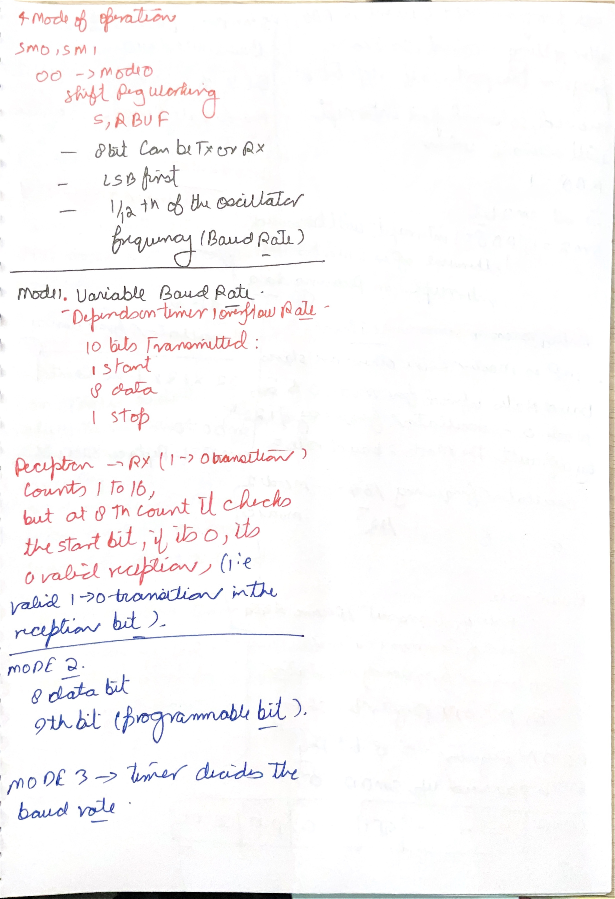</a>

Technical explanation: `TH1` reload values are two's-complement offsets in 8-bit auto-reload mode. `FDH`, `FAH`, `F4H`, and `E8H` correspond to `-3`, `-6`, `-12`, and `-24`, which change how often `TL1` overflows. The serial port then divides that overflow stream. This is why changing only `TH1` can change baud without changing the serial frame format.

#### [8051 serial/instruction page 011](images/HandWrittenNotes/8051-serial-port-programming-instruction-set-mcqs/page-011.jpg)

<a href="images/HandWrittenNotes/8051-serial-port-programming-instruction-set-mcqs/page-011.jpg">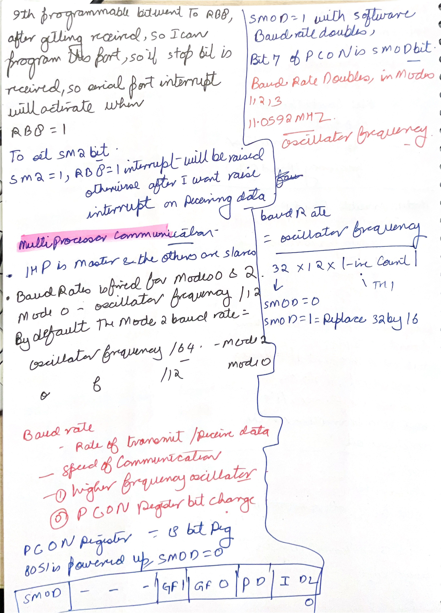</a>

Technical explanation: the ninth-bit pages explain why modes 2 and 3 are useful beyond simple character transfer. `TB8` can send a ninth bit, `RB8` stores the received ninth bit, and `SM2` can filter which frames generate receive service. This supports multiprocessor serial communication patterns where address frames and data frames are distinguished by the ninth bit.

#### [8051 serial/instruction page 012](images/HandWrittenNotes/8051-serial-port-programming-instruction-set-mcqs/page-012.jpg)

<a href="images/HandWrittenNotes/8051-serial-port-programming-instruction-set-mcqs/page-012.jpg">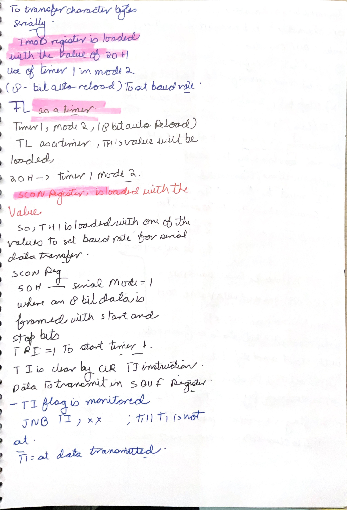</a>

Technical explanation: receive-side programming follows the hardware frame. `RXD` sees a start bit, the receiver samples data bits at the baud timing, the stop bit is accepted, the byte is placed in receive `SBUF`, and `RI` becomes `1`. Software should read `SBUF`, store the byte, and clear `RI` before waiting for the next character.

#### [8051 serial/instruction page 013](images/HandWrittenNotes/8051-serial-port-programming-instruction-set-mcqs/page-013.jpg)

<a href="images/HandWrittenNotes/8051-serial-port-programming-instruction-set-mcqs/page-013.jpg">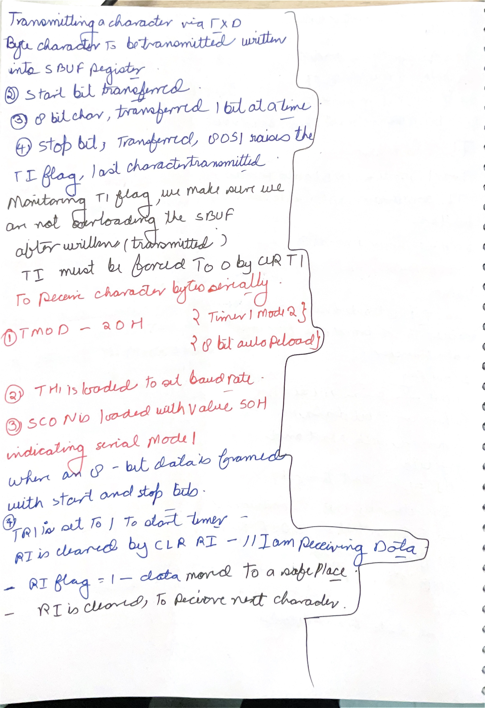</a>

Technical explanation: transmit and receive use opposite sides of the same software name. Writing `SBUF` starts transmit-side shifting through `TXD`; completion sets `TI`. Reading `SBUF` obtains receive-side data that arrived through `RXD`; completion sets `RI`. Robust polling code respects these flags so it neither overwrites a pending transmit byte nor loses an incoming receive byte.

#### [8051 serial/instruction page 014](images/HandWrittenNotes/8051-serial-port-programming-instruction-set-mcqs/page-014.jpg)

<a href="images/HandWrittenNotes/8051-serial-port-programming-instruction-set-mcqs/page-014.jpg">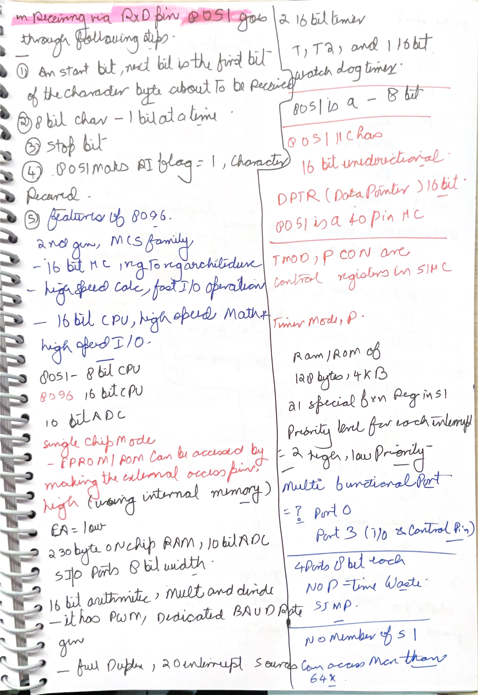</a>

Technical explanation: this page combines receive recap, 8096 comparison, and 8051 MCQ facts. For 8051, anchor on 8-bit CPU, 40-pin classic package, 128 bytes RAM, 4 KB classic ROM, four 8-bit ports, `DPTR`, `PSW`, and SFR control. For 8096, anchor on the MCS-96 16-bit controller family with stronger control-system peripherals such as ADC/PWM and higher-performance control orientation.

#### [8051 serial/instruction page 015](images/HandWrittenNotes/8051-serial-port-programming-instruction-set-mcqs/page-015.jpg)

<a href="images/HandWrittenNotes/8051-serial-port-programming-instruction-set-mcqs/page-015.jpg">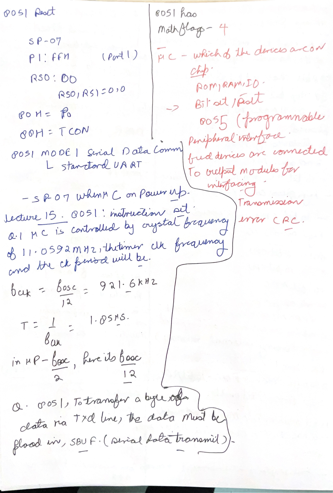</a>

Technical explanation: this page is an MCQ checkpoint. Reset facts include `SP=07H`, `PSW=00H`, Bank 0 selected, and port latches high. SFR facts include `P0=80H`, `TCON=88H`, `SCON=98H`, and `SBUF=99H`. The `11.0592 MHz` calculation gives `921.6 kHz` machine-cycle frequency and about `1.085 us` per machine cycle on the classic 12-clock 8051.

#### [8051 serial/instruction page 016](images/HandWrittenNotes/8051-serial-port-programming-instruction-set-mcqs/page-016.jpg)

<a href="images/HandWrittenNotes/8051-serial-port-programming-instruction-set-mcqs/page-016.jpg">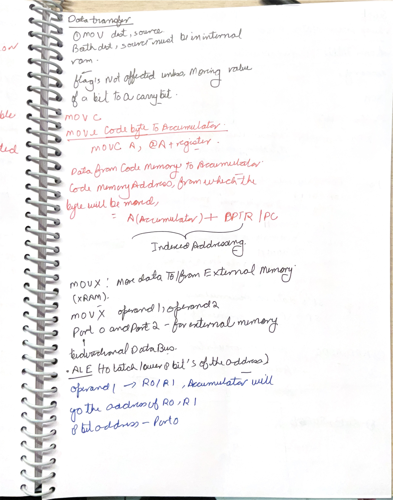</a>

Technical explanation: this page separates data-transfer address spaces. `MOV` works in the internal data/SFR/register world. `MOVC` reads code memory into `A` using an indexed address such as `A+DPTR` or `A+PC`. `MOVX` reads or writes external data memory, either through `@DPTR` for 16-bit addressing or `@R0/@R1` for 8-bit external addressing. This distinction is one of the most important 8051 instruction-set boundaries.

#### [8051 serial/instruction page 017](images/HandWrittenNotes/8051-serial-port-programming-instruction-set-mcqs/page-017.jpg)

<a href="images/HandWrittenNotes/8051-serial-port-programming-instruction-set-mcqs/page-017.jpg">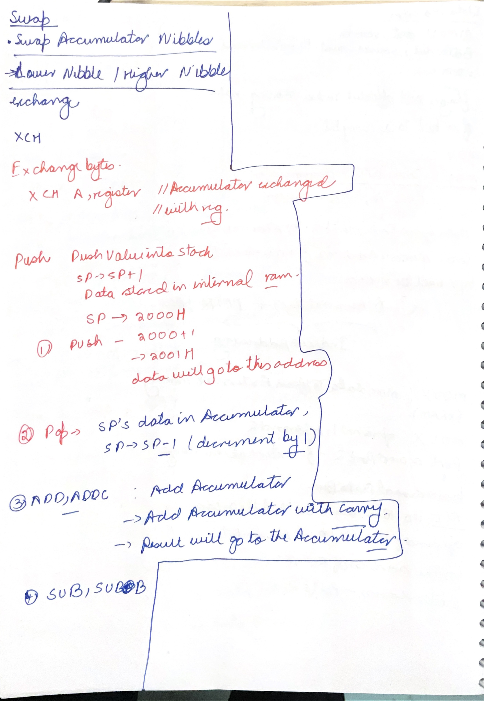</a>

Technical explanation: `SWAP A` exchanges nibbles inside the accumulator. `XCH A,operand` exchanges bytes between `A` and an allowed operand. `PUSH direct` increments `SP` before storing; `POP direct` reads then decrements `SP`. `ADD`, `ADDC`, and `SUBB` place the result in `A`, so accumulator and flag tracing are central to these instructions.

#### [8051 serial/instruction page 018](images/HandWrittenNotes/8051-serial-port-programming-instruction-set-mcqs/page-018.jpg)

<a href="images/HandWrittenNotes/8051-serial-port-programming-instruction-set-mcqs/page-018.jpg">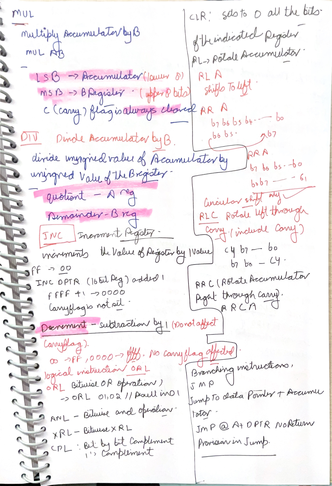</a>

Technical explanation: `MUL AB` returns a 16-bit product in `B:A`, while `DIV AB` returns quotient in `A` and remainder in `B`. `INC`/`DEC` are not carry-setting arithmetic. Logical operations such as `ANL`, `ORL`, and `XRL` are mask/combine operations, and rotates must be separated into accumulator-only forms and carry-through forms. `JMP @A+DPTR` is indexed control flow through code memory.

#### [8051 serial/instruction page 019](images/HandWrittenNotes/8051-serial-port-programming-instruction-set-mcqs/page-019.jpg)

<a href="images/HandWrittenNotes/8051-serial-port-programming-instruction-set-mcqs/page-019.jpg">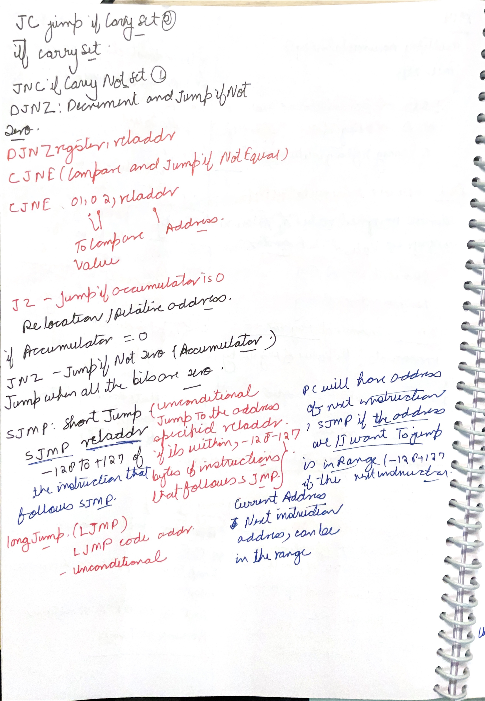</a>

Technical explanation: branch instructions must be revised by condition and range. `JC` tests carry, `DJNZ` decrements and then tests for nonzero, and `JZ/JNZ` test accumulator content. `SJMP` is relative and local, while `AJMP` is absolute within a 2 KB block. Confusing condition type with range is the common error on these pages.

#### [8051 serial/instruction page 020](images/HandWrittenNotes/8051-serial-port-programming-instruction-set-mcqs/page-020.jpg)

<a href="images/HandWrittenNotes/8051-serial-port-programming-instruction-set-mcqs/page-020.jpg">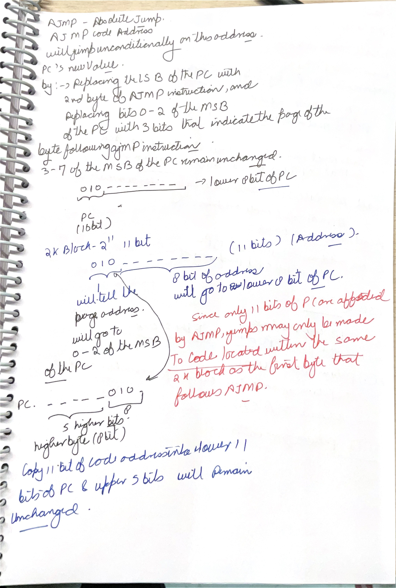</a>

Technical explanation: `AJMP` uses an 11-bit target field and keeps the upper program-counter page bits, so it can only target the same 2 KB code block. It is shorter than `LJMP` but less flexible. Use `AJMP` only when the destination is inside the same block; otherwise the long jump form is required.

#### [8051 serial/instruction page 021](images/HandWrittenNotes/8051-serial-port-programming-instruction-set-mcqs/page-021.jpg)

<a href="images/HandWrittenNotes/8051-serial-port-programming-instruction-set-mcqs/page-021.jpg">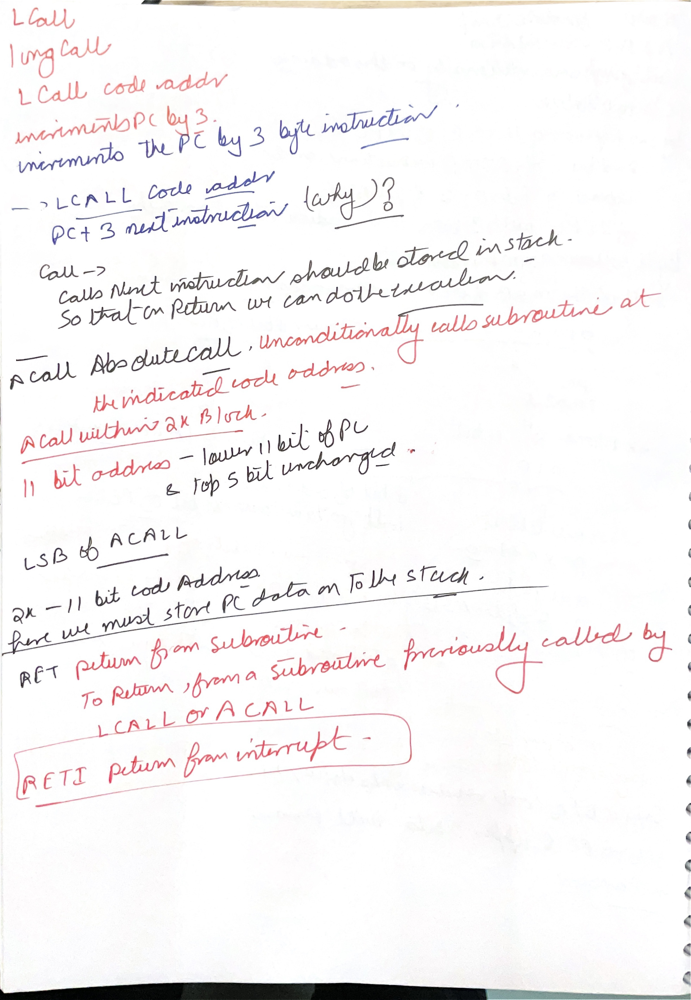</a>

Technical explanation: `LCALL` pushes the return address and can reach the full code space. `ACALL` also pushes the return address but is limited to the same 2 KB block. `RET` pops the saved PC and resumes a normal subroutine caller. `RETI` pops the saved PC and additionally completes interrupt-service state, so interrupt service routines should end with `RETI`, not plain `RET`.

#### [8051 serial/instruction page 022](images/HandWrittenNotes/8051-serial-port-programming-instruction-set-mcqs/page-022.jpg)

<a href="images/HandWrittenNotes/8051-serial-port-programming-instruction-set-mcqs/page-022.jpg">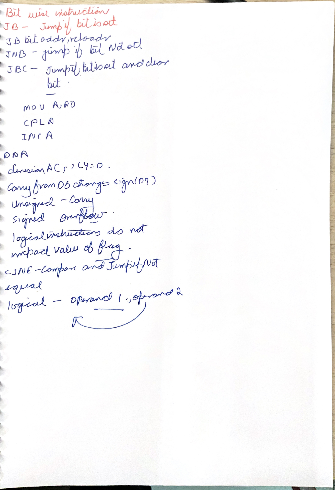</a>

Technical explanation: the final page is a compact instruction MCQ drill. Read every answer through destination, source, and flag effect. `CJNE` jumps on not-equal and sets carry for unsigned less-than. `DA A` is for BCD adjustment after addition. Byte logical instructions normally do not update the PSW math flags. Accumulator-centered arithmetic must be traced through `A`, not through an arbitrary destination register.
